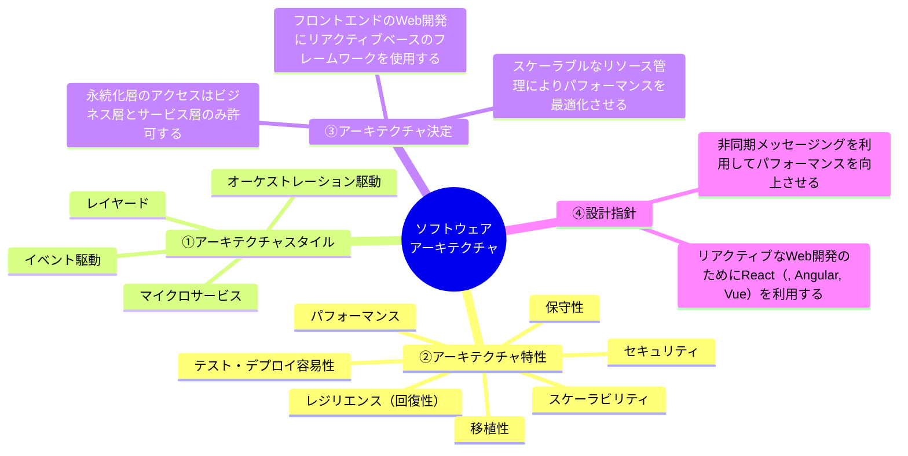
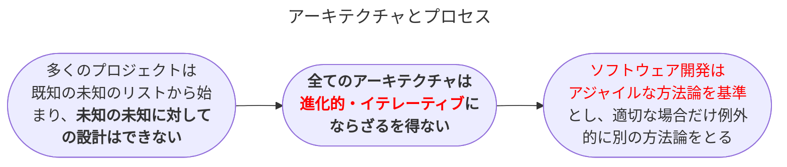
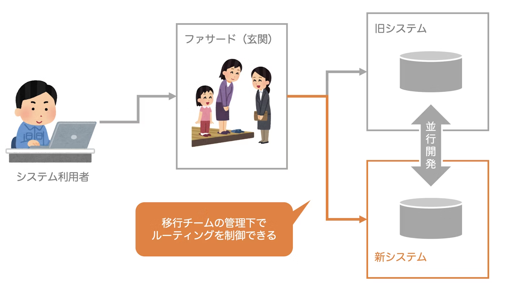
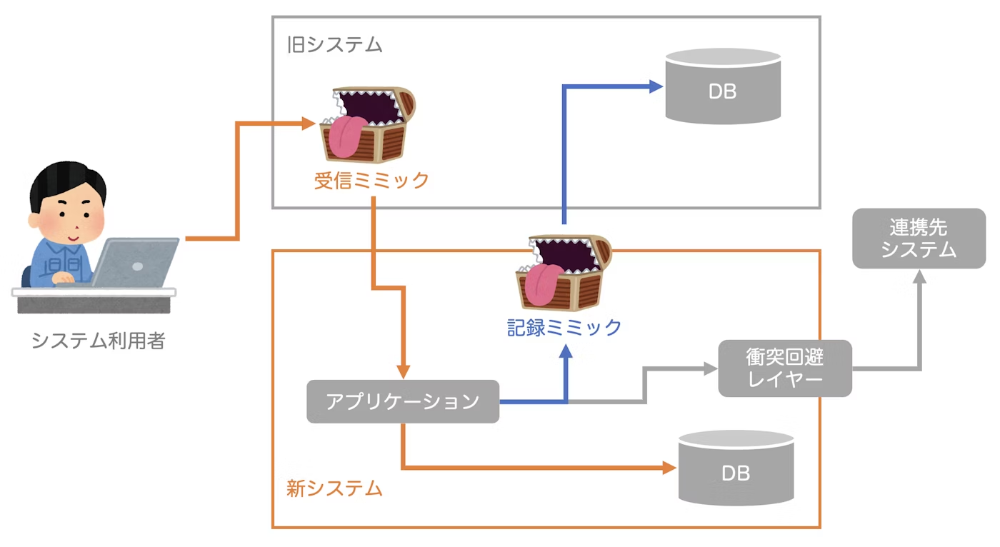

## イントロダクション

### ソフトウェアアーキテクチャの定義

- <b>ソフトウェアアーキテクチャは以下の4つを<u>組み合わせて構成</u>される</b>。
  1. **システムの構造**
  2. **アーキテクチャ特性**(＝イリティ)　※イリティ＝ソフトウェアシステムが備える特性の総称
  3. **アーキテクチャ決定**(設計指針と相補関係)
  4. **設計指針**(アーキテクチャ決定と相補関係)
- **システム構造**とは、マイクロサービスやレイヤードなどのアーキテクチャスタイルを指す。
- **アーキテクチャ特性**とは、システムの成功基準を定めるもの。以下の三つの基準を満たす。
  1. ドメインに依らない、設計に関する考慮事項を明らかにするもの
  2. 設計の王像的な側面に影響を与えるもの
  3. アプリケーションの成功に不可欠か重要なもの
- **アーキテクチャ決定**とは、システムの構築ルール。制約を示す指針になる。<u>決定を破らなければ実装できない場合</u>、その**例外の認否**はチーフや審査委員会(ARB)のもとで判断される。
- **設計指針**とは、ガイドライン。<u>アーキテクチャ決定で網羅できない箇所を補い、望ましいアプローチを提供する</u>。

### アーキテクトへの期待(8個)

1. **アーキテクチャ決定を下す**：チームや部門、企業全体の技術的な決定を導く($\neq$技術的な決定をする)ためのアーキテクチャ決定や設計指針を定義することが期待される。
2. **アーキテクチャを継続的に分析する**：ビジネス(ドメイン)・技術の両観点からアーキテクチャの存続力・健全性を継続的に評価し、改善策を提案することが期待される。
3. **最新のトレンドを把握し続ける**：アーキテクチャ決定は長い間影響を与えることから、先を見据えた適切な判断が求められる。そのために業界動向を追いかけ、最新情報を理解しておく必要がある。アーキテクトにとって特に難しい期待である。
4. **決定の遵守を徹底する**：アーキテクチャ決定・設計指針で定義したことを文書化し、チームが従っているか継続的に検証することが期待される。
5. **多様なものに触れ、経験している**：多様な技術に親しんでいなければならないという期待。今日、様々なシステムやサービスが通信し合うため技術的な幅が必要であり、コンフォートゾーンを広げる行動が求められる。
6. **事業ドメインの知識を持っている**：ビジネス課題や目標、要件などを理解するためにも、技術要素だけでなくドメイン知識も豊富なアーキテクトが求められる。強い信頼感を相手に抱かせることが一番のメリットである。
7. **対人スキルを持っている**：一見どう見えようとも常に人の問題であることから、チームワークやファシリテーション、リーダシップが期待される。<u>有能なソフトウェアアーキテクトに必要なスキルのうち少なくとも半分を占める。</u>
8. **政治を理解し、舵取りする**：アーキテクチャ決定を徹底するための作業のほとんどは会社のほぼ全員から反発される。その反発を軽減し、承諾してもらうために、<u>社内政治を舵取りし、交渉術を駆使して、ほとんどの決定を承諾してもらわねばならない</u>。<b>リーダシップスキルと同様、交渉術はとても重要なスキルである</b>。

#### アーキテクトへの期待の補足

- 「**アーキテクチャ決定を下す**」ことでやっていることは、<u>技術的な決定をすることではなく、技術的な決定を導くこと</u>である。具体的な技術名(NextJS/Django/Laravel, AWS/AZURE/GCP, MySQL/PostgreSQLなど)は登場すべきではない。ただし、<u>アーキテクチャ特性を維持・達成するために技術的選択をしなければならないこともある(<b>トレードオフ</b>)</u>。
- 「**アーキテクチャを継続的に分析する**」ことができていないと、構造的破壊につながり、アーキテクチャ特性に影響を与える。実際のところ、実践できているアーキテクトは少ない。
- 「**事業ドメインの知識を持っている**」ことは、ビジネス要件やアーキテクチャ特性、効率的・効果的なコミュニケーションなどの能力を持つことを意味しており、強い信頼感につながる。
- 「**対人スキルを持っている**」ことについて、チームのリードや開発者の指導、アイデアやアーキテクチャ決定、設計指針の**伝達などがうまくできることが他のアーキテクトとの差別化になる**。
- 「**政治を理解し、舵取りをする**」ことについて、例えば、大規模なCRMシステムを担当しているアーキテクトが顧客データを保護するためにアプリケーションサイロを作ったことを考える。その場合、<u>他のアプリケーションはRESTやSOAPなどのRPCプロトコルを通してでしか顧客データにアクセスできない、つまり手間が増える</u>。そうなれば、利用者のほとんどから反発を受けることが想定される。

### アーキテクチャと交わるもの

- 近年、**ソフトウェアアーキテクチャの領域にプロセスが入り込むようになった**。<u>プロセスとは人がどのように組織化され、どのように相互作用するかのメカニズムを意味する</u>。
- プロセスと似た意味に**エンジニアリングプラクティス**があるが、<u>エンジニアリングプラクティスは再現性のあるプロセスに依存しない手法</u>であり、CI/CDなどが例として挙げられる。
- 問題領域(ドメイン)に適した解決策(アーキテクチャスタイル)があるのと同じように、<b>アーキテクチャスタイルに適したエンジニアリングプラクティスが存在する(共生関係)</b>。例えば、<u>マイクロサービスアーキテクチャの場合、自動テスト、自動デプロイ、自動マシンプロビジョニング(需要を予測してインフラやシステムのリソースを準備・提供・割当・管理すること)など</u>
  - プロビジョニングの対象: サーバ、ネットワーク、サービス、アカウント、ストレージなど
- **アジャイルな方法論が活きる場面はシステムの再構築**である。例えば、「素早く容易に立ち上げられるという理由からモノリシックなアーキテクチャを採用していたが、よりモダンなアーキテクチャ移行が必要になった」ことを考える。この場合、以下のような方法で変更をよりうまくサポートする。
  - **ストラングラーパターン**: 機能を徐々に置き換え、段階的に移行するパターン。具体的なアプローチとして、新旧システムの前段に「ファサード」を配置し、ルーティング可能にする。これにより利用者は宛先変更を意識することなく、シームレスに新システムへ移行可能。
  - **レガシーミミックパターン(ミミック: 擬態する)**: 「隔離層」を作成し、相手側への影響を極小化しようという思想。イベント受信の役割を持つ「プロバイダ」とレコード記録の役割を持つ「コンシューマ」の2つがよく見られる。
  - **フィーチャートグル(フィーチャーフラグ/スイッチ)**: コードの特定部分をフラグにより有効/無効にできる機能。すべてのコードが本番環境に入っているが無効化されている状態で開発を進める方式。

<table>
	<tbody>
		<tr>
			<th>ストラングラーパターン</th>
			<th>レガシーミミックパターン</th>
		</tr>
		<tr>
			<td></td>
			<td></td>
		</tr>
	</tbody>
</table>

### ソフトウェアアーキテクチャの法則

- ソフトウェアアーキテクチャの第一法則: **ソフトウェアアーキテクチャはトレードオフが全て**
- ソフトウェアアーキテクチャの第二法則: **「どうやって」よりも「なぜ」の方がずっと重要**
- 第一法則より、「**トレードオフのない何かを見つけた時、それはトレードオフが特定できていないだけの可能性が高い**」という帰結が得られる。

### 【コラム】ソフトウェアアーキテクチャのキャリアパス

- 以下の理由から<b>ソフトウェアアーキテクトには明確なキャリアパスがない。</b>
  1. ソフトウェアアーキテクチャ自体の<u>定義が曖昧</u>。
  2. ソフトウェアアーキテクトの<u>役割が非常に広範囲</u>であり、今も拡大し続けている。
  3. ソフトウェアアーキテクチャが<u>動的な性質</u>を持ち、変化に富んだ対象である。
  4. ソフトウェアアーキテクチャについての資料の大半が単なる歴史的経緯(<u>役割を終えたものや失敗したもの、現在では機能しないもの</u>)となってしまっている。
- ソフトウェアアーキテクチャは刻々と変化するものであり、10年間で中核的な公理さえも見直すケースすらある。例えば、①サーバの費用は昔は効果であったが今は安価になっていることや、②オープンソースの台頭、③マイクロサービスなど文脈によってアーキテクチャの輪郭は変わる。
