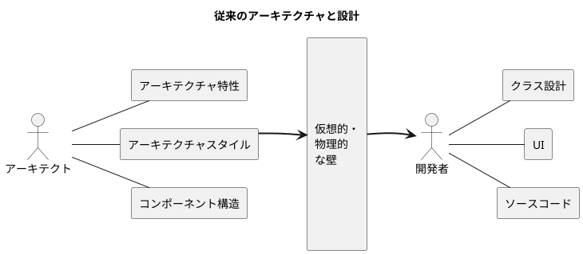
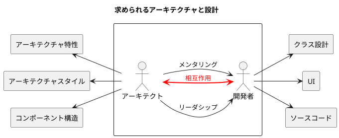
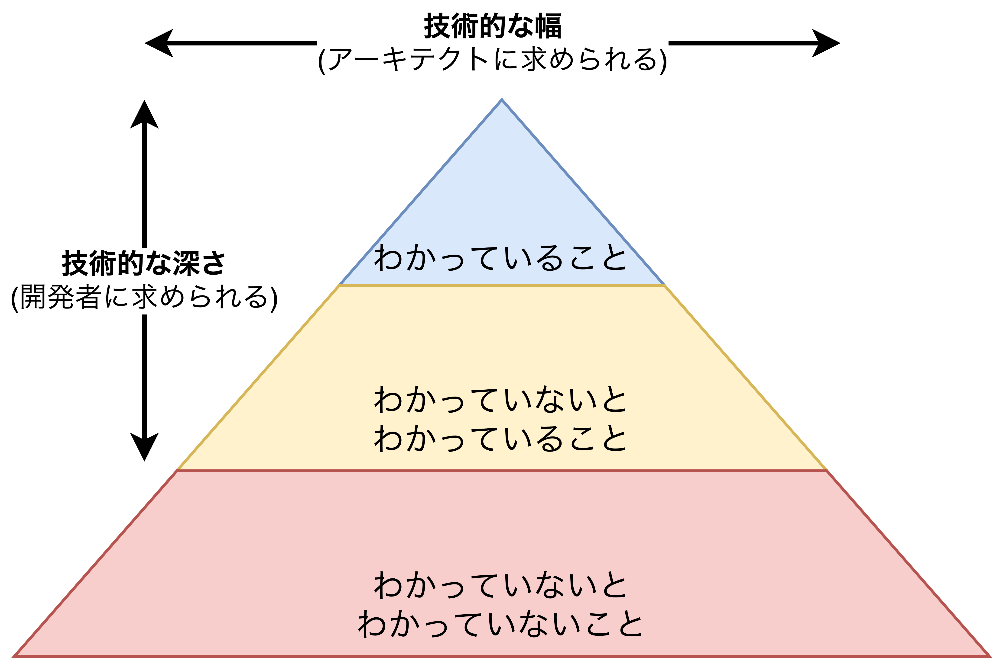

## アーキテクチャ思考

- アーキテクトらしい考え方の4つの側面
  1. **アーキテクチャと設計の違い**を理解し、アーキテクチャを機能させるために開発チームとどう協働するか理解していること。
  2. ある程度の技術的な深さを維持しながらも、ソリューションや可能性を見出せるような**広範な技術知識を持つ**こと。
  3. 様々なソリューションと技術の間にある**トレードオフを理解・分析・調整できる**こと。
  4. **ビジネスドライバー**がどのようにアーキテクチャの関心事に影響するかを理解していること。

### アーキテクチャと設計




- <font color=red>アーキテクチャと設計の境界は存在せず、<b>アーキテクチャと設計は常に同期されていなければならない</b>。</font>そのためにアーキテクトと開発者は強力な双方向のコミュニケーションを築く必要がある。
- <u>アーキテクトはメンタリングやコーチングも行う機会を提供する必要がある</u>。開発者とただコミュニケーションを取るだけではない。

### 技術的な幅



- 開発者とアーキテクトは求められる技術的詳細の範囲が異なる。
  - **開発者**: 良い仕事をするためにかなりの**技術的な深さを求められる**。
  - **アーキテクト**: アーキテクチャ視点で物事を見るために**かなりの技術的な幅が求められる**。
- <font color=red><b>アーキテクトは<u>技術を幅広く理解し、課題を解決すること</u>が価値の大部分である</b></font>ことから、技術的な深さよりも幅の方がずっと重要である。具体的に求められることは以下の通り。
  - 様々なアーキテクチャスタイルの理解とトレードオフ
  - ある問題に対して複数のソリューションを思いつく知識
  - 課題に対して柔軟にアーキテクチャを改善できる引き出しの多さ
- **アーキテクトは代替ソリューションを幅広く検討し、より適切に課題を解決することが求められる**。

### トレードオフを分析する

- <font color=red><b>アーキテクチャは全てがトレードオフであり、あらゆる問いの答えは「場合による」である。</b></font>そのためアーキテクチャには正解/不正解がない。ビジネスドライバー(ステークホルダ)、デプロイ環境、企業文化、予算、期間、開発者のスキルセットなどの複数の要素に依存する。
- ビジネス要件はプロジェクトにより異なるため、トレードオフの要素も異なることから、同じ課題は存在しない。そのため、<u>Googleで答えを見つけられるようなものではない。</u>
- 全てのアーキテクチャにとって、メリット・デメリットが存在する。例えば、<u>パフォーマンスとセキュリティ</u>のどちらを優先するか、<u>拡張性と保守性</u>のどちらを優先するか、などの**多くの「トレードオフ」を多くの「環境要因」(ビジネスドライバ、開発メンバ、納期、予算、要件など)から判断する**必要がある。

#### オークションシステムのトレードオフ事例

<!-- 
```plantuml
title 【事例】オークションシステム
left to right direction

interface 入札情報 as input
rectangle Producer
rectangle キャプチャサービス as Capture
rectangle トラッキングサービス as Tracking
rectangle 分析サービス as Analytics

input - Producer
Producer -- Capture : 入札情報
Producer -- Tracking : 入札情報
Producer -- Analytics : 入札情報
``` 
-->

```plantuml
title トレードオフ分析
left to right direction

rectangle "【解決策1】Pub/Subメッセージングモデル" as pub_sub {
  interface 入札情報 as input_pub_sub
  rectangle "Producer" as Producer_pub_sub
  rectangle "キャプチャ\nサービス" as Capture_pub_sub
  rectangle "トラッキング\nサービス" as Tracking_pub_sub
  rectangle "分析\nサービス" as Analytics_pub_sub
  queue トピック as topic_pub_sub #faa

  Producer_pub_sub <- input_pub_sub
  Producer_pub_sub --> topic_pub_sub
  topic_pub_sub --> Capture_pub_sub
  topic_pub_sub --> Tracking_pub_sub
  topic_pub_sub --> Analytics_pub_sub
}
```

```plantuml
title トレードオフ分析
left to right direction

rectangle "【解決策2】P2Pメッセージングモデル" as p2p {
  interface 入札情報 as input_p2p
  rectangle "Producer" as Producer_p2p
  rectangle "キャプチャ\nサービス" as Capture_p2p
  rectangle "トラッキング\nサービス" as Tracking_p2p
  rectangle "分析\nサービス" as Analytics_p2p
  queue キュー as queue_capture_p2p #faa
  queue キュー as queue_tracking_p2p #faa
  queue キュー as queue_analytics_p2p #faa

  Producer_p2p <- input_p2p
  Producer_p2p --> queue_capture_p2p
  Producer_p2p --> queue_tracking_p2p
  Producer_p2p --> queue_analytics_p2p
  queue_capture_p2p --> Capture_p2p
  queue_tracking_p2p --> Tracking_p2p
  queue_analytics_p2p --> Analytics_p2p
}
```

<table>
  <caption>Pub/SubとP2Pの比較
	<tbody>
		<tr>
			<th></th>
			<th>Pub/Sub</th>
			<th>P2P</th>
		</tr>
		<tr>
			<th>メリット</th>
			<td>
        ①プロデューサは<br>　<font color=blue><b>1つのトピックのみに<br>　接続するだけで良い。</b></font>
      </td>
			<td>
        ①各コンシューマの<font color=red><b>I/Fがサービス毎に<br>　最適化される</b>(シンプル)</font><br>
        ②各サービスのメッセージ数の<br>　<font color=green><b>監視が容易(スケーリングしやすい)</b></font>
      </td>
		</tr>
		<tr>
			<th>デメリット</th>
			<td>
        ①不正なコンシューマが入札情報を盗聴できる<br>
        ②各コンシューマの<font color=red><b>I/Fが共通</b>になり<br>　無駄で複雑な構造</font>になる。
        ③各サービスのメッセージ数の<font color=green><b>監視が非常に困難</b></font>
      </td>
			<td>
        ①プロデューサが<font color=blue><b>サービス数だけ<br>　キューを管理する必要がある</b></font>
      </td>
		</tr>
	</tbody>
</table>

### ビジネスドライバーを理解する

- <font color=red>「アーキテクトらしく考える」とは、<b>システムの成功に必要なビジネスドライバーを理解し、それらの要件をアーキテクチャ特性に変換すること</b></font>である。
  - **ビジネスドライバー**: 企業が目標を達成するために乗り越えるべき課題や障害、または主要な要素
  - **アーキテクチャ特性**: スケーラビリティ、パフォーマンス、可用性、移植性など
- <u>ビジネス要件をアーキテクチャ特性に変換するためには**ドメイン知識**と**ステークホルダとの「協力的」関係**が必要である。</u>

### アーキテクティングとコーディングのバランスを取る

- <font color=red>アーキテクトは<b>①一定レベルの技術的深さ</b>を持ちながらも、それよりも<b>②技術的な幅</b>を持っていることが求められる。</font>
- アーキテクトがボトルネックにならないように、開発のリーダ・マネージャポジションに「一部のクリティカルパス」を一任する必要がある。これにより<u>3つの効果</u>がある。
  1. チームのボトルネックにならずにプロダクションコードを書く実地経験ができる。
  2. クリティカルパスやフレームワークの開発がチームに分散される。
  3. 【**最も重要**】アーキテクトが開発チームと「ともに」ビジネスロジックを書くことができ、アーキテクトと開発者の両方の視点で現場で起きている課題を共有できる。
- ただし、**アーキテクトが開発チームの作業を見ることができないケース**は多々発生する。**現場感を維持し続ける対応策**として<u>4つの方法</u>が考えらえる。
  1. アーキテクチャ特性の比較・把握のために**PoC(Proof-of-Concepts: 概念検証)を頻繁に行う**。PoCで利用するソースコードはプロダクションレベルの品質で実装する。理由は①開発者のサンプルになることがほとんどであることと、②構造化された高品質なコードを書く練習になること、の2つが挙げられる。
  2. 開発チームが重要で機能的なユーザストーリーに取り組めるように、**技術的負債やアーキテクチャに関わるストーリーを引き受ける**。
  3. **バグ修正やコードレビューをする**。コードベースでアーキテクチャのトレードオフを理解することができる。
  4. **開発チームの日常業務を自動化する**。開発チームのパフォーマンスを上げてもらう。
