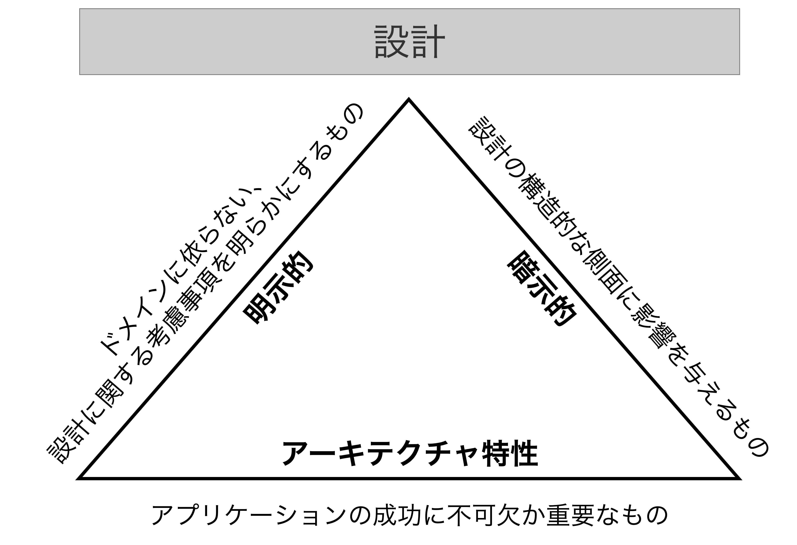

## アーキテクチャ特性

- アーキテクトは<b>ドメインに直接影響しないがソフトウェアが満たさなければならないアーキテクチャ特性を定義・観察・分析</b>しなければならない。そのためにはドメインやビジネス要件を定義することに協力することも欠かせない。
  - **アーキテクチャ特性**: 問題領域(ドメイン)とは独立したソフトウェアシステムが満たすべき要件。
- アーキテクチャ特性は3つの基準を満たす。それぞれの基準が相互作用し合う。
  1. **【明示的】ドメインに依らない設計に関する考慮事項を明らかにするもの**: 要件文書やその他の具体的な記述にあらわれるもの。
  2. **【暗示的】設計の構造的な側面に影響を与えるもの**: 要件にはほとんど現れないがプロジェクトの成功には欠かせないもの。例えば、可用性、信頼性、セキュリティなどがあり、アーキテクチャ特性の分析段階で明らかにする必要がある。
  3. **【アーキテクチャ特性】アプリケーションの成功に「不可欠」か「重要な」もの**: アーキテクチャ特性をサポートすればするほど設計が複雑になるため、「不可欠」で「重要な」ものを採用し、一握りのアーキテクチャ特性を選択する。
- <u>どのようなソフトウェアも独自の要因に基づいて重要なアーキテクチャ特性を発明する可能性がある。</u>

### アーキテクチャ特性の（部分的な）リスト

- アーキテクチャ特性は<b>コードレベルの小粒度の特性</b>から<b>運用レベルの大粒度の特性</b>まで幅広い。
- <u>アーキテクチャ特性に関する真の普遍的な標準は存在していない</u>。また、ソフトウェアシステムの急速な発展に伴い、<u>新たな概念・用語・手段・検証が常に生まれている</u>。**用語に基づく誤解を減らすためにユビキタス言語を確立**して使用することが良い。

#### 運用に関するアーキテクチャ特性

- 運用やDevOpsの関心ごとと大きく重なっており、多くのソフトウェアプロジェクトではこれらの関心ごとが交わることになる。

<table>
    <caption>運用特性</caption>
    <tbody>
		<tr>
			<th>用語</th>
			<th>定義</th>
		</tr>
		<tr>
			<th>可用性 (Availability)</th>
			<td>システムがどれくらいの期間利用できるか(24時間365日稼働する場合には、 障害が発生した場合に迅速にシステムを稼働できるようにするための 措置が必要となる)。</td>
		</tr>
		<tr>
			<th>継続性 (Continuity)</th>
			<td>障害復旧能力</td>
		</tr>
		<tr>
			<th>パフォーマンス (Performance)</th>
			<td>負荷試験、ピーク分析、機能の使用頻度、必要な容量、 応答時間の分析などが含まれる。パフォーマンスの受入れには 数ヶ月にわたる独自の作業が必要になることもある。</td>
		</tr>
		<tr>
			<th>回復性 (Recoverability)</th>
			<td>処理の持続性要件。これはバックアップ戦略と ハードウェアの複製の要件に影響する。 【例】災害時にシステムをどれだけ早くオンラインに戻す必要があるか。</td>
		</tr>
		<tr>
			<th>信頼性/安全性 (Reliability / Safety)</th>
			<td>システムがフェイルセーフである必要があるのか、人命に影響を与えるようなミッションクリティカルなものであるのかを評価する。障害が発生した場合、会社に多額の費用がかかるだろうか。</td>
		</tr>
		<tr>
			<th>堅牢性 (Robustness)</th>
			<td>実行中にインターネット接続が切れた場合や、 停電やハードウェア障害が発生した場合に エラーがや境界条件を処理できるかどうか</td>
		</tr>
		<tr>
			<th>スケーラビリティ (Scalability)</th>
			<td>ユーザ数やリクエスト数が増えてもシステムが動作する能力</td>
		</tr>
	</tbody>
</table>

#### コードの構造に関するアーキテクチャ特性

- モジュール性、コンポーネント間の結合度、コードの可読性などの内部品質に関する特性を示す。

<table>
    <caption>構造特性</caption>
    <tbody>
		<tr>
			<th>用語</th>
			<th>定義</th>
		</tr>
		<tr>
			<th>構成容易性 (Configurability)</th>
			<td>エンドユーザが(使い勝手の良いI/Fを介して)ソフトウェアの設定を簡単に変更できること</td>
		</tr>
		<tr>
			<th>拡張性 (Extensibility)</th>
			<td>新しい機能をプラグインで追加可能にすることをどれだけ重視しているか</td>
		</tr>
		<tr>
			<th>インストール容易性 (Installability)</th>
			<td>必要な全てのプラットフォームへのインストールの容易さ</td>
		</tr>
		<tr>
			<th>活用性/再利用性 (Leverageability / Reuse)</th>
			<td>複数の製品で共通のコンポーネントを利用できること</td>
		</tr>
		<tr>
			<th>ローカライゼーション (Localization)</th>
			<td>データフィールドの入力画面や問合せ画面、レポート、マルチバイト文字、 単位や通貨などが<b>多言語に対応していること</b></td>
		</tr>
		<tr>
			<th>メンテナンス容易性 (Maintainability)</th>
			<td>変更の適用やシステムの拡張がどれだけ簡単に行えるか</td>
		</tr>
		<tr>
			<th>可搬性 (Portability)</th>
			<td>システムは複数のプラットフォームで動作する必要があるか。 【例】フロントエンドはSAP DBだけでなくOracleに対しても動作する必要があるのか。</td>
		</tr>
		<tr>
			<th>アップグレード容易性 (Upgradeability)</th>
			<td>サーバやクライアント上でこのアプリケーション/ソリューションの<b>旧バージョンから新バージョンへのアップグレードを簡単/迅速に行える能力</b></td>
		</tr>
	</tbody>
</table>

#### 横断的なアーキテクチャ特性

<table>
    <caption>横断的特性</caption>
    <tbody>
		<tr>
			<th>用語</th>
			<th>定義</th>
		</tr>
		<tr>
			<th>アクセシビリティ (Accessibility)</th>
			<td>色覚障害や難聴などの障害を持つユーザも含め全てのユーザのアクセスしやすさ</td>
		</tr>
		<tr>
			<th>長期保存性 (Archivability)</th>
			<td>データは一定期間後にアーカイブまたは削除する必要があるか。 【例】顧客のアカウントは3ヶ月後に削除されるか、あるいは廃止されたものとして、将来アクセスできるようにセカンダリDBにアーカイブされる。</td>
		</tr>
		<tr>
			<th>認証 (Authentication)</th>
			<td><b>ユーザが何者かを確認する</b>ためのセキュリティ要件</td>
		</tr>
		<tr>
			<th>認可 (Authorization)</th>
			<td>ユーザが(ユースケース、サブシステム、Webページ、 ビジネスルール、フィールドレベルなどによって)アプリケーション内の <b>特定の機能にのみアクセスできることを保証する</b>セキュリティ要件</td>
		</tr>
		<tr>
			<th>合法性 (Legal)</th>
			<td>システムはどのような法的制約の中で運用されているか(データ保護、米企業改革法、GDPRなど)、会社はどのような権利留保を要求しているか、アプリケーションの構築方法やデプロイ方法に関する規則はあるか。</td>
		</tr>
		<tr>
			<th>プライバシー (Privacy)</th>
			<td>従業員から取引を隠せるか(取引が暗号化されていてDBAや ネットワークアーキテクトでさえも取引を見ることができなくなっているか)</td>
		</tr>
		<tr>
			<th>セキュリティ (Security)</th>
			<td>DB内でデータを暗号化する必要があるか。社内システム間のネットワーク通信を暗号化する必要があるか。リモートユーザのアクセスにはどのような認証が必要か。</td>
		</tr>
		<tr>
			<th>サポート容易性 (Supportability)</th>
			<td>アプリケーションにはどの程度の技術サポートが必要か。 システムのエラーをデバッグするにはログなどを どのようなレベルで整えておく必要があるか。</td>
		</tr>
		<tr>
			<th>ユーザビリティ (Usability)</th>
			<td>アプリケーション/ソリューションでユーザが 目標を達成するのに必要なトレーニングのレベル。ユーザビリティの要件は他のアーキテクチャ上の課題と同様に 真剣に扱われる必要がある。</td>
		</tr>
	</tbody>
</table>

#### 【補足】ISO(国際標準化機構)が公開しているアーキテクチャ特性

ISOは能力別に整理された不完全な分類のリスト(https://oreil.ly/SKc_Y)を公開している。<u>最初の「機能適合性」はアーキテクチャ特性ではなく、ソフトウェアアーキテクチャ自体を構築する動機になる要件である。</u>

1. **機能適合性**: 特定の条件下でプロダクトやシステムが指定されたニーズや暗黙的ニーズを満たす機能を提供する度合い
2. **パフォーマンス効率**: 基地の条件下で使用されるリソース量に対するパフォーマンスの指標
3. **ユーザビリティ**: 利用者がシステムを意図した目的に対して効果的・効率的・満足に利用できること。
4. **信頼性**: 特定の条件下で特性の間システムが機能する度合い。
5. **セキュリティ:**: 人々や他の製品、もしくはシステムが、その種類や権限のレベルに応じて適切なレベルのデータアクセスを行えるよう、ソフトウェアが情報とデータを保護する程度。
6. **保守容易性**: 環境や要求の変化に応じて開発者がソフトウェアを改良・修正・適応できる効果や効率の度合い
7. **互換性**: システムが別のシステムと情報交換したり、必要な機能を実行したりしながら、同じハードウェアやソフトウェア環境を共有できる度合い
8. **可搬性**: 開発者がシステム・製品・コンポーネントをある環境(開発/検証/本番/運用環境など)から別の環境に移行できる程度

<table border="1">
	<caption>ISOが公開している各アーキテクチャ特性の詳細</caption>
    <thead>
        <tr>
            <th>主分類</th>
            <th>副分類</th>
            <th>説明</th>
        </tr>
    </thead>
    <tbody>
        <tr>
            <th rowspan="3">機能適合性</td>
            <td>機能完全性</td>
            <td>一連の機能が特定のタスクとユーザの 目的全てをカバーしている度合い</td>
        </tr>
        <tr>
            <td>機能的正確性</td>
            <td>製品やシステムが必要な精度で正しい結果を提供する度合い</td>
        </tr>
        <tr>
            <td>機能的妥当性</td>
            <td>機能が指定されたタスクや目的の達成を容易にする度合い</td>
        </tr>
        <tr>
            <th rowspan="3">パフォーマンス 効率</td>
            <td>時間的挙動</td>
            <td>応答、処理時間、スループット率の計測</td>
        </tr>
        <tr>
            <td>リソース利用率</td>
            <td>使用されるリソースの量と種類</td>
        </tr>
        <tr>
            <td>容量</td>
            <td>設定された最大限度を超えるかどうかの程度</td>
        </tr>
        <tr>
            <th rowspan="4">ユーザビリティ</td>
            <td>適切認識可能性</td>
            <td>ユーザがそのソフトウェアが自分のニーズに あっているかどうかを認識できること</td>
        </tr>
        <tr>
            <td>学習用意性</td>
            <td>ユーザがそのソフトウェアの使い方を どれだけ簡単に習得できるか</td>
        </tr>
        <tr>
            <td>ユーザエラー防止率</td>
            <td>ユーザがエラーを起こさないようにすること</td>
        </tr>
        <tr>
            <td>アクセシビリティ</td>
            <td>幅広い特性や能力を持った人が 利用できるようにすること</td>
        </tr>
        <tr>
            <th rowspan="4">信頼性</td>
            <td>成熟度</td>
            <td>通常の運用においてソフトウェアが 信頼性要件を満たしているかどうか</td>
        </tr>
        <tr>
            <td>可用性</td>
            <td>ソフトウェアが動作し、アクセス可能であるか</td>
        </tr>
        <tr>
            <td>耐障害性</td>
            <td>ハードウェア・ソフトウェアに障害が 発生した場合にソフトウェアが期待通りに動作するか</td>
        </tr>
        <tr>
            <td>回復性</td>
            <td>ソフトウェアが障害から回復し、影響を受けたデータを回復し、 システムが望ましい状態を再構築できるか</td>
        </tr>
        <tr>
            <th rowspan="5">セキュリティ</td>
            <td>機密性</td>
            <td>アクセス権を持つ権限を与えられたもののみが データにアクセスできること</td>
        </tr>
        <tr>
            <td>完全性</td>
            <td>データへの不正アクセスや変更を防止されていること</td>
        </tr>
        <tr>
            <td>立証性</td>
            <td>アクションやイベントの実施を証明できること</td>
        </tr>
        <tr>
            <td>責任追跡性</td>
            <td>ユーザのアクションを追跡できること</td>
        </tr>
        <tr>
            <td>認証可能性</td>
            <td>ユーザの身元を証明できること</td>
        </tr>
        <tr>
            <th rowspan="5">保守容易性</td>
            <td>モジュール性</td>
            <td>ソフトウェアが離散的なコンポーネントで 構成されている度合い</td>
        </tr>
        <tr>
            <td>再利用性</td>
            <td>開発者がアセットを複数のシステムで使用したり、 他のアセットを構築したりできる度合い</td>
        </tr>
        <tr>
            <td>分析容易性</td>
            <td>開発者がソフトウェアに関する具体的な指標を どれだけ簡単に収集できるか</td>
        </tr>
        <tr>
            <td>修正容易性</td>
            <td>開発者が欠陥を導入したり、既存の製品の品質を 低下させずにソフトウェアを修正できる度合い</td>
        </tr>
        <tr>
            <td>テスト容易性</td>
            <td>開発者や他の人が容易にソフトウェアをテストできるか</td>
        </tr>
        <tr>
            <th rowspan="2">互換性</td>
            <td>共存可能性</td>
            <td>他の製品と共通の環境や資源を共有しながら、 必要な機能を効率的に実行できること</td>
        </tr>
        <tr>
            <td>相互運用性</td>
            <td>複数のシステムが情報を交換して利用できる程度</td>
        </tr>
        <tr>
            <th rowspan="3">可搬性</td>
            <td>適応可能性</td>
            <td>開発者が異なるハードもしくはソフトの環境に適応させられるか</td>
        </tr>
        <tr>
            <td>インストール可能性</td>
            <td>ソフトウェアを指定された環境にインストール/アンインストールできるか</td>
        </tr>
        <tr>
            <td>置換可能性</td>
            <td>開発者が容易に機能を他のソフトウェアに置き換え可能か</td>
        </tr>
    </tbody>
</table>

### トレードオフと少なくとも最悪でないアーキテクチャ

- アーキテクチャ特性は以下の要因から網羅的にリストアップできない
  1. アーキテクチャ特性は「設計上の努力」と「コードの構造的なサポート」を必要としている
  2. それぞれのアーキテクチャ特性が相互に影響し合うためビジネス要件ごとに特性が異なる
- <u>それぞれのアーキテクチャ特性が相互作用するため、全てのアーキテクチャ特性を最大限活かすことはほぼ不可能である。</u>そのため、アーキテクトは<b>イテレーティブにアーキテクチャを設計</b>し、最善のアーキテクチャではなく、<b>最悪でないアーキテクチャ</b>を開発することが望ましい。

#### アーキテクチャ特性のトレードオフの例

- **パフォーマンスとセキュリティ**: 実行時の暗号化や認証処理がパフォーマンスにマイナスな影響を及ぼすことが考えられる。
- **拡張性と保守性**: 機能拡張を容易に行うために、複雑なロジックになってしまい、保守性にマイナスな影響を及ぼすことが考えられる。