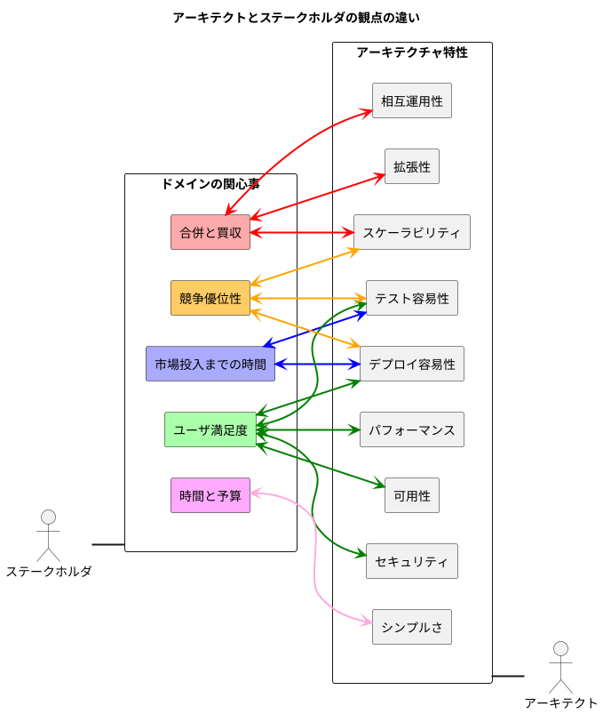

## アーキテクチャ特性を明らかにする

```plantuml
left to right direction

rectangle "ドメインの関心事" as domain
rectangle "ビジネス要件" as spec
rectangle "暗黙的なドメイン知識" as knowledge
rectangle "アーキテクチャ特性" as characteristics

domain <--> characteristics : 変換
spec <--> characteristics : 変換
knowledge <--> characteristics : 変換
```

- <font color=red>アーキテクトは<b>①ドメインの関心事</b>、<b>②ビジネス要件</b>、<b>③暗黙的なドメイン知識</b>の少なくとも3つから<b>アーキテクチャ特性を明らかにする力(変換する能力)</b>が求められる。</font>
- <u>全てのアーキテクチャ特性をサポートする「**汎用的なアーキテクチャを設計すること**」＝**アンチパターン**である</u>。そのため、**設計はイテレーティブに行いシンプルを保つ**ようにする、つまり、アーキテクチャ特性を可能な限り絞るようにする。
- アーキテクチャ特性を盛り込みすぎる(汎用アーキテクチャにする)と以下の問題が生まれやすい。
  - 設計が複雑になり、構造的崩壊につながる。
  - 開発リソース(人・費用・時間)が大きくなり、設計が非常に困難になる。
  - 仕様を固めることが難しく、曖昧になってしまう。

### アーキテクチャ特性をドメインの関心事から捉える

- アーキテクトとステークホルダとの間でアーキテクチャ特性の優先順位をつけることが多いが、<u>ほとんどが時間の無駄</u>である。そのため、<font color=red><b>アーキテクトは優先順位をつけずに最重要のアーキテクチャ特性をステークホルダに3〜5個選んでもらう</b>。</font>
- ステークホルダに選んでもらったアーキテクチャ特性をもとに<u>トレードオフ分析</u>を行い、ステークホルダと協力して<u>ドメインの観点から重要なアーキテクチャ特性を導く</u>。
- **1つのドメインの関心事を満たすためには複数(1つ以上)のアーキテクチャ特性が必要になる**。例えば、市場投入までの時間を満たすためにはテスト容易性とデプロイ容易性を少なくとも満たす必要がある。
- <u>パフォーマンスを第一に優先することは失敗につながる</u>。理由は以下の通り。
  - 【**理由1**】「可用性」なければ、システムがどれだけ早くても意味がない
  - 【**理由2**】「スケーラビリティ」がなければ、ドメインが成長して処理が時間内に完了しない可能性がある
  - 【**理由3**】「信頼性」がなければ、処理中にクラッシュしてしまう
  - 【**理由4**】「回復性」がなければ、処理が中断したところから回復して再起動できない
- 上記のことから分かる通り、パフォーマンスを満たすために必要なトレードオフ分析は可用性やスケーラビリティ、信頼性などがある。

#### アーキテクトとステークホルダの観点の違い



<div style="page-break-before:always"></div>

### ビジネス要件からアーキテクチャ特性を抽出する

- アーキテクチャ特性が要件文書に明示されている時、<font color=red>アーキテクトが持つドメイン知識が非常に有益である</font>。例えば、大学生の履修登録アプリを考える。文書には「ユーザ数」という明らかな要件が現れる。その時にアーキテクトはもち前のドメイン知識を活用し、システムの特性を定義・観察・分析する。
  - 【仮定】学校に1,000人の学生がいて、登録に10時間かかるとする。
  - 【ユースケース1】学生が均等に分散してシステムを利用する
  - 【ユースケース2】期限のラスト10分に1,000人の学生が一斉にシステムを利用する
- ビジネス要件から<u>ドメイン知識</u>と<u>想像力</u>を働かせることが重要
  - 24時間365日で**常に一定で利用される**(リクエストが一定)のか、それとも**シーズンごとに利用にばらつきがある**(瞬間的にバーストする)のか。
  - バックアップは必要か、リストアは必要か。
  - 外部サービスと連携するか、しないか(処理が中断された時の信頼性は担保するか、しないか)。
- <u>パフォーマンスは微妙な概念</u>であり、スケーラビリティ(最上位特性の一つ)の数値と組み合わせて定義しても良い。例えば、一定のユーザ数(スケール)を許容できるパフォーマンスのベースラインを確立するなど。

### ビジネス要件からアーキテクチャ特性を抽出する事例：シリコンサンドイッチ

**記述(システムが解決しようとしている全体的なドメインの問題)**
> 全国展開しているサンドイッチ店が、（電話注文に加えて）オンライン注文を可能にしたいと考えている。

**ユーザ数(予想されるシステム利用者の数や種類)**
- 数千。いずれは数百万。

**要件(ドメインレベルの要件)**
1. ユーザが注文するとサンドイッチを受け取れる時間と店舗までの道順を提示する（交通情報を含む複数の外部地図サービスと統合する必要がある）。
2. 店舗が宅配サービスを行なっている場合には、届け先にサンドイッチを宅配する。
3. モバイル端末でのアクセシビリティ。
4. 全国向けにデイリープロモーション用メニューやスペシャルメニューを提供する。
5. エリア限定でデイリープロモーション用メニューやスペシャルメニューを提供する。
6. オンラインか直接、または配達時の支払いが可能。

**追加コンテキスト(問題領域に関する暗黙的知識によって表現されるもの)** ← めちゃくちゃ難しい
1. サンドイッチ店はフランチャイズで、オーナーはそれぞれ異なる。
2. 親会社は近日中に海外展開を予定している。
3. 安い労働力を雇って利益を最大化するのが企業のゴール

#### 明示的な特性

- **スケーラビリティ**: ユーザ数より、同時接続数のサポートが求められていると推測できる。スケーラビリティは最上位のアーキテクチャ特性の一つ。
- **弾力性**: ユーザ数より、リクエストのバーストに対応するための特性として導ける。
- **信頼性**: 要件1より、道順を提示する際、外部地図サービスと統合する必要があることから、<u>必須ではないが検討事項として考慮しても良い</u>。
- **パフォーマンス**: 要件3より、予算や期間の制約にもよるが、アプリのシンプルさを考慮し、モバイル最適化した開発が考えられる。これは<font color=red>UXデザイナーやドメインエキスパート、およびステークホルダと協力して合意する必要がある</font>。
- **カスタマイズ性(拡張性)**: 要件4と5より、全国向け・エリア限定向けのメニューがあることから導き出せる。マイクロカーネル(アーキテクチャレベル)を採用するか、テンプレートメソッドパターン(設計レベル)を採用するかは、トレードオフ分析によって変わるため「場合による」という回答になる。
- **セキュリティ**: 要件6より、オンライン決済はセキュリティが暗黙的にあることを意味しているが、セキュリティの特性を強く期待していることは示されていない。
- **フィジビリティ(実現可能性)**: 追加コンテキスト1より、それぞれ店舗ごとにオーナーが異なることから異なる制約(費用や時間、スタッフのスキルセットなど)があることを考慮しなければならない。
- **国際化対応(Internationalization: i18n)**: 追加コンテキスト2より、設計上の決定になることは間違いない。国際化対応を満たす設計手法は多く存在するが、特別な構造を必要とすることはない。
- **ユーザビリティ**: 追加コンテキスト3より、目的を達成する(労働力を最小化しつつ利益を最大化する)ために、効率的・効果的な利用方法を検討する必要がある。

#### 暗黙的な特性

- <font color=red><b>アーキテクチャ特性の多くは要件文書で指定されることが少ない</b></font>。
- 暗黙的な特性の一つに**可用性**(確実にアクセスできることを保証する特性)がある。また、可用性と密接に関連している特性に**信頼性**(ユーザが利用している間はサイトが稼働し続けることを保証する特性)がある。
- **セキュリティも暗黙的特性の一つ**であり、セキュリティの知名度によって優先順位をつける必要がある。<u>セキュリティが設計の構造的側面に影響を与える場合、アーキテクトはセキュリティをアーキテクチャ特性とみなす。</u>
