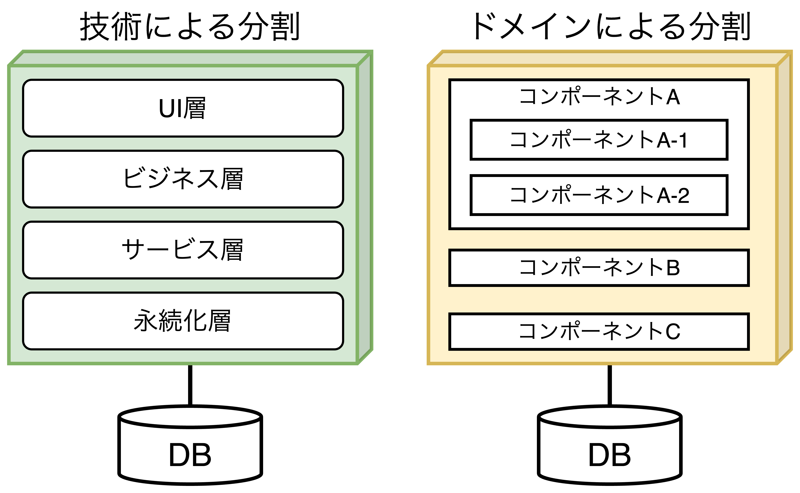

## コンポーネントベース思考

- <font color=red>「コンポーネント(jar, dll, gemなど)」とは、<b>モジュールが物理的にパッケージ化されたもの</b>を指す。</font>

### アーキテクトの役割

- アーキテクトは、以下の役割を持つ。
  - <b>アーキテクチャを構成するコンポーネントを定義・改良・管理し、統制する役割</b>
  - ビジネスアナリスト、開発者、QAエンジニア、運用エンジニア、エンタープライズアーキテクト、各分野の専門家など多くの技術者と協力して要件定義・設計を行う役割
- <font color=red>一般に、コンポーネントはアーキテクトが直接関わるソフトウェアシステムの最小要素である。</font>デザインパターンの発見・適用はアーキテクトが知っていても良いが、基本的には開発者の範囲。

#### アーキテクチャ分割



- アーキテクチャの最上位分割は大きく「レイヤードアーキテクチャ」もしくは「モジュラーモノリス」の2つに分けられる。
  - **【レイヤードアーキテクチャ】** 技術能力に基づいたアーキテクチャ編成であり、コンウェイの法則に基づいた**技術による最上位分割**と呼べる。
  - **【モジュラーモノリス】** 互いに独立したドメインやワークフローに従ったアーキテクチャ編成であり、**ドメインによる最上位分割**と呼べる。
- <font color=red>アーキテクトは最上位分割における「技術による分割」か「ドメインによる分割」かを最初に決断しなければならない。</font>

#### 【事例】アーキテクチャ分割

<table>
  <tr>
    <td></td>
    <td></td>
  </tr>
</table>

##### 技術による分割のメリット・デメリット

- **【メリット】**
  - 特定の処理を行うコードの分類に応じて明確に分離している。
  - レイヤードアーキテクチャパターンによりうまく適合している。
- **【デメリット】**
  - グローバルな結合度が高い。CommonやLocalに変更を加えた際の影響範囲が広い。
  - 開発者はCommonまたはLocalの両方のレイヤーでドメインの概念を複製しなければならない可能性がある。
  - 多くの場合、カスタマイズ部分とドメイン部分を含む単一のDBを作成するため、データレベルの結合度がより高くなる。これにより、<font color=red><u>分散システムの移行を困難にし、データ関係を複雑にする</u></font>。

##### ドメインによる分割のメリット・デメリット

- **【メリット】**
  - 実装の詳細ではなく、ビジネス機能により近い形でモデル化されている。
  - 逆コンウェイ戦略を用いてドメインを中心とした職能横断チームをより容易に編成できる。
  - モジュラーモノリスやマイクロサービスのアーキテクチャスタイルによりうまく適合する。
  - メッセージフローが問題領域と一致している。
  - データやコンポーネントの分散アーキテクチャへの移行が容易
- **【デメリット】**
  - 特定の処理を行うコードが複数箇所に現れる(再利用よりも複製を優先している)。 

### 開発者の役割

- <font color=red><b>一般的にクラス関数の設計は、大部分が開発者の役割となる</b>。開発者は通常、アーキテクトと共同で設計したコンポーネントをクラスや関数、サブコンポーネントなどに細分化する。</font>
- **開発者とアーキテクトはイテレーティブに設計と実装を重ねていく**ことで、より多くの詳細や改良点を明らかにしていく。

### コンポーネントの識別する流れ

```plantuml
title コンポーネントの識別サイクル
left to right direction

rectangle "【ステップ1】\n初期コンポーネントを\n識別する" as step1
rectangle "【ステップ2】\nコンポーネントに\n要件を割り当てる" as step2
rectangle "【ステップ3】\nロールや責務を\n分析する" as step3
rectangle "【ステップ4】\nアーキテクチャ特性を\n分析する" as step4
rectangle "【ステップ5】\nコンポーネントを\n再編成する" as step5
note left of step5
関係者にレビューを
依頼して、アーキテクチャの
**精度・確度を上げる**。
end note

step1 -> step2
step2 --> step3
step3 -> step4
step5 <-- step4
step3 <- step5
```

- コンポーネントは以下の手順でイテレーティブに識別していく方法が最も効果的である。
  1. **【初期コンポーネントを識別する】** ドメイン機能のマッピングや振る舞いの確認を行い、最上位コンポーネントや初期コンポーネント群を識別する。
  2. **【コンポーネントに要件を割り当てる】** 識別した初期コンポーネントと要件を照合し、コンポーネントの統合・分割を行うことで、要件に適合した適切な粒度のコンポーネントに調整する。
  3. **【ロールや責務を分析する】** 正しいコンポーネントの粒度を発見した後、そのコンポーネントのロールや振る舞いを考慮する必要があり、要件の中で明らかになった責務を割り当てる。
  4. **【アーキテクチャ特性を分析する】** 機能要件に加え、ユーザ数や本番環境などの複数の要件を考慮して、アーキテクチャ特性を分析する。
  5. **【コンポーネントを再編成する】** 1〜4を通して概観が明らかになってきた時に、関係者にレビューを行い、ソフトウェア設計を見直すことで、発見されていない課題や抜け漏れを洗い出す。
- コンポーネントの粒度によって、通信回数の頻度が変わるため、トレードオフが発生する。
  - **【粒度が細かい】** テスト・デプロイ容易性が高まるが、パフォーマンスに影響が出る。
  - **【粒度が粗い】** パフォーマンスが高いが、テスト・デプロイ容易性が低くなる。

<div style="page-break-before:always"></div>

### コンポーネント設計

- <font color=red>アーキテクトは<b>ドメインエキスパートを含む開発者やビジネスアナリストと協力</b></font>して初期コンポーネントを設計する。初期コンポーネントは<b>技術とドメインの両方の観点から分割</b>し、**アーキテクチャ特性を考慮した粗い分割**を行う。
- 

##### 【コンポーネントを見極める方法1】アクター/アクションアプローチ

> アクター/アクションアプローチは**要件とコンポーネントをマッピングし、システムのアクターと、アクターが実行するアクションを特定する**。このアプローチは「明確なロール」と「実行可能なアクション」の種類を形作る時にうまく機能する。
> このアプローチはモノリシックでも分散型でも全てのタイプのシステムに適合している。

##### 【コンポーネントを見極める方法2】イベントストーミング

> イベントストーミングはメッセージやイベントを使ってコンポーネント間で通信することを想定しており、要件および特定されたロールに基づいてシステムで発生するイベントを検討し、**イベントとメッセージハンドラを中心にコンポーネントを識別する**。マイクロサービスのような分散アーキテクチャでうまく機能する。

##### 【コンポーネントを見極める方法3】ワークフローアプローチ

> イベントストーミングに代替として、ワークフローアプローチがある。このアプローチは主要なロールを明らかにし、明らかにした**ロールが従事するワークフローの種類を中心にコンポーネントを識別する**。

### アーキテクチャ量子再び：モノリシックアーキテクチャと分散アーキテクチャの選択

- <font color=red>アーキテクチャ量子はアーキテクチャ特性のスコープを定義し、「モノリシックか分散型か」を決める重要な要素になる。</font>
- **モノリシックアーキテクチャ**は「レイヤードアーキテクチャ」と「モジュラーモノリス」の2つに分けられ、**分散型アーキテクチャ**は「ネットワークプロトコル」を介して通信する独自の系で動作するサービス群である。
- **アーキテクチャ量子は設計の早い段階でアーキテクチャ特性のスコープを分析する方法として有用**である。例えば、コンポーネントごとにアーキテクチャ特性が異なる場合、分散型アーキテクチャが必要になる。
