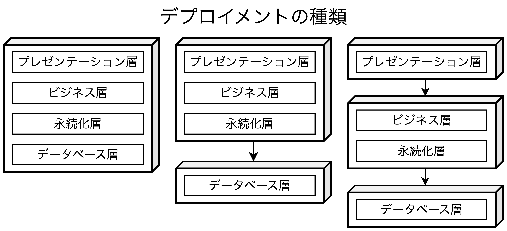
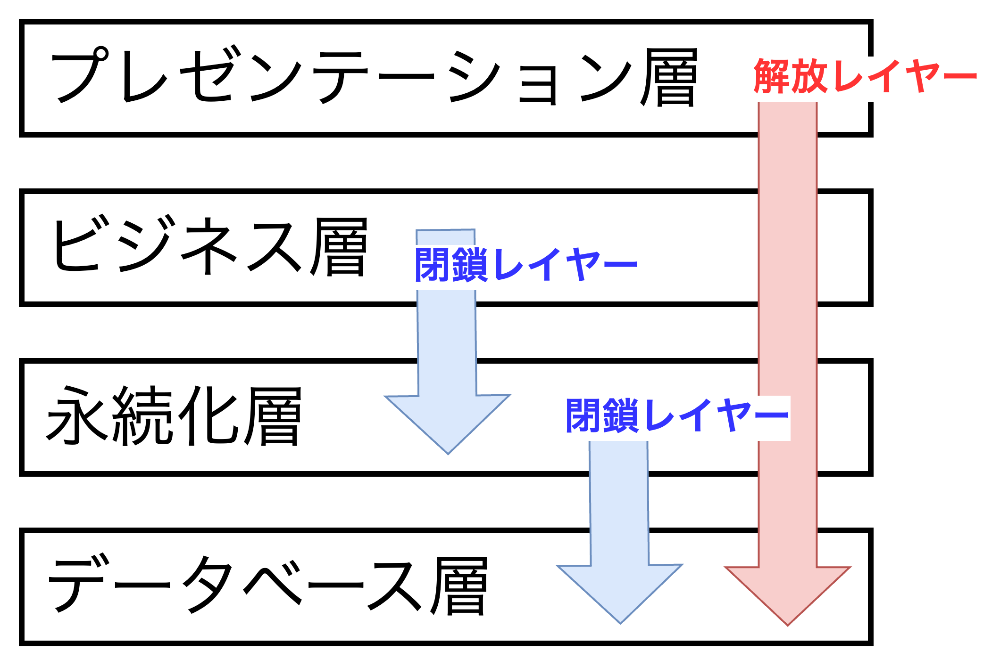
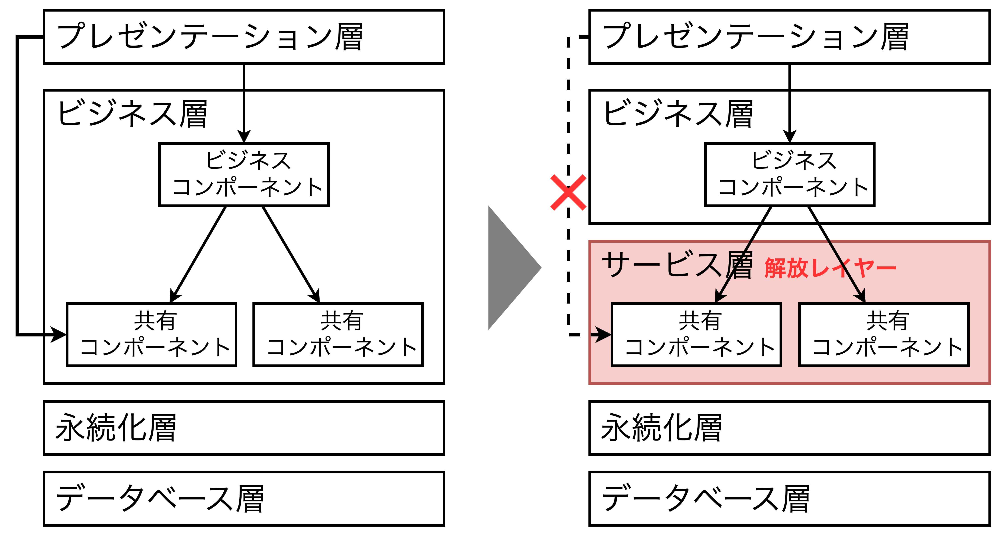

## レイヤードアーキテクチャ

- $N$層アーキテクチャと呼び、コンウェイの法則と同じ構造になっている。
- <b>シンプルさ、親しみやすさ、低コスト</b>というメリットがある一方で、<u>レイヤードアーキテクチャは暗黙のアーキテクチャアンチパターンや偶発的アーキテクチャアンチパターンにも該当する</u>。
- ほとんどのアプリケーションのデファクトスタンダードであり、「コーディングを始めたばかり」のアジャイル開発チームの場合はレイヤードアーキテクチャである可能性が高い。

### トポロジー

- レイヤードアーキテクチャ内のコンポーネントは<b>論理的な水平方向のレイヤー</b>として編成され、技術的な役割によってグループ化されるため、ドメイン駆動設計とは相性が悪い。
- 一般的にプレゼンテーション層、ビジネス層、永続化層、データベース層の4つの層が標準的である。小規模アプリの場合は、ビジネス層と永続化層が統合され、3層になることもあり、大規模アプリの場合は5層以上になることもある。
  - **プレゼンテーション層**: UIとバックエンドとの通信ロジックに責任を持つ。
  - **ビジネス層**: リクエストに関連した特定のビジネスルールの実行に責任を持つ。
  - **永続化層**: データアクセス層。データベースからデータを取得する。
  - **データベース層**: インメモリ、ファイルシステム、データベースなどのデータを保持する層。
- デプロイメントの種類としては大きく3種類に分類できる。
  1. 全ての層が一つのコンポーネントであるパターン（インメモリデータベース）
  2. DBを独立した外部ストレージとし、それ以外を1コンポーネントとして開発するパターン
  3. プレゼンテーション層、ビジネス層と永続化層、データベース層の3つに分割するパターン

### 層の分離

- 各レイヤーは**閉鎖レイヤー**か**解放レイヤー**のいずれかに分けられる。
  - **閉鎖レイヤー**: リクエストがレイヤーをスキップせずに直下の層を経由していく(していかなければならない)レイヤー
  - **解放レイヤー**: リクエストがレイヤーをスキップできるレイヤー
- 解放レイヤーの場合、例えばプレゼンテーション層がデータベース層に直接アクセスできる場合、依存関係が複雑になり、変更が困難で高コストになるだけでなく、非常に脆いアーキテクチャになる。

### レイヤーの追加

- 例えばビジネス層に共有機能を含むコンポーネントがある場合、共有機能部分をサービス層として抽出し、ビジネスコンポーネントを使用せずに直接共有機能を使用するシナリオがある場合、共有コンポーネントの依存関係が増え、管理と制御が複雑になる。
- レイヤー間の関係を関係者に理解してもらうために、文書化する必要がある。解放レイヤーと閉鎖レイヤーの説明や依存関係を<b>適切に伝えることに失敗すると、テスト・保守・デプロイが非常に困難な脆弱なアーキテクチャになってしまう</b>。

### その他の考慮事項

- <u>要件分析の中でアーキテクチャスタイルが未確定の場合</u>、<b>低コストで試験運用的</b>にレイヤードアーキテクチャを採用することが多い。
- 「アーキテクチャシンクホール」アンチパターンに注意する必要がある。これはビジネス層が何もせず、不必要なオブジェクトのインスタンス化と処理だけが行われ、<u>メモリ消費とパフォーマンスの両方に影響を与えることになる</u>。
- 指標として、$20:80$の法則がある。シンクホールの割合を$20\%$に抑え、適切な構造を保つ。

### このアーキテクチャスタイルを採用する理由

- <b>レイヤードアーキテクチャは小規模でシンプルなアプリケーションWebサイト</b>に適しており、予算と時間に非常に厳しい制約がある状況での出発点として、優れている。
- **レイヤードアーキテクチャが大きくなると、再評価が必要**になる。具体的には、以下の特性に悪影響を及ぼす。
  - 保守性
  - アジリティ
  - テスト容易性
  - デプロイ容易性

### アーキテクチャ特性の評価

- **メリット**
  - シンプルでわかりやすく、構築と保守コストも比較的低い。
  - 本質的にものりシックであり、複雑さを持たない。
  - ネットワークトラフィックや帯域幅、レイテンシーといった課題が少ない(ほとんどない)。
  - モノリシックであることから信頼性(機能が動作する度合い)が比較的高い。
- **デメリット**
  - 構造が大きくなると複雑になる。
  - デプロイ/テスト容易性が低い。少数の変更が全ファイルのデプロイになってしまう。
  - スケーラビリティと弾力性が低い。
  - 並列処理の欠如や閉鎖レイヤーに伴いパフォーマンスは比較的低い。
  - **耐障害性をサポートしていない**。ほとんどのモノリシックアプリのMTTR(平均回復時間)は2〜15分になる場合がある。

<table>
    <caption>レイヤードアーキテクチャのアーキテクチャ特性評価</caption>
	<tbody>
		<tr>
			<th>アーキテクチャ特性</th>
			<th>評価</th>
		</tr>
		<tr>
			<td>分割タイプ</td>
			<td>技術</td>
		</tr>
		<tr>
			<td>量子数</td>
			<td>1</td>
		</tr>
		<tr>
			<td>デプロイ容易性</td>
			<td>⭐️</td>
		</tr>
		<tr>
			<td>弾力性</td>
			<td>⭐️</td>
		</tr>
		<tr>
			<td>進化性</td>
			<td>⭐️</td>
		</tr>
		<tr>
			<td>耐障害性</td>
			<td>⭐️</td>
		</tr>
		<tr>
			<td>モジュール性</td>
			<td>⭐️</td>
		</tr>
		<tr>
			<td>全体的なコスト</td>
			<td>⭐️⭐️⭐️⭐️⭐️</td>
		</tr>
		<tr>
			<td>パフォーマンス</td>
			<td>⭐️⭐️</td>
		</tr>
		<tr>
			<td>信頼性</td>
			<td>⭐️⭐️⭐️</td>
		</tr>
		<tr>
			<td>スケーラビリティ</td>
			<td>⭐️</td>
		</tr>
		<tr>
			<td>シンプルさ</td>
			<td>⭐️⭐️⭐️⭐️⭐️</td>
		</tr>
		<tr>
			<td>テスト容易性</td>
			<td>⭐️⭐️</td>
		</tr>
	</tbody>
</table>
