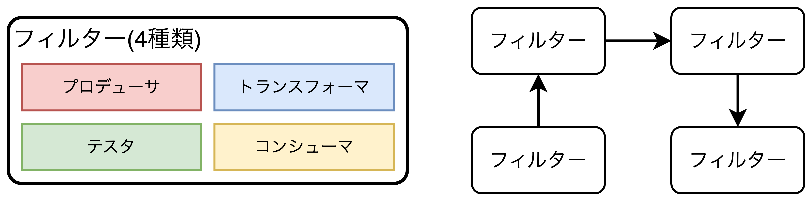

## パイプラインアーキテクチャ

- 機能を個別のパーツに分割し、<b>ストリームのように順番に処理するアーキテクチャパターン</b>

### トポロジー

- パイプラインアーキテクチャはデータ量が少ない場合、高パフォーマンスを実現するアーキテクチャであり、フィルターとパイプで構成される。
  - **パイプ**: フィルター会の通信チャンネルを形成する要素。パフォーマンスの観点から1方向になっており、データ形式は問わない。
  - **フィルター**: 1つのタスクのみを実行する自己完結型の要素。フィルターはさらに4種類に分類される。
    - **プロデューサ**: **処理の開始**点、出力のみ。ソースとも呼ばれる。
    - **トランスフォーマ**: 入力を受け、オプションでデータの一部又は全部の**変換**を行い、出力パイプに送る。map関数と同じ。
    - **テスタ**: 入力を受け、1つ以上の基準について**検査**し、結果を出力する。reduce関数と同じ。
    - **コンシューマ**: **処理の終了点**、パイプラインプロセスの最終結果を**DBに永続化**したり、**UIに表示**したりする。
- 複数の処理を実現する場合は複数のフィルターを用意して処理を行う。

### 事例

- <b>EDIツール</b>や<b>ETLツール</b>、<b>CLI</b>、<b>GitHub Actions</b>、などのシンプルな一方向の処理を進めるタスクでパイプラインアーキテクチャが用いられる。
- `Apache Camel`や`Apache Kafka`もパイプラインアーキテクチャの例になる。

### アーキテクチャ特性の評価

- **メリット**
  - シンプルで低コスト。
  - システム構築と維持コストが低い。
  - モノリシックなため、ネットワークトラフィック、帯域幅、レイテンシーの課題が少ない。
- **デメリット**
  - モノリシックなため、一つの変更が全体のデプロイに影響を与える。
  - 弾力性とスケーラビリティが非常に低く、特定の機能をスケールさせる場合でも複雑な設計技術が必要になる。
  - モノリシックなため、耐障害性がない。一部のメモリ不足が全体に影響を与え、クラッシュする。

<table>
    <caption>パイプライアーキテクチャのアーキテクチャ特性評価</caption>
	<tbody>
		<tr>
			<th>アーキテクチャ特性</th>
			<th>評価</th>
		</tr>
		<tr>
			<td>分割タイプ</td>
			<td>技術</td>
		</tr>
		<tr>
			<td>量子数</td>
			<td>1</td>
		</tr>
		<tr>
			<td>デプロイ容易性</td>
			<td>⭐️⭐️</td>
		</tr>
		<tr>
			<td>弾力性</td>
			<td>⭐️</td>
		</tr>
		<tr>
			<td>進化性</td>
			<td>⭐️⭐️⭐️</td>
		</tr>
		<tr>
			<td>耐障害性</td>
			<td>⭐️</td>
		</tr>
		<tr>
			<td>モジュール性</td>
			<td>⭐️⭐️⭐️</td>
		</tr>
		<tr>
			<td>全体的なコスト</td>
			<td>⭐️⭐️⭐️⭐️⭐️</td>
		</tr>
		<tr>
			<td>パフォーマンス</td>
			<td>⭐️⭐️</td>
		</tr>
		<tr>
			<td>信頼性</td>
			<td>⭐️⭐️⭐️</td>
		</tr>
		<tr>
			<td>スケーラビリティ</td>
			<td>⭐️</td>
		</tr>
		<tr>
			<td>シンプルさ</td>
			<td>⭐️⭐️⭐️⭐️⭐️</td>
		</tr>
		<tr>
			<td>テスト容易性</td>
			<td>⭐️⭐️⭐️</td>
		</tr>
	</tbody>
</table>

