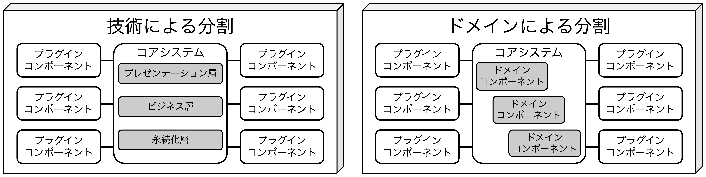
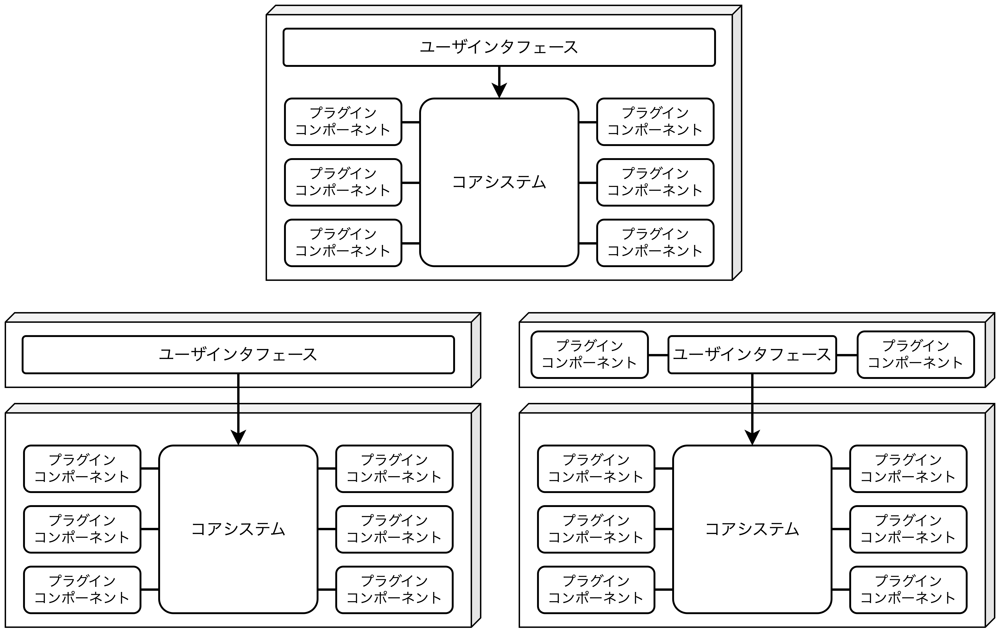
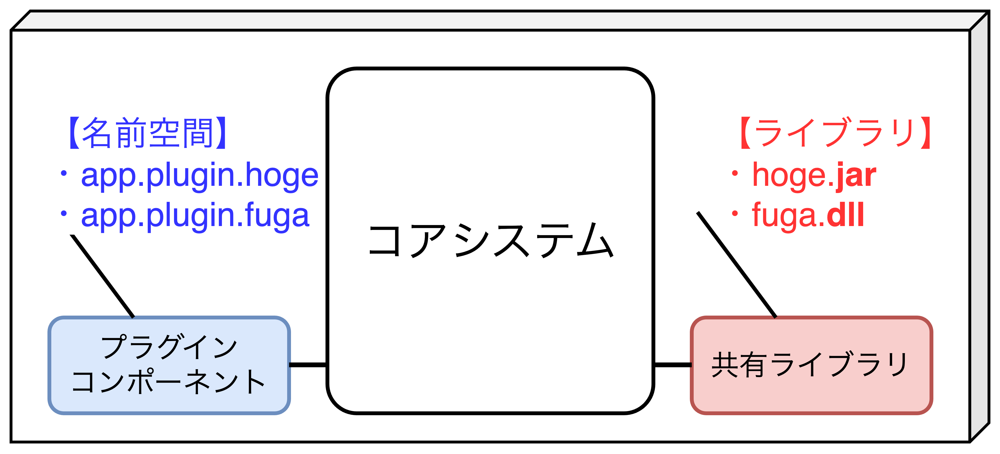

## マイクロカーネルアーキテクチャ

- <font color=red>マイクロカーネルアーキテクチャはプラグインアーキテクチャとも呼ばれ、<b>サードパーティ製品として顧客側の環境にインストールするようなアプリケーションにうまくフィットしている</b>。</font>
- <font color=red>例として<b>Eclipse/VS Code</b>や<b>Apache/NGINX</b>、<b>Chrome/Firefox</b>、<b>Unity</b>などが挙げられる。</font>

### トポロジー

- マイクロアーキテクチャは「コアシステム」と「プラグインコンポーネント」から構成される。
  - **コアシステム**: システムを実行するのに必要な最低限の機能。
  - **プラグインコンポーネント**: コアシステムを強化・拡張するための特殊な処理や追加機能。

#### コアシステム


<table>
<caption>コアシステムの未対応(左)と対応(右)の例</caption>
<tbody>
<tr>
<td>

```java
public void assessDevice(String dID){
  if(dID.equals("iPhone6s")) {
    assessiPhone6s();
  } else if(dID.equals("iPad4")){
    assessiPad1();
  } else if (dID.equals("Galaxy5")) {
    assessGalaxy5();
  } else ...
  ...
}
```
</td>
<td>

```java
public void assessDevice(String dID){
  String plugin = pluginRegistry
    .get(dID);
  Class<?> theClass = Class
    .forName(plugin);
  Constructor<?> cons = 
    theClass.getConstructor();
  DevicePlugin devicePlugin = 
    (DevicePlugin)cons.newInstance();
  devicePlugin.assess();
}
```
</td>
</tr>
</tbody>
</table>
    
- **上記のコード例**より、右のコードは電子機器の査定ロジックを表しており、コアシステムから汎用的に実行されるインタフェースを表現している。具体的な処理は独立したプラグインコンポーネントに含まれる。
- <font color=red>コアシステムは規模や複雑さに応じて、<b>レイヤードアーキテクチャやドメインサービス</b>を用いて実装する。</font>
- フロントエンドとバックエンドに分割し、**それぞれにコアシステムを持たせるという考え方**もある。

##### コアシステムのバリエーション



##### フロントエンドとバックエンドのバリエーション



<div style="page-break-before:always"></div>

#### プラグインコンポーネント

- <font color=red>プラグインコンポーネントはコアシステムを強化・拡張するための追加機能であり、揮発性高いコードを含む独立したコンポーネントである。これにより、<b>保守性とテスト容易性が向上</b>する。</font>
- それぞれが独立し、**プラグインコンポーネント間で依存関係がないことが理想**。
- プラグインコンポーネントは<u>①コンパイルベース</u>か<u>②ランタイムベース</u>のいずれかに分けられる。
  1. **コンパイルベース**: 管理はとても容易。しかし、機能の追加・変更・削除の際にモノリシックアプリ全体の再デプロイが必要。
  2. **ランタイムベース**: コアシステムや他のプラグインを際デプロイすることなく実行時に追加又は削除できるフレームワーク。
- プラグインコンポーネントを<u>RESTやSOAPなどで対応する場合、「モノリシック→分散アーキテクチャ」</u>になる。そのため、P2P(サーバを介さず直接通信する方式)かリモートにするかは要検討。
  - **メリット**: スループット、スケラービリティの向上。(リモート先が処理を行うため)
  - **デメリット**: デプロイ容易性が下がる、ネットワークの考慮事項が爆発的に増加する。

##### プラグインコンポーネントの実装方法(名前空間とライブラリ)



<div style="page-break-before:always"></div>

### レジストリ

- <font color=red>コアシステムが利用可能なプラグインモジュールやその入手方法を管理する方法として<b>プラグインレジストリ</b>がある。</font>レジストリにはプラグイン名、データコントラクト、リモートアクセスプロトコルの詳細などを定義する。

##### Javaによるソースコード例

```java
Map<String, String> registry = new HashMap<String, String>();
static {
    // P2Pアクセスの例
    registry.put("iPhone6s", "Iphone6sPlugin");

    // メッセージングの例
    registry.put("iPhone6s", "iphone6s.queue");

    // RESTful APIの例
    registry.put("iPhone6s", "https://atlas:443/assess/iphone6s");
}
```

### コントラクト

- <font color=red>コアシステムとプラグインコンポーネントとのコントラクトは通常、ドメイン全体で標準的であり、<b>入力データ(Input)</b>、<b>動作(Process)</b>、<b>出力データ(Output)</b>が含まれる。</font>
- カスタムコントラクトを作成する場合、標準コントラクトのアダプタを用意する。
- 以下のコード例のように、コアシステムはプラグイン経由で「`AssessmentOutput`クラスを返す」、もしくは「その値を表示する」だけで、処理内容(assementReportの詳細やフォーマット、金額計算ロジックなど)は関与しない。

##### 【コード例】電子機器プラグイン

```java
public interface AssessmentPlugin {
    public AssessmentOutput assess();
    public String register();
    public String deregister();
}
public class AssessmentOutput {
    public String assessmentReport;
    public Boolean resell;
    public Double value;
    public Double resellPrice;
}
```

### 【事例とユースケース】保険金請求処理を行う保険会社

- 保険金請求アプリケーションは標準的なプロセスがあるものの<u>保険金請求で何が認められ、何が認められないのか、司法管轄ごとに異なる規則が存在するため、<b>無限の条件セットが存在しうる</b></u>。例えば、いくつかの管轄区域ではフロントガラスが岩によって損傷した場合は無料交換することを認めている。
- このような無限の条件セットがある場合、マイクロカーネルアーキテクチャが適切であり、<u>新しい管轄区域やその規則の管理(追加、修正、削除、更新)が容易になる</u>。

<div style="page-break-before:always"></div>

### アーキテクチャ特性の評価

- **メリット**
  - シンプルで低コスト。
  - システム構築と維持コストが低い。
  - **ドメイン(問題領域)による分割と技術(UI, App, Infraなど)による分割が両方可能**
  - テスト容易性・デプロイ容易性・信頼性は比較的高い(プラグインコンポーネントとして独立して要素を分離できるため)。
- **デメリット**
  - **すべてのリクエストがコアシステムを経由する**。
  - モノリシックなため、①弾力性、②スケーラビリティ、③耐障害性が低く、特定の機能をスケールさせる場合でも複雑な設計技術が必要になる。
  - <u>分散アーキテクチャにする場合、ネットワークの考慮事項が爆発的に増加する。</u>

<table>
    <caption>マイクロカーネルアーキテクチャのアーキテクチャ特性評価</caption>
	<tbody>
		<tr>
			<th>アーキテクチャ特性</th>
			<th>評価</th>
		</tr>
		<tr>
			<td>分割タイプ</td>
			<td>ドメイン、技術の両方</td>
		</tr>
		<tr>
			<td>量子数</td>
			<td>1</td>
		</tr>
		<tr>
			<td>デプロイ容易性</td>
			<td>⭐️⭐️⭐️</td>
		</tr>
		<tr>
			<td>弾力性</td>
			<td>⭐️</td>
		</tr>
		<tr>
			<td>進化性</td>
			<td>⭐️⭐️⭐️</td>
		</tr>
		<tr>
			<td>耐障害性</td>
			<td>⭐️</td>
		</tr>
		<tr>
			<td>モジュール性</td>
			<td>⭐️⭐️⭐️</td>
		</tr>
		<tr>
			<td>全体的なコスト</td>
			<td>⭐️⭐️⭐️⭐️⭐️</td>
		</tr>
		<tr>
			<td>パフォーマンス</td>
			<td>⭐️⭐️⭐️</td>
		</tr>
		<tr>
			<td>信頼性</td>
			<td>⭐️⭐️⭐️</td>
		</tr>
		<tr>
			<td>スケーラビリティ</td>
			<td>⭐️</td>
		</tr>
		<tr>
			<td>シンプルさ</td>
			<td>⭐️⭐️⭐️⭐️</td>
		</tr>
		<tr>
			<td>テスト容易性</td>
			<td>⭐️⭐️⭐️</td>
		</tr>
	</tbody>
</table>
