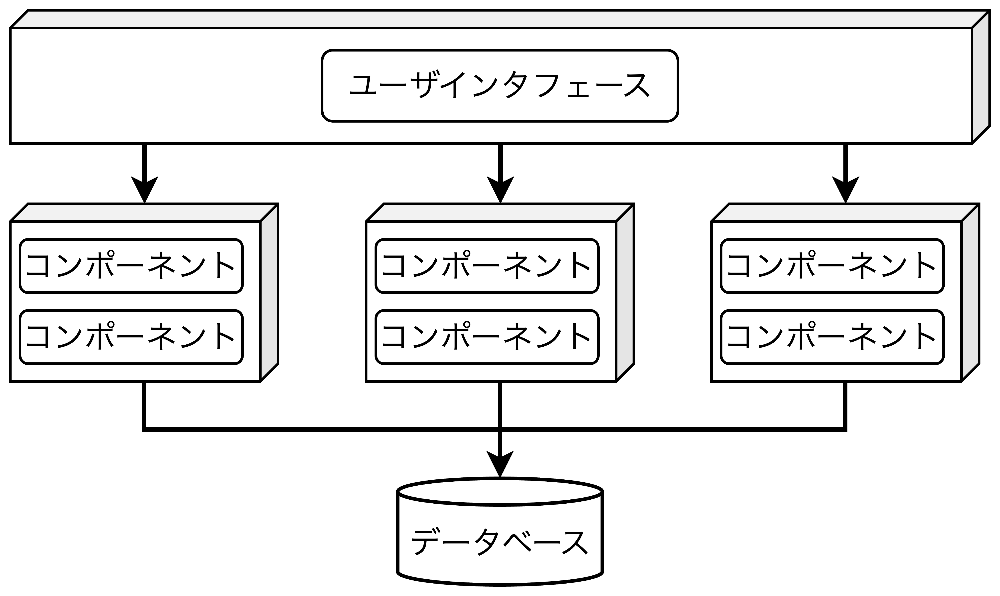
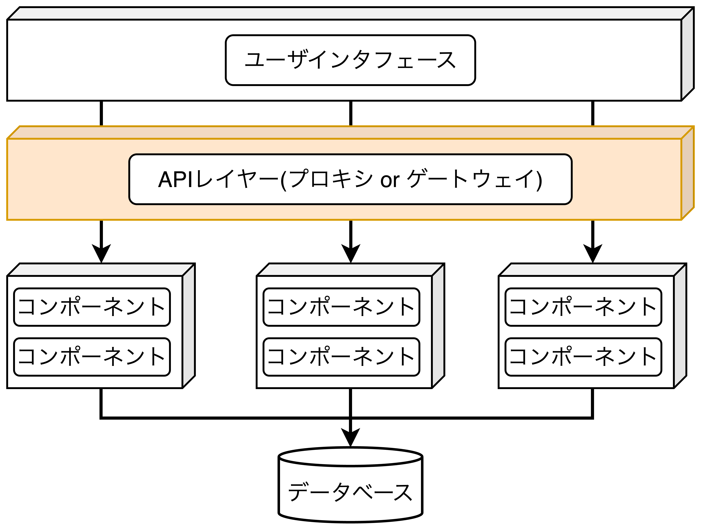
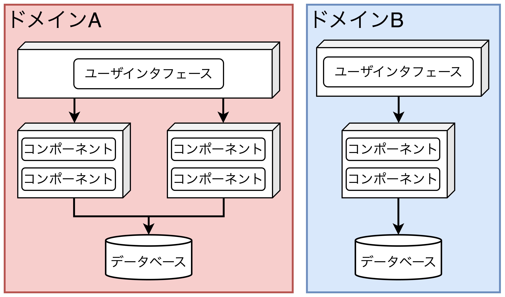
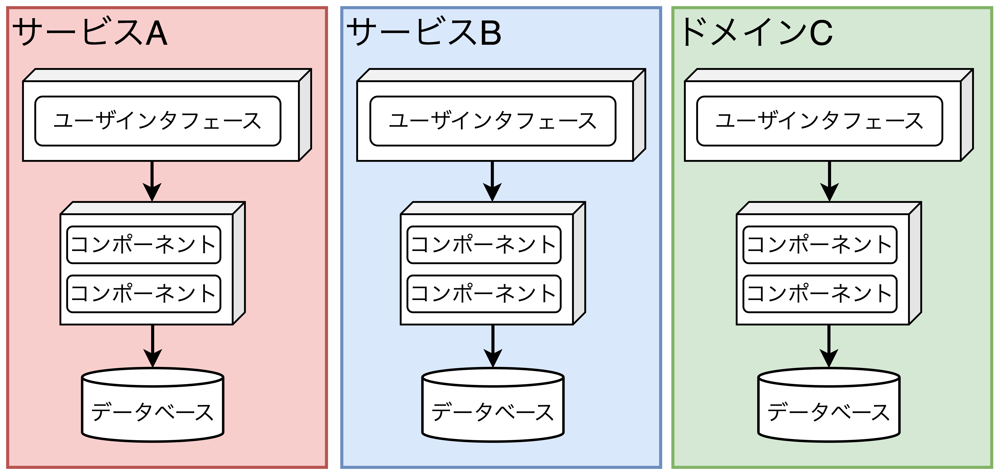
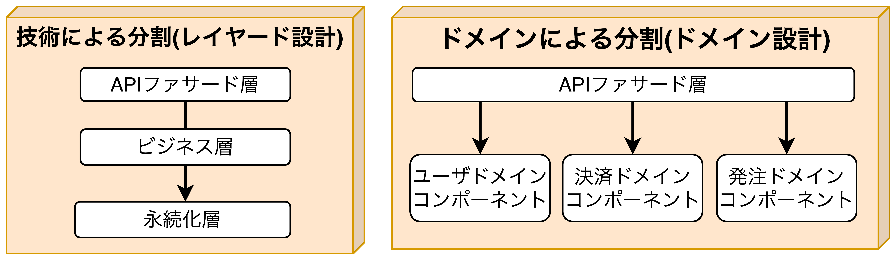
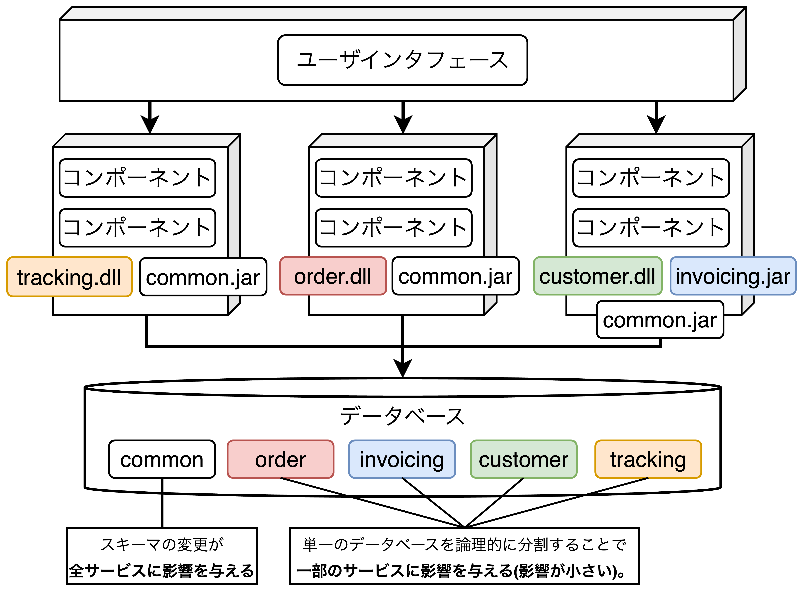

## サービスベースアーキテクチャ(キーワード: 粒度)

- 柔軟なトポロジーを採用できることから最も実用的なアーキテクチャスタイルの一つであり、マイクロサービスアーキテクチャのハイブリッド。分散アーキテクチャであるが、<b>複雑さやコストはない。</b>

### トポロジーとその種類

- 分散型のマクロなレイヤード構造を取り、<b>①個別にデプロイされたUI</b>、<b>②個別にデプロイされた粒度の粗いリモートサービス</b>、<b>③モノリシックなDB</b>から構成される。
- 一般的なサービスベースアーキテクチャの特徴は以下の通り。
  - **サービス数は4〜12**
  - 各サービスはモノリシックアプリケーション(EAR, WAR, EXEなど)でデプロイされ、コンテナ化を必要としない。
  - サービス数が比較的少ないため(4〜12個)、DBは**単一のモノリシックデータベースを共有**している。
- ほとんどの場合、<u>1つのサービスインスタンス(Windowsサービスをイメージする)で動作</u>する。
- **スケーラビリティ**、**耐障害性**、**スループット**の必要性に応じて<u>複数のサービスインスタンスを立てる</u>必要があり、**何らかの負荷分散機能**が必要になる。
- サービスベースアーキテクチャは柔軟なトポロジーを構成することが可能であり、以下にいくつか例を示す。
  - モノリシックベース
  - <b>API層を追加したケース</b>(「外部に公開する場合」や「共通機能として部署間で利用する場合」など)
  - ドメインベース
  - サービスベース

##### 【モノリシックベース】

##### 【API層を追加したケース】

##### 【ドメインベース】

##### 【サービスベース】

### サービスの設計と粒度

- サービスベースにおけるドメインサービスは一般的に粗い粒度であり、2スタイルに分けられる。
  1. **技術による分割**: APIファサード層、ビジネス層、永続化層など
  2. **ドメインによる分割**: ユーザドメイン、決済ドメイン、発注ドメインなど
- ドメインサービスはUIからのビジネス要求を満たすために何らかのファサード層を持つ必要があり、ファサード層、つまり、<b>ドメインサービスはオーケストレーションする責任を負う</b>。
- 例えば、注文機能を考える。<u>APIファサード層が注文を受信し、「**発注サービス→決済サービス→在庫更新サービス**」といったビジネス要求をオーケストレーションする</u>。
- オーケストレーションの粒度は<b>単一アプリケーションレベル</b>と<b>外部サービスレベル</b>に分けられ、<b>サービスベース</b>と<b>マイクロサービス</b>の違いにもなる。
  - 【**サービスベース**の場合】：サービスの粒度が粗いため、<u>ACIDトランザクションが使用</u>される。データの完全性と一貫性は向上するが、モノリシックなため影響範囲が広く、発注機能を変更した場合でも注文機能もテストしないといけない(<u>耐障害性とテスト容易性が低い</u>)。
  - 【**マイクロサービス**の場合】サービスの粒度が細かいため、結果整合性に依存した<u>BASEトランザクションが使用</u>される。データの矛盾が起きる可能性はあるが、分散アーキテクチャであることから影響範囲が狭く、<u>耐障害性とテスト容易性が高い</u>。

### データベースの分割

- 通常、サービスベースアーキテクチャは<b>単一のデータベースを使用</b>するため、スキーマ(テーブル、ストアドなど)を変更する際、コストがかかる。<u>具体的には、スキーマを表すエンティティオブジェクトの共有ライブラリ(DLLやJARファイル)を使用している全サービスの変更と再デプロイが必要</u>になる。そのため、**バージョン管理が非常に重要になるが、影響範囲の調査は手動での分析になり非常に困難**である。
- データベース変更の影響とリスクを軽減する方法は以下の2つがある。
  1. <b>データベースを論理的に分割</b>し、論理的な分割を共有ライブラリを介して表現する
  2. バージョン管理システムで共通エンティティオブジェクトをロックし、DBチームのみに変更アクセス権を付与し、**共通テーブルへの変更の重要性を強調**する。

### 【アーキテクチャ例】電子機器リサイクルシステム

- 電子機器リサイクルシステムは「見積依頼→受取→査定→会計→取引状態→リサイクル→レポーティング」のプロセスで進む。
- 上記アーキテクチャの特徴は以下の通り。
  - 内部機能と外部公開機能の境界を構築している。
  - ドメインごと(3つ)に個別のデプロイがされている。
- **メリット**
  - ドメインごとに分割しており、スケーラビリティと耐障害性を持つ。
  - ドメインごとに分けることで、アジリティ(迅速に変更に対応できる度合い)、テスト容易性、デプロイ容易性が高い。
  - 内部と外部を分けており、セキュリティを担保している。
- **デメリット**
  - モノリシックなため、1つのサービスの変更が該当するドメインのデプロイをしなければならない。

### アーキテクチャ特性の評価

- **メリット**
  - アプリを個別にデプロイできるため迅速に変更を行える(アジリティが高い)。
  - ドメイン分割によるサービスであるため、テスト容易性とデプロイ容易性が高い(**市場投入までが早い**)。
  - 自己完結型のサービスでありサービス間通信を利用しないため、耐障害性と可用性が高い。
  - 粒度の粗いドメインサービスであり、サービス間通信がほとんどなく、信頼性が高い。
- **デメリット**
  - 自動的なスケーラビリティと弾力性は可能(マイクロサービス化により可能)であるが、マシンリソースの観点から**費用対効果が高くない**。
  - サービスの粒度の調整が難しい(粒度が粗い場合はモノリシック、細かい場合は分散型)。
  - ACIDトランザクションとBASEトランザクションの調整が非常に困難。
  - 細かいサービスが増えると、オーケストレーションやコレオグラフィの問題が増大する。

<table>
    <caption>サービスベースアーキテクチャのアーキテクチャ特性評価</caption>
	<tbody>
		<tr>
			<th>アーキテクチャ特性</th>
			<th>評価</th>
		</tr>
		<tr>
			<td>分割タイプ</td>
			<td>ドメイン</td>
		</tr>
		<tr>
			<td>量子数</td>
			<td>1以上</td>
		</tr>
		<tr>
			<td>デプロイ容易性</td>
			<td>⭐️⭐️⭐️⭐️</td>
		</tr>
		<tr>
			<td>弾力性</td>
			<td>⭐️⭐️</td>
		</tr>
		<tr>
			<td>進化性</td>
			<td>⭐️⭐️⭐️</td>
		</tr>
		<tr>
			<td>耐障害性</td>
			<td>⭐️⭐️⭐️⭐️</td>
		</tr>
		<tr>
			<td>モジュール性</td>
			<td>⭐️⭐️⭐️⭐️</td>
		</tr>
		<tr>
			<td>全体的なコスト</td>
			<td>⭐️⭐️⭐️⭐️</td>
		</tr>
		<tr>
			<td>パフォーマンス</td>
			<td>⭐️⭐️⭐️</td>
		</tr>
		<tr>
			<td>信頼性</td>
			<td>⭐️⭐️⭐️⭐️</td>
		</tr>
		<tr>
			<td>スケーラビリティ</td>
			<td>⭐️⭐️⭐️</td>
		</tr>
		<tr>
			<td>シンプルさ</td>
			<td>⭐️⭐️⭐️</td>
		</tr>
		<tr>
			<td>テスト容易性</td>
			<td>⭐️⭐️⭐️⭐️</td>
		</tr>
	</tbody>
</table>
