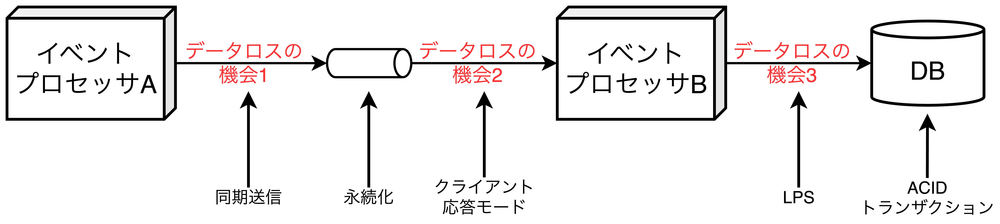

## イベント駆動アーキテクチャ

- 高スケーラブル、高パフォーマンス、適応性に優れた分散非同期型のアーキテクチャスタイル。
- 非同期的にイベントを受信して処理する分離されたイベント処理コンポーネントで構成され、他のアーキテクチャスタイル(イベント駆動マイクロサービスアーキテクチャなど)に組み込む形でも使用可能。
- 特定の状況に反応する**イベントベースの比較として**、ユーザからの要求が来た際に対応する**リクエストベース**がある。

### トポロジー

- イベント駆動アーキテクチャは大きく「ブローカー」と「メディエータ」の2つに分けられる。それぞれ、ブローカーとメディエータのそれぞれでアーキテクチャ特性と実装戦略が異なるため、状況に応じて選択することが重要である。
  - **ブローカー**: イベント処理に対して**①高度な応答性**と**②動的な制御**が必要な場合に使用される。順序性の考慮が少ないシステムなどで利用可能。
  - **メディエータ**: イベント処理の**①ワークフロー制御**が必要な場合に使用される。ワークフロー全体の制御が重要なシステムなどで利用可能

#### ブローカートポロジー

- ブローカートポロジーは以下のtつの主要なコンポーネントを用いて構成され、<b>中央のメディエータが存在しないことが特徴</b>になる。
  - **開始イベント**: イベントフロー全体を開始する最初のコンポーネント。
  - **イベントブローカー**: フェデレーション（アカウント認証やチケット購入などの複数のサービスやシステムを相互連携させる仕組み）機能を持ったコンポーネント
  - **イベントプロセッサ**: イベントブローカーから受け取った開始イベントを用いて処理を開始するコンポーネント。
  - **処理イベント**: 何をしたのかを表すコンポーネント。<u>イベントブローカーやイベントプロセッサに非同期的に処理を通知する役割を持つ</u>。
- **イベントブローカーは複数のドメインサービスがクラスタ化されたインスタンスであり、特定ドメインで使用されるすべてのイベントチャネルが含まれている。**

<table>
	<caption>ブローカートポロジーのPros/Cons</caption>
	<tbody>
		<tr>
			<th>メリット</th>
			<th>デメリット</th>
		</tr>
		<tr>
			<td>高度に分離されたイベントプロセッサ</td>
			<td>ワークフロー全体の制御</td>
		</tr>
		<tr>
			<td>高いスケーラビリティ</td>
			<td>エラーハンドリング</td>
		</tr>
		<tr>
			<td>高応答性</td>
			<td>回復性</td>
		</tr>
		<tr>
			<td>高パフォーマンス</td>
			<td>再起動の能力</td>
		</tr>
		<tr>
			<td>高耐障害性</td>
			<td>データ不整合</td>
		</tr>
	</tbody>
</table>

##### 【例】小売店の注文入力システムの処理フロー

1. **OrderPlacement**は開始イベントを受信し、DB上のテーブルに注文レコードを追加し、注文IDを返す。
2. **order-created**を通してシステムの残りの部分に注文を作成したことを伝える。
3. **Notification**、**Payment**、**Inventory**の3つは並列でタスクを実行する。
   - **Notification**は**order-created**、**payment-denied**、**order-fulfilled**、**order-shipped**をそれぞれ受信し、電子メールを送信した後、**email-sent**(別の処理イベント)を生成する。
   - **Inventory**は**order-created**を受信し、購入された書籍の在庫を減らした後、**Warehouse**に**inventory-updated**を送信し、倉庫間の在庫管理(供給量に基づいて再注文)を行う。
   - **Payment**は**order-created**を受信し、支払い処理を行う。支払適用の場合は**payment-applied**、支払拒否の場合は**payment-denied**を生成する。
4. **OrderFulfillment**は**payment-applied**を受信し、注文のピッキングと梱包をした後、**order-fulfilled**を生成する。
※fulfillment: 商品の配送や返品・交換などの処理業務を指す。
5. **Shipping**は**order-fulfilled**を受信し、商品を出荷した後、**order-shipped**を生成する。

#### メディエータトポロジー

- メディエータトポロジーは以下の5つの主要なコンポーネントを用いて構成され、<b>複数のプロセッサを調整し、ワークフローを管理・制御するメディエータが存在することが特徴</b>になる。
  - **開始イベント**: イベントフロー全体を開始する最初のコンポーネント。
  - **イベントキュー**: 開始イベントを格納したコンポーネント。
  - **イベントメディエータ**: <u>ワークフローに関する知識と制御を持つコンポーネント</u>。対応する処理イベントを生成してP2Pでイベントチャネルに送信する。
  - **イベントチャネル**: イベントプロセッサにイベントを送信するコンポーネント。
  - **イベントプロセッサ**: イベントチャネルから受け取ったイベントを用いて処理を開始するコンポーネント。<u>何をしたのかを残りのプロセッサには通知しない</u>。
- **メディエータトポロジーは通常、ドメイン(顧客や注文、在庫、配送など)ごとにメディエータを存在**し、処理イベントの性質や複雑さに応じて、適切なメディエータを選択する必要がある。
- 適切なメディエータの選択にはドメイン知識が必要であり、効果として、<u>①単一障害点の軽減と、②全体のスループットとパフォーマンス向上</u>が期待できる。
  - **【単純なメディエータ】** イベントを分類し、分類結果に基づいて「自分で処理するか」「複雑な処理をするイベントメディエータに転送するか」を決定する。【例】Apache Camel, Mule ESB, Sprint Integration。
  - **【複雑なメディエータ】** 処理の「認証」や「中断」など進捗管理(株取引など)をするような複雑な処理に対応する。【例】Apache ODE, Oracle BPEL。
  ※BPEL(Business Process Execution Language): <u>処理手順を記述したXMLライクな構文</u>
- BPELは強力であるが、習得は比較的困難なため、通常は製品に含まれるBPELエンジンスイートで提供されるGUIツールを使って作成される。
- メディエータの負の側面
  - 複雑なイベントフロー内で発生する動的な処理を宣言的にモデル化することは非常に困難であり、**メディエータとブローカーの両方を組み合わせたハイブリッドなトポロジーになることもある**。
  - **スケーリングの際**、プロセッサだけでなくメディエータもスケーリングしなければならず、**複雑性が増す**。
  - 常にメディエータがワークフローを制御するため、**パフォーマンスがそれほど良くはない**。

<table>
	<caption>メディエータトポロジーのPros/Cons</caption>
	<tbody>
		<tr>
			<th>メリット</th>
			<th>デメリット</th>
		</tr>
		<tr>
			<td>ワークフロー全体の制御</td>
			<td>イベントプロセッサ結合が強くなる</td>
		</tr>
		<tr>
			<td>エラー処理</td>
			<td>スケーラビリティの低下</td>
		</tr>
		<tr>
			<td>回復性</td>
			<td>パフォーマンスの低下</td>
		</tr>
		<tr>
			<td>再起動能力</td>
			<td>耐障害性の低下</td>
		</tr>
		<tr>
			<td>データ一貫性が高まる</td>
			<td>複雑で動的なワークフローのモデリング</td>
		</tr>
	</tbody>
</table>

##### 【例】小売店の注文入力システムの処理フロー

- **【ステップ1】** では、開始イベントを受信後、**create-order**を生成し、注文を検証する(**OrderPlacement**)。検証後、注文IDと一緒に応答をメディエータに返却する。
※この時点で注文IDを利用者に返すか、ステップ5完了後まで返さないかはビジネスルールに基づいて決定される。
- **【ステップ2】** では、メディエータは**email-customer**、**apply-payment**、**adjust-inventory**の3つを生成し、**Notification**、**Payment**、**Inventory**に向けてそれぞれ送信する。イベントを受信したプロセッサはそれぞれ並列処理を実行する。
※【ステップ2〜5】において、それぞれのプロセッサは処理完了後、結果メッセージをメディエータに通知する。この時、**メディエータは全ての応答を確認するまで待機**している。
- **【ステップ3】** では、メディエータは**fulfill-order**、**order-stock**の2つを生成し、**OrderFulfillment**、**Warehouse**に向けてそれぞれ送信する。イベントを受信したプロセッサはそれぞれ並列で処理を実行する。
- **【ステップ4】** では、メディエータは**email-customer**、**ship-order**の2つを生成し、**Notification**、**Shipping**に向けてそれぞれ送信する。イベントを受信したプロセッサはそれぞれ並列で処理を実行する。
- **【ステップ5】** では、メディエータは**email-customer**を生成し、**Notification**に向けて送信する。イベントを受信後、プロセッサは処理を実行する。

##### ブローカーとメディエータのトポロジー選択

- ワークフロー全体の制御やエラー処理を優先→メディエータトポロジー
- パフォーマンスやスケーラビリティを優先→ブローカートポロジー
- **ブローカートポロジーとメディエータトポロジーの違い**は処理イベント処理の意味と使用方法の違いである。
  - ブローカートポロジーは「<b>処理イベント」＝「システムで発生したイベント」</b>として扱い、イベントプロセッサが処理イベントに対して何らかのアクションを起こす(<u>処理イベントの無視も可能</u>)。
  - メディエータトポロジーは「<b>処理イベント」＝「コマンド(起こるべきこと)」</b>として扱い、メディエータが処理イベントを制御する必要がある。

### 非同期の能力

- イベント駆動アーキテクチャは<b>非同期通信にのみ依存する</b>という特徴を持ち、<u>システム全体の応答性を向上させる強力な技術の一つ</u>である。非同期通信には以下の2つの方式がある。
  - **【リクエスト/リプライ方式】** イベントのコンシューマからのレスポンスを必要とする方式
  - **【ファイア・アンド・フォーゲット方式】** コンシューマからのレスポンスを必要としていない方式
- 非同期通信は<u>パフォーマンスを向上させる方法ではなく、応答性を向上させる方法</u>である。
  - **【応答性】** アクションが承認されたことをユーザに通知することについての特性
  - **【パフォーマンス】** End2Endの処理を高速化することについての特性
- 非同期通信は応答性向上に貢献するが、エラー処理が複雑になってしまうというトレードオフを持つ。

### エラー処理

- 非同期処理のエラー処理が複雑になる課題に対処する方法の1つに**ワークフローイベントパターン**がある。<u>回復力と応答性の両方に対応したパターンの1つ</u>であり、<b>ワークフロープロセッサ</b>と呼ばれるエラー処理を担当するコンポーネントを用意する。

### データロスの防止

- 非同期通信はデータログが常に最大の懸念事項であり、様々な箇所でその可能性がある。
  - **【データロス1】** キューに<u>イベントプロセッサA</u>からメッセージが届かない。または届いたとしてもイベントプロセッサがそのメッセージを取得する前にブローカーが落ちてしまう。
  → **【対応方法1】** ①データストアに永続化することと、②同期送信(永続化されるまで待機(ロック))がある。
  - **【データロス2】** キューからメッセージを取得した後、イベント処理の前に<u>イベントプロセッサB</u>がクラッシュしてしまう。
  → **【対応方法2】** クライアント応答モード(↔︎自動応答モード)を実施する。このモードはメッセージをキューに残したまま「クライアントID」を付与する方法である。これにより、処理状態を把握でき、クラッシュしてもデータが残ったままの状態になる。
  - **【データロス3】** 何らかのエラーにより<u>イベントプロセッサB</u>がDBに永続化できない。
  → **【対応方法3】** ①LPS(Last Participant Support)と②ACIDトランザクションがある。LPSはイベントプロセッサからDBまでの間にデータが失われないことを保証するものである。

### リクエストベースとイベントベースの間をとる

- リクエストベースとイベントベースについて、以下のような違いがある。
  - 【リクエストベースモデル】<b>ワークフローの確実性と管理が必要な構造化されたデータ駆動型のリクエスト</b>に向いている。
  - 【イベントベースモデル】<b>複雑で動的なユーザ処理を伴うような高い応答性とスケーラビリティが必要なアクション</b>に向いている。

<table>
	<tbody>
		<tr>
			<th>リクエストベースに勝るメリット</th>
			<th>トレードオフ</th>
		</tr>
		<tr>
			<td>動的なユーザコンテンツに対する応答性の向上</td>
			<td>結果整合性のみのサポートの低下</td>
		</tr>
		<tr>
			<td>スケーラビリティ・弾力性の向上</td>
			<td>処理フローの制御性の低下</td>
		</tr>
		<tr>
			<td>アジリティとチェンジマネジメントの向上</td>
			<td>イベントフローの結果に対する確実性の低下</td>
		</tr>
		<tr>
			<td>適応性と拡張性の向上</td>
			<td>テストやデバッグが難しい</td>
		</tr>
		<tr>
			<td>充実した対応力とパフォーマンス</td>
			<td></td>
		</tr>
		<tr>
			<td>リアルタイムでの意思決定が可能</td>
			<td></td>
		</tr>
		<tr>
			<td>状況認識に対する反応の良さ</td>
			<td></td>
		</tr>
	</tbody>
</table>

### ハイブリッドなイベント駆動アーキテクチャ

- イベント駆動アーキテクチャは他のアーキテクチャスタイルと組み合わせて使われることもあり、一般的には、**マイクロカーネルアーキテクチャ**や**スペースベースアーキテクチャ**が挙げられる。イベント駆動を組み込むことにより、ユーザ応答性を改善できる。
  - **マイクロサービスアーキテクチャ**: サービスのスケーリングの際にイベント駆動を活用
  - **スペースベースアーキテクチャ**: サービス間通信にメッセージングを使用する際の処理ユニットのオートスケールにイベント駆動を利用

### アーキテクチャ特性の評価

- **メリット**
  - 非同期通信による高度な並列処理が可能であり、パフォーマンスが高い。
  - 高度に分離されたイベントプロセッサにより、高いスケーラビリティと耐障害性を持つ。
  - プロセッサの追加・修正が容易であり、進化性が高い。
- **デメリット**
  - ワークフローが複雑になりやすく、シンプルさとテスト容易性が低い(＝リクエストベースと逆)。
  - **ブローカーの場合**、「パフォーマンスとスケーラビリティ」は良いが、「エラー処理とワークフロー全体の制御」は良くない。
  - **メディエータの場合**、「エラー処理とワークフロー全体の制御」は良いが、「パフォーマンスとスケーラビリティ」は良くない。

<table>
    <caption>イベント駆動アーキテクチャのアーキテクチャ特性評価</caption>
	<tbody>
		<tr>
			<th>アーキテクチャ特性</th>
			<th>評価</th>
		</tr>
		<tr>
			<td>分割タイプ</td>
			<td>技術</td>
		</tr>
		<tr>
			<td>量子数</td>
			<td>1以上</td>
		</tr>
		<tr>
			<td>デプロイ容易性</td>
			<td>⭐️⭐️⭐️</td>
		</tr>
		<tr>
			<td>弾力性</td>
			<td>⭐️⭐️⭐️</td>
		</tr>
		<tr>
			<td>進化性</td>
			<td>⭐️⭐️⭐️⭐️⭐️</td>
		</tr>
		<tr>
			<td>耐障害性</td>
			<td>⭐️⭐️⭐️⭐️⭐️</td>
		</tr>
		<tr>
			<td>モジュール性</td>
			<td>⭐️⭐️⭐️⭐️</td>
		</tr>
		<tr>
			<td>全体的なコスト</td>
			<td>⭐️⭐️⭐️</td>
		</tr>
		<tr>
			<td>パフォーマンス</td>
			<td>⭐️⭐️⭐️⭐️⭐️</td>
		</tr>
		<tr>
			<td>信頼性</td>
			<td>⭐️⭐️⭐️</td>
		</tr>
		<tr>
			<td>スケーラビリティ</td>
			<td>⭐️⭐️⭐️⭐️⭐️</td>
		</tr>
		<tr>
			<td>シンプルさ</td>
			<td>⭐️</td>
		</tr>
		<tr>
			<td>テスト容易性</td>
			<td>⭐️⭐️</td>
		</tr>
	</tbody>
</table>

