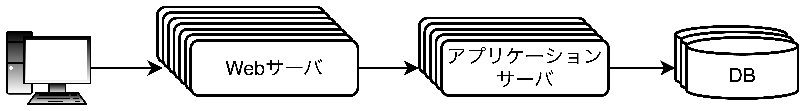
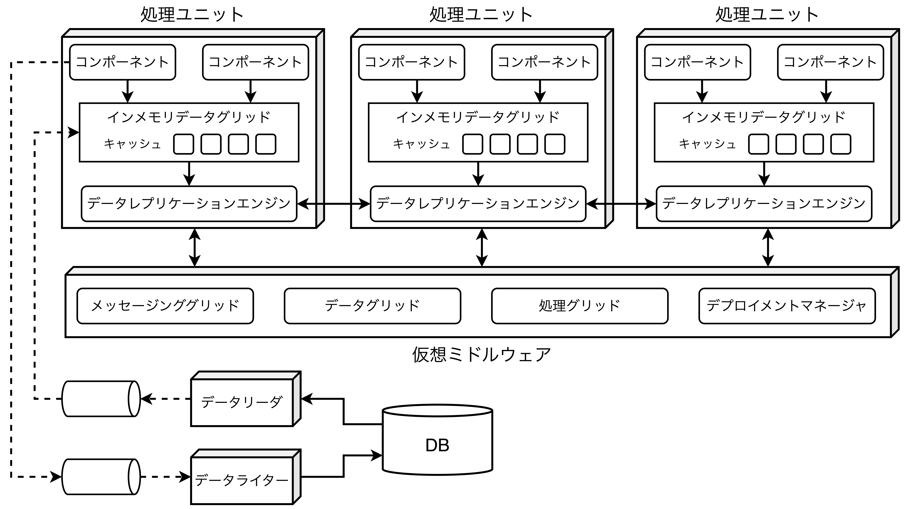

## スペースベースアーキテクチャ

##### 従来のWebベースのスケールアウト例

- ほとんどのWebアプリはスケールアウトしても、<b>ボトルネックが「Webサーバ」→「アプリケーションサーバ」→「DB」と順に移動するだけ</b>である。最終的には、`Webサーバ数＞アプリケーションサーバ数＞DB数`のような三角形のトポロジーになる。
- スペースベースアーキテクチャは同時接続ユーザ数が変動して予測できないようなアプリケーションに有効であり、<b>スケーラビリティ、弾力性、同時実効性</b>を向上させる目的で設計されたアーキテクチャスタイルである。

### 一般的なトポロジー

##### スペースベースアーキテクチャの基本的なトポロジー

- スペースベースアーキテクチャはタプルスペースの概念に由来し、<b>レプリケート(複製)されたインメモリデータグリッドを活用する</b>ことでスケーラビリティ、弾力性、パフォーマンスを向上させる。
  - **【タプルスペース】** 複数の並列プロセッサが共有メモリを介して通信する技術。
- アプリケーションデータはメモリ内に保持され、全てのアクティブな処理ユニットでレプリケートされる。処理ユニットはユーザ負荷の増減に応じて動的に起動・停止し、弾力的なスケーリングに対応しており、DBは関与しないためボトルネックは解消される。
- スペースベースアーキテクチャは以下の要素で構成される。
  - **【処理ユニット】** アプリケーションロジックを含むコンポーネントを持つ。
  - **【仮想ミドルウェア】** 処理ユニットの管理・調整を行う役割を持つ。
  - **【データポンプ】** 更新されたデータを非同期にDBへ送信する役割を持つ。
  - **【データライター】** データポンプから更新を実行する役割を持つ。
  - **【データリーダ】** 起動時にDBのデータを読み込んで処理ユニットに配信する役割を持つ。

#### 処理ユニット

- 処理ユニットはアプリケーションロジックを含み、バックエンドやビジネスロジックを持つ。<u>処理ユニットは規模によって内容が異なる</u>。
  - **【小規模】** 単一の処理ユニットとしてデプロイ
  - **【大規模】** 機能を複数の処理ユニットに分割してデプロイ
- 処理ユニットにはアプリケーションロジックだけでなく、**Hazelcast**や**Apache Ignite**、**Oracle Coherence**といった製品を通じて実装されるインメモリデータグリッドとレプリケーションエンジンも含まれる。

#### 仮想ミドルウェア

- 仮想ミドルウェアはデータ同期やリクエスト処理の様々な側面を制御するアーキテクチャ内のインフラストラクチャに関する問題を処理する。
- 仮想ミドルウェアは「独自開発」のケースと「サードパーティ製品」のケースがある。
- **【メッセージンググリッド】** 入力されたリクエストやセッションの状態を管理し、通常はロードバランシング機能を持つ典型的なWebサーバ(HAプロキシやNginxなど)を使って実装する。メッセージンググリッドは「単純なラウンドロビンアルゴリズム」から「複雑なネクストアベイラビリティアルゴリズム」まで多岐にわたり、様々である。
- **【データグリッド】** 最も重要かつ不可欠なコンポーネント。最近はレプリケーションキャッシュとして処理ユニット内にのみ実装されることがほとんど。
- **【処理グリッド】** 
- **【デプロイメントマネージャ】** 

#### データポンプ

- 

#### データライター

- 

#### データリーダ

- 

### データ衝突

- 

### クラウドとオンプレミス

- 

### レプリケーションキャッシュと分散キャッシュ

- 

### ニアキャッシュの考慮

- 

### 実装例

- 

### アーキテクチャ特性の評価

- **メリット**
  - シンプルで低コスト。
- **デメリット**
  - モノリシックなため、①弾力性、②スケーラビリティ、③耐障害性が低く、特定の機能をスケールさせる場合でも複雑な設計技術が必要になる。

<table>
    <caption>スペースベースアーキテクチャのアーキテクチャ特性評価</caption>
	<tbody>
		<tr>
			<th>アーキテクチャ特性</th>
			<th>評価</th>
		</tr>
		<tr>
			<td>分割タイプ</td>
			<td>ドメイン、技術の両方</td>
		</tr>
		<tr>
			<td>量子数</td>
			<td>1</td>
		</tr>
		<tr>
			<td>デプロイ容易性</td>
			<td>⭐️⭐️⭐️</td>
		</tr>
		<tr>
			<td>弾力性</td>
			<td>⭐️</td>
		</tr>
		<tr>
			<td>進化性</td>
			<td>⭐️⭐️⭐️</td>
		</tr>
		<tr>
			<td>耐障害性</td>
			<td>⭐️</td>
		</tr>
		<tr>
			<td>モジュール性</td>
			<td>⭐️⭐️⭐️</td>
		</tr>
		<tr>
			<td>全体的なコスト</td>
			<td>⭐️⭐️⭐️⭐️⭐️</td>
		</tr>
		<tr>
			<td>パフォーマンス</td>
			<td>⭐️⭐️⭐️</td>
		</tr>
		<tr>
			<td>信頼性</td>
			<td>⭐️⭐️⭐️</td>
		</tr>
		<tr>
			<td>スケーラビリティ</td>
			<td>⭐️</td>
		</tr>
		<tr>
			<td>シンプルさ</td>
			<td>⭐️⭐️⭐️⭐️</td>
		</tr>
		<tr>
			<td>テスト容易性</td>
			<td>⭐️⭐️⭐️</td>
		</tr>
	</tbody>
</table>
