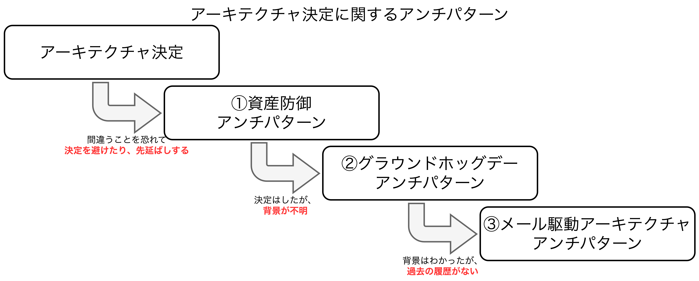

## アーキテクチャ決定

- アーキテクトに求められることの1つにアーキテクチャ決定がある。優れたアーキテクチャ決定は開発チームが適切な技術的選択を行うための指針となる。
  - **【アーキテクチャ決定】** アプリケーションやシステムの構造に関わる決定であり、アーキテクチャ特性に影響を与える技術的決定も含まれる。

### アーキテクチャ決定に関するアンチパターン



- <font color=red>アーキテクチャ決定を下す際、いくつかのアンチパターンが存在し、技芸が求められる。</font>具体的には①資産防御アンチパターン、②グラウンドホッグデーアンチパターン、③メール駆動アーキテクチャアンチパターンの3つがあり、これらは繋がり、段階的に進む。

<div style="page-break-before:always"></div>

#### 【例1】資産防御アンチパターン

- <font color=red><b>選択を誤ることを恐れて決定を避けたり、先延ばししたりする場合に発生するアンチパターン</b></font>
- このアンチパターン克服方法は2つあり、①重要なアーキテクチャ決定を**最終責任時点(決定を下し損ねると重要な大対策がなくなる時点)** まで先延ばしにすることと、②決定したことが期待通りに実装できるよう開発チームに継続的に協力すること、が挙げられる。
  - **【①の補足】** 政党であると犬種おするのに十分あ情報が得られるまで決定を先延ばしすることを意味しているが、**分析麻痺アンチパターン(過度に分析しすぎてしまい解決策や行動方針が決まらない状態)** になるほど先延ばしにしてはいけないため、注意が必要である。
  - **【②の補足】** 特定の技術やその関連問題の詳細をアーキテクトだけが全て把握するのは不可能であるため、開発チームと密に連携し、問題発生時にも迅速に対応できるようにする。
- 例えば、「全てのサービスインスタンスは製品に関する参照データをキャッシュする方式で管理する」というアーキテクチャ決定をしたとする。この場合、製品情報に変更があると関連サービス全てに情報を反映させる必要があり、<u>開発チームがスケーラビリティの要件を満たすために仮想メモリをより多く割り当てる必要があることに気づいたとすると、アーキテクトは開発チームと連携をとることで迅速に把握し、対応することができる</u>。

#### 【例2】グラウンドホッグデーアンチパターン

- <font color=red><b>ある決定が下された理由がわからず、繰り返し何度も議論されてしまうアンチパターン</b></font>。これは決定の根拠を示さないために発生するものであり、<u>①技術的理由と②ビジネス的理由の2つが必要</u>。**どちらか一つでも欠けている場合はアーキテクチャ決定を再考すべきである**。
- 例えば、「モノリシックアプリを別々のサービスに分解し、機能ごとに切り離すことで仮想マシンリソースを軽減し、保守性とデプロイ容易性を向上させる」というアーキテクチャ決定をしたとする。これは技術的理由は満たすがビジネス的理由がない状態である。ビジネス的理由を加えるなら、「①新しいビジネス機能をより早く提供することで市場投入までの時間短縮、②開発とリリースのコスト削減」が挙げられる。
- 一般的なビジネス的理由例としては**①コスト、②市場投入までの時間、③ユーザ満足度、④戦略的なポジショニング**が挙げられ、<u>ステークホルダにとって何が重要なのかを考慮することで優先順位が異なる</u>。

#### 【例3】メール駆動アーキテクチャアンチパターン

- <font color=red><b>人々がアーキテクチャ決定を見失ったり、忘れたり、あるいは決定されたことさえ知らなかったりするため実装できなくなってしまうアンチパターン</b></font>
- アーキテクチャ決定を伝える際、**①WikiやGit、ファイルなどのリンクを共有する(管理場所を1つに絞る)**、**②「あなたに直接影響のある重要な決定になります。」という文言を追加する(アーキテクチャ決定に直接関係する人だけ含める)**、2つを実践することが肝要。

### アーキテクチャ上重要なもの

- <font color=red>アーキテクチャ決定を判断する際は関連情報を十分に集め、妥当性を評価し、文書化した上でステークホルダに効果的に伝える必要がある。</font>
- アーキテクチャ上重要な決定とは、構造、非機能特性、依存関係、インタフェース、構築手法に影響を与える決定のことを指す。
  - **【構造】** 使用しているアーキテクチャスタイルやパターンに影響を与える決定を指す。例えば、「マイクロサービス間でデータ共有する」という決定をしたとすると、マイクロサービスの境界づけられたコンテキストに影響を与え、アプリケーションの構造にも影響を与える。
  - **【非機能特性】** 開発や保守の対象となるアプリやシステムにとって重要なアーキテクチャ特性のことを指す。例えば、パフォーマンスがアプリの重要な側面であり、技術選択がパフォーマンスに影響を与える場合、その選択はアーキテクチャ決定になる。
  - **【依存関係】** システム内のコンポーネントやサービス間の結合点を指す。全体的なスケーラビリティ、モジュール性、アジリティ、テスト容易性、信頼性などに影響を与える。
  - **【インタフェース】** サービスへのアクセスやオーケストレーションの方法を指す。通常はGW、サービスバス、APIプロキシなどを介して行われ、<u>コントラクトの定義・改廃も含む</u>。
  - **【構築手法】** プラットフォーム、フレームワーク、プロセスに関する技術的決定を指す。

### アーキテクチャデシジョンレコード

- <font color=red>アーキテクチャ決定を文書化する最も効果的な方法の1つにADR(Architecture Decision Records)がある。ADRはテキストファイルで構成され、WikiページやGitなど<b>ADRは組織ごとに独自のフォーマットを取りうる</b>。例えば、アーキテクトがADRのドラフトを送付してコメントを求めたい場合、コメント募集(RFC: Request For Comment)という名前の新しいステータスを作成するなど。</font>

#### 基本構造

##### タイトル

> ADRのタイトルには通常連番が振られ、アーキテクチャ決定を説明する簡単なフレーズが含まれる。タイトルは決定の性質と文脈に対する曖昧さを十分に取り除く程度には説明的でなければならないと同時に短く簡潔でなければならない。
> 
> 【例】
> 42.OrderサービスとPaymentサービス間における非同期メッセージでの通信

##### ステータス

- ステータスの変更時、管理者や上司に会話が必要なケースがある。その会話の要否基準としては①コスト、②チーム間の影響、③セキュリティが挙げられる。
  - **【コスト】** ソフトウェアの購入費やライセンス料、追加ハードウェア費用、サービス利用料など
  - **【チーム間の影響】** 他部署との合意、チームメンバの負荷状況確認など
  - **【セキュリティ】** 決済サービスの導入、

> ADRのステータスは、①提案済み、②承認済み、③破棄、④コメント募集のいずれかが設定される。**①提案済みステータス**は決定が上位の意思決定者またはある種のアーキテクチャ管理機関によって承認されなければならないことを意味し、<u>受け入れられるまで変更され続ける</u>。**②承認済みステータス**は決定が承認され、実装の準備ができていることを意味する。**③破棄ステータス**は決定が変更され、別のADRにとって変わられたことを意味する。**④コメント募集ステータス**はステークホルダと様々な仮定や主張を検証するために期限付きコメントを求めていることを意味し、分析麻痺アンチパターンを回避し、最終的な決定を行うことができる。コメント募集後、提案済みもしくは承認済みに変更することも想定される。
> 
> 【例】
> ADR 42.OrderサービスとPaymentサービス間における非同期メッセージでの通信
> **ステータス：ADR 68に伴い破棄された。**
>
> ADR 68.OrderサービスとPaymentサービス間におけるRESTでの通信
> **ステータス：承認済み。ADR 42を破棄した。**

##### コンテキスト

> どのような状況でこの決断を迫られているのかということを記述する。また、具体的な状況や問題点を説明し、可能な代替案も簡潔に説明する。**代替案の説明が詳細になる場合は新たに「代替案セクション」を追加することで対応する**。
>
> 【例】
> Orderサービスは現在発注されている注文の決済を行うために、Paymentサービスに情報を渡さなければならない。これはRESTまたは非同期メッセージを使用して行える。

##### 決定

> アーキテクチャ決定がその完全な正当性と共に記述され、非常に肯定的かつ命令的に記述する。HowよりもWhyに重点を置いて記述し、決定がなされた背景を理解するのに役立つ。例えば、
>
> 【例】
> ◯ サービス間に非同期メッセージを**使用する**。
> ✖️ サービス間に用いるのは非同期メッセージが最善の選択肢**だと思う**。

##### 影響

> アーキテクチャ決定の全体的な影響を記述する。**アーキテクチャのトレードオフ分析の結果などを記述**し、利点が欠点を上回っているかどうかをレビューできるようにする。
>
> 【例】
> Webサイトにレビュー投稿するために非同期メッセージングを使用する場合、応答性を3,100ms→25msに改善できるが、エラー処理が複雑になる。

##### コンプライアンス

> アーキテクチャ決定をどのように評価し、アーキテクチャ決定を遵守するという観点からどのように統制すべきかを記述する。<u>標準セクションではない</u>。

##### 備考

> ADRの様々なメタデータを記述する
> - 著者
> - 承認者、承認日
> - 最終更新者、最終更新日
> - 変更点

#### ADRを保存する

- <font color=red>ADRはWikiや共有ファイルサーバで管理すべきである。</font>
- **Gitリポジトリによる管理には注意が必要**。アクセス権の制御や複数のアーキテクチャ決定の管理(統合アーキテクチャ決定やエンタープライズアーキテクチャ決定など)には適していないため。

```
ADR
├ app
│ ├ common
│ ├ atp
│ └ pstd
├ integration
└ enterprise
```

#### ドキュメントとしてのADR

- <font color=red>C4モデルやArchiMate標準などアーキテクチャを<b>図解するための規格がいくつか存在するが文書の規格(標準)は存在しない</b>。</font>
- ADRはアーキテクチャの文書として十分に有用であり、組織によって独自のフォーマットを取ることが予想される。

#### 事例

> **ADR 76. 入札サービス間での非同期Pub/Subメッセージング**
> 
> **ステータス**
> 承認済み
> 
> **コンテキスト**
> BidCaptureサービスはオンライン入札者または競売人経由のライブ入札者からの入札を受信すると、その入札をBidStreamerサービスとBidTrackerサービスに転送する必要がある。これには、非同期ポイントツーポイント(P2P)メッセージングが非同期パブリッシュ/サブスクライブ(pub/Sub)メッセージング、あるいはオンラインオークションAPI層を介したRESTが使用できる。
> 
> **決定**
> BidCaptureサービス、BidStreamerサービス、BidTrackerサービス間では、非同期のPub/Subメッセージングを使用する。
> - BidCaptureはBidStreamerやBidTrackerから情報を受け取る必要はない。
> - BidStreamerはBidCaptureが受け付けた順番通りに入札を受け取らなければならない。メッセージングやキューを使用することで、ストリームの入札順ば自動的に保証される。
> - 非同期のPub/Subメッセージングを使用することで、入札プロセスのパフォーマンスを向上させ、入札情報の拡張性を高められる。
> 
> **影響**
> メッセージキューのクラスタリングと高可用性が必要になる。内部の入札イベントはAPI層で行われるセキュリティチェックをバイパスする。
>
> 【更新】2025/4/3
> アーキテクチャ審査委員会(ARB)で検討した結果、ARBはこれは受け入れ可能なトレードオフであり、これらのサービス間の入札イベントに追加のセキュリティチェックは不要と決定した。
> 
> **コンプライアンス**
> 定期的にコードレビューと設計レビューを手動で行い、BidCaptureサービス、BidStreamerサービス、BidTrackerサービス間での非同期のPub/Subメッセージングが使用されていることを確認する。
> 
> **備考**
> 著者　　：山田太郎
> 承認　　：ARB会議メンバ、2025/4/1
> 最終更新：山田太郎、2025/4/5
