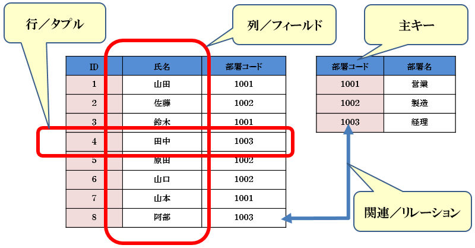
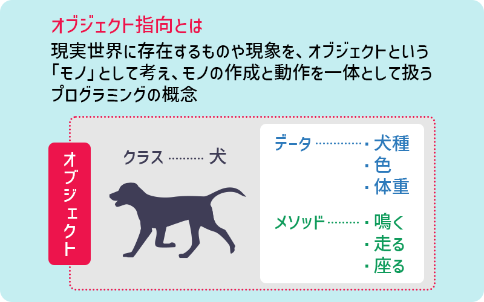
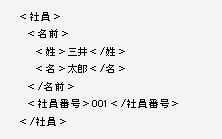
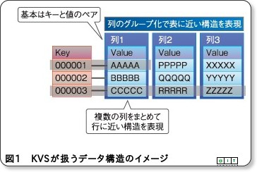
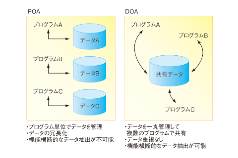
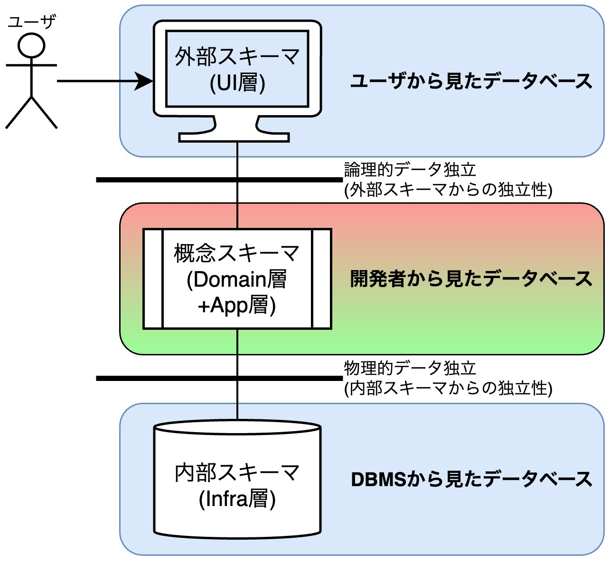

## データベースを制するものはシステムを制す

<div style="padding: 10px; margin-bottom: 10px; border: 5px double;">
    <h5>学習のポイント</h5>
    <ul>
        <li>「DB」とはデータを集積する論理的概念を指す。</li>
        <li>「DBMS」はDBを実装したソフトウェアを指す。</li>
        <li>DB設計では、外部スキーマ、概念スキーマ、内部スキーマの三つに分けて考える。</li>
    </ul>
</div>

<div style="padding: 10px; margin-bottom: 10px; border: 5px double;">
    <h5>勘どころ</h5>
    <ol>
        <li>DBを使わないシステムはこの世に存在しない。</li>
        <li>情報はデータと文脈を合成して生まれる。</li>
        <li>DBモデルが異なれば、データフォーマットも設計技法も異なる。</li>
        <li>基本的には、DBMSが異なっても設計方法に影響はない。</li>
        <li>最初にデータがあり、プログラムがある。</li>
        <li>DBを制するものがシステムを制す。DBはシステムの中心であると同時にシステム開発の中心でもある。</li>
        <li>概念スキーマはデータ独立性を保証するためにある。</li>
        <li>概念の有用性がわからなかったら、「それがなかったらどうなるか」を考えてみよう。</li>
    </ol>
</div>

### データベースとシステム

- **システム**の中で**DB**は利用される
- **DB**は「データの集まり」である。
- **データ**は**データフォーマット**により揃えられた事実である。
- **情報**は**データ**と**文脈**(コンテキスト)の合成により発生する。

特に情報について、例えば、購買履歴には、利用者の購入データ(事実)が集まっており、「いつ」「何を」「誰が」買ったのかわかる。このデータをもとに利用者の欲しい商品を分析する。このように、データ(事実)とそれに基づく文脈を合わせることで情報は生成される。

```math
システム\supsetデータベース\supsetデータ:=データフォーマット \tag{1}
```
```math
情報 = データ + コンテキスト \tag{2}
```

<div style="page-break-before:always"></div>

### データベースモデル

データベースモデルはデータフォーマットを基準に分類される。

| モデル名 | 説明 | 画像 |
| -- | -- | -- |
| **リレーショナル<br>データベース(RDB)** | 人間が理解しやすい表形式で<br>データを管理する方式 |  |
| **オブジェクト指向<br>データベース(OODB)** | データと操作(メソッド)を<br>まとめたオブジェクトという単位で<br>データを管理する方式 |  |
| **XMLデータベース<br>(XMLDB)** | XML形式でデータを管理する方式。<br>RDBが苦手とする階層構造のデータを<br>扱うことが可能 |  |
| **キーバリュー型ストア<br>(Key-Value Store)** | キーとバリューの組み合わせだけで<br>データを表現し、管理する方式。<br>Webサービスで多用され、<br>データ問い合わせ(SELECT)は高速だが、<br>複雑なデータ操作は苦手 |  |

<div style="page-break-before:always"></div>

### POAとDOA

**①プログラム→②データの順に設計するPOAで設計を進めた場合**、複数プロセスで同じデータを個別に持つケースが発生し、冗長性が生じる。一方、**①データ→②プログラムの順に設計するDOAで設計を進めた場合**、データが中心にあるため、複数プロセスでの共用が容易になる。



### 3層スキーマ

DB設計では、「スキーマ」という概念が重要になる。「スキーマ」とは枠組みや構図という意味を持つが、DB設計では特に、データ構造やフォーマットという意味で用いる。DB設計では以下のレベルでスキーマを分ける。

1. **外部スキーマ(外部モデルを定義)**： ビューの世界であり、ユーザから見たデータベース。UI層と同等である。
2. **概念スキーマ(論理データモデルを定義)**： テーブルの世界であり、開発者から見たデータベース。アプリケーション層に該当し、**物理データと論理データの独立性を保証する機能**を持つ。
3. **内部スキーマ(物理データモデルを定義)**： テーブルやインデックス(索引)などの物理的定義を含む、DBMSから見たデータベース。インフラ層に該当し、データアクセス機能を持つ。ファイルで表現される世界。



<!-- 改ページ -->
<div style="page-break-before:always"></div>

### 演習問題

#### 問1-1： 性能試験において、ある夜間バッチ処理のSQLの性能が非常に悪く、要件上は1時間で終了すべきSQLが10時間かかることがわかった。解決方法を考えよ。

##### 回答
対応策は以下の通り。
- 【コスト小】SQLのアクセスパスの最適化
- 【コスト中】アプリケーションの改修
- 【コスト大】テーブルのレイアウトの変更

**【コスト小】SQLのアクセスパスの最適化**
SQL文はDBMS内部で手続型のコードに変換されて実行されるが、必ずしもパフォーマンス的に最適になっているわけではありません。そのためSQLの性能問題が発生する。そこで、<font color=red>①適切な列にインデックスを付与すること</font>や、<font color=red>②実行計画をユーザーが直接指定する機能を使用する</font>、などしてアクセスプランを変える方法が考えられる。

**【コスト中】アプリケーションの改修**
アプリケーションの改修では<font color=red>①非効率なコードの排除</font>、<font color=red>②取得データの削減</font>、などプログラムを作り替える作業を行う。改修作業自体が設計工程以降に影響があるため、手戻りは大きいものになる。

**【コスト大】テーブルのレイアウトの変更**
本対応策では、テーブルの物理定義を変更することになる。これは<font color=red>非正規化</font>や<font color=red>データマート</font>といった手段を含む。DOA（データ中心アプローチ）の原則に基けば、これは下手をするとほとんど全部作り直しになることを意味する。<font color=red>データマートを追加する場合は改修コストは軽いが、非正規化の場合はインパクトは大きくなる</font>。

#### 問1-2： 画面からオンラインで出力する帳票において、現在のレイアウトでは情報が不足していることがわかった。顧客との要件調整に漏れがあったことが原因だった。解決方法を考えよ。

##### 回答
想定される解決策は①プログラムの修正、②テーブルの列項目の追加、③データマートの追加の3つが挙げられる。
状況によって解決策は変わる。例えば、SELECT句に列項目を忘れていた場合は、SQL文の修正だけで済むが、そもそもテーブルの列が不足していた場合、改修コストは大きくなる。他のシステムでも使用されているテーブルの場合、影響範囲はさらに大きくなる。