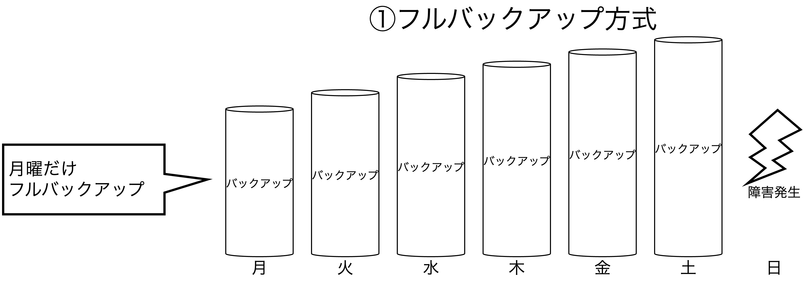

## 論理設計と物理設計

<div style="padding: 10px; margin-bottom: 10px; border: 5px double;">
    <h5>学習のポイント</h5>
    <ul>
        <li>論理設計は物理設計に先立つ。少なくともそう意識していなければいけない。</li>
        <li>設計者はファイルレベルで考えるのが物理設計のポイント。</li>
        <li>サイズ(CPU、メモリ、ストレージ)の選定は難しい。</li>
        <li>RAIDは信頼性、性能、そして"財布"を考慮して決める。</li>
        <li>バックアップおよびリカバリの設計は地味なタスクだが、おろそかにすると"新聞に載る"。</li>
        <li><b>データベースでは、データの整合性とパフォーマンスにトレードオフがある。</b></li>
        <li><b>バックアップ方式では、コストとリカバリ手順にトレードオフがある。</b></li>
    </ul>
</div>

<div style="padding: 10px; margin-bottom: 10px; border: 5px double;">
    <h5>勘どころ</h5>
    <ol start=10>
        <li>エンティティ(実体)といっても、物理的実態を伴う必要はない。</li>
        <li>サイジングはキャパシティ(ストレージ)とパフォーマンス(CPUとメモリ)の2つの観点から行う。</li>
        <li>DBの性能問題の8割はストレージのディスクI/Oネック。</li>
        <li>性能要件の指標は「どれだけ速いか」と「どれだけ多いか」の2つ。</li>
        <li>高精度なサイジングは困難なため、「安全率」と「高可用性(HA)」を考慮した構成を組む。</li>
        <li>RAIDはシステムの信頼性と性能を共に改善できる技術。</li>
        <li>DBのRAIDは少なくともRAID5で構成する。お金に余裕があればRAID10。</li>
        <li>バックアップ方式は「フルバックアップ＋差分バックアップ」か「フルバックアップ＋増分バックアップ」が一般的。</li>
    </ol>
</div>

### 概念スキーマと論理設計

概念スキーマを定義する設計を論理設計といい、「物理層の制約に依存しない設計」を目指す。物理層の制約は、CPUやメモリのスペック、ストレージ容量、DBMSのデータ型やSQL構文などがあり、これらの制約にとらわれず、概念スキーマを定義する。具体的には以下のステップで進む。

1. **エンティティの抽出・定義**： システム内で登場するデータの集合体(エンティティ)を洗い出す作業。「要件定義」と重なる部分でもあり、扱うデータを洗い出していく。そして、エンティティが持つデータ(属性)も決めることで、テーブルとそのカラムを定義することができる。
2. **正規化**： データの操作(CRUD)が整合的に行えるようにするために、エンティティを細分化し、システムのデータを整理する作業。
3. **ER図**： 正規化後、エンティティ同士の関係を表現する図がER図であり、エンティティの見取り図となる。ER図で作成されるモデルを「論理モデル」と呼び、IE記法やIDEFIXと呼ばれる記述方法がある。

### 内部スキーマと物理設計

論理設計を踏まえて、データ格納のための物理的な領域や格納方法を決める工程。物理層ではハードウェアやDBMSの製品知識が必要になるため、論理設計と異なる知識が必要になる。具体的には以下のステップで進む。

1. **テーブル定義**： 論理設計で定義した概念スキーマをもとにDBMS内部に格納するための「テーブル」定義を行う。本フェーズで作られるモデルを「物理モデル」と呼ぶ。
2. **インデックス定義**： インデックスは索引と呼ばれ、パフォーマンス向上に寄与する。
3. **ハードウェアのサイジング(非常に難しいタスク)**： パフォーマンス(CPUとメモリ)、キャパシティ(ストレージ)の2つの観点から行う。ボトルネックの8割はディスクIO。
4. **ストレージの冗長構成**： RAIDやクラスタリング(Active-Active、Active-Standby)を用いて信頼性向上を図る。
5. **ファイルの物理配置**： データファイル、インデックスファイル、

#### キャパシティのサイジング

<font color=red><b>キャパシティのサイジングは最終的なテーブルやインデックスの定義が完了しないと算出はできない</b></font>ため、論理設計が完了していることが前提になる。しかし、現実問題として並行して進めることもしばしばある。またサービスリリース後、データ量は増加していくため、安全率(システムが正常に動作しなくなる<u>最小負荷</u>と、予測されるシステムへの<u>最大負荷</u>との比)と拡張性の2点を考慮して構成を考える必要がある。

#### パフォーマンスのサイジング

パフォーマンスの要件として、「**処理時間(どれだけ速いか)**」と「**スループット(どれだけ多いか)**」がある。実際にかかるシステムの負荷を知るためには、①類似システムのデータを流用するか、②開発初期にプロトタイプを構築して性能試験を実施するかの2通りが考えられる。

||①類似システムのデータ流用|②プロトタイプ開発|
|--|--|--|
|メリット|安上がり|高精度にサイジング可能|
|デメリット|類似システムがない場合精度が低い|検証に時間と人手が必要|

#### ファイルの物理配置

冗長構成を決定後、ファイル配置を決める。ファイルは5種類あり、以下の5つがある。特にログファイルに関して、DBMSによって呼び方が異なる。OracleではREDOログ、PostgreSQLとSQLServerではトランザクションログ、MySQLではバイナリログと呼ばれる。

1. **データファイル**： DBに格納するデータを保持するファイル。アプリがSQLを通じて操作するファイル。
2. **インデックスファイル**： テーブルに作成されたインデックスが格納されているファイル。DBMSではインデックスはデータファイルとは別に管理される。
3. **システムファイル**： DBMSの内部管理用データを保持したファイル。
4. **一時ファイル**： サブクエリを展開したデータやGROUP BYやDISTINCTを利用したソートデータなどが格納されたファイル。<font color=red>一時ファイルは処理が終了すれば削除されてなくなるためサイズ増加はない</font>。
5. **ログファイル**： テーブルのデータ変更を受け付けた際、変更情報を溜め込むためのファイル。溜め込んだ後、一括してデータファイルに適用する（こちらの方がパフォーマンスが良いため）。トランザクションログとも呼ばれる。

|  | 中身 | ユーザ<br>アクセス | データ量の<br>継続的増加 | 性能の<br>考慮レベル | I/O量 |
| -- | -- | -- | -- | -- | -- |
| **データファイル** | テーブルデータ | **◯** | **◯** | 高 | 最多 |
| **インデックス<br>ファイル** | インデックス | **◯** | **◯** | 高 | 多 |
| **システムファイル** | 管理用データ | $\times$ | **◯** | 低 | 極小 |
| **一時ファイル** | サブクエリや<br>ソートデータ | $\times$ | $\times$ | 高 | 多 |
| **ログファイル** | 更新ログ | $\times$ | $\times$ | 中 | 普通<br>(更新が多い場合は多) |


<div style="page-break-before:always"></div>

### バックアップ設計

バックアップは基本的にはファイルコピーで行い、主要な方式は完全バックアップ、差分バックアップ、増分バックアップの3つが挙げられる。バックアップ設計では、**「データ量」と「リカバリ手順」のトレードオフ**がある。

<table>
	<tbody>
		<tr>
			<th colspan="2">名称</th>
			<th>フルバックアップ</th>
			<th>差分バックアップ</th>
			<th>増分バックアップ</th>
		</tr>
		<tr>
			<td colspan="2">バックアップ<br>対象データ</td>
			<td>すべて</td>
			<td>前回のフルバックアップ<br>からの差分</td>
			<td>前回の任意の<br>バックアップ<br>からの差分</td>
		</tr>
		<tr>
			<td colspan="2">バックアップの<br>トータル処理時間</td>
			<td>小</td>
			<td>中</td>
			<td>大</td>
		</tr>
		<tr>
			<td colspan="2">メリット</td>
			<td>
                ①バックアップリカバリ<br>　運用が簡単<br>
                ②リカバリ時に<br>　一つのファイルが必要
            </td>
			<td rowspan="2">
                ①何かにつけて中間的<br>
                ②リカバリ時には<br>二つのファイルが必要
            </td>
			<td>バックアップの<br>ファイルサイズが<br>小さい</td>
		</tr>
		<tr>
			<td colspan="2">デメリット</td>
			<td>
                ①リソースへの負荷が大きい<br>
                ②サービス停止が必要
            </td>
			<td>リカバリ時に<br>全ファイルが必要</td>
		</tr>
		<tr>
			<td rowspan="4">DBMS</td>
			<td>Oracle</td>
			<td>全体バックアップ</td>
			<td>累積増分<br>バックアップ</td>
			<td>差分増分<br>バックアップ</td>
		</tr>
		<tr>
			<td>SQL Server</td>
			<td>完全バックアップ</td>
			<td>差分バックアップ</td>
			<td>トランザクション<br>ログバックアップ</td>
		</tr>
		<tr>
			<td>PostgreSQL</td>
			<td>ベースバックアップ</td>
			<td colspan="2">特になし</td>
		</tr>
		<tr>
			<td>MySQL</td>
			<td>フルバックアップ</td>
			<td colspan=2>増分バックアップ</td>
		</tr>
	</tbody>
</table>

<div style="page-break-before:always"></div>

#### フルバックアップ/完全バックアップ

ある時点でそのシステムが保持しているすべてのデータをバックアップする方式で、あるタイミングにおけるスナップショット(静止画)のようなもの。非常にシンプルな方式であるが、3つの欠点がある。

1. バックアップ時間が(相対的に)長い
2. ハードウェアリソースへの負荷が(相対的に)高い
3. サービス停止が必要




#### 差分バックアップ

フルバックアップの欠点を補った方式が差分バックアップになる。差分バックアップではログファイルをバックアップすることで実現する方式になる。ログファイルにはDBに対するあらゆる変更操作履歴が残っているため、ログファイルをバックアップしておけば、DBに対する変更操作を再度再現できる。
　運用としては、**「月のフルバックアップ」＋「土の差分バックアップ」で最新データの復旧を実現**することになる。


<div style="page-break-before:always"></div>

#### 増分バックアップ

差分バックアップの無駄をさらになくした方式が増分バックアップになる。増分バックアップでは、必要なログファイルのみをバックアップします。最小のコスト(データ量)で抑えられるメリットがある一方で、リカバリ手順が複雑になるというデメリットがある。
　運用としては、**月〜土の全てのバックアップで最新データの復旧を実現**することになる。


#### 【おまけ】レプリケーション

**全く同じデータを持つDBを2セット用意し、常に一方の更新差分をもう一方に反映させる方式**。RAIDと近いところはあるが、バックアップ方式の選択肢の一つとして覚えてもう良いと思う。


<div style="page-break-before:always"></div>

### 演習問題

#### 問2-1： DBの信頼性と性能を高める物理設計としてクラスタリングがある。調査せよ。

##### 回答
```plantuml
!include puml/2_4Clustering.puml
```

##### アクティブ(現用系)-スタンバイ(待機系)方式

現用系に障害が発生した場合、待機系に切り替わり、システムの復旧が行われる。**復旧が比較的早いホットスタンバイ(コスト高)方式**と、**復旧が比較的遅いコールドスタンバイ(コスト低)方式**の2種類がある。

##### 【アクティブ(現用系)-アクティブ(現用系)方式】

複数サーバを分散して配置し、複数サーバで単一ディスクを共有する**シェアードエブリシティング(シェアードディスク)方式**とサーバごとに単一のディスクを占有する**シェアードナッシング方針**の2種類がある。

<table>
	<tbody>
		<tr>
			<td></td>
			<td>シェアードエブリシング</td>
			<td>シェアードナッシング</td>
		</tr>
		<tr>
			<td>メリット</td>
			<td>
                ①フェールオーバーで処理を引き継ぎ、<br>ダウンタイムを最小限に抑えられる<br>
                ②どのノードも全てのデータに<br>アクセスできるため障害に強い
            </td>
			<td>
                ①分散処理により性能が向上する<br>
                ②競合がないためスケールアウトの影響が少ない<br>
                ③サーバを追加すればするほど性能が向上する
            </td>
		</tr>
		<tr>
			<td>デメリット</td>
			<td>
                ①共有ディスクのアクセス競合増加<br>により処理向上が得られない
            </td>
			<td>
                ①DBサーバに障害が発生した場合、<br>付随するディスクのデータが孤立してしまう
            </td>
		</tr>
	</tbody>
</table>

<div style="page-break-before:always"></div>

#### 問2-2： ハードウェアのリプレイスを実施することになった。①プロジェクト予算は少ない、②ピーク時間でも遅くならないようにする、③アクセスログとリソースログは取得可能、の3つを条件にCPUの机上サイジングを実施せよ。

##### 回答

手順は①アクセスログの確認、②ハードウェアリソースログの確認、③新旧サーバの性能比の算出、の3ステップがある。

まず、**アクセスログの確認では、ピーク時間のレスポンスタイムとスループットを調査し、性能要件が満たされているかチェック**する。ここでは性能要件と実測値の差を記録しておく。
次に、**ハードウェアリソースログの確認では、CPU、メモリ、ディスク、ネットワークを確認し、ボトルネックを見つける**。たとえば、メモリ使用率が定常的に$90\%$を超えていた場合、メモリの増強が必要になる。
そして、**新旧サーバの性能比の算出では、ボトルネックとなっている項目の目標数値と比較し、性能比を算出**する。たとえば、メモリ使用率を$50\%$に抑えたい場合、$90 / 50 = 1.8$倍の性能を持つメモリを検討する必要がある。さらに安全率を考慮し、1.8倍ではなく、2倍の性能を持つメモリを検討しても良い。性能評価には、非営利業界団体の[SPEC](http://www.spec.org/)(Standard Performance Evaluation Corporation)のベンチマーク指標を使うのが一般的である。
