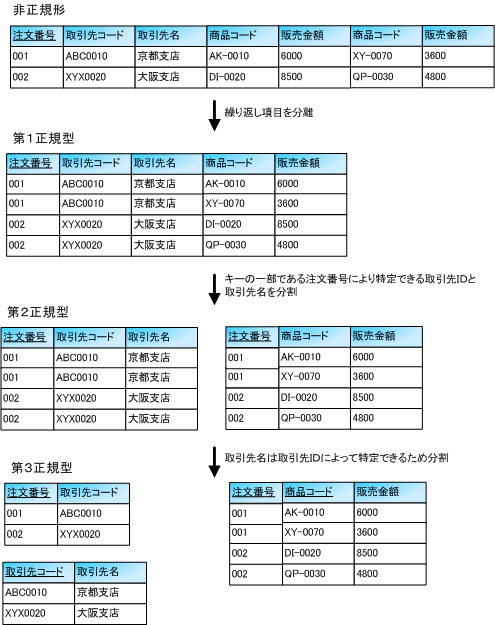
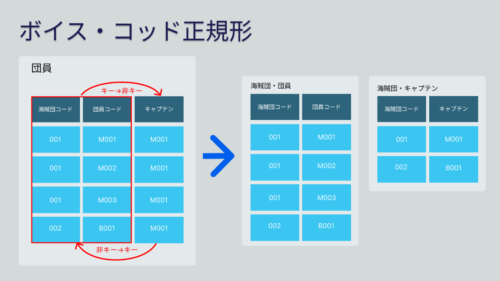
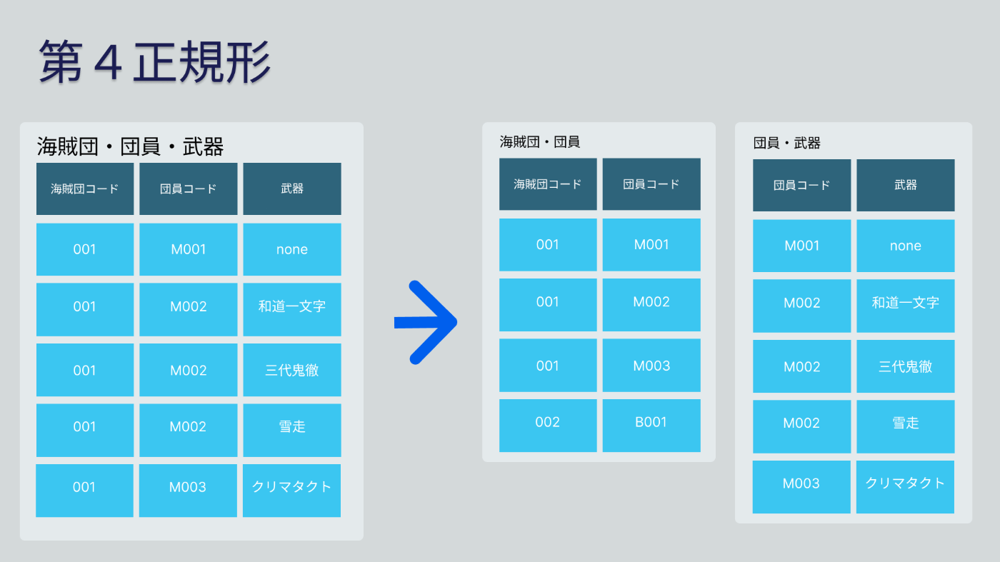
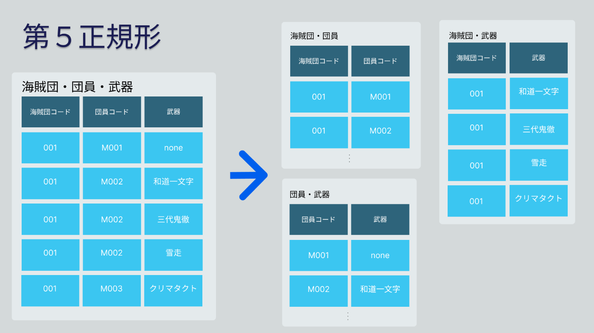
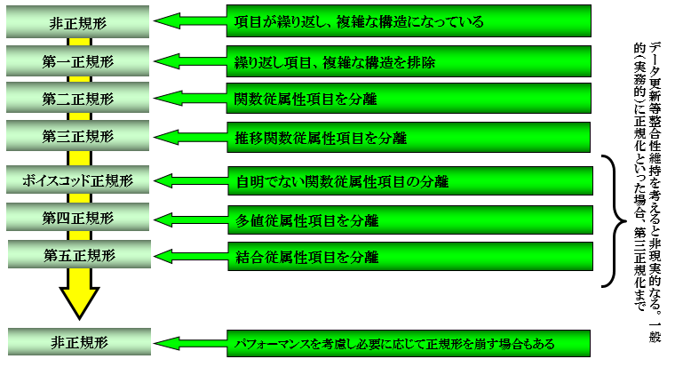

## 論理設計と正規化

    <h5>学習のポイント</h5>
    <ul>
        <li>RDBにおけるテーブルとは「同じ種類のものの集合」。</li>
        <li>「キー」とはある情報を引き出すための鍵。最も重要なのが「主キー」。</li>
        <li>「正規化」はデータ不整合を防止するために冗長性をなくしていく作業。</li>
        <li>関数従属の概念(部分関数従属、推移的関数従属、多値従属性)が正規化には重要。</li>
        <li><b>正規化と検索性能(パフォーマンス)はトレードオフにある。</b></li>
        <li>正規化は重要概念だが、論理設計で一番頭を悩ますのは「正規化後」。</li>
    </ul>

    <h5>勘どころ</h5>
    <ol start=18>
        <li>テーブルとは、共通点を持ったレコードの集合である。</li>
        <li>テーブル名は英語ならば複数形 / 複数名刺でかける。そうでなければそのテーブルにはどこか間違いがある。</li>
        <li>テーブルには重複行は存在できない。</li>
        <li>外部キーは人間の親子関係と同じ。</li>
        <li>外部キーが設定されている場合、データの削除は子から順に操作するのが吉。</li>
        <li>キーとなる列には、コードやIDなどの表記体系の定まった固定長文字列を用いる。</li>
        <li>テーブル定義において、列には可能な限りNOT NULL製薬を付加する。</li>
        <li>テーブルや列の名前に日本語は御法度。</li>
        <li>正規化レベルは第5まであるが、普通は第3正規化まで理解すれば十分。</li>
        <li>主キーは一部であってもNULLを含んではならない。</li>
        <li>第2正規形は、部分関数従属を解消することで得られる。</li>
        <li>正規化とは、現実世界の実体間にある階層の差を反映する手段でもある。</li>
        <li>正規化の逆操作は結合</li>
        <li>ボイス-コッド正規形への分解時には、気をつけないと非可逆な分解を行なってしまうことがある。</li>
        <li>関連実体(エンティティ同士の関連を表すエンティティ)に含まれる関連は一つだけにすること。</li>
    </ol>

### 第1正規化〜第3正規化

そもそも、**正規化とは、データ変更時の不整合や不都合を予防することを目的とした、データの冗長性をなくす作業**である。まず、第1正規化から第3正規化について説明する。

- **第1正規化**： 重複する行をなくす。 → 繰り返し項目の分離
- **第2正規化**： 主キーの「一部」に従属する列を抽出する。 → 部分関数従属の除去・完全関数従属のみテーブル作成
- **第3正規化**： 非キーの「一部」に従属する列を抽出する。 → 推移的関数従属の除去

### ボイス-コッド正規化(BCNF)

**ボイスコッド正規化は、非キーから主キーへの関数従属をなくした状態**であり、第##正規化とも呼ばれる。<b>ボイスコッド正規化では、非可逆な分解を起こす可能性があり、無損失分解に反することがある</b>ため、注意が必要である。

### 第4正規化・第5正規化

最後に、第##正規化は「関連実体」に対して発生する正規化である。**関連実体とは、エンティティ同士の関連を表すエンティティ**である。例えば、社員-所属チーム、社員-担当製品などが挙げられる。これは、**多値従属性**と呼び、一つのキーに対して複数の値が定まるような【キー】-【集合】の関係を意味する。

まず、<b>第4正規化では、関連実体があるテーブルを分離していく作業</b>になる。次に、<b>第5正規化では、エンティティ同士に関連がある場合は関連実体(テーブル)を作る作業</b>になる。一見、第##正規化でそれぞれ反対の操作をしているように見えるが、**どちらの操作も関連実体は##対応させる目的**で実施される作業である。

<table>
    <tr>
        <td></td>
        <td></td>
    </tr>
</table>

<!-- 改ページ -->

### 正規化まとめ

以上の内容を踏まえ、以下に正規化についてまとめる。

#### ポイント1. 正規化とは更新時の不都合/不整合を排除するために行う。

- データ操作(CRUD)時の不都合を防ぐ。
- ヒューマンエラーによるデータ不整合を防ぐ。

#### ポイント2. 正規化は従属性を見抜くことで可能になる。

- 繰り返し項目があれば第1正規化。
- 部分関数従属があれば第2正規化。
- 推移的関数従属があれば第3正規化。
- ボイス-コッド正規化は非可逆な分解を起こす場合があるため注意。
- 多値従属性があれば第4正規化。
- エンティティ同士に関連があれば第5正規化。
- <b>従属の有無は業務知識(ドメイン)が必要</b>

#### ポイント3. 正規形はいつでも非正規形に戻せる。

- 正規化により分割されたテーブルはいつでも非正規化テーブルに戻せる(無損失分解を満たす)

#### ポイント4. 正規化とメリットとデメリットを抑える。

正規化は原則、**①第三正規化まで行い**、**②関連実体がある場合は##対応**にすることを意識すれば良い。ただし、以下のメリットとデメリットを考慮する必要がある。

- メリット
  - データの冗長性が排除され、更新時の不整合を防止できる。
  - テーブルの持つ意味が明確になり、開発者が理解しやすい。
- デメリット
  - テーブルが増えるため、パフォーマンスが悪化する(トレードオフ)

<!-- 改ページ -->

### 演習問題

#### 問3-1： 以下のテーブルの正規形の次数を答えよ。

<!-- 支社支店商品テーブル -->
<table>
    <caption>支社支店商品</caption>
	<tbody>
		<tr>
			<th>支社コード</th>
			<th>支社名</th>
			<th>支店コード</th>
			<th>支店名</th>
			<th>商品コード</th>
			<th>商品名</th>
			<th>商品分類コード</th>
			<th>分類名</th>
		</tr>
		<tr>
			<td>001</td>
			<td>東京</td>
			<td>01</td>
			<td>渋谷</td>
			<td>001</td>
			<td>石鹸</td>
			<td>C1</td>
			<td>水洗用品</td>
		</tr>
		<tr>
			<td>001</td>
			<td>東京</td>
			<td>01</td>
			<td>渋谷</td>
			<td>002</td>
			<td>タオル</td>
			<td>C1</td>
			<td>水洗用品</td>
		</tr>
		<tr>
			<td>001</td>
			<td>東京</td>
			<td>01</td>
			<td>渋谷</td>
			<td>003</td>
			<td>歯ブラシ</td>
			<td>C1</td>
			<td>水洗用品</td>
		</tr>
		<tr>
			<td>001</td>
			<td>東京</td>
			<td>02</td>
			<td>八重洲</td>
			<td>002</td>
			<td>タオル</td>
			<td>C1</td>
			<td>水洗用品</td>
		</tr>
		<tr>
			<td>001</td>
			<td>東京</td>
			<td>02</td>
			<td>八重洲</td>
			<td>003</td>
			<td>歯ブラシ</td>
			<td>C1</td>
			<td>水洗用品</td>
		</tr>
		<tr>
			<td>001</td>
			<td>東京</td>
			<td>02</td>
			<td>八重洲</td>
			<td>004</td>
			<td>コップ</td>
			<td>C1</td>
			<td>水洗用品</td>
		</tr>
		<tr>
			<td>001</td>
			<td>東京</td>
			<td>02</td>
			<td>八重洲</td>
			<td>005</td>
			<td>箸</td>
			<td>C2</td>
			<td>食器</td>
		</tr>
		<tr>
			<td>001</td>
			<td>東京</td>
			<td>02</td>
			<td>八重洲</td>
			<td>006</td>
			<td>スプーン</td>
			<td>C2</td>
			<td>食器</td>
		</tr>
		<tr>
			<td>002</td>
			<td>大阪</td>
			<td>01</td>
			<td>堺</td>
			<td>001</td>
			<td>石鹸</td>
			<td>C1</td>
			<td>水洗用品</td>
		</tr>
		<tr>
			<td>002</td>
			<td>大阪</td>
			<td>01</td>
			<td>堺</td>
			<td>002</td>
			<td>タオル</td>
			<td>C1</td>
			<td>水洗用品</td>
		</tr>
		<tr>
			<td>002</td>
			<td>大阪</td>
			<td>02</td>
			<td>豊中</td>
			<td>007</td>
			<td>雑誌</td>
			<td>C3</td>
			<td>書籍</td>
		</tr>
		<tr>
			<td>002</td>
			<td>大阪</td>
			<td>02</td>
			<td>豊中</td>
			<td>008</td>
			<td>爪切り</td>
			<td>C4</td>
			<td>日用雑貨</td>
		</tr>
	</tbody>
</table>

##### 回答

次数は1、つまり、第一正規形の状態。

#### 問3-2： 「支社支店商品」テーブルの関数従属性を全て上げよ。

##### 回答

- 部分関数従属
  - {支社コード} $\rightarrow$ {支社名}
  - {支社コード, 支店コード} $\rightarrow$ {支店名}
  - {商品コード} $\rightarrow$ {商品名, 商品分類コード, 分類名}
- 推移的関数従属
  - {商品コード} $\rightarrow$ {商品分類コード} $\rightarrow$ {分類名}

<!-- 改ページ -->

#### 問3-3： 「支社支店商品」テーブルを可能な限り、高次に正規化せよ。

##### 回答

<!-- 支社テーブル、支店テーブル、商品分類テーブル -->
<table>
    <tr>
        <td>
            <table>
                <caption>支社</caption>
                <thead>
                <tr>
                    <th>支社コード</th>
                    <th>支社名</th>
                </tr>
                </thead>
                <tr>
                    <td>001</td>
                    <td>東京</td>
                </tr>
                <tr>
                    <td>002</td>
                    <td>大阪</td>
                </tr>
            </table>
        </td>
        <td>
            <table>
                <caption>支店</caption>
                <thead>
                <tr>
                    <th>支社コード</th>
                    <th>支店コード</th>
                    <th>支店名</th>
                </tr>
                </thead>
                <tr>
                    <td>001</td>
                    <td>01</td>
                    <td>渋谷</td>
                </tr>
                <tr>
                    <td>001</td>
                    <td>02</td>
                    <td>八重洲</td>
                </tr>
                <tr>
                    <td>002</td>
                    <td>01</td>
                    <td>堺</td>
                </tr>
                <tr>
                    <td>002</td>
                    <td>02</td>
                    <td>豊中</td>
                </tr>
            </table>
        </td>
        <td>
            <table>
                <caption>商品分類</caption>
                <thead>
                <tr>
                    <th>商品分類コード</th>
                    <th>分類名</th>
                </tr>
                </thead>
                <tr>
                    <td>C1</td>
                    <td>水洗用品</td>
                </tr>
                <tr>
                    <td>C2</td>
                    <td>食器</td>
                </tr>
                <tr>
                    <td>C3</td>
                    <td>書籍</td>
                </tr>
                <tr>
                    <td>C4</td>
                    <td>日用雑貨</td>
                </tr>
            </table>
        </td>
    </tr>
</table>

<!-- 支店商品テーブル、商品テーブル -->
<table>
    <tr>
        <td>
            <table>
                <caption>支店商品</caption>
                <thead>
                <tr>
                    <th>支社コード</th>
                    <th>支店コード</th>
                    <th>商品コード</th>
                </tr>
                </thead>
                <tr>
                    <td>001</td>
                    <td>01</td>
                    <td>001</td>
                </tr>
                <tr>
                    <td>001</td>
                    <td>01</td>
                    <td>002</td>
                </tr>
                <tr>
                    <td>001</td>
                    <td>01</td>
                    <td>003</td>
                </tr>
                <tr>
                    <td>001</td>
                    <td>02</td>
                    <td>002</td>
                </tr>
                <tr>
                    <td>001</td>
                    <td>02</td>
                    <td>003</td>
                </tr>
                <tr>
                    <td>001</td>
                    <td>02</td>
                    <td>004</td>
                </tr>
                <tr>
                    <td>001</td>
                    <td>02</td>
                    <td>005</td>
                </tr>
                <tr>
                    <td>001</td>
                    <td>02</td>
                    <td>006</td>
                </tr>
                <tr>
                    <td>002</td>
                    <td>01</td>
                    <td>001</td>
                </tr>
                <tr>
                    <td>002</td>
                    <td>01</td>
                    <td>002</td>
                </tr>
                <tr>
                    <td>002</td>
                    <td>02</td>
                    <td>007</td>
                </tr>
                <tr>
                    <td>002</td>
                    <td>02</td>
                    <td>008</td>
                </tr>
            </table>
        </td>
        <td>
            <table>
                <caption>商品</caption>
                <thead>
                <tr>
                    <th>商品コード</th>
                    <th>商品名</th>
                    <th>商品分類コード</th>
                </tr>
                </thead>
                <tr>
                    <td>001</td>
                    <td>石鹸</td>
                    <td>C1</td>
                </tr>
                <tr>
                    <td>002</td>
                    <td>タオル</td>
                    <td>C1</td>
                </tr>
                <tr>
                    <td>003</td>
                    <td>歯ブラシ</td>
                    <td>C1</td>
                </tr>
                <tr>
                    <td>004</td>
                    <td>コップ</td>
                    <td>C1</td>
                </tr>
                <tr>
                    <td>005</td>
                    <td>箸</td>
                    <td>C2</td>
                </tr>
                <tr>
                    <td>006</td>
                    <td>スプーン</td>
                    <td>C2</td>
                </tr>
                <tr>
                    <td>007</td>
                    <td>雑誌</td>
                    <td>C3</td>
                </tr>
                <tr>
                    <td>008</td>
                    <td>爪切り</td>
                    <td>C4</td>
                </tr>
            </table>
        </td>
    </tr>
</table>