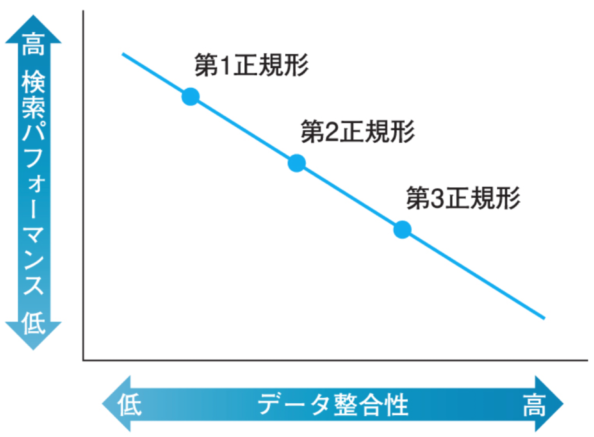
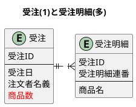
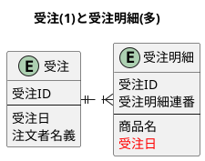
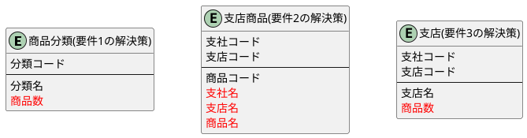

## 論理設計とパフォーマンス

<div style="padding: 10px; margin-bottom: 10px; border: 5px double;">
    <h5>学習のポイント</h5>
    <ul>
        <li><b><font color=red>データ整合性とパフォーマンスのトレードオフを把握する。</font></b></li>
        <li>正規化はデータ整合性の利点と、パフォーマンス低下の欠点がある。</li>
        <li>正規化は高コストな結合を要し、処理速度悪化の原因の多くが結合処理になる。</li>
        <li>正規化で発生する問題の解決策は①SQL文のチューニングと②非正規化がある。</li>
    </ul>
</div>

<div style="padding: 10px; margin-bottom: 10px; border: 5px double;">
    <h5>勘どころ</h5>
    <ol start=34>
        <li>非正規化テーブルならばSQLで結合せずに済み、パフォーマンス向上に寄与する。</li>
        <li>COUNTやAVG、SUMなどのサマリデータを冗長に保持すると正規形に違反するが、検索を高速化できる。</li>
        <li>選択条件を冗長に保持すると正規形に違反するが、検索を高速化できる。</li>
        <li>論理設計には物理設計のトレードオフの知識(後工程を考慮したエア開発)が必要。</li>
    </ol>
</div>

### 正規化の功罪

正規化の利点はデータの整合性を保持であり、ヒューマンエラーによるデータの不都合や不整合を予防する。一方で、システムの実用に耐えられないぐらいのパフォーマンス不足に起因することもある。そのため、エンジニアは**正規化によるデータの整合性とパフォーマンスのトレードオフ**に対処する必要がある。下図のように、正規化の次数が低いほど検索SQLのパフォーマンスは良い。以下にクリス・デイトの言葉を示す。

<p style="background-color: #dddddd; padding: 10px;">
「非正規化」はあくまでも最後の手段であるという姿勢で臨む、というものだ。要するに、十分に正規化された設計を諦めても良いのは、パフォーマンスを向上させるためのその他全ての戦略が要件を満たさない場合だけである。
C.J.Date、『データベース実践講義』より
</p>




#### 正規化とSQL(検索)

SQLにおいて、正規化の反対処理である結合処理は非常にコストが高い処理になり、テーブル数とレコード数に比例して処理時間が長くなる。結合処理には内部結合と外部結合がある。**結合処理によるパフォーマンス悪化を防ぐ策としては非正規化**がある。非正規化のクエリサンプルを見ると結合処理(JOIN)がないことがわかる。これにより処理速度が高速になる。

```plantuml
!include puml/5_1table_example2.puml
```

```plantuml
!include puml/5_1table_example1.puml
```

```sql
-- 正規化したテーブルにおける内部結合処理のクエリサンプル
SELECT 会社.会社名, 社員.社員名, 部署.部署名
FROM 社員
INNER JOIN 会社 ON 社員.会社コード = 会社.会社コード -- 内部結合
INNER JOIN 部署 ON 社員.部署コード = 部署.部署コード -- 内部結合
;
```

```sql
-- 正規化したテーブルにおける外部結合処理のクエリサンプル
SELECT 会社.会社コード, COUNT(社員.社員名) as 社員数
FROM 社員
LEFT OUTER JOIN 社員 ON 社員.会社コード = 会社.会社コード -- 内部結合
ORDER BY 会社.会社コード
;
```

```sql
-- 非正規化によるクエリサンプル(結合なし)
SELECT 会社名, 社員名, 部署名
FROM 社員
;
```

<!-- 改ページ -->
<div style="page-break-before:always"></div>

#### 正規化とSQL(更新)

先ほどの2つのテーブル(第3正規化のテーブル設計と第1正規化のテーブル設計)を用いて、更新処理を考える。更新処理においては正規化後のテーブルに軍配が上がる。これは単純に更新されるレコード数が変わるためである。以下にSQLの例を示す。

```sql
-- 会社テーブルを更新する場合
UPDATE 会社
SET 会社名 = 'E物産'
WHERE 会社コード = 'C0001'
;
```
```sql
-- 社員テーブルを更新する場合
UPDATE 社員
SET 会社名 = 'E物産'
WHERE 会社コード = 'C0001'
;
```

会社テーブルは一つのレコード更新だけで良いが社員テーブルは会社名に一致する社員のレコードを全て更新する必要がある。つまり、`会社テーブルのレコード数＜社員テーブルのレコード数`であり、**正規化と非正規化は検索(結合)と更新のトレードオフでもある**ことがわかる。

### 非正規化とパフォーマンス

正規化で冗長性を排除したことによって発生する性能問題は大きく2つに分けられる。<b>①サマリデータの冗長性排除と②選択条件の冗長性排除、の2つであり、<font color=red>必ず1対多の関連を持つ二つのテーブル間で発生</font></b>する。以下のER図を例に考える。

```plantuml
!include puml/5_2table_example3.puml
```

#### ①サマリデータの冗長性排除による問題の解決方法

例えば、「受注日ごとに何この商品が注文されているかを調べよ。」という要望があった場合、SQLは以下のようになる。このクエリは内部結合(高コストな処理)があります。これによりパフォーマンス低下の原因になることが考えられる。解決策としては受注エンティティに「商品数」の列を追加することが挙げられる。つまり、**非正規化**である。<b><font color=red>サマリデータ(COUNTやAVG、SUMなどの集約関数を用いたデータ)を冗長に保持することで正規形に違反するが、検索を高速化</font></b>できる。


```sql
-- 受注日ごとの商品数を取得するクエリ例
SELECT 受注.受注日, COUNT(*) as 商品数
FROM 受注
INNER JOIN 受注明細 -- 内部結合(高コストな処理)
    ON 受注.受注ID = 受注明細.受注ID
GROUP BY 受注日 -- 受注日ごとにグループ化
;
```



#### ②選択条件の冗長性排除による問題の解決方法

次に、「受注日が2012/1/6〜2012/1/7の期間に注文された商品の一覧を出力せよ。」という要望があった場合を考える。SQLは以下の通りである。

```sql
SELECT 受注.受注ID, 受注明細.商品名
FROM 受注明細
INNER JOIN 受注 -- 内部結合(高コストな処理)
    ON 受注.受注ID = 受注明細.受注ID
WHERE 受注.受注日 BETWEEN '2012-01-06' AND '2012-01-07'
;
```

SQLを見ると結合処理(高コスト)があることがわかる。解決策としては受注明細エンティティに「受注日」列を追加することであり、これにより結合処理をなくし、I/Oコストを大きく削減することが可能になる。この場合、**第2正規化から外れてしまうが**、<b><font color=red>選択条件を冗長に保持すると正規形に違反するが、検索を高速化</font></b>できる。



<!-- 改ページ -->
<div style="page-break-before:always"></div>

### 非正規化の利点と欠点

- 利点
  - 検索のパフォーマンス向上
- 欠点
  - 更新パフォーマンスの低下
  - データのリアルタイム性の低下
  - 手戻りが大きい

#### 欠点①更新時のパフォーマンス

例えば、「特定日における発送商品数」を保持するテーブルを考える。商品のキャンセルや追加購入による発送商品数の増減があることから、**「更新の頻度」は非常に多い**ことがわかる。また、容易に想像できると思うが、現実世界において取引される商品は非常に多いことから、**「更新される量」も多い**ことが想像できる。

#### 欠点②データのリアルタイム性

欠点①の続きになるが、**データのリアルタイム性**という問題がある。これは、データの最新性を問う要件であり、データを反映するタイミングを見つける必要があります。<b><font color=red>データのリアルタイム性については性能問題と直結するため、ユーザとの平衡点を模索する必要がある</font></b>。

#### 欠点③改修コストの大きさ

最後に、改修コストの大きさである。非正規化$\rightarrow$正規化、正規化$\rightarrow$非正規化のどちらにも言えるが、**開発や検証フェーズにおいてデータモデル(テーブル)を変更することは、非常にコストが高い**。そのため、<b>DBの論理設計者は<font color=red>①正規形の理論を理解</font>し、<font color=red>②様々なトレードオフ</font>を知った上で、<font color=red>③機能要求や品質要求を同時に満たす平衡点を探し出す能力</font>が必要</b>とされる。

上記の3つの欠点から以下の結論を得る。
$$論理と物理のトレードオフを理解して初めて論理設計ができる。$$


<!-- 改ページ -->
<div style="page-break-before:always"></div>

### 演習問題

#### 問5-1： 下記の5テーブルから、以下の要件を満たすSQLを考えよ。

- 要件1： 商品分類ごとの商品数。結果には分類名を含むものとする。
- 要件2： 支社/支店別の取扱商品の一覧。結果には支社名、支店名、商品名を含むものとする。
- 要件3： 最も取扱商品数が多い視点の視点コードと商品数。

<!-- 支社テーブル、支店テーブル、商品分類テーブル -->
<table>
    <tr>
        <td>
            <table>
                <caption>支社</caption>
                <thead>
                <tr>
                    <th>支社コード</th>
                    <th>支社名</th>
                </tr>
                </thead>
                <tr>
                    <td>001</td>
                    <td>東京</td>
                </tr>
                <tr>
                    <td>002</td>
                    <td>大阪</td>
                </tr>
            </table>
        </td>
        <td>
            <table>
                <caption>支店</caption>
                <thead>
                <tr>
                    <th>支社コード</th>
                    <th>支店コード</th>
                    <th>支店名</th>
                </tr>
                </thead>
                <tr>
                    <td>001</td>
                    <td>01</td>
                    <td>渋谷</td>
                </tr>
                <tr>
                    <td>001</td>
                    <td>02</td>
                    <td>八重洲</td>
                </tr>
                <tr>
                    <td>002</td>
                    <td>01</td>
                    <td>堺</td>
                </tr>
                <tr>
                    <td>002</td>
                    <td>02</td>
                    <td>豊中</td>
                </tr>
            </table>
        </td>
        <td>
            <table>
                <caption>商品分類</caption>
                <thead>
                <tr>
                    <th>商品分類コード</th>
                    <th>分類名</th>
                </tr>
                </thead>
                <tr>
                    <td>C1</td>
                    <td>水洗用品</td>
                </tr>
                <tr>
                    <td>C2</td>
                    <td>食器</td>
                </tr>
                <tr>
                    <td>C3</td>
                    <td>書籍</td>
                </tr>
                <tr>
                    <td>C4</td>
                    <td>日用雑貨</td>
                </tr>
            </table>
        </td>
    </tr>
</table>

<!-- 支店商品テーブル、商品テーブル -->
<table>
    <tr>
        <td>
            <table>
                <caption>支店商品</caption>
                <thead>
                <tr>
                    <th>支社コード</th>
                    <th>支店コード</th>
                    <th>商品コード</th>
                </tr>
                </thead>
                <tr>
                    <td>001</td>
                    <td>01</td>
                    <td>001</td>
                </tr>
                <tr>
                    <td>001</td>
                    <td>01</td>
                    <td>002</td>
                </tr>
                <tr>
                    <td>001</td>
                    <td>01</td>
                    <td>003</td>
                </tr>
                <tr>
                    <td>001</td>
                    <td>02</td>
                    <td>002</td>
                </tr>
                <tr>
                    <td>001</td>
                    <td>02</td>
                    <td>003</td>
                </tr>
                <tr>
                    <td>001</td>
                    <td>02</td>
                    <td>004</td>
                </tr>
                <tr>
                    <td>001</td>
                    <td>02</td>
                    <td>005</td>
                </tr>
                <tr>
                    <td>001</td>
                    <td>02</td>
                    <td>006</td>
                </tr>
                <tr>
                    <td>002</td>
                    <td>01</td>
                    <td>001</td>
                </tr>
                <tr>
                    <td>002</td>
                    <td>01</td>
                    <td>002</td>
                </tr>
                <tr>
                    <td>002</td>
                    <td>02</td>
                    <td>006</td>
                </tr>
                <tr>
                    <td>002</td>
                    <td>02</td>
                    <td>007</td>
                </tr>
            </table>
        </td>
        <td>
            <table>
                <caption>商品</caption>
                <thead>
                <tr>
                    <th>商品コード</th>
                    <th>商品名</th>
                    <th>商品分類コード</th>
                </tr>
                </thead>
                <tr>
                    <td>001</td>
                    <td>石鹸</td>
                    <td>C1</td>
                </tr>
                <tr>
                    <td>002</td>
                    <td>タオル</td>
                    <td>C1</td>
                </tr>
                <tr>
                    <td>003</td>
                    <td>歯ブラシ</td>
                    <td>C1</td>
                </tr>
                <tr>
                    <td>004</td>
                    <td>コップ</td>
                    <td>C1</td>
                </tr>
                <tr>
                    <td>005</td>
                    <td>箸</td>
                    <td>C2</td>
                </tr>
                <tr>
                    <td>006</td>
                    <td>スプーン</td>
                    <td>C2</td>
                </tr>
                <tr>
                    <td>007</td>
                    <td>雑誌</td>
                    <td>C3</td>
                </tr>
                <tr>
                    <td>008</td>
                    <td>爪切り</td>
                    <td>C4</td>
                </tr>
            </table>
        </td>
    </tr>
</table>

<div style="page-break-before:always"></div>

##### 回答

SQLは以下の順で処理が進む。
```sql
FROM → JOIN → WHERE → GROUP BY → HAVING → SELECT → ORDER BY → LIMIT
```
要件1の問題はGROUP BY句で商品分類コードと分類名を指定した上で、SELECT句で指定する必要がある。要件2は内部結合をうまく使う必要がある。要件3はサブクエリをうまく使い、処理を分ける必要がある。

```sql
-- 要件1： 商品分類ごとの商品数。結果には分類名を含むものとする。
SELECT 商品分類.商品分類コード, 商品分類.分類名, COUNT(*) as 商品数
FROM 商品
INNER JOIN 商品分類　ON 商品.商品分類コード = 商品分類.商品分類コード
GROUP BY 商品分類.商品分類コード, 商品分類.分類名 -- SELECT句で表示する項目をGROUP BYで指定しておく必要がある。
;
```
```sql
-- 要件2： 支社/支店別の取扱商品の一覧。結果には支社名、支店名、商品名を含むものとする。
SELECT 支社.支社名, 支店.支店名, 商品.商品名
FROM 支店商品
INNER JOIN 支社　ON 支社.支社コード = 支店商品.支社コード
INNER JOIN 支社　ON 支店.支店コード = 支店商品.支店コード
INNER JOIN 支社　ON 商品.商品コード = 支店商品.商品コード
;
```
```sql
-- 要件3： 最も取扱商品数が多い支店の支店コードと商品数。
SELECT 支店.支社コード, 支店.支店コード, COUNT(*) as 最大商品数
FROM 支店 
INNER JOIN 支店商品
    ON 支店.支社コード = 支店商品.支社コード
    AND 支店.支店コード = 支店商品.支店コード
GROUP BY 支店.支社コード, 支店.支店コード
HAVING COUNT(*) >=
    (
        SELECT MAX(商品数) 
        FROM 
        ( 
            SELECT 支社コード, 支店コード, COUNT(*) as 商品数
            FROM 支店
            INNER JOIN 支店商品
                ON 支店.支社コード = 支店商品.支社コード
                AND 支店.支店コード = 支店商品.支店コード
            GROUP BY 支店.支社コード, 支店.支店コード
        )　TMP -- TMPテーブルとして扱う
    )
```

<div style="page-break-before:always"></div>

#### 問5-2： 問5-1のSQLのパフォーマンスを向上させる方法を考えよ。

##### 回答

**問5-1は「結合」と「集約」の二つが原因で複雑**になっている。したがって解決策はそれぞれ、以下の通りである。

- 要件1の解決策： 商品分類テーブルに「商品数」カラムを追加する。
- 要件2の解決策： 支店商品テーブルに「支社名」、「支店名」、「商品名」を追加する。
- 要件3の解決策： 支店テーブルに「商品数」カラムを追加する。

