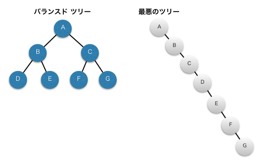

## データベースとパフォーマンス

<div style="padding: 10px; margin-bottom: 10px; border: 5px double;">
    <h5>学習のポイント</h5>
    <ul>
        <li>DBのパフォーマンスの決定要因は<b><font color=red>①ディスクI/Oの分散(RAID)</font></b>、<b><font color=red>②SQLにおける結合(正規化)</font></b>、そして<b><font color=red>③インデックスと統計情報</font></b>の3つがある</li>
        <li>インデックスはパフォーマンス向上に有効な道具だが、正しい使い方を知る必要がある。</li>
        <li>統計情報はDBMSにとっての地図情報。最新の情報でなければ最短のアクセスパスを選択できない。</li>
        <li>人間の手によって統計情報も作られているため、統計情報が最適解ではない場合もある。</li>
        <li>経験豊富なDBAでない限り、直接的にアクセスパスを決定する手段(オプティマイザヒント)は使わない。<br>※チューニングの一手段であって方法論ではない。</li>
    </ul>
</div>

<div style="padding: 10px; margin-bottom: 10px; border: 5px double;">
    <h5>勘どころ</h5>
    <ol start=38>
        <li>最初のうちはインデックス＝B木インデックスで覚える。</li>
        <li>B木は平均点が高いの秀才タイプ。</li>
        <li>データ量が少ない(1万件以下)の場合はインデックスの効果はない。</li>
        <li>カーディナリティが高い列ほどインデックスの効果は高い。　※<b><font color=red>値の分散が大きいことがベスト</font></b>。</li>
        <li>SQLの実行計画はDBMSが「おまかせ」で選ぶ。</li>
        <li>データが大きく更新された後、なるべく早く統計情報を収集する。</li>
        <li>原則、統計情報収集は夜間帯に実施する。</li>
    </ol>
</div>

### DBのパフォーマンスの決定要因

DBのパフォーマンスを良好に保つための方針について、2章や5章のほかに<b><font color=red>インデックス</font>と<font color=red>統計情報</font>がある</b>。

### インデックス設計

インデックス設計のメリットについて、**①プログラムに影響を与えない(アプリケーション透過性)**、**②テーブルデータに影響を与えない(データ透過性)**、**③性能改善の効果が大きい**、の3つが挙げられる。
　まず、①アプリケーション透過性について、これは「存在を意識しなくても良い」性質のことであり、インデックスを作成する際はアプリケーションのことを意識する必要はないという意味である。テーブル定義やプログラムの変更に比べて、非常に軽い作業になる。
　次に、②データ透過性について、これも「存在を意識しなくても良い」性質を表す。テーブルの構造やその中身のデータについて意識する必要がないという意味である。そのため、論理設計を修正する手直しを軽減・解消することができる。
　そして、③性能改善の効果が大きいことについて、これはインデックスの性能がデータ量に対して緩やかに劣化することを意味している。

### B木のインデックス設計方針

インデックスはB木が一般的であり、B木は以下の5つの性質を高水準で満たす。

1. 【**均一性**】B木は**平衡木**であり、①ルートからリーフまでの距離(高さ)が一定、②自動的に平衡をとるため、検索速度にバラツキが少ない。
2. 【**持続性**】処理は$O(\log n)$であり、検索や更新にかかる処理時間はほとんど増えないため、データ量の増加に対してパフォーマンスの劣化は緩やか。
3. 【**処理汎用性**】処理性能はCRUD操作のいずれも$O(\log n)$であり、概ね速い。
4. 【**非透過性**】等号(＝)と不等号($>, \geqq, <, \leqq$)、範囲検索(BETWEEN句)による処理が高速。ただし、<font color=red>否定条件(<>、!=)やNULL判定などについては「特定のノード以外」として判定されてしまうため、絞り込みが効かない</font>。
5. 【**親ソート性**】GROUP BY、ORDER BY、COUNT / MAX / MINなどのソートが必要な処理を高速に行う。B木インデックスは構築時にキー値をソートして保持するため、<u>インデックスが存在する列を指定してソートが必要なSQLの場合、ソート処理をスキップできる</u>。これにより、ソート処理によるパフォーマンス劣化を軽減する効果があり、チューニングの大きな助けになる。一般的に以下の処理を記述したときはDBMS内部で**暗黙的にソート**による高コストの演算が行われているため、ディスクI/Oコストが非常に大きくなる可能性がある。
   - 集約関数(COUNT、SUM、AVG、MAX、MIN)
   - ORDER BY句
   - 集合演算(UNION、INTERSECT、EXCEPT)
   - OLAP関数(RANK、ROW_NUMBERなど)
   ※OLAP(Online Analytical Processing)はオンライン分析処理を意味し、多次元データ分析で使用する。


<table>
    <tr>
        <th>均一性　　　　　　　　　　　　　　　　　　</th>
        <th>持続性</th>
    </tr>
    <tr>
        <td></td>
        <td></td>
    </tr>
</table>

<div style="page-break-before:always"></div>

### インデックスの使用上の注意

1. 大規模なテーブルに対してB木インデックスを作成する(目安は1万レコード以上)
2. カーディナリティの高い列を作成する(5%程度の絞り込みができる、つまり20以上のカーディナリティを持つ)
3. SQL文でWHERE句の選択条件やJOIN句の結合条件に使用されている列に作成する
4. 主キーおよび一意制約の列には作成不要
5. B木インデックスは更新性能を劣化させる

#### 大規模なテーブルに対してB木インデックスを作成する

データ量が少ない場合、フルスキャンとB木インデックスの処理性能に差はない。<b>CPUやメモリ、ディスクの性能など環境要因によって変わるが、<font color=red>目安としては1万レコードをB木インデックスを作成する閾値</font>としてみてもよい</b>。逆に、1万レコード未満のデータであればインデックスの効果はない。

#### カーディナリティの高い列を作成する

**カーディナリティとは、特定列の値がどれぐらいの種類を持つかを表す概念**になる。たとえば、性別の場合は「男」「女」「不詳」の3つ、都道府県の場合は47のカーディナリティになる。<b>カーディナリティの目安としては<font color=red>「全体のレコード数の5%程度に絞り込めるだけのカーディナリティがあること」</font>である</b>。例えば、365日のうちの1日を指定する場合、$\frac{1}{365}\fallingdotseq 0.27\%$であり、約$0.3\%$に絞り込めるため列にB木インデックスを作る意味はあると判断できる。
　カーディナリティの注意点は、<b><font color=red>①複合列に対してインデックスを作成する場合は複合列の組み合わせで考える</font></b>こと、<b><font color=red>②カーディナリティはバラツキ(分散・標準偏差)も考慮する</font></b>こと、の2つが挙げられる。

#### SQL文でWHERE句の選択条件やJOIN句の結合条件に使用されている列に作成する。

以下のSQLはインデックスを利活用できていない例である。以下、col_1にインデックスが存在する場合を考える。

##### インデックス列に演算を行なっている。

```sql
-- インデックス対象はcol_1であって演算後(col_1 * ##)ではない
SELECT * FROM SomeTable
WHERE col_1 * 1.1 > 100;
-- ↓ 対応策
SELECT * FROM SomeTable
WHERE col_1 > 100/1.1;
```

##### 索引列に対してSQL関数を適用している。

```sql
-- インデックス対象はcol_1であって戻り値 SUBSTR(col_1, 1, 1) ではない
SELECT * FROM SomeTable
WHERE SUBSTR(col_1, 1, 1) = 'a';
```

##### IS NULL 述語を使っている。

```sql
-- 一部のDBMSはNULLもインデックスが有効に作用しますが、汎用的ではない。
SELECT * FROM SomeTable
WHERE col_1 IS NULL;
```

##### 否定形を用いている。

```sql
-- 検索範囲が広すぎて、否定形はインデックスを利用できない。
SELECT * FROM SomeTable
WHERE col_1 <> 100;
```

##### ORを用いている。

```sql
SELECT * FROM SomeTable
WHERE col_1 = 99 OR col_1 = 100;
-- ↓ 対応策
SELECT * FROM SomeTable
WHERE col_1 IN(99, 100);
```

##### 後方一致、または中間一致のLIKE述語を用いている。

```sql
SELECT * FROM SomeTable WHERE col_1 LIKE '%a';  -- ダメな例1(後方一致)
SELECT * FROM SomeTable WHERE col_1 LIKE '%a%'; -- ダメな例2(中間一致)
SELECT * FROM SomeTable WHERE col_1 LIKE 'a%';  -- 良い例(前方一致)
```

##### 暗黙の型変換を行なっている。

```sql
SELECT * FROM SomeTable WHERE col_1 = 10;                   -- ダメな例(col_1は文字列型)
SELECT * FROM SomeTable WHERE col_1 = '10';                 -- 良い例1(col_1は文字列型)
SELECT * FROM SomeTable WHERE col_1 = CAST(10, AS CHAR(2)); -- 良い例2(col_1は文字列型)
```

#### 主キーおよび一意制約の列には作成不要

主キーや一意制約を作成する際、内部的にはB木インデックスを作成する。これにより、インデックスを作成した列はデータをソートして保持し、**重複チェック**をしている。

#### B木インデックスは更新性能を劣化させる

一般的に、**インデックスはテーブルとは別のオブジェクトとしてDBMS内部に保持**される。そのため、インデックスが作成されているテーブルの対象列の値が変更されると、インデックス内の値も変更する必要がある。つまり、<b><font color=red>B木インデックスを作成すればするほど、更新処理は劣化する</font></b>。

<div style="page-break-before:always"></div>

### 統計情報の概要

**統計情報はメタデータ**のことであり、テーブルやインデックスなど「データ」についてのデータを意味する。DBMSはこのメタデータを元にSQLのアクセスパスを決定する。DBMSがSQL文を受け取り、テーブルにアクセスするまでの流れを以下に示す。**テーブルにアクセスする際の手続きの手順を実行計画やアクセスプランと呼ぶ**が、これはDBMSが自動で決定する。

1. **ユーザ**はDBMSへSQLを実行する。
2. **パーサ**はSQL文を解析し、文法をチェックする。
3. **オプティマイザ**は**カタログマネージャ**から統計情報を取得する。
4. **オプティマイザ**は統計情報から最短経路を選択し、実行計画を決定する。
5. **実行計画**に基づいてテーブルにアクセスする。


ここで、<b><font color=red>オプティマイザを信じない悲観的設計という考え方</font>もあるが、現実的に実施するのは非常にコストが高い</b>。この考え方は<u>現在の実行計画がデータへの最短ルート</u>であるとわかっている場合の設計であり、統計情報を凍結することで実現できる。

### 統計情報の設計指針

統計情報は実行計画を決定する上で非常に重要になる。統計情報の収集する際のポイントを以下に示す。

- **収集タイミング** ①原則夜間帯、②データが大きく変更(挿入、更新、削除)された後、なるべく早く
- **収集対象（範囲）** ①大きな変更（挿入、更新、削除）があったテーブルやインデックス、②一時テーブル

#### 統計情報収集のタイミング   

**収集タイミングは<font color=red>「データが大きく変更された後」に「なるべく早く」</font>収集**する。例えば、①レコード件数の増減や、②データの分布が変わることなどがアクセスパスの選定に影響する。逆に<u>データの更新量が少ない場合は収集の意味はあまりない</u>。<b>別の視点として、<font color=red>「原則、利用が少ない夜間帯」</font>に収集すること</b>が挙げられる。

#### 統計情報収集の対象(範囲)

<b>収集対象(範囲)は<font color=red>「大きな変更のあったテーブルおよびインデックス」</font></b>になる。大きい変更のあるテーブルやインデックスについては、設計者からヒアリングすることで得られる。<u>統計情報の取得は負荷が高い処理であるため、無駄なく、必要最低限の対象・範囲に絞ることが重要</u>になる。

<!-- 改ページ -->
<div style="page-break-before:always"></div>

### 演習問題

#### 問6-1： RDBで利用可能なインデックスには「ビットマップインデックス」と「ハッシュインデックス」がある。これらのインデックスの長所と短所を答えよ。

##### 回答

|  | 説明 | 長所 | 短所 |
| - | - | - | - |
| **ビットマップ<br>インデックス** | 列データの値から<br>ビットデータを作成して、<br>それをインデックスとして<br>保持する。 | ①カーディナリティの低い列に<br>　対しても検索性能が良い。<br>②OR条件にも利用できる。<br>③インデックスサイズが小さい | ①データ更新のたびに<br>　インデックスも更新。<br>　(更新性能が悪い)<br>②更新頻度が多い<br>システム(OLTP)ではリスクが大きい。 |
| **ハッシュ<br>インデックス** | ハッシュ関数から<br>データをハッシュ化し、<br>インデックスとして保持。 | ①一度の読込でデータを<br>　特定できる($O(1)$)。<br>②等値検索(＝)が非常に高速 | ①範囲検索(BETWEEN)や<br>部分一致検索(LIKE)では<br>利用できない。 |

※OLTP(OnLine Transaction Processing)： オンライントランザクション処理。複数の処理や操作をまとめて処理する形式。

<table>
    <tr>
        <th>ビットマップインデックス</th>
        <th>ハッシュインデックス</th>
    </tr>
    <tr>
        <td></td>
        <td></td>
    </tr>
</table>

<!-- 改ページ -->
<div style="page-break-before:always"></div>

#### 問6-2： B木インデックスは更新のたびに構造が崩れ、性能劣化していく。この防止策にインデックスの再編成がある。この具体的な方法をDBMSごとに答えよ。

##### 回答

DBSMにおいてインデックスを編成する方法は**①一度インデックスを削除して、作成する方法**と、**②削除せず、再編成する方法**の二つがある。方法①については、最も簡単な方法である一方、エラーにより失敗してしまうとインデックスがない状態になってしまうということです。そのため、原則方法②を行う。

##### Oracle

```sql
-- 簡易的な再編成
ALTER INDEX インデックス名 COALESCE;

-- 本格的な再編成
ALTER INDEX インデックス名 REBUILD;
```

##### SQLServer

```sql
-- 簡易的な再編成
ALTER INDEX インデックス名 REORGANIZE;

-- 本格的な再編成
ALTER INDEX インデックス名 REBUILD;
```

##### PostgreSQL

```sql
-- オプションで細かい制御を行う。
REINDEX インデックス名;
```

##### MySQL

```sql
-- テーブルの再編成を行うコマンド。
-- このコマンドと合わせてインデックスの再編成も行う。
-- なぜインデックスの再編成を行うコマンドがないのかは不明。。。
OPTIMIZE TABLE テーブル名;
```
