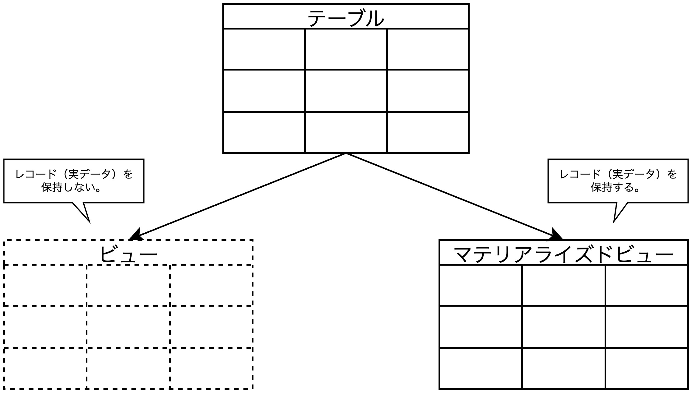

## 論理設計とアンチパターン

<div style="padding: 10px; margin-bottom: 10px; border: 5px double;">
    <h5>学習のポイント</h5>
    <ul>
        <li>RDBの論理設計の原則に違反した設計をアンチパターンと呼び、アンチパターンはシステムの品質を左右し、変更が難しい。</li>
        <li>代表的なバッドノウハウには、①非スカラ値、②ダブルミーニング、③単一参照テーブル、④テーブル分割、⑤不適切なキー、⑥ダブルマスタがある。</li>
    </ul>
</div>

<div style="padding: 10px; margin-bottom: 10px; border: 5px double;">
    <h5>勘どころ</h5>
    <ol start=45>
        <li>情報は可能な限り分割して(正規化して)保存する。ただし、意味を壊してはいけない。</li>
        <li>列は変数ではない。一度意味を決めたら変更不可。</li>
        <li>テーブルにポリモーフィズムは不要。</li>
        <li>可変超文字列は普遍性がないためキーには不向き。</li>
        <li>キーには固定長文字列の「コード」列が望ましい。</li>
        <li>ダブルマスタはシステム統廃合で起きることが多い。</li>
    </ol>
</div>

### やってはいけない論理設計

**<font color=red>システム開発において設計と実装は戦略と戦術</font>に相当**する。設計が品質を左右することはあっても、実装が品質を左右することはほとんどない。そのため、論理設計は品質要求を考慮しながら、物理設計にも想いを馳せる非常に難しい作業と言え、**論理と物理、利用者と開発者、それぞれの視点でトレードオフを探す必要がある**。設計者は望ましい形だけでなく、真似してはいけない設計も知っている必要がある。**<font color=red>真似してはいけない設計パターンを「バッドノウハウ」や「アンチパターン」</font>と呼ぶ**。

<div style="page-break-before:always"></div>

### 非スカラ値(第一正規化未満)

**非スカラ値とは、2つ以上の値が入ったデータ**である。例として配列がある。配列を用いたテーブル作成のDDLを以下に示す。

```sql
-- 扶養者テーブル
CREATE TABLE huyosha(
    shain_id    varchar(4),
    shain_mei   varchar(20),
    kodomo      varchar(20)[], -- 配列の宣言
    PRIMARY KEY(shain_id)
);
```

<table>
    <caption>非スカラ値の例</caption>
	<tbody>
		<tr>
			<th>社員ID</th>
			<th>社員名</th>
			<th>子</th>
		</tr>
		<tr>
			<td>000A</td>
			<td>加藤</td>
			<td>達夫<br>信二</td>
		</tr>
		<tr>
			<td>000B</td>
			<td>藤本</td>
			<td></td>
		</tr>
	</tbody>
</table>

しかし、これだと、第一正規化に違反します。そのため、<b><font color=red>配列型は利用せず、第一正規化を遵守する</font></b>。以上のことから非スカラ値は使用せず、スカラ値を用いることが重要であることがわかった。
　スカラ値の基準を考える。<b>スカラ値の基準は「意味的に分割できる限り、なるべく分割する」</b>である。たとえば、氏名であれば「苗字」と「名前」、メールアドレスであれば「ユーザアカウント」と「ドメイン」が挙げられる。**分割する理由は、①分割したものを結合することと、②結合してあるものを分割することとでは、②のコストが比較的高いからである**。つまり、後から①をするのと、②をするのとでは、②をする方が大変ということである。以上のことから、<u>原子的な形でデータを保持することが望ましい</u>ことがわかる。

<div style="page-break-before:always"></div>

### 単一参照テーブル

<b><font color=red>単一参照テーブルとは、あらゆるタイプ(県コードや顧客コード、性別コードなど)のマスタテーブルを一つのテーブルに放り込んだテーブル</font>になる</b>。これは複数のテーブルが同じ構造を持っている場合に発生してしまうアンチパターンである。


また、単一参照テーブルの利点と欠点を示す。下表より、利点に比べて欠点が大きいことがわかる。単一参照テーブルは「ポリモーフィズム」である。この<b><font color=red>「ポリモーフィズム」はDBにおいては管理コスト低下やパフォーマンス劣化に繋がるため、アンチパターン</font>である</b>。

- **メリット**
  1. マスタテーブルの数が減り、ER図やスキーマがシンプルになる。
  2. コード検索のSQLを共通化できる。
- **デメリット**
  1. コードタイプ、コード値、コード内容の各列とも必要とされる列長は体系によって異なるため、余裕を見てかなり大きめの可変長文字列型で宣言する必要がある。
  2. 一つのテーブルにレコードを集約するため、コード種別とその数が増えるとパフォーマンス劣化に繋がる。
  3. コード検索のSQL内でコードタイプやコード値を間違えて指定してもエラーにならないため、バグに気づきにくい。
  4. ER図がすっきりすると言っても、ERモデルとしては正確さにかけており、かえってER図の可読性を下げることになる。

<div style="page-break-before:always"></div>

### テーブル分割


テーブル分割は水平分割と垂直分割に分けられ、どちらも以下の3つの欠点を持ちます。

- **欠点①分割する理由がない**：正規化の際、テーブル分割をする理由は出てこない。物理設計における性能要件を満たさない場合以外では実施しない。
- **欠点②拡張性に乏しい**：テーブルが増える(変わる)とプログラムも増える(変わる)ため管理コストがかかる。
- **欠点③他の代替手段がある**：インデックスやパーティション、シャーディングがある。

以下に、テーブル分割の代替手段を示す。データマートとサマリテーブルは垂直分割に対する代替手段であり、「**集約**」と呼ばれる。次にパーティションは水平分割と垂直分割の両方に対する代替手段である。最後に、シャーディングとカラムベースDBはテーブル分割の発送と似た技術になる。

#### 代替手段1：データマートとサマリテーブル

まず、データマートは列の絞り込みを行う際の具体的な手段になる。**<font color=red>データマート</font>はユースケースに応じて列を絞り込んだ小規模なテーブル**であり、<u>①オリジナルのテーブルを破壊することなく</u>、<u>②パフォーマンスを向上（＝I/Oコストを削減）</u>するという利点がある。一方、欠点として、<u>①オリジナルテーブルとのデータの同期</u>、<u>②ストレージの圧迫</u>という欠点もある。一方で<b><font color=red>サマリテーブル</font>は集約関数(COUNT、AVG、SUMなど)によってレコードを集約した状態で保持しているテーブル</b>のことである。利点と欠点はデータマート同様である。


<div style="page-break-before:always"></div>

#### 代替手段2：パーティション

**パーティションとは、テーブルを複数のグループに分割する処理**である。分割には「水平」と「垂直」の2つがある。これにより、<u>テーブルを分割することなく、パーティションキー（年度や部署など）を軸として物理的に格納領域を分離することが可能</u>。これによりデータ量を$\frac{1}{n}$($n$はパーティション数)に減らすことが可能。


#### テーブル分割と似た技術1：シャーディング

シャーディングとは、**予め決められた規則に従って複数のDBサーバにデータを分散して割り当てる方法**の1つで、DBへのリクエストを分散し全体のスループットを上げる目的で利用される。DBサーバは**シェアードナッシング方式**で分割された断片的なデータ集合(シャード)を持っている。実装方法としては、<font color=red>①行（レコード）を基準にテーブルを分割する水平方向のシャーディング</font>と、<font color=red>②列（カラム）を基準にテーブルを分割する垂直方向のシャーディング</font>の2つがある。


##### その他技術との比較

| 技術名 | 比較内容 |
| -- | -- |
| パーティション | <b><font color=red>すべてのデータグループを同じコンピュータに保存</font>する。<br>※<font color=red>DBシャーディングはそれらを異なるコンピュータに分散</font>させる</b>。|
| レプリケーション | 全く同じデータを持つDBを2つ用意し、常に一方の更新差分をもう一方に<br>反映して同期を取る仕組み。<u>シャーディングは同じ情報のコピーはない</u>ため<br><b><font color=red>シャーディングとレプリケーションを組み合わせて使用すると、<br>スケールと高可用性の両方を実現可能</font></b>。 |

<div style="page-break-before:always"></div>

### ダブルマスタ

ダブルマスタとは、その名の通り同じマスタテーブルが存在することを指す。ダブルマスタが原因で、<u>SQLの複雑化(JOINやUNIONなどの結合処理)</u>や、<u>パフォーマンスの悪化(処理時間の増大)</u>が懸念される。**ダブルマスタの内容は非常に簡単であるが、発生ケースが非常に重要**である。<b><font color=red>ダブルマスタはシステムの統廃合で発生することが多い</font></b>。
　例えば、企業の統廃合により、金融業の顧客システムと小売業の顧客システムを統合があった場合、これがダブルマスタの発生ケースになる。この場合、既存のエンティティを並べただけの名ばかりな統合をせず、データを精査し、エンティティの統廃合が必要になる。このような<b><font color=red>データを精査する作業を「データクレンジング」と呼び、システム統合や既存システムの改修時において、重要な役割を果たす</font></b>。


### バッドノウハウがダメな理由

バッドノウハウのダメな理由は大きく三つあるが、一言でまとめると<b><font color=red>「保守・運用の管理コストが増大する」</font></b>ということである。

#### 理由①：エンジニアがそんなに頭が良くない（可読性）

バッドノウハウを採用したシステムは保守・運用コストが非常に高くなる。その理由は、バッドノウハウが人間の直感に反するものだからであり、開発担当者の仕様理解を妨げる要素になる。たとえば、単一参照テーブルの場合、最初に設計した人以外は意図を理解することが困難である。またテーブル分割のようにパフォーマンスを追求したことで可読性を下げる設計をした場合、人間にとって「わかりにくい」システムになる。これらは作業者の理解やコミュニケーションを阻害することに繋がり、「バグの温床」になる。

#### 理由②：設計変更の難しさ（変更容易性）

前述した通り、バッドノウハウは保守・運用コストを非常に高める。そのため、もし、基本設計においてバッドノウハウを決定してしまった場合、開発や検証などの後工程で修正することは非常に高いコストを要する。これはデータモデル(エンティティ)が変わることで、プログラムが変更されることを意味しており、大きな手戻りが発生する。上記の**開発・検証フェーズにおけるデータモデルの変更コストが非常に高くなる問題はRDBそのものの欠点**として言われることもある。

#### 理由③：データ構造がコードを決め、その逆はない。（DOAの原則）

DOAより、システムはデータ構造が決まった後、プログラム(アプリケーション)が決まる。このことから、バッドノウハウに基づくデータ構造の決定はアプリケーションにまで影響を与える。**不適切なデータ構造は複雑なSQLを生み、非効率な処理につながる**。つまり、ダメなデータ構造をプログラムで挽回することは不可能である。

<!-- 改ページ -->
<div style="page-break-before:always"></div>

### 演習問題

#### 問7-1： 水平分割の代替手段としてパーティションを取り上げた。ここで、「レンジパーティション」「リストパーティション」「ハッシュパーティション」をそれぞれ調べ、利点と欠点を答えよ。

##### 回答


##### レンジパーティションとリストパーティション

レンジパーティションは、**パーティションの中で最も基本的で頻繁に利用される機能**。インデックスではB木に相当する。この機能はある列をキーにして、その値の範囲によってパーティションを分割する。そのため、年月や時間などの<font color=red><u>順序関係のあるデータにしか適用できない</u></font>。
　リストパーティションは**都道府県や顧客コードなどの離散的なキーに対してレコードを区切るパーティション機能**。特定のキーの値を使ってレコードをパーティションごとに振り分ける点を見ると、レンジパーティションとは原理的には同一。
　レンジパーティションとリストパーティションを利用する際の基本方針は以下の通り。
- **方針1**：なるべく各パーティションに含まれるレコード数が同じくらいになるキーを選ぶ。そうでなければ、キーによってI/O量が大きく変わる。
- **方針2**：SQL文で選択(SELECT)や結合(JOIN)の条件に利用されるキーを選ぶこと。せっかくパーティションでデータを区切っても、SQL文で利用されなければ意味がない。
- **方針3**：値があまり変更(UPDATE)されないキーを使うこと。<u>パーティションにレコードが格納された後にキー値を変更されると、<font color=red>パーティション間のレコード分布が崩れ、I/O量が変わる</font></u>ため、あまり変動が大きいキーを使うことは推奨できない。

##### ハッシュパーティション

**ハッシュ関数でパーティションキーをの値を分散させるパーティション機能**であり、原理的にはハッシュインデックスと同一。ハッシュインデックスと同様、一意検索では効果を発揮するが、範囲検索では効果が見込めない。レンジ/リストパーティションとの利用方針の違いはパーティション数が明確かどうかになる。<font color=red>レンジ/リストパーティションはユーザが明示的にパーティション数を決める必要があるが、ハッシュパーティションは事前にユーザが指定は不要である</font>。

#### 問7-2： 垂直分割の代替手段としてデータマートを取り上げた。ここで、「マテリアライズドビュー（Materialized View）」の機能について答えよ。

##### 回答



マテリアライズドビューは「実体化されたビュー」という意味であり、実データ（レコード）を保持するビューのことである。マテリアライズドビューの利点と欠点は以下の通り。欠点について、<font color=red>①リフレッシュを怠ると元のテーブルと食い違いが起こってしまうため、定期的なデータ同期が必要</font>。また、<font color=red>②データマートと同様、ストレージの容量も消費する</font>。

- 利点
  1. 実データを保持するので通常のビューと異なり、アクセス時にビュー定義のSELECT文が実行されない(ビューより高速)。
  2. インデックスを作成することが可能。
- 欠点
  1. リフレッシュ(マテリアライズドビューの更新)の管理が必要。
  2. 普通のテーブルと同様にストレージを消費する。
