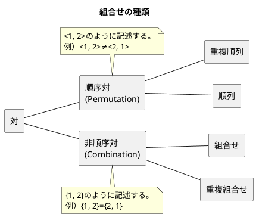

### 自己結合の使い方

<div style="padding: 10px; margin-bottom: 10px; border: 5px double;">
    <h5>学習のポイント</h5>
    <ul>
        <li>自己結合は非等値結合と組み合わせて使うのが基本</li>
        <li>重複順列、順列、重複組合せ、組合せの4つを活用し、自己結合を実現する。</li>
        <li>自己結合で使用する比較演算子は数値型、文字型、日付などにも有効。</li>
        <li>GROUP BYと組み合わせると、再起的集合を作ることが可能</li>
        <li>本当に異なるテーブルを結合していると考えると理解しやすい</li>
        <li>「物理」ではなく「論理」の世界で考える</li>
    </ul>
</div>

#### 重複順列・順列・組合せ・重複組合せ

次の商品と値段を保持するテーブルを例に重複順列、順列、重複組合せ、組合せを示す。例えば、商品が3個($n=3$)、選ぶ個数が2個($k=2$)の時、組合せは以下の通り。

- 【**重複順列**】　　$n^k\hspace{2mm}=3^2=9$個
- 【**順列**】　　　　$_nP_k=_3\hspace{-1mm}P_2=6$個
- 【**重複組合せ**】　$_nH_k=_{n+k-1}\hspace{-1mm}C_k=_{3+2-1}\hspace{-1mm}C_2=_4\hspace{-1mm}C_2=6$個
- 【**組合せ**】　　　$_nC_k=_3\hspace{-1mm}C_2=3$個



<div style="page-break-before:always"></div>

<table>
    <caption>商品</caption>
	<tbody>
		<tr>
			<th><u>name<br>商品名</th>
			<th>price<br>値段</th>
		</tr>
		<tr>
			<td>りんご</td>
			<td>100</td>
		</tr>
		<tr>
			<td>みかん</td>
			<td>50</td>
		</tr>
		<tr>
			<td>バナナ</td>
			<td>80</td>
		</tr>
	</tbody>
</table>

重複順列、順列、重複組合せ、組合せを文章で表現すると以下の通り。これらをSQLに変換する。

- 【**重複順列**】　　異なる$n$個のものから**重複を許して**$r$個を選び、順番に並べる場合の数。
- 【**順列**】　　　　異なる$n$個のものから$r$個を選び、順番に並べる場合の数。
- 【**重複組合せ**】　異なる$n$個のものから**重複を許して**$r$個を選ぶ場合の数（順番は問わない）。
- 【**組合せ**】　　　異なる$n$個のものから$r$個を選ぶ場合の数（順番は問わない）。


```sql
-- 重複順列(CROSS JOIN)
SELECT DISTINCT P1.name AS name_1, P2.name AS name_2
FROM Products P1
CROSS JOIN Products P2;

-- 【非推奨】同じ重複順列であるが意図せぬクロス結合の危険性があるため危険
SELECT DISTINCT P1.name AS name_1, P2.name AS name_2
FROM Products P1, Products P2;
-- WHERE P1.name <> P2.name -- 順列のSQLの場合はWHERE句を追加(こちらも非推奨)

--順列(INNER JOIN)
SELECT P1.name AS name_1, P2.name AS name_2 
FROM Products P1
INNER JOIN Products P2 ON P1.name <> P2.name;

-- 重複組合せ(結合条件に「=」を含める)
SELECT P1.name AS name_1, P2.name AS name_2
FROM Products P1
INNER JOIN Products P2 ON P1.name >= P2.name;

-- 組合せ(結合条件に「=」を含めない)
SELECT P1.name AS name_1, P2.name AS name_2
FROM Products P1
INNER JOIN Products P2 ON P1.name > P2.name;

```

##### 【発展系】2列→3列への拡張版

- 順列、重複組合せ、組合せについてINNER JOINの結合条件が異なる。
  - **順列**　　　　不等号(<>)のINNER JOIN
  - **重複組合せ**　以上(>=)または以下(<=)のINNER JOIN
  - **組合せ**　　　大なり(>)または小なり(<)のINNER JOIN

```sql
-- 重複順列(3列への拡張版)
SELECT P1.name AS name_1, P2.name AS name_2, P3.name AS name_3
FROM Products P1
CROSS JOIN Products P2
CROSS JOIN Products P3;

--順列(3列への拡張版)
SELECT P1.name AS name_1, P2.name AS name_2, P3.name as name_3
FROM Products P1
INNER JOIN Products P2 ON P1.name <> P2.name
INNER JOIN Products P3 ON P1.name <> P3.name AND P2.name <> P3.name;

--重複組合せ(3列への拡張版)
SELECT P1.name AS name_1, P2.name AS name_2, P3.name AS name_3 
FROM Products P1 
INNER JOIN Products P2 ON P1.name >= P2.name 
INNER JOIN Products P3 ON P2.name >= P3.name;

--組合せ(3列への拡張版)
SELECT P1.name AS name_1, P2.name AS name_2, P3.name AS name_3 
FROM Products P1 
INNER JOIN Products P2 ON P1.name > P2.name 
INNER JOIN Products P3 ON P2.name > P3.name;
```

<div style="page-break-before:always"></div>

#### 重複行を削除する

重複行はRDBにおいてNULLと並んで嫌われる存在であり、これを排除する方法は下図多く考えられている。例えば、以下のテーブルに置いて「みかん」の重複データを削除することを考える。

<table>
    <caption>重複行の存在するテーブル</caption>
	<tbody>
		<tr>
			<th>name(商品名)</th>
			<th>price(値段)</th>
		</tr>
		<tr>
			<td>りんご</td>
			<td>50</td>
		</tr>
		<tr>
			<td>みかん</td>
			<td>100</td>
		</tr>
		<tr>
			<td>みかん</td>
			<td>100</td>
		</tr>
		<tr>
			<td>みかん</td>
			<td>100</td>
		</tr>
		<tr>
			<td>バナナ</td>
			<td>80</td>
		</tr>
	</tbody>
</table>

```sql
-- 重複行を削除するSQL(極値関数の利用)
DELETE FROM Products P1
WHERE P1.rowid < (
    SELECT MAX(P2.rowid)
    FROM Products P2
    WHERE P1.name = P2.name AND
    P1.price = P2.price
);

-- 重複行を削除するSQL(非等値結合の利用)
DELETE FROM Products P1
WHERE EXISTS (
    SELECT * 
    FROM Products P2
    WHERE P1.name = P2.name AND
    P1.price = P2.price AND
    P1.rowid = P2.rowid
);
```

<div style="page-break-before:always"></div>

#### 部分的に不一致なキーの検索

「同じグループでも住所が異なるデータ」や「同じ金額で異なる商品」などを取得するSQLを考える。

<table>
    <tr>
        <td>
            <table>
                <caption>住所</caption>
                <thead>
                    <tr>
                        <th>氏名</th>
                        <th>番号</th>
                        <th>住所</th>
                    </tr>
                </thead>
                <tbody>
                    <tr><td>前田 義明</td><td>100</td><td>東京都港区虎ノ門3-2-<b>29</td></tr>
                    <tr><td>前田 由美</td><td>100</td><td>東京都港区虎ノ門3-2-<b>92</td></tr>
                    <tr><td>加藤 茶</td><td>200</td><td>東京都新宿区西新宿2-8-1</td></tr>
                    <tr><td>加藤 勝</td><td>200</td><td>東京都新宿区西新宿2-8-1</td></tr>
                    <tr><td>ホームズ</td><td>300</td><td>ベーカー街221B</td></tr>
                    <tr><td>ワトソン</td><td>400</td><td>ベーカー街221B</td></tr>
                </tbody>
            </table>
        </td>
        <td>
            <table>
                <caption>商品</caption>
                <tbody>
                    <tr>
                        <th><u>name</th>
                        <th>price</th>
                    </tr>
                    <tr>
                        <td>りんご</td>
                        <td>50</td>
                    </tr>
                    <tr>
                        <td>みかん</td>
                        <td>100</td>
                    </tr>
                    <tr>
                        <td>ブドウ</td>
                        <td>50</td>
                    </tr>
                    <tr>
                        <td>スイカ</td>
                        <td>80</td>
                    </tr>
                    <tr>
                        <td>レモン</td>
                        <td>30</td>
                    </tr>
                    <tr>
                        <td>いちご</td>
                        <td>100</td>
                    </tr>
                    <tr>
                        <td>バナナ</td>
                        <td>100</td>
                    </tr>
                </tbody>
            </table>
        </td>
    </tr>
</table>

```sql
-- 同じ家族で住所が異なるSQL
SELECT DISTINCT A1.name, A1.address 
FROM Addresses A1 
INNER JOIN Addresses A2 
    ON A1.family_id = A2.family_id 
    AND A1.address <> A2.address ;

-- 同じ金額の商品を取得するSQL
SELECT DISTINCT P1.name, P1.price
FROM Products P1
INNER JOIN Products P2 
    ON P1.name <> P2.name 
    AND P1.price = P2.price;
```

<div style="page-break-before:always"></div>

#### 演習問題

##### 問題3-1

「りんご、みかん、バナナ」の3つのデータを持つ商品テーブルを使って2列の重複組合せを求めよ。

##### 問題3-1の回答

```sql
-- 重複組合せ(結合条件に「=」を含める)
SELECT P1.name AS name_1, P2.name AS name_2
FROM Products P1
INNER JOIN Products P2 ON P1.name >= P2.name;
```

##### 問題3-2

重複行の削除について、実装依存の機能を使わずに実行する方法を考えよ。ウィンドウ関数を使う方法とテーブルを使う方法がある。

<table>
    <caption>商品</caption>
	<tbody>
		<tr>
			<th>name<br>商品名</th>
			<th>price<br>値段</th>
		</tr>
		<tr>
			<td>りんご</td>
			<td>100</td>
		</tr>
		<tr>
			<td>みかん</td>
			<td>50</td>
		</tr>
		<tr>
			<td>みかん</td>
			<td>100</td>
		</tr>
		<tr>
			<td>みかん</td>
			<td>150</td>
		</tr>
		<tr>
			<td>バナナ</td>
			<td>80</td>
		</tr>
	</tbody>
</table>

##### 問題3-2の回答

```sql
DELETE FROM (
    -- 同じ商品の行数(row_num)を取得
    SELECT ROW_NUMBER() OVER(
        PARTITION BY name, price ORDER BY name
    ) AS row_num
    FROM Products
)
WHERE row_num > 1;
```