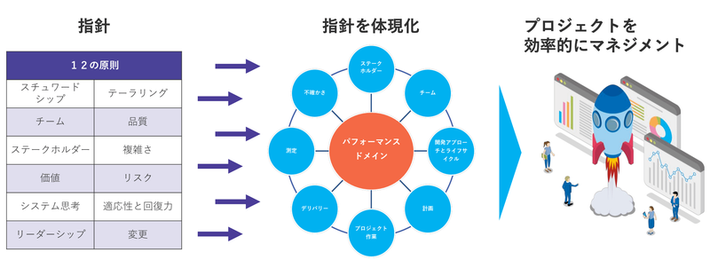

# PMBOK入門

## プロジェクトの基礎知識
### PMBOKにおけるプロジェクトとは
| <h4>独自のプロダクト、サービス、所産を想像するために実施する有期的な業務</h4> |
|:-:|

| **単語** | **意味** |
| -- | -- |
| 独自性 | これまでに誰も実施していない、または手順や方法、環境などに違いがあること。 |
| 有期性 | 明確な開始と終了があること。 |
| 所産 | あることの結果として生み出されたモノ。これには、経験や知見、感動など目には見えないものも含む。 |

<table>
    <tr>
        <td colspan="2" rowspan="2" ></td>
        <td colspan="2" style="text-align:center;">独自性</td>
    </tr>
    <tr>
        <td>あり</td>
        <td>なし</td>
    </tr>
    <tr>
        <td rowspan="2" style="text-align:center;">有期性</td>
        <td>あり</td>
        <td><b>プロジェクト</b></td>
        <td>季節業務</td>
    </tr>
    <tr>
        <td>なし</td>
        <td>発明・工夫</td>
        <td>定常業務</td>
    </tr>
</table>

#### 成果物の効果
| <h4>成果物は「ユーザ価値」と「事業価値」を提供し、両者の満足度を満たすモノである必要がある。</h4> |
| :-: |

#### プロジェクトにおける制約条件
制約条件には、品質・コスト・期間**など**があり、これらの重要度・優先度は（独自性により）プロジェクトで異なる。
　上記の制約条件を満たした上で、**プロジェクトの目的・目標を達成する必要**がある。
- **品質(Quality)**
  - 要求を満たしている度合い。①成果物の品質と②プロセスの品質に分けられる。
- **コスト(Cost)**
  - プロジェクトに費やすお金（費用）。投資対効果が見込める必要がある。
- **期間(Delivery)**
  - プロジェクトの期限。

### プロジェクトマネジメントとは

### プロジェクト要素の関連性

## プロジェクトマネジメントの心得
### 12の原則
| **名前** | **内容** |
| 価値 |  |
| 品質 |  |
| ステークホルダー |  |
| 変革 |  |
| チーム |  |
| リーダーシップ |  |
| 複雑さ(曖昧さ) |  |
| リスク |  |
| システム思考 |  |
| テーラーリング |  |
| スチュワードシップ |  |
| 適応力と回復力 |  |

### 原則間の関連性

## プロジェクトマネジメントの活動

