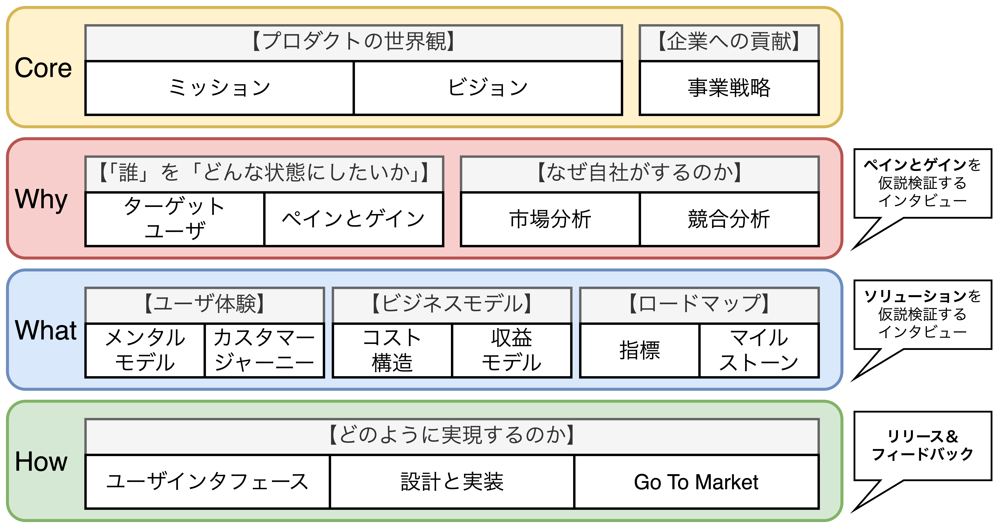

## プロダクトの4階層

- <b>プロダクトマネージャはCore・Why・What・Howの4階層全てに責任を持ち、意思決定に関わる。</b>

<table>
	<tbody>
		<tr>
			<th>各層</th>
			<th>概要</th>
			<th>協業先</th>
		</tr>
		<tr>
			<td>プロダクトの Core</td>
			<td>プロダクトの世界観となる ミッションやビジョン、事業戦略</td>
			<td><li>ステークホルダ</li></td>
		</tr>
		<tr>
			<td>プロダクトの Why</td>
			<td>誰のどんなペイン(障害、悩み)と ゲイン(期待する結果)を、 なぜ自社が満たすのかという理由</td>
			<td>
				<li>プロダクトマーケティングマネージャ(PMM)</li>
				<li>事業企画部</li>
				<li>UXリサーチャ</li>
			</td>
		</tr>
		<tr>
			<td>プロダクトの What</td>
			<td>プロダクトのWhyを実現する 狭義のプロダクトが示す解決策。 UXとビジネスモデルの2種類があり、 実現順序であるロードマップや 指標(KGI、NSM、KPI)も含む。</td>
			<td>
				<li>ユーザ体験はUXデザイナー</li>
				<li>ビジネスモデルは事業企画部</li>
			</td>
		</tr>
		<tr>
			<td>プロダクトの How</td>
			<td>Whatを実現するための実現方法 (狭義のプロダクト)</td>
			<td>
				<li>技術面はテックリードなどのエンジニア</li>
				<li>マーケット試作はPMM</li>
				<li>カスタマーサポートはサポート部隊</li>
			</td>
		</tr>
	</tbody>
</table>

### プロダクトのCore・Why・What・How

#### Core: ミッションとビジョン、事業戦略

- Coreはプロダクトの核であり、<b>①ミッション②ビジョン(世界観)③事業戦略</b>が挙げられる。<u>ユーザ価値と事業収益と同じくらい重要な項目である。</u>

#### Why:「誰」を「どんな状態にしたいか」、なぜ自社がするのか

- Whyでは、<b>ユーザ側の目的(「誰」を「どんな状態にしたいか」)とプロダクト側の目的(なぜ自社がするのか)</b>の2つの側面から、<u>プロダクトが対象とする全種類のユーザに価値を提供できていることを確認する必要がある。</u>
- **ユーザ側の目的を考える際**、【顧客】と【ユーザ】を区別する必要がある。
  - **【顧客】** 決裁権を持ち、支払い担当の対象者(親、社内システム担当者など)
  - **【ユーザ】** 聞き手(読み手)と話し手(書き手)、一般/管理者ユーザ、設計/実装/検証担当者、など
- **プロダクト側の目的を考える際**、<u>他者が真似できない価値の源泉</u>を理解し、自社の強みを活かしたプロダクトを開発する必要がある。
- **【ユーザ側の目的(Why)を検討する方法論】** MVP、バリュー・プロポジションキャンバス、プロダクトのペインとゲイン、ユーザインタビュー
- **【プロダクト側の目的(Why)を検討する方法論】** PEST分析、ファイブフォース分析、SWOT分析、クロスSWOT分析、STP分析

##### 「誰」を「どんな状態にしたいか」は世界観(ビジョン)から導かれる。

#### What:ユーザ体験、ビジネスモデル、ロードマップ

- Whatはプロダクトの解決策であり、<b>①ユーザ体験②ビジネスモデル</b>から構成され、<u>どの精度で、どの順番で達成していくのかを表す指標とロードマップも含まれる</u>。
- 課題やユーザ像の整合性を合わせるために、UXとビジネスモデルは前提条件を揃えて設計しなければならない。
- **【解決策(What)を検討する方法論】** ペルソナ、メンタルモデルダイアグラム、カスタマージャーニーマップ、ビジネスモデルキャンバス、ロードマップ、指標(KPI、North Star Metric)

#### How:UI、設計と実装、Go To Marketなど

- Howは具体的な実現方法であり、<b>プロダクトマネージャが主体的に手を動かすことはないフェーズ</b>である。
- **【具体的な実現方法(How)を検討する方法論】** ユーザストーリーとユーザストーリーマッピング,
- プライバシーポリシーと利用規約、障害に備える

### プロダクトの４階層の中における仮説検証

- プロダクトの機能をリリースした後、ユーザからのフィードバックを得ることで一連の仮説検証を実行可能になる。また、ユーザにインタビューすることでリリースする前に仮説検証をすることが可能になり、手戻りが少ないプロダクトマネジメントができるようになる。
- **1つ目のインタビュータイミング**は、プロダクトのWhyの検討が終わった後である。<u>ターゲットユーザが解決しようとしているペインとゲインを実際に抱いているのかを検証すると良い</u>。
- **2つ目のインタビュータイミング**は、プロダクトのWhatの検討が終わった後である。<u>提供する解決策がユーザのペインとゲインを解決するかをインタビューすると良い</u>。

### プロダクトの方針を可視化する

- プロダクトの検討結果を1枚にまとめ俯瞰して全体を指揮しながら検討できるフレームワークを用意しておく必要があり、「**決まったこと**」と「**決まっていないこと**」を可視化しておくと良い。

#### リーンキャンバス(新規事業のビジネスモデルを可視化する)

<table>
  <caption>リーンキャンバス</caption>
	<tbody>
		<tr>
			<td rowspan="2"><b>【Why】</b> 課題 (Problems)  既存の代替品 (Existing Alternatives)</td>
			<td><b>【What】</b> ソリューション (Solution)</td>
			<td colspan="2" rowspan="2"><b>【Core】</b> 独自の価値提案 (UVP: Unique Value  Proposition)  ハイレベル コンセプト (High Level  Concept)</td>
			<td><b>【What】</b> 圧倒的な優位性 (Unfair Advantage)</td>
			<td rowspan="2"><b>【Why】</b> カスタマー セグメント (Customer Segment)  アーリー アダプター (Early Adopters)</td>
		</tr>
		<tr>
			<td><b>【What】</b> 主要指標 (Key Metrics)</td>
			<td><b>【What】</b> チャネル (Channels)</td>
		</tr>
		<tr>
			<td colspan="3"><b>【What】</b> コスト構造(Cost Structure)</td>
			<td colspan="3"><b>【What】</b> 収益の流れ(Revenue Streams)</td>
		</tr>
	</tbody>
</table>

<table>
	<tbody>
		<tr>
			<th>項目</th>
			<th>内容</th>
		</tr>
		<tr>
			<td>課題</td>
			<td>「カスタマーセグメント」が抱えている課題について記載する。 「既存の代替品」には課題を現在解決している代替手段を記載する。</td>
		</tr>
		<tr>
			<td>ソリューション</td>
			<td>どんな機能でユーザの課題を解決するのかを記載する。 → 7.1参照</td>
		</tr>
		<tr>
			<td>主要指標</td>
			<td>「ソリューション」を提供する上で指標となるもの。 → 7.4.3参照</td>
		</tr>
		<tr>
			<td>独自の価値提案</td>
			<td>プロダクトが提案する価値が何であるのかを記載する。「ハイレベルコンセプト」 には独自の価値提案がユーザに伝わるコピーを記載する。</td>
		</tr>
		<tr>
			<td>圧倒的な優位性</td>
			<td>「ソリューション」が自社だから提供できる優位性を記載する。 → 6.2参照</td>
		</tr>
		<tr>
			<td>チャネル</td>
			<td>「カスタマーセグメント」にアクセスするための手段を記載する。 → 7.2.2参照</td>
		</tr>
		<tr>
			<td>カスタマー セグメント</td>
			<td>ターゲットユーザのセグメントを記載する。「アーリーアダプタ」には 「カスタマーセグメント」の中でも最速で利用開始する層を記載。 → 6.2.3参照</td>
		</tr>
		<tr>
			<td>コスト構造</td>
			<td>プロダクトを実現するために必要な初期投資やランニングコストを記載する。 → 19.1.5参照</td>
		</tr>
		<tr>
			<td>収益の流れ</td>
			<td>プロダクトを実現することによって得られる収益と支払いもとを記載する → 19.1.2参照</td>
		</tr>
	</tbody>
</table>

#### マイルストーン(詳細版は7.3.2)

- リーンキャンバスをまとめたらスケジュールとゴールも作成しておき、いつまでにどのような成果物を作成するのかのマイルストーンを用意しておくと議論を円滑にできる。
- ここで用意したマイルストーンは計画に過ぎず、<u>計画(マイルストーン)よりも必要な仮説検証を十分に実施することを優先した方が良い</u>。
