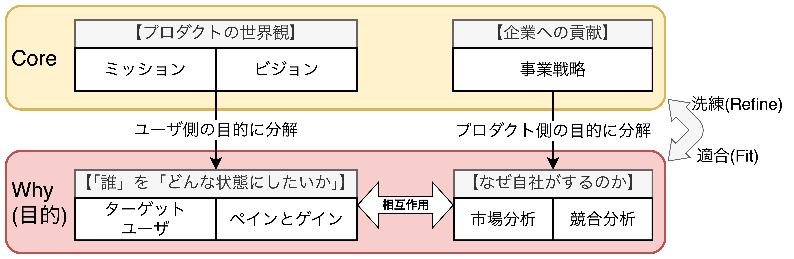
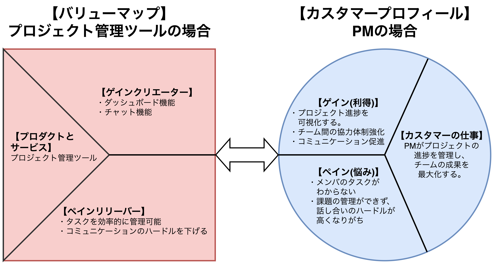
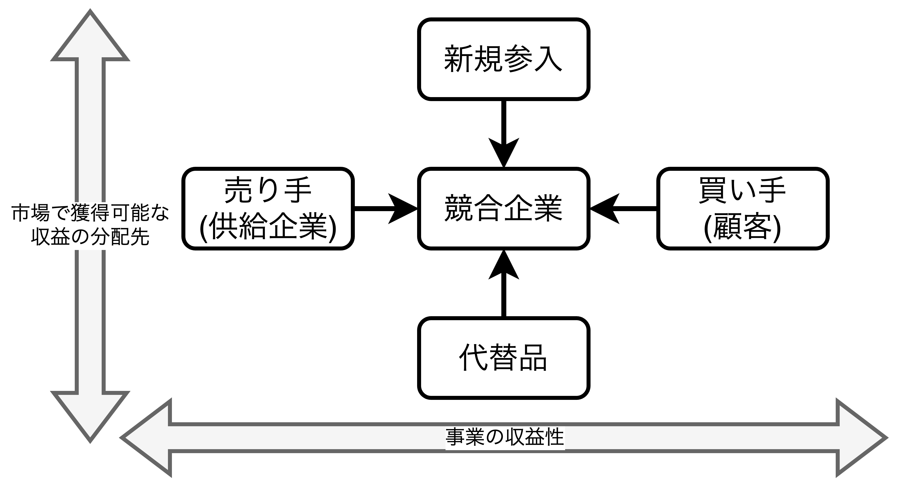
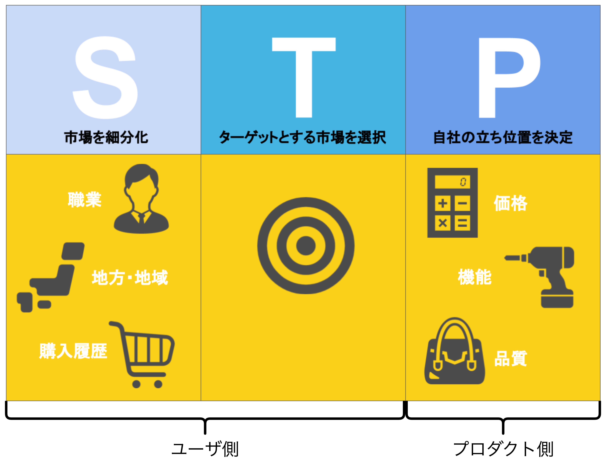
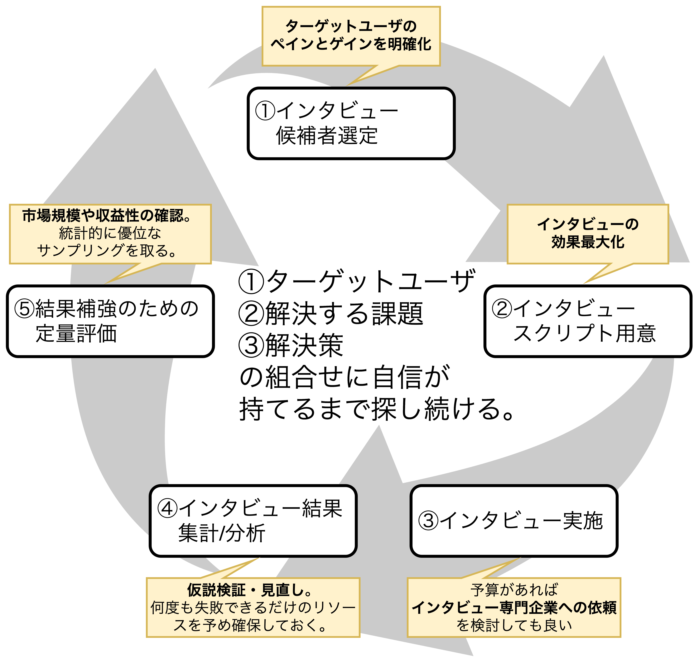
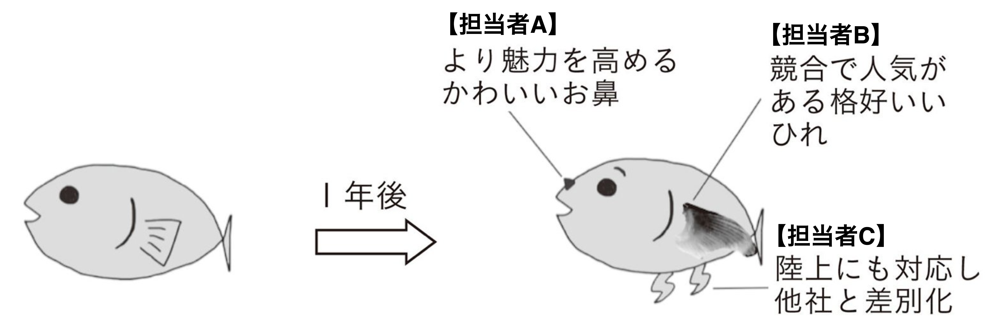

## プロダクトのWhy

- プロダクトのWhyはプロダクト実現の目的を検討する。成果物には以下の2つがある。
  - **【ユーザ側の目的】** 「誰」を「どんな状態にしたいか」(主にミッションとビジョンから分解される)。<u>どんなユーザ価値を提案するのかを明らかにする。</u>
  - **【プロダクト側の目的】** なぜ自社がするのか(主にミッションと事業戦略から分解される)。<u>ユーザの課題がなぜ他のプロダクトでは解決されていないのかを検討し、なぜ自社が解決すべきなのか、自社のどんな強みが他のプロダクトよりも課題をうまく解決できるのかを明らかにする。</u>

### ターゲットユーザと価値の組み合わせを選ぶ

- <b>①プロダクトのミッションとビジョンを満たす価値</b>をまず考え、<b>②その価値に共感するユーザ</b>を設定する。
- 【「誰」を「どんな状態にしたいか」】↔︎【ビジョン】を行き来しながら、ユーザと提供価値の組み合わせを選定する。

#### バリュー・プロポジションキャンバス

- ターゲットユーザと価値の組み合わせ候補を洗い出した後、「**バリュー・プロポジションキャンバス(VPC)**」を用いてさらに想像を膨らませる。
- VPCは「ユーザのニーズ」と「プロダクトの価値」の整合性を確認することができ、ユーザ像が複数ある場合はユーザ像ごとにキャンバスを書く。
- **VPCの目的**は①ユーザと提供価値のすり合わせ、②ユーザの理解を深める、③代替品の洗い出し、などがあり、思いつく限り書き出すことが望ましい。

### なぜ自社がするのか(外部/内部環境、ターゲットと提供価値)

#### 外部環境を分析する(PEST分析、ファイブフォース分析)

- 外部環境を分析する手法としてPEST分析とファイブフォース分析がある。
  - **【PEST分析】** 外部環境を①Politics(政治)、②Economy(経済)、③Society(社会)、④Technology(技術)の4つの視点で洗い出し、<u>市場全体で起きている要因を書き出し、環境の流れや懸念点を知ることができる</u>。
  - **【ファイブフォース分析】** 自社に影響を及ぼす5つの力①買い手、②売り手、③新規参入者、④代替品、⑤競合企業をもとに業界の構造を把握する。<u>買い手・売り手から収益性を分析し、新規参入・代替品から市場で獲得可能な収益の分配先を分析する</u>。

<table>
  <caption><b>PEST分析</caption>
	<tbody>
		<tr>
			<td><b>Politics</b> 政治に関する変化 例)減税、安全保障強化、 規制緩和、国家IT戦略推進</td>
			<td><b>Economy</b> 経済に関する変化 例)経済成長、物価の高騰、ボラティリティの高い為替や株式相場</td>
		</tr>
		<tr>
			<td><b>Society</b> 社会に関する変化 例)少子高齢化、晩婚化や女性の社会進出、新型コロナウイルスによる外出自粛、テレワーク推進など</td>
			<td><b>Technology</b> 技術に関する変化 例)AIやRPAによる自動化、 5Gへの移行、特許、技術革新など</td>
		</tr>
	</tbody>
</table>

#### 自社の強みと弱み(内部環境)を分析する(SWOT分析→クロスSWOT分析)

- 自社の強みと弱みを可視化するフレームワークにSWOT分析やクロスSWOT分析がある。
  - **【SWOT分析】** 自社の強み・弱みを洗い出す手法。
  - **【クロスSWOT分析】** 自社の強みをさらに活かし、弱みを克服する戦略を検討する手法。
- SWOT分析で自社の強み・弱みを洗い出した後、クロスSWOT分析を行うことで強みをさらに活かしながら、弱みを克服する戦略を検討する。

<table>
  <caption><b>SWOT分析(自社の強み・弱みを洗い出す)</caption>
	<tbody>
		<tr>
			<th></th>
			<th>ポジティブ(Positive)</th>
			<th>ネガティブ(Negative)</th>
		</tr>
		<tr>
			<th>内部環境</th>
			<td>Strength 自社の活かすべき強み</td>
			<td>Weakness 自社が克服すべき弱み</td>
		</tr>
		<tr>
			<th>外部環境 (PEST分析の結果を 抜き出しても良い)</th>
			<td>Opportunity 外部環境の変化で活かせる機会</td>
			<td>Threat 外部環境の変化で回避が必要な脅威</td>
		</tr>
	</tbody>
</table>

<table>
  <caption><b>クロスSWOT分析(強みをさらに活かしながら、弱みを克服する戦略を検討)</caption>
	<tbody>
		<tr>
			<th></th>
			<th>Strength(強み)</th>
			<th>Weakness(弱み)</th>
		</tr>
		<tr>
			<th>Opportunity(機会)</th>
			<td>強み×機会 ビジネスチャンスに強みを活かす</td>
			<td>弱み×機会 機会を生かして弱みを克服する</td>
		</tr>
		<tr>
			<th>Threat(脅威)</th>
			<td>強み×脅威 強みを使って脅威を回避する</td>
			<td>弱み×脅威 脅威であっても弱みの影響を最小化する</td>
		</tr>
	</tbody>
</table>

#### ターゲットと価値の方針を定める(マーケットイン/プロダクトアウト、STP分析)

##### ターゲットユーザが求める価値と自社が提供できる価値

- ターゲットユーザが求める価値と自社が提供できる価値を考える時、<b>マーケットイン</b>と<b>プロダクトアウト</b>の2つがある。
  - **【マーケットイン】** ユーザを主語として、解消されていないユーザの課題を競合とは別の方法で解決するアプローチ。
  - **【プロダクトアウト】** プロダクトの開発側を主語として、自社の強みやアイデアを先に作るアプローチ。
- <u>マーケットインとプロダクトアウトは両極端に見るのではなく、両視点でバランスよく検討する必要がある。</u>

##### 競合と代替品

- **バリュープロポジションキャンバス**や**SWOT分析**から導いた自社の提供価値をもとにプロダクトが目指すべき方向性を定めた後、<u>比較のために競合製品や代替品の深い理解が求められる</u>。例えばタクシーの場合、「終電を逃してしまった帰宅時」であれば**タクシーの代替品はカプセルホテル**になる。
  - **【競合製品】** 同じ市場で提供されているプロダクト
  - **【代替品】** 異なる市場で同じ価値を提供しているプロダクト
- 競合分析の目的は`Who-What-How`の3つを知ることであり、競合のターゲットユーザと自社のターゲットユーザの共通点や違いを判断する。<u>競合と同じ課題を持っていたとしても競合と同じ手法で解決するのではなく、**自社の強みを活かしてユーザの課題をどのように解決するのかを考えるべき**</u>である。
- 競合分析から`Who-What-How`の3つを知っても、競合がなぜその解決策を選定したのかわからない場合、自社が気づいていない競合の戦略(ねらい)が隠れている可能性がある。
- <u>競合の目線でリーンキャンバスを記載</u>すると、競合の戦略や**PMF(Product Market Fit)** の狙いが見えてくることもある。

##### セグメンテーション、ターゲッティング、ポジショニング(STP分析)

- **【セグメンテーション】** プロダクトが戦う市場を①ライフサイクルや②ニーズ、③属性情報などで細分化し、どのユーザ層に商品を届けるのかを定義する。セグメントの評価には<u>6Rというフレームワーク</u>を用いることもある。
- **【ターゲッティング】** プロダクトの根幹であり、セグメンテーションで定義した市場のどの部分を狙うかを決めること。
- **【ポジショニング】** ターゲッティングで決めたユーザに対して、プロダクトの訴求ポイントを決める。一般的にプロダクトのWhy(「誰」を「どんな状態にしたいか」)が明確になっていれば、任意の2軸を取り、4象限で競合との差別化・位置関係を表現できるはずである。

<table>
	<caption><b>【フレームワーク】6R</caption>
	<tbody>
		<tr>
			<th>項目</th>
			<th>概要</th>
		</tr>
		<tr>
			<td>Rank(優先度)</td>
			<td>セグメントに影響力の強さでランクをつけて優先度をつける</td>
		</tr>
		<tr>
			<td>Realistic(有効規模)</td>
			<td>マネタイズできる十分な規模であるか</td>
		</tr>
		<tr>
			<td>Reach(到達可能性)</td>
			<td>到達できるセグメントであるか</td>
		</tr>
		<tr>
			<td>Response(測定可能性)</td>
			<td>効果測定をできるセグメントであるか</td>
		</tr>
		<tr>
			<td>Rate(成長性)</td>
			<td>今後成長していく市場であるか</td>
		</tr>
		<tr>
			<td>Rival(競合)</td>
			<td>参入する余白がある市場であるか</td>
		</tr>
	</tbody>
</table>

### ペイン(利得)とゲイン(悩み)の仮説検証

- プロダクトを作る時は少なくとも2回のユーザインタビューが必要である。
  - **【1回目のインタビュー: Whyの仮説検証】** ①想定したペインとゲインを持ったユーザが本当に存在するのか、②ペインとゲインの抜け漏れがないか、確認する。
  - **【2回目のインタビュー: Whatの仮説検証】** 開発するプロダクトがユーザのペインとゲインを解決し、価値提供できるのかを確認する。

#### ペインとゲインを仮説検証する〜ユーザインタビュー〜

- ユーザインタビューは以下のステップで行う
  1. **【インタビュー候補者を集める】** **解決すべきペインとゲインを明確化した上でインタビューの候補者を選定する**。STP分析で定義したセグメンテーションを詳細化し、セグメントの属性情報から仮説を立てる。<u>候補者の人数は課題の大きさやセグメントの広さに依存するため、プロダクトマネージャが納得のいくまで、インタビューを繰り返すことが望ましい。</u>
  2. **【インタビュースクリプトを用意する】** 効果を最大化するためにあらかじめ台本となるスクリプトを用意しておく。
     - **【インタビュー前】** ①秘密保持の書面サインや②緊張をほぐすためのアイスブレイク、③インタビューの目的の説明などがあっても良い。
     - **【スクリプトの中身】** ①事前説明事項、②インタビュー内容と聞く順番、③質疑応答の時間、④インタビュー後のアナウンスなど。
     - **【インタビュー後】** ①属性情報を聴取するためのアンケートなどがあっても良い。
  3. **【インタビューを実施する】** 対面やビデオ会議、テキストなど様々なやり方があり、謝礼がある形式とない形式がある(謝礼があったほうがユーザも真剣に答えてくれる)。**インタビューを自説への有利な情報収集にしないためにも予算があれば専門企業に依頼しても良い**。インタビュー中、<u>予想外のペインとゲインや代替品に気づくことも少なくないため、インタビュー時間のバッファは持っておくほうが良い。</u>
  4. **【インタビュー結果を集計/分析する】** <b>KJ法や親和図法などを用いて結果をグルーピングし、関係性や因果関係を図式化した後、仮説検証を行う。</b>この時、<u>①ホワイトボードに付箋を貼ったり、Google Jamboardやmiroなどのツールを用いてオンライン上で結果を共有しながら議論する</u>。インタビュー実施から時間を空けずに結果をまとめるとよい。
  5. **【インタビュー結果を補強する定量調査】** ユーザの仮説が広く市場に存在するのか、ユーザ特有の属性ではないのかを確認するために、多人数に向けた定量調査を実施する。**仮説が受け入れられる市場が存在することと、収益化できるだけの規模があることを確認する**。ただし、<u>定量調査である以上、統計的に優位なサンプルイング数を取る必要がある。</u>
- チームが同じ方向を向きながら議論を活発化させるためにも、ユーザインタビューはプロダクトチーム全員が参加すべきであり、インタビュー中の録画を視聴することが望ましい。
- <u>往々にして1度目のユーザインタビューで当初の仮説が間違っていたことがわかることも少なくない</u>。ユーザの仮説が間違っていた場合、CoreとWhyを見直し、アイデアをブラッシュアップしていく。
  - **【Core】** ビジョンや事業戦略を見直す。
  - **【Why】** ユーザの目的(ターゲットユーザ、ペインとゲイン)やプロダクトの目的(自社の提供価値、ポジショニング)を見直す。
- **仮説検証の結果、ターゲットセグメントと異なる人物だと判断した場合には意見を採択しないことも必要**であり、仮説を常に検証しながらプロダクトを構築する姿勢は崩してはならない。

<table>
	<caption><b>インタビューにおける悪い質問と良い質問</caption>
	<tbody>
		<tr>
			<th>悪い質問例</th>
			<th>良い質問例</th>
		</tr>
		<tr>
			<td>
				◼︎あなたはもっと運動したいですか？ →Yes/Noで答えるクローズドな質問ではなく 　5W1Hで質問する。 →「もっと」は抽象的なので、 　具体的に質問する。
			</td>
			<td>
				◼︎普段どれくらい運動しますか？ 
				◼︎理想的にはどれくらい運動したいですか？ 
				◼︎どんな問題によって理想の頻度で 　運動できないのでしょう？
			</td>
		</tr>
		<tr>
			<td>
				◼︎転職時に重視する項目は何ですか？ →答えづらい質問は 　答えやすくする仕組みを用意する。
			</td>
			<td>◼︎普段使っている転職サイトの 　検索条件を見せていただけますか？ ◼︎これらの転職時によく使われている項目を 　あなたが重視する順に並べてください。 ◼︎使いやすい転職サイトはどれですか？ 　どんなところが良かったですか？</td>
		</tr>
		<tr>
			<td>
				◼︎競合の地図アプリの使いやすいところは 　どこですか？ →漠然と質問せずに、プロダクトを 　利用する背景から理解する。
			</td>
			<td>◼︎直近で使ったのはどんな時でしたか？ 　その時のエピソードを教えてください。 ◼︎その時、どのように感じましたか？ ◼︎この地図アプリがないとどんな時に困りますか？</td>
		</tr>
	</tbody>
</table>

### プロダクトのCoreとのFit & Refine

- <b>【Fit & Refine】</b> プロダクトのWhy(目的)で定めた方針(Fit)をもとに、プロダクトのCoreをブラッシュアップ(Refine)していく。**プロダクト開発はCoreを定め、Whyのユーザの深い理解を持つことが重要であり、WhatはCoreとWhyを実現するための「手段」でしかないことを思い出すことが肝要。**
- 以下の3つを定めた後、ユーザインタビューを実施し、プロダクトのWhyをまとめ、リーンキャンバスを埋めていく。
  - **【定めること1】** ターゲットユーザと自社の提供価値(バリュープロポジションキャンバス、STP分析)
  - **【定めること2】** 外部環境(PEST分析、ファイブフォース分析)
  - **【定めること3】** 内部環境(SWOT分析、クロスSWOT分析)

<table>
  <caption><b>ここまでで記載可能なリーンキャンバス</caption>
	<tbody>
		<tr>
			<td rowspan="2"><b>【記載可能】</b> 課題 (Problems)  既存の代替品 (Existing Alternatives)</td>
			<td>ソリューション (Solution)</td>
			<td colspan="2" rowspan="2"><b>【記載可能】</b> 独自の価値提案 (UVP: Unique Value  Proposition)  ハイレベル コンセプト (High Level  Concept)</td>
			<td><b>【記載可能】</b> 圧倒的な優位性 (Unfair Advantage)</td>
			<td rowspan="2"><b>【記載可能】</b> カスタマー セグメント (Customer Segment)  アーリー アダプター (Early Adopters)</td>
		</tr>
		<tr>
			<td>主要指標 (Key Metrics)</td>
			<td>チャネル (Channels)</td>
		</tr>
		<tr>
			<td colspan="3">コスト構造 (Cost Structure)</td>
			<td colspan="3">収益の流れ (Revenue Streams)</td>
		</tr>
	</tbody>
</table>

#### 【アンチパターン】Coreのないプロダクト

- <u>Coreのないプロダクトは「誰」を「どんな状態にしたいか」を曖昧にする</u>ため、プロダクトチーム全体への啓蒙のためにもCore(ミッション・ビジョン・事業戦略)は必要である。Coreがなく、WhyとWhatだけでプロダクトを開発すると、「**ユーザの深い理解(Why)とユーザの欲しいもの(What)を把握しているが、チグハグな機能を持ったプロダクト**」になってしまう。
- 例えば、Coreがない【プロダクト1】の機能改修を考える。担当者A〜Cの3人がユーザの声を聞き、それぞれ異なる解釈で以下の機能改修をしたとする。これでは、<u>プロダクトの価値が揺らいでしまい、ターゲットユーザがおざなりになり、プロダクトの提供価値の軸が曖昧になる。</u>
  - **【担当者A】** プロダクトをキャラクタだと捉えている。
  - **【担当者B】** プロダクトを魚だと捉えている。
  - **【担当者C】** 移動することがプロダクトの価値だと捉えている。
- 以上のことから、<b>プロダクト開発においては全体最適の視野を持って、ビジョン・ユーザ・プロダクトそれぞれを主語にした視点をもち、それぞれを相互作用させながらイテレーティブに全体(ビジョン・ユーザ・プロダクト)の解像度を上げていく必要がある。</b>

