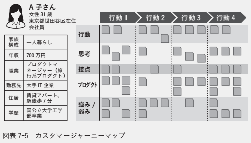

## プロダクトのWhat

- プロダクトのWhatでは、①ユーザ体験②ビジネスモデル③ロードマップを作成し、「**プロダクトのWhyを解決する最も有効な方法を模索し、どのような優先度で取り組みのか**」を検討する。

### 何を作るのか 〜ユーザ体験〜

- ユーザ体験とは$UX(User\hspace{1mm}Experience)$とも呼ばれ、ユーザが体験したもの全てを指し、以下の例が挙げられる。
  - 「プロダクトを認知してから目的を達成するまで」の一連のプロダクトの使い勝手
  - プロダクトを使った感触や、想起される感情
- UXと別にUIというワードもあるが、$UI\subset UX$であり、プロダクトマネージャはUIとUXのどちらの議論をしているのか理解しておく必要がある。**プロダクトマネージャは主にUIよりUXの実現に向けて協議を重ね、検討する必要がある。**
- 「ユーザが求めているゴール」と「ユーザのメンタルモデル」が理解できれば、「なぜ」ユーザは特定の行動を取るのかがわかり、これはユーザが「どんな」行動を取るのかよりもはるかに重要なことである。

#### ユーザを理解する(ターゲットセグメントとペルソナ)

<table>
  <tr>
    <th>セグメントとペルソナの関係性</th>
    <th>ペルソナ</th>
  </tr>
  <tr>
    <td></td>
    <td></td>
  </tr>
</table>

- プロダクトを提供する際、誰の目線で価値やUXを考えるかが重要になる。例えば、ITに詳しいプロダクトマネージャ自身の視点だけで検討すると、その他多くの一般的なユーザの視点は軽視されてしまい、使いづらいものになる可能性が高い。
- そこで、ターゲットセグメントの中からペルソナを決め、仮想的な特定の1ユーザを設定することで、プロダクトチーム全員が目線を揃えて、かつ、より具体的に想像して検証できるようになる。目的はより良いUXの検証であるため、<u>ペルソナはある程度情報の的を絞って議論することに注意が必要である。</u>
- ペルソナを決める際、<u>①名前②顔写真③年齢④家族構成⑤性別⑥職業など人物像が具体的になるレベルで情報を列挙する</u>、つまり、**ペルソナはその人物が朝起きてから夜寝るまでの行動の中でどのようにプロダクトを使うのか、どこでどんな価値を感じるのか、といったことをイメージさせる程度の情報量が必要である。**
- ペルソナはプロダクトの想定ユーザの数だけ用意し、スキルレベルを考慮する必要がある。
  - **【想定ユーザ】** 出品者と購入者、部署ごとの社員(営業、開発、経営管理など)、顧客と営業、など
  - **【スキルレベル】** 習得時間、情報リテラシー、プロダクトに関するタスク習熟度、など
- ペルソナをもとにペインとゲインを洗い出し、より良いUXを考えた後、ペルソナを含むターゲットセグメントにも当てはまるか検証する。つまり、**ペルソナ(主観)だけでなくターゲットセグメント全体(客観)の視点も俯瞰しておく必要がある**。

#### ユーザのゴールを知る

- プロダクトはユーザが求めるゴールを達成するまでの一連の体験を提供する。そのため、<b>プロダクトマネージャはタスク完了までのユーザのモチベーションを理解することが重要である。</b>
- UXの文脈において、ユーザのゴールは3つのレベルで理解することが推奨されている。
  1. **【レベル1: 達成するもの(End Goal)】** ユーザはプロダクトを使って何を成し遂げたいのか？
       - **【例】** うる、買う、送る、リマインドする、読むなど
  2. **【レベル2: 感じるもの(Experience Goal)】** ユーザがプロダクトを使う際に大切にしている感情やモチベーションはどのようなものか？
       - **【例】** 遠く離れた恋人とより深く繋がっていたいのでメールよりもビデオチャットを使いたい。この場合ユーザが大切にしているものは「つながり」になる。
  3. **【レベル3: 人生に彩りを与えるもの(Life Goal)】** ユーザの人生における究極のゴールは？そこにプロダクトがどのように影響を与えるのか？
       - **【例】** 誰が今どのような進捗にあるのか、随時アラートやアップデートが欲しい。この場合、ユーザのLife Goalはチームメンバが何かに躓いている時にいち早くそれを知って助けたい、そうしてチームで大きな成果を上げたい、ということになる。

#### ユーザの行動や期待値を知る〜メンタルモデルダイアグラム〜

- 一般に、<u>プロダクトや体験に対する暗黙の前提を「メンタルモデル」</u>といい、<b>UXの文脈におけるメンタルモデルとは、ユーザがプロダクトに対して起きて欲しい挙動(期待している挙動)を指す</b>。
- プロダクトの機能を考える時、<u>ペルソナの行動をもとに必要な機能(不足している機能)を洗い出す「**メンタルモデルダイアグラム**」が非常に有用である</u>。

#### カスタマージャーニーを設計する

- プロダクト利用時のユーザ体験をカスタマージャーニーと呼び、それを時系列でまとめたものを「**カスタマージャーニーマップ**」とよぶ。カスタマージャーニーマップの特徴は以下の通り。
  - **【特徴1】** 時系列ごとにバリュープロポジションキャンバス(VPC)を書いていることと同じであり、ペルソナごとに作成する。
  - **【特徴2】** 決まった形式はなく、チーム間でテンプレートを作り上げる。
  - **【特徴3】** ①ユーザ側の項目(行動・思考)と②プロダクト側の項目(プロダクト・強み/弱み)、そして③ユーザとプロダクトの接点にそれぞれ大別できる。
- カスタマージャーニーマップはユーザとプロダクトのコミュニケーションインタフェースを検討することができ、行動の移り変わりとユーザの課題の理解につながる。**①個人単位での新たなユーザの課題の発見**だけでなく、**②プロダクトチーム間でのユーザ理解の差の顕在化**も期待できる。
- カスタマージャーニーマップはユーザの意思決定の理由を知るのに有用であり、**①他社ではなく自社プロダクトを継続利用する理由**や**②自社プロダクトの離脱理由**などの分析に利用できる。

#### ワイヤーフレームを描く

- カスタマージャーニーマップ作成後、ワイヤーフレームを利用する。ワイヤーフレームはプロダクトマネージャがデザイナーに意図を伝えるための1ツールであり、他のプロダクト画面のスクリーンショットを貼り付け、一部を代替してしまうこともある。

### 何を作るのか 〜ビジネスモデル〜

- **UXと同時に考えなければならないこととしてビジネスモデルがある**。ビジネスモデルにはプロダクトの価値をきちんとユーザに届けるために適切なプロセスやステップが示されている。

#### ビジネスモデルキャンバスとは

- ビジネスモデルキャンバスとは、<b>①企業が行うビジネス活動の現状や課題を表現したり、②新たにビジネスモデルをデザインしたり、③事業のピボット(方向転換や路線変更を意味する)を構想したりする</b>ために使われるツールである。
- ビジネスモデルキャンバスは「**どれくらいのコストでどれくらいの価値が創出され収益を上げているか**」を視覚的に理解できる特徴を持ち、<u>ユーザ中心に設計していく</u>。
- ビジネスモデルキャンバスはユーザ中心設計のため、$CS(カスタマーセグメント)\rightarrow VP\rightarrow CH\rightarrow CR\rightarrow RS\rightarrow KR\rightarrow KA\rightarrow KP\rightarrow CS(コスト構造)$の順で書くことが推奨される。この順で書く理由は<u>ビジネスはユーザ(CS)に価値提供することで成り立ち、コスト(CS)やリソース(KR)は価値を実現するための手段にすぎないということに由来している</u>。
- 実際、CS(カスタマーセグメント)から設計することで、ターゲットユーザから考えることができ、ユーザが曖昧であればプロダクトの価値を十分に発揮できないため、気づきを与えるきっかけにもなる。

##### ビジネスモデルキャンバスのチェックリスト(プロダクトのWhyと一緒に見直す)

- [ ] 我々はどのようなユーザの問題を解決しようとしているのか？
- [ ] なぜユーザはその問題を解決してほしいと考えるのか？そのモチベーションは？
- [ ] 我々の提供価値を最も理解してくれるユーザとは？どこにいるのか？
- [ ] ユーザは別のビジネスで満足しているとしたら、その特徴は何か？
- [ ] 対象とするユーザセグメントにどのように提供価値を伝えているか？
- [ ] このビジネスモデルはどのくらい確だしそうか？（単位あたりのリソース投入に対して自律的にビジネスが拡大しそうか？）
- [ ] 競合プロダクトへのスイッチングコストを考えた時、顧客の離脱を防ぐための顧客との関係性やチャネル、および提供価値とその価格はどうあるべきか？
- [ ] 継続的な収益を上げられているか？
- [ ] コストをかける前に収益を上げられているか？
- [ ] 自社でやることに価値がある部分に適切なコストがかけられているか？
- [ ] ビジネスモデル自体が競合からの参入に対してどのくらい強固か？

<table>
  <caption>ビジネスモデルキャンバス</caption>
	<tbody>
		<tr>
			<th colspan="6">ビジネス要素　←　　　　　　　　　　　　　　　　　　　　　　→　ユーザ要素</th>
		</tr>
		<tr>
			<td rowspan="2">KP キーパートナー</td>
			<td>KA 主な活動</td>
			<td colspan="2" rowspan="2">VP 価値提案</td>
			<td>CR カスタマーとの関係</td>
			<td rowspan="2">CS カスタマー セグメント</td>
		</tr>
		<tr>
			<td>KR 主なリソース</td>
			<td>CH チャネル</td>
		</tr>
		<tr>
			<td colspan="3">CS コスト構造</td>
			<td colspan="3">RS 収益の流れ</td>
		</tr>
	</tbody>
</table>

<table>
  <caption>ビジネスモデルキャンバスの各項目の説明</caption>
	<tbody>
		<tr>
			<th>項目</th>
			<th>内容</th>
		</tr>
		<tr>
			<td>KP キーパートナー</td>
			<td>なくてはならない事業パートナー（逆にこのパートナーなしには 価値を生み出せない。サプライヤーは含まない）</td>
		</tr>
		<tr>
			<td>KA 主な活動</td>
			<td>このビジネスモデルを回していくために、 毎日どのようなことがされているか？</td>
		</tr>
		<tr>
			<td>KR 主なリソース</td>
			<td>人・金・情報・特許など、価値を生み出す際に使われるもの</td>
		</tr>
		<tr>
			<td>VP 価値提案</td>
			<td>ユーザのためにプロダクトがすることは何か？</td>
		</tr>
		<tr>
			<td>CR カスタマーとの関係</td>
			<td>企業とユーザの関係性はどこでどのように現れるか？ そしてどのように維持されているのか？</td>
		</tr>
		<tr>
			<td>CH チャネル</td>
			<td>ユーザに価値を伝えるためにどのようなコミュニケーション手段を 使っているか？また価値をどのように伝えているか？</td>
		</tr>
		<tr>
			<td>CS カスタマーセグメント</td>
			<td>最も収益を上げているユーザセグメントは？</td>
		</tr>
		<tr>
			<td>CS コスト構造</td>
			<td>KA、KRの中で最もコストが大きい固定費や変動費、初期投資は？ 規模の経済性、ビジネス多角化による経済性がきくか？ →19.1.2参照</td>
		</tr>
		<tr>
			<td>RS 収益の流れ</td>
			<td>収益を上げているビジネスモデルは何か？（フリーミアム、フリートライアルの場合も記載） → 19.1.3参照</td>
		</tr>
	</tbody>
</table>

#### ソリューションを仮説検証するユーザインタビュー

- <b>UXとビジネスモデルの妥当性評価のためにインタビューを行い、仮説検証する</b>。UX構築時点でもインタビューをできるが、プロダクトの提供価値や価格設定の評価のためにも、<u>UXとビジネスモデルの両方が構築できた後にインタビューを実施することが望ましい。</u>
- ユーザインタビューの手順としては以下の通り。
  1. **【前提】** この段階では、<u>①解決しようとしているペインとゲインを持っているユーザの市場規模が十分であること</u>、かつ、<u>②ビジネスモデルが実現可能であること</u>を満たしているものとする。
  2. **【ユーザインタビューの候補者の選定】** セグメントごとに5名程度のインタビューするユーザを用意する。【※1】によるとユーザビリティに関するユーザインタビューは5人程度に行えば必要なインサイトの80%以上が得られるという結果がある。
     - **【※1】** https://www.nngroup.com/articles/why-you-only-need-to-test-with-5-users/
  3. **【ユーザインタビューの設計】** ここでは、実際のプロダクトが提供するUXやビジネスモデルについて深く意見を聞くことになるため、プロトタイプを用意しても良い。ユーザの深い理解のために以下のような質問を投げ、**①提供するソリューションの代替案**、**②プロダクトの適正価格の設定**などを行い、WhyとWhatの仮説検証・評価を行う。
     - **【質問例1】** このプロダクトをどんな時に利用すると思いますか？
     - **【質問例2】** このプロダクト/機能がない場合はどのようにしていますか？
     - **【質問例3】** インタビューを通して「一番印象に残っている機能」は何ですか？
     - **【質問例4】** 機能リストの中で1つ機能を外すならどれですか？
     - **【質問例5】** 普段どの外部サービス(SNS、決済、チャットツールなど)と連携しますか？

### どのような優先度で取り組むか 〜ロードマップ〜

#### ロードマップを策定する

- <b>ロードマップはプロダクト開発の全関係者とのコミュニケーションツールであり、現在地と短期〜長期の見通しを示す</b>。Core(ミッション・ビジョン・事業戦略)からプロダクトのWhyとWhatがしっかりと定まっていれば、ステークホルダー間で納得のいくロードマップを作り上げることができる。
- ロードマップは以下の特徴を持つ。
  1. **【最も重要】** 関係者間の認識統一(コミュニケーションの円滑化)
  2. 目標の明確化
  3. 中長期的な戦略の視覚化(進捗管理、リソース最適化)
- 一度に全てを開始/終了するのではなく、段階的に開始/終了していくことを「**フェージング**」といい、MVPはフェージングの一つである。<u>ロードマップを用いて、プロダクトの機能を段階的に実施し、戦略変更や機能拡充の意思決定を行いながら、プロダクトを成長させていく</u>。

#### プロジェクトのマイルストーンを可視化する

- プロジェクトマネージャはマイルストーンで定めた期日、リソース、品質を満たしながらプロジェクトを進行する責務を持つ。そのため、<u>プロジェクトにかける時間・人・金の承認や進行はプロジェクトマネージャに任せることが望ましい</u>。
- マイルストーンは **「誰」が「何(どのタスク)」を「いつまで」に達成/実行するのか**を明確にしておくことが望ましい。
  - **誰が** <u>担当者</u>を明確化し、責任を持たせる。
  - **何を** <u>成果物</u>を明確化し、タスクのゴールを提示する。成果物の評価指標があるとなお良い。
  - **いつまでに** <u>締め切り</u>を明確化し、先延ばしを防ぐ。
- 基本的には**プロダクト内の全てのプロジェクトは同じフローで進むことが望ましく**、特例的に追加フェーズがあったり、スキップされるフェーズが発生する場合であっても、関係者全員がプロジェクトのおおよその流れに対して共通認識を持った状態でコミュニケーションをとることが大切である。
- プロジェクトのマイルストーン(マスタスケジュール)を作成後、オープンな場に公開することで以下の効果が期待できる。
  - **【効果1】** 関係者間の認識を揃え、士気を上げられる。
  - **【効果2】** 他のメンバを巻き込むきっかけになる。
  - **【効果3】** プロジェクトマネージャの良いプレッシャになる。

#### 評価指標を立てる

##### プロダクトとKPI

- プロダクトの成否を判断するための指標として<b>KPI(Key Performance Indicator)</b>があり、<b>SMARTルール</b>を用いてKPIであるかどうかのチェックを行う。
  - **Specific** 具体的に表現されている
  - **Measurable** 数値計測可能である
  - **Agreeable(Achievable)** ステークホルダ間で同意可能である(達成可能である)
  - **Relevant** 目標に関連している
  - **Time-bound** 期限が決められている
- <u>KPIは遅行指標(Lagging Indicator)と先行指標(Leading Indicator)の2種類</u>があり、KPIの分解の仕方によってどちらにもなり得る。

<table>
	<tbody>
		<tr>
			<th>KPI</th>
			<th>KPIではないもの</th>
		</tr>
		<tr>
			<td>数字 (5%、10億円、200万人、500時間など)</td>
			<td>言葉 (最高品、即日配送、地域No.1など)</td>
		</tr>
		<tr>
			<td>比較可能 (前年比、地域別、プロダクト別、年代別)</td>
			<td>脈絡のない思いつきの単独の値 (100、500個、3000人)</td>
		</tr>
		<tr>
			<td>時系列データ (過去3年、直近18ヶ月)</td>
			<td>ランダムデータ (非連続データ)</td>
		</tr>
		<tr>
			<td>自社で取得可能 (ソースが自社データ)</td>
			<td>外部ソース依存 (マーケティングリサーチ、メディア)</td>
		</tr>
		<tr>
			<td>社内共通の理解があり、行動可能 (何のためのデータか)</td>
			<td>自己満足で終わっている (大きい数字で見栄えをよく)</td>
		</tr>
	</tbody>
</table>

##### 一般的なKGI/KPIの考え方の問題点

- KPIに対して<b>KGI(Key Goal Indicator: 重要目標達成指標)</b>があり、「売上50億円」といった収益目標や成長目標で表されることが多い。ただし、KGIは企業が実現したい目標であるが、**プロダクトの価値をユーザに継続的に届いていることを示す指標ではない**。

##### 【先行指標】 NSM(North Star Metric)

- NSMは「<b>プロダクトのコアとなる価値がユーザに届いているかを知る、単一の指標</b>」であり、事業が長期的に成長しているかどうかを図る、経営・プロダクト両面で重要な指標である。
- <u>**経営面**で言えば、このままプロダクトに投資し続けるべきかどうかの根拠</u>として利用でき、<u>**プロダクト面**で言えば、どの方向にプロダクトを進化させれば良いかのヒント</u>になる。
- 良いNSMのポイントは5つある。
  1. NSMの改善が<u>ユーザ体験(UX)の向上とリンク</u>している。
  2. ユーザがプロダクトに<u>どのくらい定着しているか</u>を示す。
  3. $x$軸に時間、$y$軸に収益や成長目標といった<u>グラフで表現でき、右上方向に進む</u>。
  4. 「<u>収益に結びつくための</u>先行指標」である。
  5. <u>組織内で理解してもらいやすい</u>。
- 例えばZoomの場合、2021年の会計年度ではKGIとして「売上高1800億円」を掲げており、NSMとして「Zoomで主催された1週間あたりのミーティング数」を置いている。

<table> 
  <caption><b>【例】ZoomのNSM</caption>
	<tbody>
		<tr>
			<th>良いNSMのポイント</th>
			<th>ZoomのNSM</th>
		</tr>
		<tr>
			<td>NSMの改善がユーザ体験の向上と リンクしている</td>
			<td>音声画像が高品質なビデオ会議を どこよりも簡単に実施できる。</td>
		</tr>
		<tr>
			<td>ユーザがプロダクトに どのくらい定着しているかを示す</td>
			<td>1週間あたりのMTG数は新規ユーザや 既存ユーザが増えるに従って大きく増える。</td>
		</tr>
		<tr>
			<td>NSMを通して実現する 成長指標のグラフが右上方向</td>
			<td>収益KGIを達成するためには有料ユーザが 増えなければならず、1週間あたりのMTG数が 増え続けると、有料ユーザ数も増えることに つながる。</td>
		</tr>
		<tr>
			<td>収益に結びつくための<b>先行指標である</b></td>
			<td>1週間あたりのMTG数が増えないことには そもそも収益も増えない。</td>
		</tr>
		<tr>
			<td>組織内で理解してもらいやすい</td>
			<td>どのようなバックグラウンドの 人でもわかりやすい。</td>
		</tr>
	</tbody>
</table>

##### NSMを達成するための主要因

- <u>NSMは「**収益に結びつくための先行指標**」であることに注意されたい</u>。例えば、NSMとして「10億円の売上」を置いてしまうと、先行指標となるプロダクトのUXはおざなりになってしまう。また、NSMとして「ダウンロード数」を置いた場合、収益は伸びていないのにダウンロード数が増えただけでプロダクトが成長していると勘違いしてしまう。
- 評価指標をまとめると以下の通り。特に、プロダクトチームが目指すべきKPIの輪郭をはっきりさせ、プロダクトの成否を判断するためにも、**NSMはKGIと合わせて利活用すべき**である。
  - <b>【KGI】</b>企業全体の収益目標や成長目標。
  - <b>【NSM】</b>プロダクト特化のKGI。<u>ユーザにプロダクトの価値を継続的に届いているかを示す指標</u>。
  - **【Topline KPI】** NSMに直接影響を与える要素
  - **【Sub KPI】** Topline KPIの各要素の分解要素。<u>Sub KPIはNSMへの効果波及に時間を要するため必要最小限にすることが望ましい</u>。

### プロダクトのWhyとのFit & Refine

- プロダクトのWhatの成果物(ペルソナ、メンタルモデルダイアグラム、カスタマージャーニーマップ)をもとにプロダクトのWhyの成果物(バリュープロポジションキャンバス、PEST分析、SWOT分析、STP分析)を見直す。これにより、<u><b>ユーザのペインとゲイン</b>や<b>プロダクトの価値</b>の解像度を上げることができ、一貫性(トレーサビリティ)を強化する</u>。必要であれば、CoreとWhyのFit&Refineも行う。

#### プロダクトのWhat検討後に気をつけること

- プロダクトのWhatまではプロダクトマネージャが主体となるが、How以降はプロダクトチームメンバの各専門家が牽引していく必要がある。
- プロダクトのHow以降は関わる人数が増えるため、プロダクトのCore/Why/Whatを再確認する。
  - **【確認事項1 技術的に実現可能か】** <u>現在の技術力でプロダクトのビジョンやプロジェクトのゴールは実現可能かどうか</u>確認する。実現不可の場合、アライアンス(業務提携)を組むことや他者から技術を購入することなど、技術的に実現可能にするためのアプローチを検討する。また、<u>プロダクトの価値を継続的に提供できるだけのリソースがあるかどうか</u>も確認する。社内リソースだけでなく外部リソースの利用も視野に入れて検討する。
  - **【確認事項2 商標権や特許権を侵害しないか】** インターネットの普及により、知的財産(IP)の戦略を世界市場で意識する必要があり、<u>他者/他社の権利を侵害していないか最低限確認する必要がある</u>。特許については「プロダクトのアイデア」だけでなく、「プロダクトの実現方法」の部分まで出願されているケースもあるため、プロダクトのHowのフェーズでも継続的に確認しておく必要がある。出願できる発明があれば積極的に特許出願を行い、自社の強みを強化するだけでなく、他社の参入障壁を上げておくことも期待できる。
  - **【確認事項3 個人情報の扱いに問題がないか】** 利用規約やプライバシーポリシーの範疇でプロダクトが扱う個人情報に問題がないか確認する。
  - **【確認事項4 STPが正しく設定されているか】** <u>ビジネスモデルキャンバスはビジネスモデルの理解と分析のためのツールであり、マーケットサイズの大小を比較するツールではない</u>ため、収益が大きくならない事態が想定される。そこで、ビジネスモデルキャンバスと合わせてSTP分析を再度行い、市場規模を再分析・再確認する。
  - **【確認事項5 事業目標を達成できるか】** <u>実現可能性があり、ビジネスモデルの成否を評価できる指標(KGI、NSM、KPI)があるかどうか確認する</u>。プロダクトのCoreからHowを通して損益(費用と収益)を算出し、ビジネスモデルと業界の親和性を見ながら事業として成り立つかどうか再確認する。例えば、法人ユーザにダイナミックプライシングのビジネスモデルを構築した場合、契約前後で金額が変動し、稟議申請の再実施が必要になることも考えられるため、事前のユーザリサーチでビジネスモデルが受け入れられるか検証しておく。
  - **【確認事項6 競合優位性を築くことができるか】** <u>競合他社の動向は常にアンテナを張っておく必要がある</u>。例えば、ビデオレンタル市場はTSUTAYAが席巻していたが、Netflixの登場により市場は大きく変動した。このことから、ビジネスモデルの選定が競合優位性を築いているか確認することは非常に重要である。

<table>
  <caption><b>プロダクトチームメンバ例</caption>
	<tbody>
		<tr>
			<th>メンバ</th>
			<th>役割</th>
		</tr>
		<tr>
			<td>プロダクト マネージャ</td>
			<td><b>プロダクトを成功させることに責任を持つ</b>。プロダクトに関する 意思決定を実施し、プロダクトチームを率いる。</td>
		</tr>
		<tr>
			<td>事業責任者</td>
			<td><b>プロダクトの事業収益に責任を持つ</b>。チーフプロダクトオフィサーや 最高プロダクト責任者が実質の事業責任者となることもある。</td>
		</tr>
		<tr>
			<td>UXデザイナー</td>
			<td>プロダクトのデザインなどを通して、一気通貫したUXを検討する。</td>
		</tr>
		<tr>
			<td>UIデザイナー</td>
			<td>実際にユーザが触れるUIを検討する。</td>
		</tr>
		<tr>
			<td>UXリサーチャ</td>
			<td>プロダクトのUXを考えるために、ユーザの課題やニーズを見つける。</td>
		</tr>
		<tr>
			<td>エンジニア</td>
			<td><b>プロダクトの実現に必要な技術に責任を持つ</b>。実現方法を検討し、実装する。</td>
		</tr>
		<tr>
			<td>プロダクト マーケティング マネージャ(PMM)</td>
			<td>プロダクトのビジョンを実現することができるユーザを探し、 プロダクトをそのユーザに届ける。</td>
		</tr>
		<tr>
			<td>QA担当者</td>
			<td><b>プロダクトのすべての品質保証(Quality Assurance)に責任を持つ</b>。</td>
		</tr>
		<tr>
			<td>プロジェクト マネージャ(PJM)</td>
			<td><b>プロジェクトの品質(Quality)、費用(Cost)、納期(Delivery)に責任を持つ</b>。</td>
		</tr>
		<tr>
			<td>カスタマーサポート</td>
			<td>ユーザと接点を持ち、ユーザのプロダクト利用上の障害を解決する。</td>
		</tr>
		<tr>
			<td>カスタマーサクセス</td>
			<td>ユーザと接点を持ち、プロダクト利用上の障害を能動的に解決し、継続利用を促す。</td>
		</tr>
		<tr>
			<td>営業</td>
			<td>売上最大化のために、ユーザにプロダクトの価値を伝え、販売する。</td>
		</tr>
		<tr>
			<td>法務</td>
			<td>プロダクトが法令や条例、ガイドラインなどに則っているかを確認する。</td>
		</tr>
	</tbody>
</table>

<table>
  <caption><b>プロダクトを取り巻くステークホルダ例</caption>
	<tbody>
		<tr>
			<th>役割</th>
			<th>概要</th>
		</tr>
		<tr>
			<td>最終意思決定者 (CEOなど)</td>
			<td><b>プロダクトが紐づく事業の最終的な意思決定を下し、事業の収益や成長などの 事業全般に関しての責任を持つ</b>。スタートアップであれば一般的にはCEOである。</td>
		</tr>
		<tr>
			<td>最終意思関与者 (CTO/CPOなど)</td>
			<td>最終意思決定者が正しい判断をするために意見を述べ、影響を与える。 スタートアップの場合、CTOなどのC職(所管業務の最高責任者職)や株主など。</td>
		</tr>
		<tr>
			<td>機能型組織の マネージャ</td>
			<td>プロダクトチームへのメンバのアサインなど、 プロダクトチームメンバの人事に関係する意思決定を実施する。</td>
		</tr>
	</tbody>
</table>

