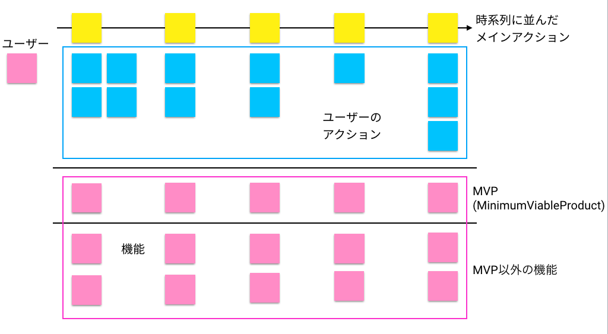

## プロダクトのHow

### プロダクトバックログを作る

```plantuml
title プロダクトバックログの役割
left to right direction

actor プロダクトマネージャ as manager
actor エンジニア as engineer
rectangle "プロダクト\nバックログ" as backlog {
    rectangle ユーザーストーリー1 as us1
    rectangle ユーザーストーリー2 as us2
}
note bottom of backlog
バックログを介して、
コミュニケーションをとる。
end note
note left of us1
◼︎「誰」に「何」を「何のため」に
　開発するのか(**プロダクトのWhat**)を記載。
◼︎「受入条件」をセットで書くと
　なお良い。
end note

manager -- backlog
backlog -- engineer
```

- <font color=red>プロダクトバックログは、プロダクトに求められている「機能」や「仕組み」の優先度つきリストである。</font>プロダクトバックログは更新し続けるものであり、プロダクトマネージャとエンジニアはプロダクトバックログを返してコミュニケーションを取り合う。
- プロダクトバックログは**ユーザストーリー(プロダクトのWhat)** と**その受け入れ条件(ユーザストーリーを満足する条件)** を記載することが望ましく、具体的には以下の例がある。
  - ユーザストーリー
    - **【例1】** 【ユーザタイプ】として、【理由】のために、【ゴールの達成】が欲しい
    - **【例2】** 【ユーザタイプ】として、【背景】のために、【ペインとゲイン】を解決するために、【ソリューション】が欲しい
  - 受け入れ条件
    - **【例1】** ボタン押下後、エラーが発生した時はエラーメッセージを表示する。
    - **【例2】** データ取得後、フォーマットに不正があった場合は既定値(空文字やNULL)を入れる。

#### プロダクトバックログに優先度をつける

##### ユーザストーリーマッピング



- <font color=red>ユーザの行動フローをもとに提供すべき価値や開発の優先順位を整理するために「<b>ユーザストーリーマッピング</b>」が利用される。</font>ユーザストーリーマッピングを用いて、プロダクトバックログの優先順位を決め、**MVP**や開発要素を洗い出す。

##### 品質の基準を決める

```plantuml
title プロダクトの品質
left to right direction

rectangle "SLI\nサービスレベル指標" as sli
rectangle "SLO\nサービスレベル目標" as slo
rectangle "SLA\nサービスレベル契約" as sla
note top of sli
**プロダクトの品質評価の**
**ための計測指標**
◼︎信頼性
◼︎可用性
◼︎稼働率
◼︎など
end note
note bottom of slo
**SLIに対しての具体的な内部目標値**
end note
note top of sla
**ユーザに対して保証するもの**
end note

sli --> slo
slo --> sla
``` 

- <font color=red>外部に対してプロダクトの品質を明文化する場合、SLI、SLO、SLAがあり、<u>ユーザはSLAを見てプロダクトの堅牢性を確認し、利用判断をする</u>。</font>
- **SLAが何らかの問題により達成できない場合、利用料金を減額するといったペナルティを支払うようにすることが多い**。


### ユーザにプロダクトを提供する仕組みを整える(GTM)


### リリースの前にすべきこと


### プロダクトのWhatとのFit & Refine


### リリースする


### 次の改善のために


