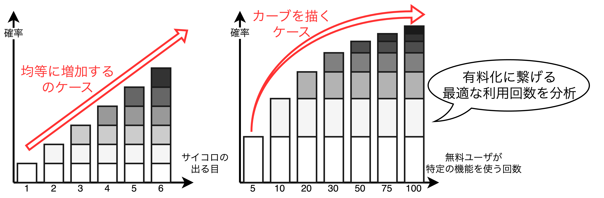

## ビジネスの基礎知識

### 収益・コスト・ビジネス環境の基礎知識

#### ビジネスの基本構造

<font color=red>$$利益＝収益-コスト$$</font>
- つまり、利益を上げる方法は「収益を上げる」か「コストを下げる」かの2つしかない。
- <u>自社プロダクトの収益構造とコスト構造を把握することでビジネスプランがどこまで現実的であるか、どこからが大きな賭けになるかを見通すことができる。</u>

##### 【例1】Netflixの場合の利益

```math
\begin{align*}
利益 &= 収益-コスト\\
 &= (サブスクプラン\times有料会員数) - (コンテンツコスト+固定費+変動費)\\
\end{align*}
```

##### 【例2】買い切り型やパッケージ系プロダクトの場合

```math
\begin{align*}
利益 &= 収益-コスト\\
 &= (商品価格\times販売数) - (原価+固定費+変動費)\\
\end{align*}
```

#### コストの考え方

- 企業活動のコストは会計上、「総費用」と呼ばれ、<b>「総費用＝固定費+変動費」</b>で表せる。
  - **固定費**: 土地や自社ビル、人件費などの<u>販売数の増減によって変動がない費用</u>
  - **変動費**: ハード/ソフトの原価や、販売活動、サービス利用料などの<u>販売数の増減によって変動がある費用</u>
- 上記の固定費と変動費以外に以下のような区分がある。
  - **原価**: サーバ費用、サードパーティのサービス利用料、部品代、開発に必要なパソコンの購入費用、外注費などを含む<u>売上に必要なリソースの調達費用</u>
  - **販売及び一般管理費**: 営業コストや広告コスト、バックオフィス運営の費用などを含む<u>販売費用や企業運営の費用</u>
  - **研究開発費**: <u>新しい知識発見のための研究開発費用</u>

<div style="page-break-before:always"></div>

#### 収益モデル

##### 【買い切りモデル】
> ユーザがプロダクトの利用を始める<b>最初のタイミングで課金をして、以降は支払いをせずに利用することができる収益モデル</b>。従来の多くの製品やサービスは買い切りモデルであった。

##### 【サブスクリプション】
> <b>ユーザがある一定の期間（週・月・年）ごとにプロダクトに対する金額を払う収益モデル</b>。
> 【例】NetflixやAmazon Prime、Disney+など

- 現在、toB, toC問わず多くの企業がサブスクリプションモデルを踏襲しており、以下のメリットがある。
  - **【メリット1】** 一回の課金が少額でユーザにとって払いやすい
  - **【メリット2】** 都度消費に比べて収益の見通しがつきやすい
  - **【メリット3】** 一度の長期コミットメントする必要もなく、自動更新が可能であればユーザの購買意思決定に要する負荷が減る
  - **【メリット4】** 使用中サービスに付加価値を追加する「クロスセル」、プロダクト消費量を大きくする「アップセル」という手法で追加収益を狙える
- ただし、以下のデメリットもある。
  - **【デメリット1】** 投資回収に時間がかかるため、最初は一定の赤字を覚悟する必要がある。
  - **【デメリット2】** ユーザ継続率や獲得率などユーザが長期にわたって支払う金額の見通しを立てることが難しい(Life Time Valueに気を配る必要がある)


##### 【ダイナミックプライシング】 Dynamic Pricing
> <b>ユーザからの需要や季節性、天候や時間といった要因でユーザの消費行動が大きく変わる場合に適切な収益モデル</b>。プロダクトの価格弾力性が高く(値段が変わると需要も大きく変わる)、提供できる価値の総量に限りがある場合に検討すると良い。
> 【例】新幹線や飛行機、ホテルなど

##### 【オークション】
> <b>供給に対して最も多く払えるものが対象を競り落とせる収益モデル</b>。<u>プロダクト供給側が売り手市場(供給よりも需要が多い状態)を作れる場合、オークションモデルは非常に有効</u>である。
> 【例】ヤフーオークションやeBayなど

##### 【従量課金】 Pay as you go
> <b>基本料金を超えた場合に使った分(時間・回数・データ量・通信量など)だけ支払う収益モデル</b>。使用状況をモニターできる仕組みを導入する必要であり、状況を視覚化できると良い。
> 【例】水道料金やガス料金、電話代など

##### 【キャプティブプライシング】 Captive Pricing
> <b>コアプロダクトに関して値段を低く抑えて敷居を低くし、交換パーツや消耗品、追加機能に関しては高めに値段を設定する収益モデル</b>。
> 【例】プリンター、カミソリ、ウォータサーバなど

##### 【段階的プライシング】 Tiered Pricing
> <b>プロダクトの機能をカテゴリーに分けて、その消費形態に応じて段階ごとに価格をつける収益モデル</b>。ベーシック、デベロッパー、スタンダード、プロ、エンタープライズのように段階ごとに使える機能やサポートレベルが追加されていく。
> 【例】SQL Serverライセンス、Visual Studioライセンス、GitHubプラン、Netflixプランなど

- 単にユーザ数増加だけでなく、<u>いかにアップセル(より上位プランを導入してもらうこと)を実現するかがポイント</u>になる。<font color=red>プランの分類についてユースケース・シナリオを考えると導出しやすい</font>
  - セキュリティを高めたい(SSO, 二段認証など)
  - 画質(解像度)や処理速度を上げたい
  - データ上限や接続台数を増やしたい
  - 便利機能(レビュワーの追加、Wiki機能、ストレージ枠追加など)をさらに使えるようにしたい
  - **商用利用可能にしたい**

<div style="page-break-before:always"></div>

##### 【フリーミアム】 Free + Premium
> <b>プロダクトの価値がわかる基本機能を無料提供し、気に入ってもらえたユーザやより多くの機能や容量が必要な場合は有料(プレミアム)で使用してもらうという収益モデル</b>。有料ユーザの転換タイミングや価格設定が非常に難しいが、心理的障壁が非常に低いという特徴がある。
> 【例】OneDriveやLinkedIn、Evernote、Canva、生成AI(ChatGPT, DallE)など

- **心理的障壁が非常に低いこと**がメリットであり、**有料ユーザへの誘導(転換タイミング・価格設定)が非常に難しいこと**がデメリットである。
- シリコンバレーのスタートアップ企業の経験則では、フリーユーザから有料ユーザに転換する確率はおよそ$10\%$である。

##### 【ぺネトレーションプライシング】 Penetration Pricing
> <b>レッドオーシャンにあえて価格を下げて市場投入し、一気にマーケットシェアを拡大していく収益モデル</b>。ユーザにとって別のプロダクトへ乗り換えるスイッチングコストがかかる場合や使い続けるほど解くと感じるプロダクトからわざわざ乗り換えさせなければならない場合などにも使われるモデル。
> 【例】「1つ買うともう1つ無料」や「最初の1年は50%オフ」など

- **【メリット】**
  - マーケット認知度が上がりやすい。
  - ユーザ数を増やしやすい。
- **【デメリット】**
  - 価格競争を起こしやすい。
  - 独占禁止法違反の恐れがある。
  - 想定していないユーザが飛びつくことがある。

##### 【レベニューシェア】 Revenue Share
> <b>事業者がサードパーティやパートナーシップを組んだ会社と協力して行った共通のビジネスを通して得られた収益を、<u>一定の比率</u>で配分する収益モデル</b>。
> 【例】オンライン広告や音楽配信、ライドシェアなど

- プラットフォーム型プロダクトでよく見られ、**①視聴回数や再生回数を正確に計測する技術**や**②定時価格の要素(売上、シェア率、ユーザ数、コンテンツ消費動向)** など高精度なトラッキングメカニズムが必要になる。

<div style="page-break-before:always"></div>

#### 収益モデル選定の際に気をつけるべきこと

##### 【気をつけるべきこと①】ユーザと収益モデルの相性

- <font color=red>業界やユーザの行動習慣によっては収益モデルが受け入れられないことがある</font>。例えば、法人顧客の購買ルールや税制がサブスクリプションモデルに適合しておらず、購入しにくいと思われてしまうケースがある。負のギャップを生まないためにも事前にユーザリサーチでしっかり検証しておくことが望ましい。

##### 【気をつけるべきこと②】価格に影響するトレンド

- <u>ユーザが行動や購買を決定するのは価格だけではない</u>。極端な例として、モバイルユーザの増加が頭打ちになり、逆に減り始めたらモバイルアプリの収益モデルにどう影響するのか検討する必要がある。
- 収益モデルの前提条件は不定値ではないため、シナリオプランニングやリスク検証を十分にする必要がある。

##### 【気をつけるべきこと③】プロダクトステージとの関係

- 収益モデルは①プロダクトのライフサイクルや②競合環境、③ユーザとの関係性や広がり(顧客基盤)など複合的な要素から構成される。
- <font color=red>強固な顧客基盤がない場合、シンプルな収益モデルが望ましい場合がある</font>。例えば、すべての処理に$2.5\%$の使用料金を取るという透明性が高く、わかりやすい収益モデルが良いケースもある。
- BtoBの場合は一度導入を決めると変更が難しいため、慎重に検討した方が良い。

##### 【気をつけるべきこと④】競合の収益モデル

- <font color=red>収益モデルの選定は優位性を気づくきっかけになるため非常に重要</font>である。例えば、Netflixは従来の「借りた本数と日数分の支払い」から「定額モデル」へ転換したことで優位性を築き、成功した。

##### 【気をつけるべきこと⑤】収益モデルの開発難易度

- <font color=red>最も大事なことはプロダクトが提供する価値の大きさと、その価格が釣り合っているかどうかである。</font>
- 大企業の新規事業の場合は既存ビジネスの収益モデルに組み入れないといけない場合がある一方、スタートアップの場合は限りあるリソースの中で複雑な収益モデルを構築することが難しいという場合もある。
- このようにBuild or Buy(内製かサードパーティのソリューションを買うか)の判断を行い、総所有コスト(Total Cost Ownership: TCO)や収益性がどのくらい期待できるのかシミュレーションを行わなければならない。


<div style="page-break-before:always"></div>

#### 収益を拡大するための手法

##### 【ネットワーク効果】

- ネットワーク効果とは、プロダクトを使うユーザが増えれば増えるほどプロダクトの価値が増大することを指す。例えば、FacebookやInstagram、Pinterestが挙げられる。
- ネットワークのサイクルとしては以下の通りである。
  1. ユーザがコンテンツ(テキスト、写真、動画)を載せる。
  2. プロダクトを使いたいと思うユーザが増える。
  3. さらにコンテンツの投稿が増える
  4. さらにユーザが増える
- ネットワーク効果のアプローチとしていくつかある。
  - **【アプローチ①】** 特定のセグメントでしっかりとネットワーク効果が出ることを確認し、プロダクトを広げる。
  - **【アプローチ②】** 単機能をフリーで提供し、ユーザの裾野を増やす方法。AdobeやAcrobat Readerが例。
  - **【アプローチ③】** プラットフォームとしてサービス参加者とサービス提供者のマッチングを加速する仕組みを作る方法である。Airbnbはフォトグラファを短期集中で大量投入し、宿泊場所の写真をより魅力的に一変させた。

##### 【フリーミアムとフリートライアル】

- スタートアップの場合、心理的抵抗を減らすためにフリーミアムとフリートライアルを使用。
  - **フリーミアム**: プロダクトの価値の一部を無償提供し、満足してもらえたら有償ユーザになってもらう戦略である。DropboxやGoogle Driveなどが挙げられる。
  - **フリートライアル**: 一定期間プロダクトのフル機能を使ってもらい、期間終了後は有償ユーザになることで継続利用できるようにする戦略である。

##### 【クロスセルとアップセル】

- プロダクトの継続的改善のために新規機能を投入する際、<font color=red>追加費用のアプローチとして<b>クロスセル</b>と<b>アップセル</b>の2種類がある</font>。
  - **クロスセル**: プロダクトの別の機能を有償で提供する方法。例えば、自動車保険の加入と同時に生命保険を勧めることや、
  - **アップセル**: プロダクトの機能そのものは変えず、有償でプロダクトの容量や能力を大きくする方法。ストレージ上限や帯域幅、画質などが例として挙げられる。アップセルと同様の考え方で「シートエクスパンション(Seat Expantion)」があり、従業員数(利用ユーザ数)に応じて課金額を変える方法。
- **プロダクトマネージャはプロダクトの価値をうまく切り出し、収益性を適切に見出すことが求められる**。

<div style="page-break-before:always"></div>

#### ビジネス環境の変化を知る

- プロダクトの側面だけでなく、社会環境やトレンドからビジネスを理解する必要もある。
  - **【歴史】**: 日本史だけでなく世界史も含む
  - **【地理】**: 日本と欧米、日本とアジアといった日本が関わるところだけではなく、プロダクトによっては北米と中南米というように日本以外の地域視点も必要
  - **【政治・法律】**: 規制を重視するか政治家、競争に対してオープンな法制度化など
  - **【経済】**: どこに投資が向かい、何が成長しているか、それはなぜか。人々の消費活動のトレンドなど。
  - **【民族・文化】**: ユーザを取り巻く文化的な背景や民族的な習慣や、思考習慣など。
  - **【哲学・思想】**: どのような哲学・思想が続いているか、もしくは台頭しているかなど。

##### 【具体例1】ユーザ獲得コストの増加とWillingness To Payの低下

- 2021年時点で<u>新ユーザ獲得に必要なコストが上昇傾向にあり、スタートアップや新規事業を展開するときのコストを押し上げている</u>。例えば、Facebookを使った広告の場合CPMは2017年だけで17.1%、Twitterは27%、LinkedInは15%それぞれ増加している。
- そのため、<font color=red>企業はオンライン広告に代わるより効果的なユーザ獲得チャネルを模索している</font>。現在は<u>サブスクリプションモデルにフリートライアルやフリーミアムを導入するケースが多い</u>。その他の手段は追加投資が必要でありあまり行われていない。
- **サブスクリプションモデルはWTPを押し下げることに一役買っており、ユーザは手軽に月額や使った分だけを払い、手軽で手頃な価格で利用することができる**。例えば、Adobeは2011年から「ライセンス買い切りモデル→サブスクリプションモデル」に切り替えた。これによりユーザに継続的に機能を提供でき、Adobeは収益を伸ばすことに成功した。

##### 【具体例2】ユーザ自己学習型(Self-Educated)プロダクトの台頭

- スマートデバイスの対等によりUI/UXが身近になり、**ユーザがベンだから使い方を教わるよりも自分で試して使えるかどうかを判断したいという意思が自然**になってきている。
- 例えば、SlackやDropboxなどBtoB用途であっても、消費者向けUX(Consumer Grade UX)と同じくらい直感的に使えるプロダクトが広まっていることは無視できない。

##### 【具体例3】プロダクト体験(Product Experience)の優先度の変化

- <font color=red>UI/UXが進化し、プロダクトの<b>UXが購買意思決定プロセスにおける本質になってきている</b></font>。ブランド力もあるが、UXはブランド力を凌駕する力がある。いずれにせよ、**トレンドとターゲットユーザに合わせてどのようなアプローチが適切か徹底的に考え抜くことが重要**である。
- 例えば、現在の`Zoom`の知名度は圧倒的であるが昔は`Cisco`や`Microsoft`、`Citrix`の方がブランド力は優っていた。ところが、`Zoom`は徹底的にシンプルに使いやすく作り上げ、3億人を超えるユーザ数まで伸ばした。

<div style="page-break-before:always"></div>

### パートナーシップを構築する

#### パートナーシップとは

- パートナーシップとはユーザに価値を提供するための企業や行政、教育期間などとの連携のことである。<font color=red>自社にない、もしくは弱い機能を補完するための方法の一つとして、<b>パートナーシップの活用</b>がある</font>。
- 市場の中でプロダクトを差別化して際立たせたり、テクノロジーの利用により新たな価値を生み出す際に有用であり、**パートナーシップを活用して自社でできることを超えてユーザに価値を提供することができる**。
- パートナーシップの背景には、<u>どんなに資金が潤沢な会社であっても1社で**すべてのユーザにリーチし、すべてのニーズを満たすことは実質不可能であるという考え方**がある</u>。
- SaaS形態のプロダクトは素早いリリースを可能にしたが、同時に市場の中で多くの競合を生むことにもなる。例えば、マーケティングテクノロジーの領域では世界中で約8000社が存在する。
<u>※【参考】マーケティングテクノロジーカオスマップ参照</u>
- **プロダクトの価値を強化・拡張したり、価値の届け先を増やすなどのためにパートナーシップを活用することは重要な選択であり、特に成長期や成熟期にあるプロダクトにとって考える必要がある**。

##### 【参考】マーケティングテクノロジーのカオスマップ


##### 【パートナーシップの目的】

- 市場の中における認知度向上
- 市場参入時における負担をできるだけ小さくする
- 既存・新規市場へのアクセスの拡大
- 自社で0から立ち上げるよりも早くスキルや経験を獲得しイノベーションのスピードを上げる

##### 【パートナーシップの種類】

- 代表的な形態として「**チャネルパートナー**」があり、GTM(ユーザにプロダクトを提供する仕組みを整える)で活用されるパートナーシップである。ユーザへのリーチにおいてよく活用される形態であり、チャネルパートナーはさらに以下の分類がある。
  - **ディストリビュータ**: 「卸売」の立ち位置で在庫を持ったり営業活動の裏方として活動する。
  - **リセラー**: 生産者たる一次企業もしくはディストリビュータからプロダクトを仕入れて再販したり、サポートや導入支援の部分でのサービス提供を行い、プロダクトに対する変更は何もしない。
  - **VAR(Value Added Reseller)**: リセラーの役割に加え、プロダクトにサービスなどの価値をのせる。
  - **システムインテグレーター**: VARと同様。
  - **MSP(Managed Service Provider)**: プロダクトに関するすべてのサービスを請け負う。

#### パートナーエコシステムの型


- <font color=red>パートナーエコシステムとは、異なるパートナーシップの組み合わせによる価値創造の戦略</font>であり、**エコシステム参加企業全てが何らかのメリットを享受する代わりに、一定のコミットメントを果たすことで成り立つ**。
- パートナーエコシステムにはエコシステムを構築する側とエコシステムの参加者をコントロールする側でそれぞれ4種類に分類できる。
  - **【ロックイン型】** エコシステムを構築するためのハード/ソフトを1社によって独占的に提供され、そこに参加するパートナー企業は独占している1社のコントロールを受ける形態である。<u>ロックイン型に参加する企業はスポンサー企業のプロダクトに直接手を加えることはできない</u>。AppleやCiscoなど。
  - **【ライセンス型】** 1社によって支援され、参加する多数の企業は独自にプロダクトを開発したり、サービスを提供したりする。Visual StudioやSQL Serverが例として挙げられる。
  - **【ジョイントベンチャー型】** 多数の企業がエコシステムを構築し、ジョイントベンチャとして設立された企業(1社)がエコシステムをコントロールする形態。Huluが例として挙げられ、<u>映像コンテンツは多くのパートナーシップ参画企業によって成り立っているが、コンテンツの管理はHuluが独占的に行う</u>。
  - **【オープンソース型】** 多数の企業がエコシステムを構築し、多数の企業がエコシステムをコントロールしている形態。Linuxが例として挙げられ、AT&T、Cisco、Facebook、富士通、日立、Huawei、IBM、NEC、Oracleといった<u>世界中の企業がスポンサー</u>としている。また、商用利用の際はOSの中心部分を自社用に作り替えたり、Linuxと互換性を持つドライバを用意したりなど<u>商用展開は企業に一任されており、独自に開発を行う</u>。

#### プロダクト戦略に合わせたパートナーシップを構築する

- パートナーシップの活用はスタートアップ企業が大企業と組めるという理由で飛びつくケースが多くあるが、スタートアップ企業の開発リソースをむやみに割かれてしまい、身動きが取れない状況に陥ることがあるため、注意が必要。こうなると**誰のためのプロダクトなのかわからなくなる**。
- <u>ビジネスパートナーを選定する前に性能評価を作成し、評価が高い順に検討すべき</u>である。また、**①相手がプロダクトに関わるメリット**や**②アライアントを結ぶことに至った背景や要因**、**③契約条件(SLAやNDAなど)** を可視化しておく。

### 指標を計測し、数字を読む

#### プロダクトでよく使われる代表的な指標

- <font color=red>データ分析の入り口は無数にあるため、データサイエンティストとともに分析することが良い。</font>

##### 【指標1】継続率(User Retention)

<table>
	<tbody>
		<tr>
			<th>コホート分析を用いたユーザ継続率の計測</th>
			<th>ユーザ継続率曲線の曲線パターン</th>
		</tr>
		<tr>
			<td></td>
			<td></td>
		</tr>
	</tbody>
</table>

- $継続率=\frac{任意の日数におけるユーザ数(DayNユーザ数)}{ある日にプロダクトを初めて使い始めたユーザ数(Day0ユーザ数)}$
- 上図のコホート分析は継続率を表した可視化手法であり、継続率を色の濃淡で表現する。
- <font color=red>ユーザが初めてプロダクトに触れた時の体験をFirst Time User Experience(FTUX: エフタックス、エフチューイ)といい、<u>①アプリを開いた回数、②アプリを開いていた時間、③使用した機能などを計測して、アンインストールされる原因を探る</u>。</font>
- 継続率は日次や週次、月次など業界によってそれぞれ計測期間が異なり、**DAU(Daily Active User)** や**MAU(Monthly Active User)** などがある。<u>DAUとMAUはプロダクトを使ったユニークユーザ数であり、どのように使ったかは基本的には問わない</u>。ただし、あるアクションまでをとったユーザをDAUやMAUとして計測する考え方もある。

<div style="page-break-before:always"></div>

##### 【指標2】離脱率(Churn Rate)

<table>
	<tbody>
		<tr>
			<th>継続率と離脱率の違い</th>
			<th>AARRRモデル</th>
		</tr>
		<tr>
			<td></td>
			<td></td>
		</tr>
	</tbody>
</table>


- 離脱率を考える上で有用なモデルはAARRRモデルがあり、漏斗(ファネル)とも呼ばれる。
  - 上から下に行くに従い、ユーザ数が減る。
  - トップオブ/ボトムオブファネルなど階層ごとに<u>集中して働きかける階層を分けて考える</u>。
  - 扱うプロダクトやビジネスによってはReferralとRevenueが逆になることもある。例えば、買って使ってもらって初めてユーザにReferralする気になってもらうこともあれば(特にBtoB)、SNSでバズを起こしてReferralしてもらってからRevenueに繋げる場合もあるからである。
- **AARRRモデルを用いて各階層の「ユーザ数の落ち込み」に着目する。各階層の中で落ち込みが一番大きい層を分析し、「なぜ離脱したのか」の仮説を検証していく。**

##### 【指標3】ネットプロモータースコア(NPS: Net Promoter Score)

- <font color=red>プロダクトを使った後にユーザがどのような印象を持つかを定量的に計測するための指標。</font>スコアは-100〜100まであり、高いほどよい。
- NPSには二種類ある。
  - **トランザクショナルNPS**: 時期に関係なく何らかのプロダクト体験の終わりに問う形式
  - **リレーショナルNPS**: 毎月、4半期、毎年といった定期的にユーザに問う形式
- **NPSの計測方法は以下の通り。**
  1. 「あなたが〇〇を友人や親戚に勧める可能性はどのくらいありますか？」の質問に対して0〜10までの11段階の点数を選んでもらう。
  ※ 〇〇にはプロダクトやサービス名、企業名が入る
  2. 得られた点数から批判者(0〜6点)、中立者(7〜8点)、推薦者(9〜10点)の3グループに分ける。
  3. 各グループの割合を求め、$NPS=推薦者の割合-批判者の割合$を算出する。
  【例】推薦者の割合が80%、批判者の割合が10%の場合、$NPS=80-10=70$となる。

#### サブスクリプションモデルでよく使われる指標

- <font color=red>サブスクリプションモデルのように「継続的に価値を提供するプロダクト」は従来の買い切り型のプロダクトとは指標の捉え方が異なる。</font>
- コストの観点におけるソフトとハードの決定的な違いは**限界費用(MC: Marginal Cost)** である。限界費用は提供できる限度を迎えた時に、設備投資のために費用が急激に上がることになり、ハードウェアの世界でよくある話である。
※**【限界費用】** 生産量を1つ増やした時に必要な生産費用
- CVについて、例えばユーザ1人あたり7500円の平均購入額が1年のうちに4回平均して発生していれば、CVは3万円(7500円×4回)となる。

<table>
  <caption>サブスクリプションモデルによく使われる指標</caption>
	<tbody>
		<tr>
			<th>略称</th>
			<th>名称</th>
			<th>概要</th>
		</tr>
		<tr>
			<td>MC</td>
			<td>限界費用<br>(Marginal Cost)</td>
			<td>生産量を1単位増やした場合に必要とされる費用</td>
		</tr>
		<tr>
			<td>CAC</td>
			<td>ユーザ獲得費用<br>(Customer Acquisition Cost)</td>
			<td>新規ユーザを1人獲得するために必要な<br>マーケティングコスト</td>
		</tr>
		<tr>
			<td>LTV</td>
			<td>ライフタイムバリュー<br>(Life Time Value)</td>
			<td>ユーザが定着している間にどのくらいの収益が<br>上げられるのか(支払いがあるのか)を測る指標。</td>
		</tr>
		<tr>
			<td>CV</td>
			<td>ユーザ1人あたりから得られる収益<br>(Customer Value)</td>
			<td>ユーザの平均購入額とユーザの平均利用頻度を<br>積算し、ユーザ1人あたりによってもたらされる<br>単位期間あたりの収益を示すもの。</td>
		</tr>
		<tr>
			<td>ACL</td>
			<td>平均ユーザ定着期間<br>(Average Customer Lifespan)</td>
			<td>1人のユーザがプロダクトを利用する期間の平均</td>
		</tr>
		<tr>
			<td>MRR</td>
			<td>月次計上収益<br>(Monthly Recurring Revenue)</td>
			<td><b>月ごと</b>に決まって発生する売上</td>
		</tr>
		<tr>
			<td>ARR</td>
			<td>年次計上収益<br>(Annual Recurring Revenue)</td>
			<td><b>年ごと</b>に決まって発生する売上</td>
		</tr>
		<tr>
			<td>ARPU</td>
			<td>ユーザ1人辺りの平均収益<br>(Average Revenue Per User)</td>
			<td>売上をユーザ数で割って計算される<br>1人あたりの平均収益</td>
		</tr>
		<tr>
			<td>ACV</td>
			<td>年次あたりの契約金額<br>(Annual Contract Value)</td>
			<td>1年間での受注金額の合計</td>
		</tr>
	</tbody>
</table>

<div style="page-break-before:always"></div>

##### 【ユーザ獲得費用(CAC)とライフタイムバリュー(LTV)】

- <font color=red>ソフトウェアの場合はユーザが1人増えたところで、その1人のためにコードを追加することはしない。<b>既存サーバでは捌ききれないほど急激にユーザ数が増え、サーバがパンクしない限り、限界費用は0に近い。</b></font>ハードウェアは限界費用を超える場合、急激に追加費用が必要になる。
- しかし、サブスクリプションモデルの場合、ユーザが1人増えることによってユーザ獲得費用(CAC)が増加する。CACはコストである以上、値が小さいほど望ましい。
- CACとLTVを比較し、健全性を判断する。
  - $【CAC<LTV(1<UE)】$利益(LTV)が費用(CAC)を上回っている状態。**特にUEが3以上であればSaaSの世界においては順調に成長しているとみなされる**。例えば、100万円の投資で300万円のリターンが得られている状態である。
  - $【CAC=LTV(1=UE)】$どのようにLTVを上げ、CACを下げる化を考えなければならない。①プロダクトの新規性がない、②価値を感じてもらえていない可能性がある。
  → **クロスセルやアップセルをうまく取り入れることでLTVを向上させることが必要**
  - $【CAC>LTV(1>UE)】$**ユーザ獲得のたびに利益を失っている**ことを意味しており、プロダクトづくりの1歩目から間違っている可能性がある。
- SaaSビジネスの健全性を示す値として$UE=\frac{LTV}{CAC}$があり、1ユーザあたりの経済性(Unit Economics)の指標である。

$$
\begin{align*}
CAC&=単位期間当たりの広告費用\div単位期間当たりに新規獲得ユーザ\\
CV&=全ユーザの平均購入額\times全ユーザの平均利用頻度\\
ACL&=1\div離脱率\\
LTV&=CV\times ACL\\
UE&=LTV\div CAC
\end{align*}
$$

##### 【その他の指標】

- $MRR$は月次計上収益であり、**ユーザが一定期間ごとに繰り返し支払うことを想定した継続収益予測のために利用される**。年単位で継続収益を予測する場合は$ARR$を使用する。
- ユーザ1人あたりの平均収益として$ARPU=\frac{単位期間あたりの収益}{企業数/ユーザ数}$があり、**LTVより算出が簡単に収益傾向を掴む場合に利用される**。
※ユーザ数は①無料ユーザ数と②有料ユーザ数に分けることもある。
- ユーザがどれくらいの期間継続利用すればCACを回収できるかを示す値として、CAC回収期間があり、**CAC回収期間は12ヶ月以内に収めることが望ましい**。<u>スタートアップであれば通常15〜18ヶ月を示すことが多い</u>。
- 単年度あたりの契約金額としてACVがあり、エンタープライズ系プロダクトで使われる。例えば、3年で300万円の契約で導入支援に90万円だった場合、$ACV=(300+90)\div 3=130$【万円/年】という計算になる。**年間契約の料金メニューを持っているサブスクリプション型プロダクトで使われる**。

<div style="page-break-before:always"></div>

#### データ収集をするための技術的な知識

- ユーザデータの利活用にはデータ収集の仕組みが必要であり、データ収集には**①ユーザデータ(ユースケース)の定義**、**②データの記録**、**③データの処理**、**④データの分析**が必要になる。
- **①ユーザデータの定義**では、「どのアクションを収集するか」と「アクションの付加情報」の2つを考える。たとえば、動画配信サービスを利用するユーザがドラマを見ようとした場合を考えるとアクションとその付加価値は以下のようになる。
  - **【収集するアクション(ユースケース)】** ドラマのエピソードを見る。
  - **【付加情報】** OSバージョン(PC, 携帯, スマートTV)やクリックされた位置情報、クリックされた時間など
- **②データの記録**では、サーバかクライアントのどちらでデータを記録するかを考える。
<table>
  <caption>②データの記録場所による特徴</caption>
	<tbody>
		<tr>
			<th></th>
			<th>長所</th>
			<th>短所</th>
		</tr>
		<tr>
			<th>クライアント<br>サイド</th>
			<td>
        <li>サーバに通信できない状態でも<br>ユーザのアクションを確実に収集し、<br>サーバ通信時に記録可能。</li>
        <li>画面読込からクリックまでの時間や<br>カーソルの動きなどの詳細を収集可能。</li>
      </td>
			<td>
        <li>モバイルでサードパーティの<br>ツールを埋め込んで使う場合は<br>アプリサイズが大きくなる。</li>
        <li>クライアントデバイスの挙動に<br>依存する(ブラウザやAdBlocker<br>により動きが変わることもある)</li>
      </td>
		</tr>
		<tr>
			<th>サーバ<br>サイド</th>
			<td>
        <li>サーバのタイムスタンプで集計可能</li>
        <li>アクセスログから遡って集計可能</li>
      </td>
			<td>
        <li>サーバを介さずにされる処理を<br>集計できず、タイムラグがある。</li>
      </td>
		</tr>
	</tbody>
</table>

- **③データの処理**では、ETL(Extract, Transformation, Loading)ツールを経て社内DBに蓄積する。集計タイミングとしては大きく3種類が挙げられる。
  - **【タイミング1】** <u>リアルタイム処理(コスト大)</u>。ユーザイベントがあるたびにリアルタイムでユーザ動向を見る。
  - **【タイミング2】** <u>イベントベース(コスト中)</u>。ある特定のイベントが発生したタイミングで処理を開始する。
  - **【タイミング3】** <u>バッチ処理(コスト小)</u>。単位時間ごとにデータが集まるのを待って定期的に処理する。
- **④データの分析**では、ダッシュボード等でデータを可視化し、価値のあるデータを見極めることを考える。簡単な分析から複雑な分析まで、データサイエンティストと適宜連携する必要がある。
  - **【簡単】** 1日あたりのアクティブユーザ(DAU)
  - **【簡単】** 1日あたりのユーザのアクション数
  - **【複雑】** 特定コンテンツにアクセスしたユーザの時間帯別分散

<div style="page-break-before:always"></div>

<table>
  <caption>④モバイルアプリのサードパーティ別の特徴</caption>
	<tbody>
		<tr>
			<th>レイヤー</th>
			<th>項目</th>
			<th>役割</th>
			<th>代表的なベンダー</th>
		</tr>
		<tr>
			<th rowspan="2">データの<br>記録</th>
			<td>ヘルス<br>チェック</td>
			<td>プロダクトのヘルスチェックや<br>クラッシュなどのユーザの体験を<br>阻害してしまう部分をトラックする。</td>
			<td>Firebase Crashlytics, <br>Datadog, <br>New Relic</td>
		</tr>
		<tr>
			<td>ユーザ属性<br>情報収集</td>
			<td>ユーザがプロダクト内でとる<br>アクションに対して、そのログと付加情報<br>(App version, OS, Device type, <br>Location等)を合わせて集める。</td>
			<td>Adjust, <br>Appsflyer, <br>Singular</td>
		</tr>
		<tr>
			<th></th>
			<td>ディープリンク</td>
			<td>Webサイトからモバイルアプリへ<br>遷移する際にインストールを<br>挟んでもユーザのアクションを<br>トラックできる</td>
			<td>Branch, <br>Button</td>
		</tr>
		<tr>
			<th>データの<br>処理</th>
			<td>データ<br>パイプライン</td>
			<td>ログを集めるためのデータパイプライン</td>
			<td>Treasure Data, <br>Alooma, <br>Snowplow</td>
		</tr>
		<tr>
			<th rowspan="2">データの<br>分析</th>
			<td>アナリティクス</td>
			<td>パイプラインから集まってくるデータを<br>分析するツール</td>
			<td>Tableau, <br>Google Analytics, <br>Adobe Analytics, <br>Mixpanel, <br>Kissmetric, <br> Amplitude</td>
		</tr>
		<tr>
			<td>ABテスト</td>
			<td>成果を最大化するために2つのパターンを<br>表示して効果を検証するテストツール</td>
			<td>Optimizely, <br>Apptimize, <br>Google Optimize</td>
		</tr>
		<tr>
			<th>統合<br>プラット<br>フォーム</th>
			<td>カスタマーデータ<br>プラットフォーム</td>
			<td>記録・処理・分析をまとめて提供する<br>プラットフォーム</td>
			<td>Segment, mParticle</td>
		</tr>
	</tbody>
</table>

<div style="page-break-before:always"></div>

#### データを読み解くための統計的な知識

##### 【ABテスト】

- <font color=red><b>仮説検証手法の1つ。</b>ユーザを「新しい機能やUI/UXのプロダクトを体験してもらうグループ(<u>テストグループ</u>)」と「現行プロダクトを体験してもらうグループ(<u>コントロールグループ</u>)」に分け、効果を検証する。<b>ABテストは分析結果を社内に情報公開し、ノウハウ共有にも重宝される。</b></font>
- ABテストでは有意差を確認するために、どの指標を上げることが目的なのか、関連指標は何なのかを明確にしておく必要がある。また、**①テストデータ数(テストユーザ数)** や**②テスト期間**が重要になり、さらには**③必要なサンプルデータ**の推測も必要になるケースがある。
- <u>テストグループを複数パターン用意したABテストは注意が必要である</u>。この場合、ABCテストやMultivariate AB testと呼ばれ、**サンプル数や十分なユーザを集める時間(テスト期間)が増加する**。


<div style="page-break-before:always"></div>

##### 【基礎的な統計学の知識】

<table>
  <caption>統計量</caption>
  <thead>
    <tr>
      <th>指標</th>
      <th>説明</th>
      <th>補足</th>
    </tr>
  </thead>
  <tbody>
    <tr>
      <td><strong>平均値</strong></td>
      <td>数値の総和を個数で割った値。<br>算術/幾何/調和/移動平均がある。</td>
      <td><u>データの偏りは考慮できていないため、<br>平均値だけを見ると誤った解釈につながる。</u></td>
    </tr>
    <tr>
      <td><strong>中央値</strong></td>
      <td>数値を昇順(降順)に並べた時の<br>真ん中(中央)にある値。</td>
      <td><u>中央値と平均値の乖離が大きい場合は<br>外れ値があることが考えられる。</u></td>
    </tr>
    <tr>
      <td><strong>最頻値</strong></td>
      <td>数値の集合のうち最も出現回数が多い値。<br>インタビューやアンケートで利用される。</td>
      <td>
        <u>平均値と合わせて解析することで、<br>サイレントマジョリティに気付ける可能性がある。</u><br>
        <font color="red">※グラフ化し、山が複数(2つ以上)の場合、複数の最頻値を集計することもある。</font>
      </td>
    </tr>
    <tr>
      <td><strong>分散(標準偏差)</strong></td>
      <td>データのばらつきを表す値。</td>
      <td>毎月の売上や新規ユーザ数などの分散が<br>大きい場合は原因を分析しても良い。<br>季節性(周期性)、一過性、人員増加など原因分析が重要。</td>
    </tr>
    <tr>
      <td><strong>累積<br>確率分布</strong></td>
      <td>対象とする事象が起こる確率を<br>積み上げて表現するグラフ。</td>
      <td>確率的な傾向を視覚的に捉えるのに有効。
</td>
    </tr>
    <tr>
      <td><strong>変化率</strong></td>
      <td>
        時系列データで利用され、期間中にどの程度<br>変化したかを表す値。
      </td>
      <td>
        複数年単位で成長率を見る場合は年平均成長率<br>(CAGR: Compound Annual Growth Rate)を利用する。
      </td>
    </tr>
  </tbody>
</table>



$$
\begin{align*}
年平均成長率(CAGR)=(今年度の売上-N年前の売上)^{\frac{1}{N}}-1
\end{align*}
$$

<div style="page-break-before:always"></div>

### 知的財産の扱い

- <font color=red><b>ライセンスビジネス</b>のように、知的財産そのものが一種のプロダクトのように<b>収益源</b>となることもある。</font>自らのプロダクトが他者の権利を侵害することは避けなければならない。


#### 基本的な知的財産権

##### 【知的財産制度の概要】

- **知的財産権制度**は「知的創造活動によって生み出されたものを、創作した人の財産として保護するための制度」( https://www.jpo.go.jp/system/patent/gaiyo/seidogaiyo/chizai02.html )である。
- <font color=red>プロダクトマネージャは下表の全ての知的財産について概要を把握するために、社内研修・書籍・セミナー等から基本的な知識は習得しておく必要がある。</font>
- 【知的財産を知らないことにより生じうる問題】
  - **【問題1】** 自社の特許か可能な技術を秘密保持契約がない相手に話してしまい、先方に活用された後からそれに気づいても権利を主張できない。
  - **【問題2】** 第三者から提案されたアイデアを採用し、プロダクトに組み込んだ後で、そのアイデアが特許化されていたことを聞かされた額のライセンス料が発生する。
- 本書ではプロダクトマネージャが特に留意すべき①特許権、②意匠権、③商標権、④著作権を解説する。
  - **【特許権】** 発明や考案など目に見えないものや、明示的に保有することができないものを保護する権利。
    - <u>特許取得は金銭的・人的コストがかかるため知財戦略を設けて進めるべき</u>であり、スタートアップの特許取得が勧められない。
    - ディープテックのような先端技術をコアコンピタンスとする会社でもない限り、スタートアップの特許取得はあまり得策ではない。
    - **リバースエンジニアリングが容易ではない業界においてはあえて特許を出願しないという戦略**を取ることもある。<u>最悪の場合、特許を出願したために自社の手の内を公開し、競合に情報を提供するだけで終わってしまう可能性がある。</u>
  - **【意匠権】** デザインに対して与えられる権利。
    - <u>ソフトウェアプロダクトであったとしても、そのUIが特徴的であれば意匠権を獲得可能。</u>
    - 最も意匠権を獲得している企業の1つがAppleであり、デバイスや付属品、商品の陳列棚に至るまで意匠を取得している。Appleのような<u>複数の強い知的財産を保有した企業の場合、クロスライセンス契約という手段も持てる</u>。
  - **【商標権】** 商品やサービスに付ける商標を独占的に使用できる権利。
    - <u>商標権の保護範囲は「全く同一である場合」だけでなく、「文字や図形」「記号」「立体的形状」「音」などの類似性も保護範囲の対象となる。</u>
    - **無用なリスクを抱えないためにもプロダクトのロゴやサービス名については必ず商標を取得する必要がある**。
  - **【著作権】** 著作物(思想または感情を創作的に表現したものであって、文芸、学術、美術または音楽の範囲に属するもの)を保護する権利。
    - <u>**ユーザの著作物を共有できるプロダクトの場合**、その著作権はユーザにあるため利用規約で著作権の扱いを明示し、**①ユーザから著作権の譲渡を受ける**か、**②その著作物の利用許諾を取る**必要がある。</u>

<table>
  <caption>ITプロダクトに関わる知的財産権の概観</caption>
	<tbody>
		<tr>
			<th>分類</th>
			<th>権利等</th>
			<th>対象</th>
			<th>該当する法律</th>
		</tr>
		<tr>
			<th rowspan="6">知的創造物に<br>ついての権利等</th>
			<td>特許権</td>
			<td>発明</td>
			<td>特許法</td>
		</tr>
		<tr>
			<td>実用新案権</td>
			<td>物品の形状等の考案</td>
			<td>実用新案法</td>
		</tr>
		<tr>
			<td>意匠権</td>
			<td>物品、建築物、画像のデザイン</td>
			<td>意匠法</td>
		</tr>
		<tr>
			<td>著作権</td>
			<td>文芸、学術、美術、音楽、<br>プログラム等の精神的作品</td>
			<td>著作権法</td>
		</tr>
		<tr>
			<td>回路配置利用権</td>
			<td>半導体集積回路の<br>回路配置の利用</td>
			<td>半導体集積回路の<br>回路配置に関する法律</td>
		</tr>
		<tr>
			<td>営業秘密</td>
			<td>ノウハウやユーザリスト</td>
			<td>不正競争防止法</td>
		</tr>
		<tr>
			<th rowspan="3">営業上の標識に<br>ついての権利等</th>
			<td>商標権</td>
			<td>商品・サービスに<br>使用するマーク</td>
			<td>商標法</td>
		</tr>
		<tr>
			<td>商号</td>
			<td>商号</td>
			<td>個人の場合は商法、<br>会社の場合は会社法</td>
		</tr>
		<tr>
			<td>商品等表示</td>
			<td>周知・著名な商標等・ドメイン名</td>
			<td>不正競争防止法</td>
		</tr>
	</tbody>
</table>

##### 【プロダクトマネージャが抑えるべきポイント】

- プロダクト開発では、<b>①他者の知的財産を侵害する可能性の確認</b>及び<b>②自社のアイデアの特許化検討</b>が必要であり、以下のメンバと共同で調査し、アドバイスをもらった上で、プロダクトマネージャやCEOが意思決定を行う。
  - **【メンバ1】** 自社の法務部
  - **【メンバ2】** 特許事務所
  - **【メンバ3】** 弁理士
- 知的財産権を出願する目的は攻めと守りの2つの考え方がある。
  - **【攻め】** <u>他社が自社の知的財産権を侵害している場合にその利用を停止させ、競争優位性を保ったり、**ライセンスビジネス**を始めたりする</u>など、知的財産を積極的に他者との競争のために利用する。ひいては売却して収益を得ることも可能である。
  - **【守り】** 他社に先んじてそのアイデアの権利を得ることで、安心してそのアイデアをもとにしたプロダクトを提供できたり、他者から訴えられる可能性を軽減する。<u>もし訴えられたとしても【自社の特許A】の利用を許諾する代わりに【先方の特許B】を利用するという**クロスライセンス契約**を結ぶことも視野に入れて検討できる。</u>

<div style="page-break-before:always"></div>

#### 知的財産権を保護する(利用規約・NDA・コンタミネーション)

##### 【ユーザとの権利関係】

- <font color=red><b>ユーザがプロダクトを利用する際</b>、予め利用規約に知的財産の取扱いについて記載しておくことで、権利関係のトラブルに備えることができる。</font>例えば、ユーザが第三者の著作物を無断でプロダクト上にアップロードした場合、プロダクト運営者が著作者から対処を求められたり、プロバイダ責任制限法に従ったりする必要がある場合もあるため、利用規約には知的財産の扱いについての記載も必要になる。

##### 【協業時の権利関係】

- <font color=red><b>他社と協業を検討する際</b>、お互いに未発表の情報をもとに検討を進めることがあり、秘密保持契約(NDA: Non-Disclosure Agreement)を結ぶ必要がある。</font>
- 一般的にNDAは開示情報の範囲を制限し、<u>他者へ漏洩しないことを義務付ける目的で締結される</u>。例えば、企業同士の協業時だけではなく、ユーザインタビューで未公開の機能をテストする場合などにも、インタビュー参加者にNDAをサインしてもらうことが有効となる。
- NDA締結時、コンタミネーション(情報の汚染)に注意する必要がある。コンタミネーションにより、**①成果物の所有権の帰属先が不明確**になったり、**②意図せずその権利が他社に帰属してしまう**ケースもある。

<table>
  <caption><b>知的財産の保護</caption>
	<tbody>
		<tr>
			<th>NDA(秘密保持契約)</th>
			<th>コンタミネーション</th>
		</tr>
		<tr>
			<td></td>
			<td></td>
		</tr>
	</tbody>
</table>

##### 【ライセンスの扱い】

- オープンソース(OSS)のライブラリなどを利用する場合には、そのOSSが著作権をどのように扱うのかを確認しなければならない。例えば、コピーレフト型はOSSとしての公開義務があるためプロダクトマネージャが推進することはないが、技術進歩を妨げないライセンスでもあるため、検討の余地がある。

<table>
  <caption>OSS利用時の公開義務</caption>
	<tbody>
		<tr>
			<th>OSSライセンス</th>
			<th>改変・ライセンスの宣言義務</th>
			<th>成果物の公開義務</th>
      <th>例</th>
		</tr>
		<tr>
			<td>コピーレフト型</td>
			<td>必須</td>
			<td>必須</td>
			<td>AGPL, GPL</td>
		</tr>
		<tr>
			<td>準コピーレフト型</td>
			<td>必須</td>
			<td>不要</td>
			<td>LGPL</td>
		</tr>
		<tr>
			<td>非コピーレフト型</td>
			<td>不要</td>
			<td>不要</td>
			<td>MIT License, Apache License</td>
		</tr>
	</tbody>
</table>
