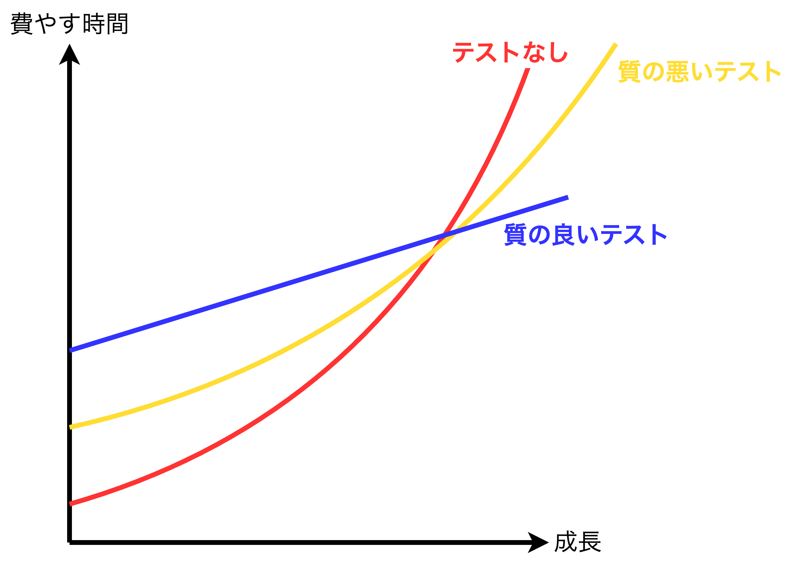

## なぜ、単体テストを行うのか？

- この章で扱うこと
  - 単体テストの現状
  - 単体テストを行うことの目標
  - 単体テストの質の悪さが引き起こす結末
  - 網羅率とテストスイートの質との関係
  - 成功するテストスイートの特徴

### 単体テストの現状

- <font color=red>ほとんどのプロジェクトにおいて単体テストを導入することは当然のことであり、特にエンタープライズアプリケーションにおいては網羅率を高めるために単体テストだけでなく統合(integration)テストも実施される。</font>
- **エンタープライズアプリケーションは組織の内部的な業務を補助・自動化することを目的としたアプリケーション**であり、以下の特徴を持つ。
  1. ビジネスロジックが非常に複雑である
  1. プロジェクトの生存期間が長い
  1. 適切な量のデータしか扱わない（ビッグデータなどは扱わない）
  1. パフォーマンスへの要求はあまり高くない（膨大なユーザがいるわけではない）
- 新機能の追加により既存機能にバグが発生することを避けるためにも、テストコードは重要であり、良いテスト（最小限の労力で最大限の網羅率を保証するテスト）が必要になる。
- テストコードはプロダクションコードの概ね1〜3倍であり、最大10倍になると言われている。

### なぜ、単体テストを行うのか？

- <font color=red>単体テストを行う理由は<b>ソフトウェア開発プロジェクトの成長を持続可能なものにする</b>ということ</font>
- <b>単体テストのしにくさ（しやすさ）はプロダクションコードの質が悪い（悪くない）を検出することにつながるが、質の良さを評価することにはならない。つまり、質の悪さという一方向でしか評価ができない。</b>
- プロダクションコードの質の悪さは通常、密結合が原因であり、コードを分離して個別にテストすることが難しくなっている。
- <u>テストコードを用意することは退行(regression)を検出するセーフティネットを作ること</u>に寄与し、既存機能の振る舞いの正否を判断できる。
  - **退行(regression)**: 特定のイベント後(通常はコードに変更を加えた後)、意図したように機能しなくなることを指す。「退行」と似た用語として「ソフトウェアバグ」がある。

#### テストの質によるプロジェクトの成長の違い

- <font color=red>ソフトウェア開発において、<b>質の良いテストを作る(持続可能な成長を支援する)ことで開発スピードを維持することに寄与する</b></font>。<u>テストはソフトウェアの持続可能な成長を支援する</u>代わりに、最初はそれなりの労力(場合によっては膨大な労力)が必要になる。
- 単体テストを洗い出す際、テストの価値とその保守コスト(労力)のトレードオフを考慮する必要があり、具体的なコストは以下が挙げられる。
  1. プロダクションコードのリファクタリングに伴うテストコードのリファクタリングコスト
  2. プロダクションコードを変更するたびにテストを実施するコスト
  3. テストが間違って失敗した時の対処コスト
  4. プロダクションコードがどのように振る舞うのかを理解するためにテストコードを読む(理解する)コスト
- <font color=red><b>コード(プロダクションコード＋テストコード)は資産ではなく負債</b>であり、コードが増えればバグ経路が増えると解釈することができるため、コードは最小限にすべき。</font>

<table>
  <caption>ソフトウェアエントロピー</caption>
  <tr>
    <td></td>
  </tr>
</table>

### 網羅率(coverage)とテストスイートの質との関係

- <font color=red>網羅率には様々な種類(コード網羅率と分岐網羅率)があり、テストスイートの質を評価する際によく使用され、<b>網羅率はテストスイートが悪くないことを示すだけで、質が良いことを示すものではない</b>(単体テストとプロダクションコードの関係と同じで質の悪さという一方向でしか評価ができない)。</font>
- 具体的には、コード網羅率と分岐網羅率のどちらも以下の問題を持つことからテストスイートの質を評価することはできない。
  - 網羅率からは実際のテスト対象のコードが検証されたのかを保証できない。**例えば、処理結果をプロパティに保持させるケースは網羅率からは保証できない**。
  - 網羅率を算出する際、使用するライブラリ内のコードは計測対象から外れる。**例えば、int.Parseメソッドにおいて、nullや文字列("", "5", "not an int")などがある**。

#### 【補足】コード網羅率

$コード網羅率=\displaystyle{\frac{実行されたコードの行数}{総行数}}$

- <b>コード網羅率は</b>行数しか見ていないため、ちょっとしたことで簡単に算出結果が変わり、<b>テストスイートの価値が正しく判断できない。</b>

```CSharp
// サンプルコード1
public static bool IsStringLong(string input) 
{                       // 1行目
  if(input.Length > 5)  // 2行目
    return true;        // 3行目
  return false;         // 4行目
}                       // 5行目

// サンプルコード2
public static bool IsStringLong(string input) 
{
  return (input.Length > 5)? true : false;
}

public void Test() {
  // サンプルコード1の場合は4/5=80%のコード網羅率
  // サンプルコード2の場合は3/3=100%のコード網羅率
  IsStringLong("abc");
}
```

#### 【補足】分岐網羅率

$分岐網羅率=\displaystyle{\frac{経由された経路の数}{分岐経路の総数}}$

- 分岐網羅率はコードに依存しない(分岐に依存する)値のため、コード網羅率より正確な網羅率の計測ができる。
- コード網羅率のサンプルコード1と2を例にとると両方のサンプルコードとも網羅率は$50\%$になる。

### 何がテストスイートの質を良くするのか？

- <font color=red>結局のところ、テストスイートの評価は各テストケースを1つずつ評価するしかなく、テストスイートの質を自動的に評価できるような方法は存在しない。</font>
- 優れたテストスイートの特徴は以下の通り。
  1. **テストすることが開発サイクルの中に組み込まれている**: コードの変更があるたびにテストが実施されるような開発サイクルが構築されていることが理想。
  2. **ドメインロジック(コードベースの特に重要な部分)のみがテスト対象となっている**: テストの費用対効果を最大化するためにはドメインモデルを対象にする。インフラ(DB接続やファイル操作など)や外部サービス(WebAPIやサードパーティシステムなど)は重要なアルゴリズムを含まない限りテストする価値は小さい。
  ※統合テストやE2Eテストの場合はインフラや外部サービスを含めたシステム全体のテストを行う。
  3. **最小限の保守コスト(労力)で最大限の価値を生み出すようになっている**: 単体テストにおいて最も難しい項目。これを実現するためには①良いテストケースと悪いテストケースを見分ける力と、②価値のあるテストケースを作る力が必要。①は業務知識(ドメイン)が必要で、②はドメインに加えて設計能力も必要(だと思う)。

<div style="page-break-before:always"></div>

### まとめ

- コードベースは成長とともに劣化し、変更を加えるたびにエントロピー(無秩序の量)が増加する。この状況を防ぐためにテストを用意し多くの退行を検出することで、ソフトウェア開発の持続可能な成長を支援する(単体テストの目標)。
- 単体テストを作成することも重要であるが「良い」単体テストを作成することが同じくらい重要である。良い単体テストを作ることで開発スピードを長い間維持し(プロジェクトの停滞を回避し)、リファクタリングや機能追加を容易にする。
- 単体テストのしやすさはプロダクションコード(設計)の質の悪さを評価することはできるが、質の良さを保証できない(質が悪いという一方向の評価しかできない)。つまり、<u>コードは資産ではなく負債として見るべき</u>である。
- 網羅率とテストスイートについても単体テストとプロダクションコードの関係と同様のことが言え、網羅率の高さはテストスイートの質の悪さを評価することができるが、質の良さを保証できない。
- 良いテストスイートの特徴(3つ)
  - テストすることが開発サイクル(例えばコードに変更があったケースなど)に組み込まれている。
  - ドメインロジック(コードベースの特に重要な部分)がテスト対象になっている。
  - 最小限の保守コスト(労力)で最大限の価値を生み出すようになっている。
- 単体テストの目標(ソフトウェア開発の持続可能な成長を支援すること)を達成するために必要な能力
  - テストケースの質の良し悪しを区別できる能力(業務知識が必要)
  - 良いテストケースを作成したり、良いテストコードに修正したりする能力(業務知識＋設計能力が必要)