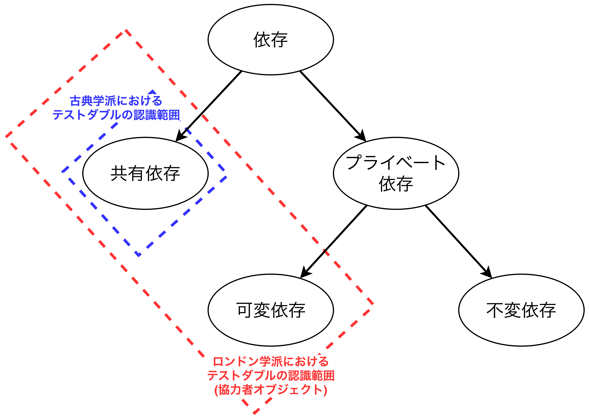
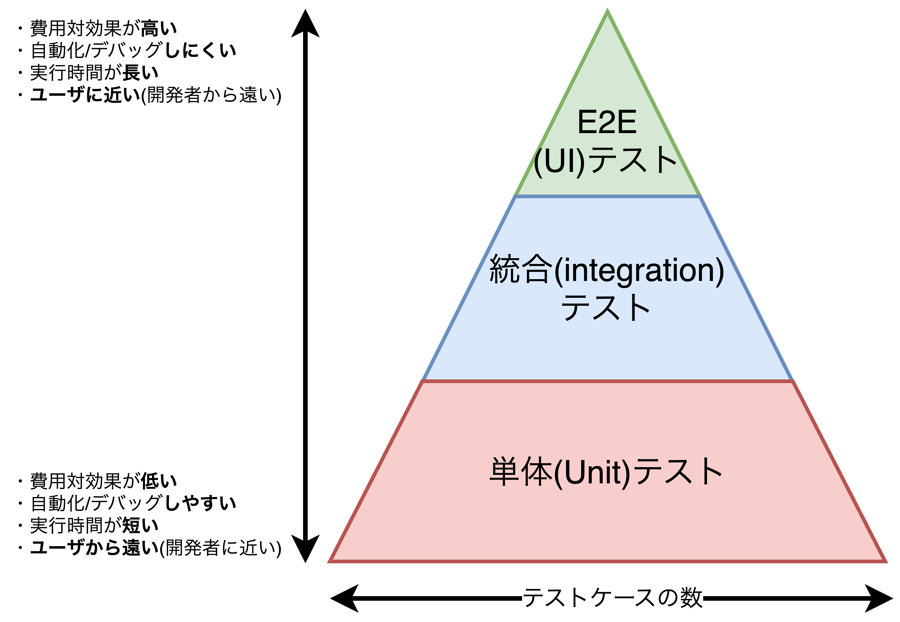
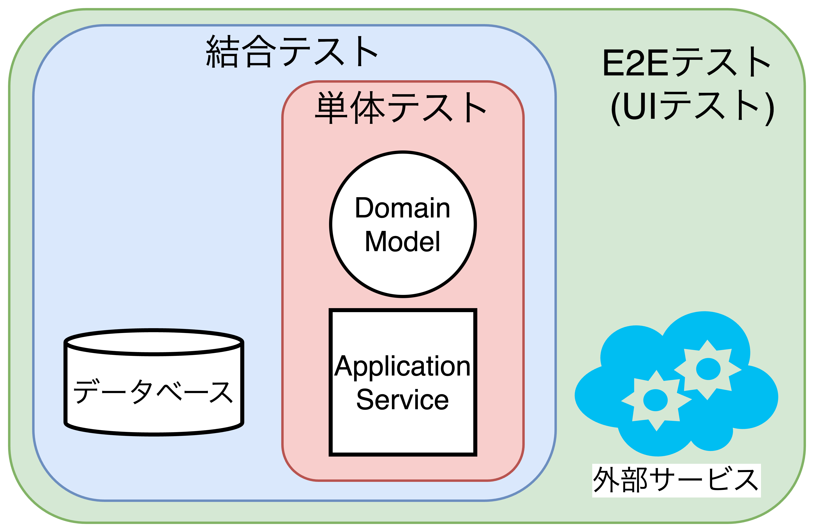

## 単体テストとは何か？

- この章で扱うこと
  - 単体テストとは何か？
  - 共有依存、プライベート依存、揮発性依存の違い
  - 単体テストにおける2つの学派である古典学派とロンドン学派について
  - 単体テスト、結合テスト、E2Eテストの違い

### 単体テストの定義

- 単体テストは以下の3つの性質を全て持った上で、自動化されたテストのこという。
  1. 「単体(unit)」と呼ばれる少量のコードを検証する。
  2. 実行時間が短い(＝想定する時間内に処理が完了している)。
  3. 隔離された状態で実行される。
  ※隔離された状態について、古典学派とロンドン学派によって解釈が異なる。

#### ロンドン学派が考える隔離とは

- <b>ロンドン学派の単体テストでは、1つのクラスをテスト対象として隔離</b>し、テスト対象クラスが他クラスから依存している場合は依存しているクラスをテストダブルに置き換える。
  - **テストダブル**: リリース対象のオブジェクトと同じような見た目と振る舞いを持っていながらも、複雑さを減少させてテストを行いやすくしたオブジェクト。
- ロンドン学派のメリット
  - テストが失敗した時にコードベースのどこで問題が起こったのかを明確にできる。
  - オブジェクトグラフ(オブジェクト間の結びつき)を分離し、複雑な依存関係や循環依存を解消できる(疎結合な設計ができる)。
- ロンドン学派のデメリット
  - <u>モックのメンテナスコストが高くなりやすく、テストの保守性が大きく下がる(**質の悪いテストにつながる**)</u>。例えば、依存クラスである協力者オブジェクト(Collaborator)を修正した際、テストダブルの修正も必要になるが、発見が漏れやすい。

#### 古典学派が考える隔離とは

- <b>古典学派の単体テストでは、1つのテストケースを対象として隔離</b>し、各テストケースをお互いに影響を与えることなく個別に実行できるようにする。そのため、テストケースをどう実行した場合と逐次実行した場合とで結果は常に同じになる。
- ①テストケースごとに隔離することと②実行速度を向上させることを目的として、テストケース間で共有される状態を持つ依存に対してのみテストダブル(≒モック)を使う。**依存関係を分類しながら、どの依存関係にテストダブルを導入するべきか検討する。**
- 依存にはいくつか種類があり、単体テストを効果的に設計するためには、依存を正しく分類し、影響を最小限に抑える工夫が必要。
  1. **共有依存**: テストケース間で共有される依存でありテストダブルの対象になる。例えば、staticなメンバ(フィールドやメソッド)が挙げられ、予期しない動作を引き起こす原因となる。
  2. **プライベート依存**: テストケース間で共有されない依存。プライベート依存はさらに可変依存と不変依存に分けられる。
     - **可変依存**: テストごとに異なる状態や振る舞いを持つ依存。例えば、インスタンスメンバがある。
     - **不変依存**: どのテストでも状態が変わらない依存。例えば、定数がある。
  3. **プロセス外依存**: アプリケーションのプロセス外で稼働する依存。例えば、異なるプロセス間でデータをやり取りする際に利用されることが一般的。
  4. **揮発性依存**: 現在日時や乱数など呼び出すたびに異なる振る舞いをする依存や、開発者の環境に特定の設定が必要となる依存。
- 古典学派のメリット
  - **良い設計に繋がる**(依存関係が複雑な場合のテストは難しくなるため、設計を見直す)。
  - アプリがどのような振る舞いを持つのかわかるため、**テストコードがドキュメントになる**。
  - 1つの動作(ユースケース)を担保でき、統合時にバグが起きる危険性を排除できる。
- 古典学派のデメリット
  - テストケースが煩雑になりやすく、<u>ロンドン学派と比較してエラーが出た際に原因が特定しにくい</u>。
  - 複雑な依存関係がある場合、全体的な動作を検証するのに時間がかかるため、広範なカバレッジが難しい。

### 古典学派およびロンドン学派が考える単体テスト

- ロンドン学派と古典学派で隔離に対する違いが根底にある。
  - **ロンドン学派の隔離対象**: テスト対象システム(TUS: Test Under System)を協力者オブジェクトから隔離する。
  - **古典学派の隔離対象**: テストケースを別のテストケースから隔離する。
- 古典学派はドメイン駆動開発(ドメインロジックの検証)と相性が良く、ロンドン学派は技術駆動開発(クラス間協調の検証)と相性が良い？
- 実際のプロジェクトにおいて、**共有依存でありかつプロセス外依存でない分類**は滅多にない。また、逆の**共有依存でないかつプロセス外依存である分類**も滅多にない。ただし、どちらも恣意的に作ることは可能。

<table>
    <caption>ロンドン学派と古典学派の単体テストにおける見解の違い</caption>
    <tr>
        <th></th>
        <th>隔離対象</th>
        <th>単体の意味</th>
        <th>テストダブルの置き換え対象</th>
    </tr>
    <tr>
        <th>ロンドン学派 (技術駆動開発？)</th>
        <td>単体</td>
        <td>1つのクラス</td>
        <td>不変依存を除くすべての依存 ・共有依存 ・可変依存 ・プロセス外依存</td>
    </tr>
    <tr>
        <th>古典学派 (ドメイン駆動開発？)</th>
        <td>テストケース</td>
        <td>1つのクラス、もしくは 同じ目的を達成するための クラスの1グループ</td>
        <td>共有依存 ・データベース ・ファイルシステム ・クラスメンバ</td>
    </tr>
</table>

<table>
    <tr>
        <th>依存の分類</th>
        <th>共有依存とプロセス外依存の関係</th>
    </tr>
    <tr>
        <td></td>
        <td></td>
    </tr>
</table>

### 単体テストにおける古典学派とロンドン学派の違い

- ロンドン学派の単体テストは外側から内側に向かうテスト駆動開発であり、古典学派の単体テストは内側から外側に向かうテスト駆動開発である。
  - **ロンドン学派の単体テスト**: システム全体がどのように機能するのかを考えた広い視野でのテストケースを作成することから始まる開発になる。
  - **古典学派の単体テスト**: まずドメインロジックやアプリケーションサービスから実装とテストを始めていき、その後にインフラや外部サービスの実装やテストの追加を進める。
- 一般的に、ロンドン学派の方が古典学派より単体テストとプロダクションコードの結びつきが強い傾向がある。
- **テストケースがすべきことはステークホルダにテスト対象のコードが解決しようとしている物語を伝える(≒テストケースをドキュメントにする)こと**である。そのためには凝集度を高め、非開発者でも理解できるようにする。
- <u>複雑な依存関係がある場合テストダブルは非常に有用</u>であるが、**そもそも複雑な依存関係になる原因は間違った設計であることがほとんどである**。
- <u>テストスイートの至る所に失敗が発生する場合</u>、**問題となった箇所(クラスやメソッド)が多くの依存関係を持つことを証明しており、設計や改修によりコードを扱う際に有用な情報になる**。

### 古典学派およびロンドン学派における統合(integration)テスト

- ロンドン学派ではテストダブルではなく、<b>実際の協力者オブジェクトを使って行うテストはすべて統合テストとみなす</b>ため、古典学派の単体テストのほとんどはロンドン学派の視点だと統合テストに分類される。
- **古典学派における統合テスト**は古典学派における単体テストの条件を1つでも損なっているテストを指す。別の言い方で言えば、共有依存・プロセス外依存を含んだテストや同じ組織内の異なるチームによって開発されたコードが統合された状態で検証するテストを指す。

<table>
  <caption>古典学派における単体テストの条件</caption>
  <tr>
    <th>単体テストの定義</th>
    <th>古典学派における単体テストの定義</th>
  </tr>
  <tr>
    <td>「単体(unit)と呼ばれる少量のコードを 検証すること</td>
    <td><b>1単位の振る舞い(a unit of behavior)</b>を 検証すること</td>
  </tr>
  <tr>
    <td>実行時間が短いこと</td>
    <td>実行時間が短いこと(同じ)</td>
  </tr>
  <tr>
    <td>隔離された状態で 実行されること</td>
    <td><b>他のテストケースから隔離された状態</b>で 実行されること</td>
  </tr>
</table>

#### 統合(integration)テストの一種としてのE2Eテスト(UIテスト)

- 統合テストの一種にE2Eテスト(UIテスト)があり、E2Eテストエンドユーザの視点でシステムを検証する。
- <u>統合テストとE2Eテストに明確な違いがあるわけではない</u>が、**一般的に統合テストは1〜2個のプロセス外依存を含むが、E2Eテストはほとんどすべてのプロセス外依存を含むテストを指す**。
- データベースやファイルシステムなどの開発者が完全に制御できる依存関係であれば統合テストで扱うが、制御が難しい(ほとんど不可能)な外部サービス(天気情報のWebAPIや決済サービスなど)についてはテストダブルを用意する。

<table>
    <tr>
        <th>テストピラミッド</th>
        <th>テスト範囲</th>
    </tr>
    <tr>
        <td></td>
        <td></td>
    </tr>
</table>

### まとめ

- 本書における単体テスト(古典学派)の定義は以下の3つの性質を持つものを指す。
  1. 1単位の振る舞い(a unit of behavior)を検証すること
  2. 実行時間が短いこと
  3. 他のテストケースから隔離された状態で実行されること
- 単体テストにおいて、ロンドン学派ではクラス単位(a unit of code)でクラスごとに単体テストを行い、不変依存以外のすべての依存関係をテストダブルに置き換える必要がある。一方、古典学派では振る舞い単位(a unit of behavior)で振る舞いごとに単体テストを行い、他の振る舞いに影響を与える可能性のある共有依存やプロセス外依存をテストダブルに置き換える必要がある。
- 【ロンドン学派のメリット】
  - テストが失敗した時にコードベースのどこで問題が起こったのかを明確にできる。
  - オブジェクトグラフ(オブジェクト間の結びつき)を分離し、複雑な依存関係や循環依存を解消できる(疎結合な設計ができる)。
- 【ロンドン学派のデメリット】
  - <u>モックのメンテナスコストが高くなりやすく、テストの保守性が大きく下がる(**質の悪いテストにつながる**)</u>。例えば、依存クラスである協力者オブジェクト(Collaborator)を修正した際、テストダブルの修正も必要になるが、発見が漏れやすい。
  - 検証内容が詳細になりすぎてしまい、テスト対象の内部的なコードと密接に結びついてしまう(**ロンドン学派の最大の課題**)
- 【古典学派のメリット】
  - **良い設計に繋がる**(依存関係が複雑な場合のテストは難しくなるため、設計を見直す)。
  - アプリがどのような振る舞いを持つのかわかるため、**テストコードがドキュメントになる**。
  - 1つの動作(ユースケース)を担保でき、統合時にバグが起きる危険性を排除できる。
- 【古典学派のデメリット】
  - テストケースが煩雑になりやすく、<u>ロンドン学派と比較してエラーが出た際に原因が特定しにくい</u>。
  - 複雑な依存関係がある場合、全体的な動作を検証するのに時間がかかるため、広範なカバレッジが難しい。
