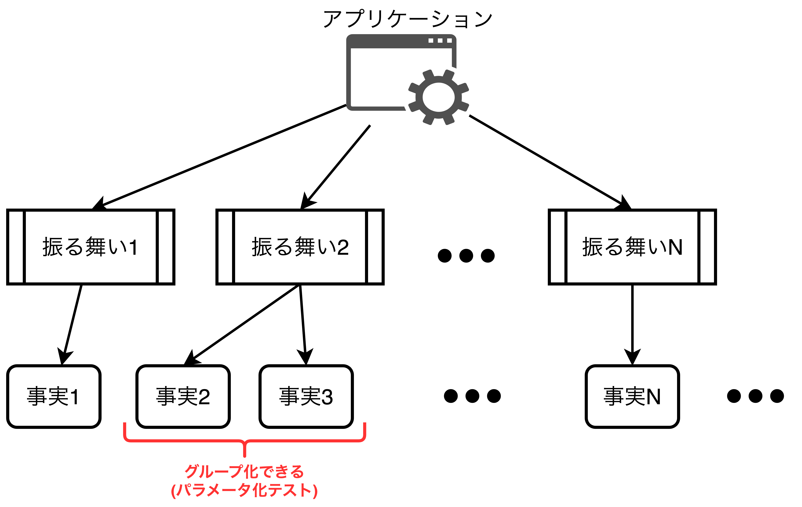

## 単体テストの構造的解析

- この章で扱うこと
  - 単体テストにおけるテストケースの構造
  - テストメソッドに対する名前の付け方に関するベストプラクティス
  - パラメータ化テスト
  - 確認フェーズの読みやすさの改善

### 単体テストの構造

- <font color=red>テストは<b>Arrange(準備)、Act(実行)、Assert(確認)</b>の3フェーズに分けることができ、この構成を<b>AAAパターン(3Aパターン)</b>と呼ぶ。</font>
  - **準備フェーズ(Arrange)**: テスト対象システムとその依存状態を設定するフェーズ
  - **実行フェーズ(Act)**: テスト対象の振る舞いをメソッドを呼び出して実行するフェーズ
  - **確認フェーズ(Assert)**: 実行結果を確認するフェーズ。<u>実行結果はテスト対象システムのメソッドの戻り値、協力者オブジェクトの状態やメソッドの実行有無がある。</u>
- AAAパターンはArrangeから書き始めるケースとAssertから書き始めるケースに分けられる。
  - **Arrangeから始める場合**: テストコードを書く前にプロダクションコードが書かれている場合
  - **Assertから始める場合**: プロダクションコードを書く前にテストコードが書かれている場合(テスト駆動開発の場合)

```CSharp
public class Calculator {
    public double Sum(double first, double second) {
        return first + second;
    }
}

public class CalculatorTests {
    [Fact]
    public void Sum_of_two_numbers() {
        double first = 10, second = 20;
        var sut = new Calcurator(); // System Under Test

        double result = calculator.Sum(first, second);

        Assert.Equal(30, result);
    }
}
```

#### 単体テストにおいて回避すべきこと(2つ)

- <font color=red>1つのテストケースの中に複数の実行フェーズや確認フェーズを持つことは<b>複数の振る舞いを検証していることになるため、避けるべき</b>である。</font>複数の振る舞いを検証している場合は統合テストになる。
- 保守性の観点から見ても、**同じフェーズを複数持つような1つのテストケースよりも、各フェーズが1つしかない複数のテストケースの方が優れている**。
- <font color=red>if文を使ったテストは複数の検証をしていることを示唆しており、可読性・保守性の低下につながるため、避けるべきである。</font>単体テストや統合テストなどすべてのテストにおいてif文は使用してはいけない。

#### 各フェーズ(Arrange, Act, Assert)のサイズはどれくらいが適切なのか？

- <font color=red>通常、Arrangeフェーズが最も大きくなりやすく、場合によってはActとAssertを合わせたサイズと同じくらいになることさえある。</font>もし、Arrangeが2つのフェーズを合わせたサイズよりはるかに大きくなる場合はファクトリクラスを作るべきである。Arrangeフェーズのコードをテストケース間で共有する際に有用なパターンとして、オブジェクトマザーとテストデータビルダーがある。
- <font color=red><b>通常、Actフェーズは1行のコードだけで足りるはずであり、クライアントへ公開するAPIがきちんと設計されていないことを示唆している</font>(大事な考えだと思う)</b>。1つの振る舞いを実行するためにクライアントへ複数のAPIを公開していることになり、<u>コードのカプセル化に失敗している</u>可能性がある。
- <font color=red>Assertフェーズは<u>1つの振る舞いの実行結果に対して1つ以上の確認</u>を行う。</font>確認事項は①テスト対象システムの振る舞い(メソッド)の戻り値や、②協力者オブジェクトの状態、③協力者オブジェクトのメソッドの実行有無などがあることから、<u>振る舞いの実行結果に対する確認事項は必ずしも1つだけになるわけではない。</u>

<div style="page-break-before:always"></div>

### 単体テストのフレームワークについて(xUnit)

- わかりやすくシンプルなことから、<font color=red>本書では単体テストのフレームワークにxUnit( https://github.com/xunit/xunit )をおススメしている。</font>xUnitの他にもMSTestやNUnitもある。
- xUnitでの事前準備に関するロジックはテストクラスのコンストラクタ内に定義する(**NUnitの[SetUp]属性に該当**)。xUnitの後始末のロジックはIDisposableインタフェースの実装クラスとして定義し、Disposeメソッドに後始末のためのロジックを定義する(**NUnitの[TearDown]属性に該当**)。
- **各テストケースはプロダクションコードが解決しようとしている物語(問題領域の個別で不可分なシナリオ＝ユースケース？)について語るべき**である。これにより<u>テストドキュメント(APIドキュメント)としてユーザに見てもらうことができる</u>。

#### xUnitの事前準備と後始末の方法

```CSharp
public class CalculatorTests : IDisposable {
    private readonly Calculator _sut; // テスト対象システム(System Under Test)

    /// <Summary>
    /// xUnitの場合、テストメソッドごとに、
    /// テストクラスのコンストラクタが呼び出される。
    /// </Summary>
    public CalculatorTests() {
        _sut = new Calculator();
    }

    [Fact]
    public void Sum_of_two_numbers() {
        // 1つの振る舞いを検証する
    }

    /// <Summary>
    /// 各テストメソッドが実行された後に、
    /// Disposeメソッドが呼び出されるため、
    /// 後始末の処理を書く。
    /// </Summary>
    public void Dispose() {
        _sut.CleanUp();
    }
}
```

### テストケース間で共有するテストフィクスチャ

- **テストフィクスチャ(Test Fixture)**: テストを実施する際に使われるオブジェクト全般を指し、テスト対象システム(SUT)や協力者オブジェクト(collaborator)、データベースやファイルシステム、テストダブル(≒モック)などが挙げられる。<u>同じテストケースを何度実行しても毎回同じ結果を返すために、**テストフィクスチャは各テストケースの実行前に毎回決められた(fixed)状態になっている**必要がある</u>。
- Arrangeフェーズの記述コードを減らすためにコンストラクタにてテストフィクスチャを準備することがあるが、**①テストケース間の結びつきが強くなる**ことと**②テストケースが読みづらくなる**ことの欠点がある。この欠点を解消するためにプライベートなファクトリメソッド(Create〇〇など)を実装する方法がある。これにより、テストケース間の結びつきを軽減・解消し、テストメソッド内だけで処理が完結できる。

```CSharp
// 【不適切なテストフィクスチャの使い方】
// コンストラクタでテストフィクスチャを作成すると、
// 全テストケースで共通のオブジェクトを使用することになり、
// テストケース間の隔離が難しくなる(最悪できなくなる)。
public class CalculatorTests {
    private readonly Store _store;
    private readonly Calculator _sut;

    public CalculatorTests() {
        _store = new Store();
        _store.AddInventory(Product.Shampoo, 10);
        _sut = new Calculator();
    }
}
```
```CSharp
// 【適切なテストフィクスチャの使い方】
// プライベートなファクトリメソッドを定義し、テストケース間の結びつきをなくす。
public class CalculatorTests {
    private Store CreateStoreWithInventory(Product product, int quantity) {
        Store store = new Store();
        store.AddInventory(product, quantity);
        return store;
    }
    private static Customer CreateCustomer() {
        return new Customer();
    }
}
```

### 単体テストでの名前の付け方

- <font color=red>何を検証しているのか把握することに加えテストをドキュメントとして作るためにも、単体テストの名前を明確にすることは非常に重要である。<b>開発者目線ではなく、ドメインエキスパートの目線でテストメソッドを命名することが重要である。</b></font>
- テストメソッドの命名指針
  1. **厳格な命名規則に縛られないようにする(<font color=red>大事な考えだと思う</font>)**
  2. **ドメインエキスパートに検証内容が伝わるような名前をつける**(開発者の言葉を極力避ける)
  3. **テストメソッド名はアンダースコアで区切るようにする**
- テストメソッドの命名指針(ii)について、テスト対象のメソッド名(開発者の言葉)をできる限りテストメソッド名に含めないようにする。もし、メソッド名を含めている場合コード(クラス)をテストしていることを示唆している。**テストすべきはクラスではなく、振る舞いである**。ただし例外として、<u>ユーティリティ系のコード(ビジネスロジックとは関係のない技術駆動のコード)をテストする場合はテスト対象のメソッド名を含めても良い</u>。
- 単体テストは1つの振る舞いについて1つの不可分な事実を伝えるものであるため、**テストメソッド名には「〜である」というisを使用する**。「〜べき」や「〜かも」などのshouldやmayは使用しない。

### パラメータ化テストへのリファクタリング

- <font color=red>同じテストケースに対して入力パラメータを変え、異なる事実(実行結果)を発生させたい時、パラメータ化テストにより1つのテストケースとしてグループ化することができる。</font>
- <u>パラメータ化テストはコード量を減らすが、可読性の低下(コード量と可読性のトレードオフ)にもつながってしまう</u>ため、正常系と異常系でテストメソッドを分けて定義するなど工夫が必要である。



#### パラメータ化テストで使うデータの作成方法(InlineDataとMemberData)

- **[InlineData]属性**: 入力値が数値や文字列で入力パラメータも少ない場合に使用する。
- **[MemberData]属性**: [InlineData]属性において、大量のパラメータがある場合や、入力値が複雑な型(DateTimeや自作クラス)の場合に使用する。

```CSharp
// InlineData属性を用いたパラメータ化テスト
[InlineData(-1, false)]
[InlineData(0, false)]
[InlineData(1, false)]
[InlineData(2, true)]
[Theory]
public void Can_delete_an_invalid_delivery_date(int daysFromNow, bool expected) {
    DeliveryService sut = new DeliveryService();
    DateTime deliveryDate = DateTime.Now.AddDays(daysFromNow);
    Delivery delivery = new Delivery { Date = deliveryDate };

    bool isValid = sut.IsDeliveryValid(delivery);

    Assert.Equal(expected, isValid);
}
```

```CSharp
// MemberData属性を用いたパラメータ化テスト
[Theory]
[MemberData(nameof(Data), parameters: 2)] // データを2つ用いる(parameters: 2)
public void Can_delete_an_invalid_delivery_date(int daysFromNow, bool expected) {
    DeliveryService sut = new DeliveryService();
    DateTime deliveryDate = DateTime.Now.AddDays(daysFromNow);
    Delivery delivery = new Delivery { Date = deliveryDate };

    bool isValid = sut.IsDeliveryValid(delivery);

    Assert.Equal(expected, isValid);
}
public static List<object[]> Data() {
    return new List<object[]> {
        new object[] { DateTime.now.AddDays(-1), false },
        new object[] { DateTime.now.AddDays(0), false },
        new object[] { DateTime.now.AddDays(1), false },
        new object[] { DateTime.now.AddDays(2), true }
    };
}
```

### まとめ

- 単体テストのすべてのテストケースはArrange(準備)、Act(実行)、Assert(確認)の3つのフェーズで構成される<b>AAAパターン(3Aパターン)</b>を適用すべきであり、1つのテストケースで1単位の振る舞いを検証する必要がある。もし<b>テストケースに複数の実行フェーズや確認フェーズがある場合、テストケースを修正しなければならない</b>。
- 実行フェーズが1行を越す(2行以上になる)場合、クライアントに1つの振る舞いを実現させるために2つ以上のAPIを求めていることになるため、設計を見直し、コードを適切に**カプセル化**できているか確認する必要がある。
- <font color=red><b>各テストケースはプロダクションコードが解決しようとしている物語(問題領域の個別で不可分なシナリオ＝ユースケース？)について語るべき</b>である。これにより<u>テストドキュメント(APIドキュメント)としてユーザに見てもらうことができる</u>。</font>
- テストケースの結びつきとテストメソッドないで処理を完結させるために、テストフィクスチャの準備はコンストラクタではなく、ファクトリメソッドで定義する。
- テストメソッド名をつける際は以下の3つを意識する。特に1つ目が大事になる。
  1. **厳格な命名規則に縛られないようにする**
  2. **ドメインエキスパートに検証内容が伝わるような名前をつける**(開発者の言葉を極力避ける)
  3. **テストメソッド名はアンダースコアで区切るようにする**
- パラメータ化テストは一つの振る舞いに対して複数のテストケースをまとめる際に便利な機能であり、C#のxUnitにおいては[InlineData]属性と[MemberData]属性の2種類がある。