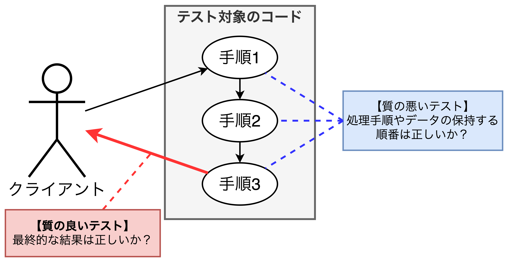
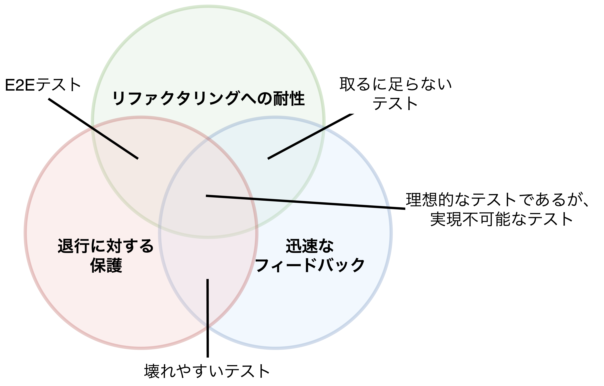
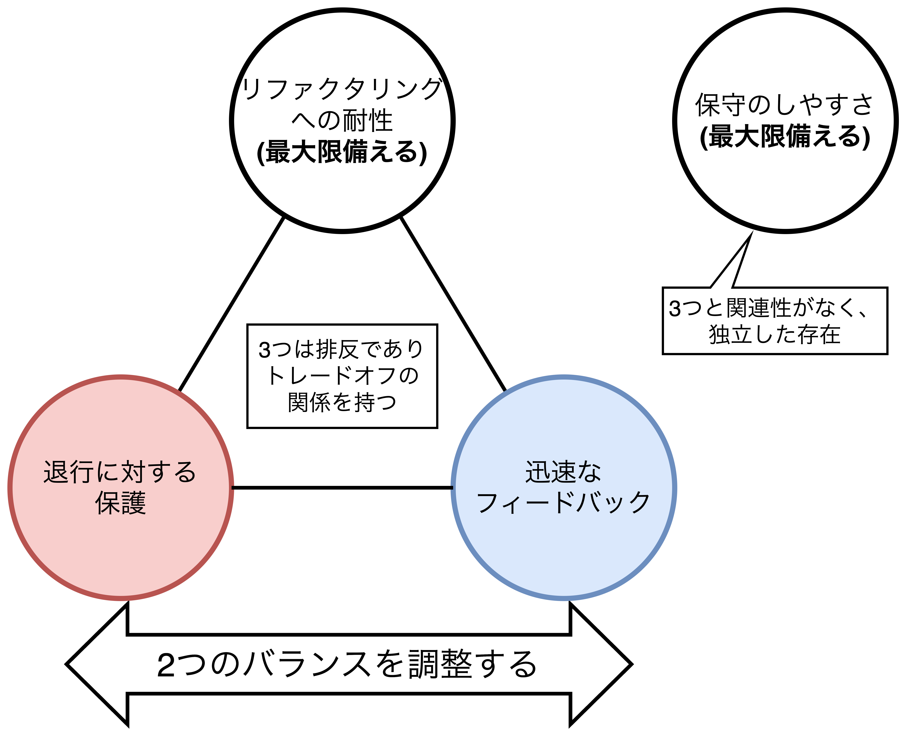
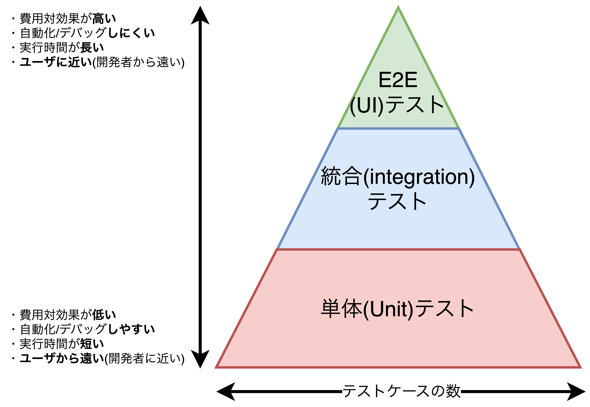
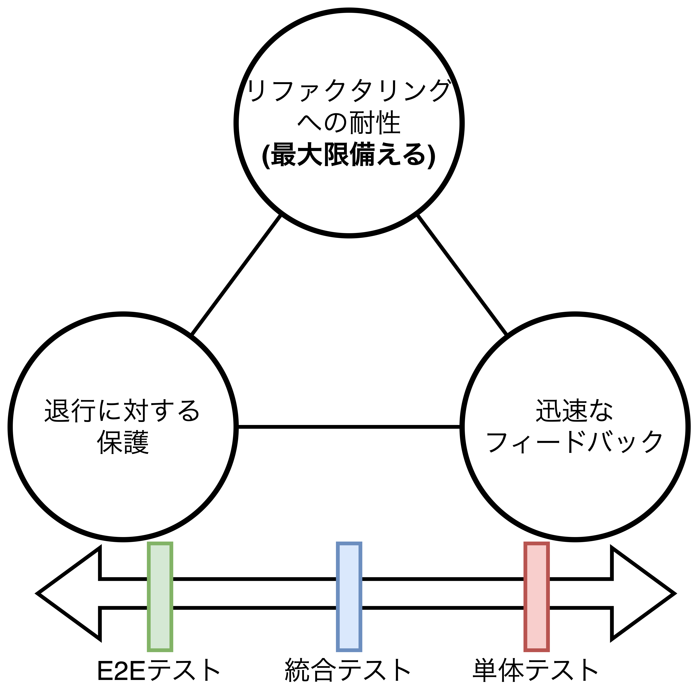

## 良い単体テストを構成する4本の柱

- この章で扱うこと
  - 良い単体テストを構成する性質の大きな分類
  - 理想的なテストについての定義
  - テストピラミッドについて
  - ブラックボックステストとホワイトボックステストの使い方

### 良い単体テストを構成する4本の柱

- 良い単体テストを構成要素として以下があり、単体テスト、統合テスト、E2Eテストなどあらゆるテスト自動化の分析に活用できる。
  1. 退行(regression)に対する保護
  2. リファクタリングへの耐性
  3. 迅速なフィードバック
  4. 保守のしやすさ

#### 退行(regression)に対する保護

- コードは資産ではなく負債であり、<b>コードが大きくなればなるほど潜在的なバグ(バグ経路)が増える</b>ため、退行から保護される仕組みが重要になる。
- 退行から保護されているかどうかは以下の指標から判断する。
  - テスト時に実行されるプロダクションコードの量
  - そのコードの複雑さ
  - そのコードが扱っているドメインの重要性

#### リファクタリングへの耐性

- リファクタリングへの耐性とは、<b>テストが失敗することなくどのくらいプロダクションコードのリファクタリングが行えるのか</b>という意味である。
- リファクタリングへの耐性は言い換えれば、「**偽陽性**が生まれにくい性質」である。偽陽性はテスト対象のコードが意図通りの振る舞いをしている(正解している)が、テスト結果は失敗していることを指す。<u>リファクタリングへの耐性がない(偽陽性が生まれやすい)とプロジェクトの持続可能な成長ができず、単体テストの目的が満たせない。</u>
- リファクタリングの耐性があることにより得られる効果は以下の2つ
  - **既存機能に何らかの問題が入った場合でもテスト時に早い段階で警告される**
  - **プロダクションコードを変更しても退行が起こらないことに自信を持てる**
- 逆にリファクタリングの耐性がないことによる実害は以下のとおり。
  - プロダクションコードに対応する開発者の能力と意志を弱めることになるだけでなく、テスト結果を重要視しなくなり(最悪無視してしまい)、**問題のあるコードが本番環境に持ち込まれてしまう**。
  - テストがセーフティネットとしての機能を失い、コードの変更をできるだけ行いことが退行を防ぐ最善の手段として考えられるようになってしまう(**リファクタリングが敬遠されるようになる**)。
- <u>リファクタリングが未実施のままプロダクションコードが放置されると(不要な機能や古いコードを取り除くことを怠ると)</u>、テスト結果を無視する習慣が出来てしまい、**いつか本番環境にて大きな影響を及ぼすバグ**が発生したときに開発者たちがとても嫌な思いをすることになる。
- リファクタリングの耐性を高く保つためにはテストスイートを分析して、質の悪いテストケースを取りのぞく力が必要になる(7章で詳しく説明する)。

#### 偽陽性の原因とリファクタリングの耐性を持たせる方法

- テストコードがプロダクションコードと深く結びつくことが原因で偽陽性が生まれる。例えば、<b>アルゴリズム(処理手順)や内部的に保持しているデータの順番などを検証することが原因で偽陽性が生まれ、リファクタリングの耐性が低下する</b>。
- **対応策としては検証で確認する内容を振る舞いの最終的な出力結果にすること**である。これにより観察可能な振る舞いにのみ結びつき、内部的な実装の詳細とは結びついていない。

### 退行(regression)に対する保護とリファクタリングへの耐性との関係

- <b>退行に対する保護(偽陰性)とリファクタリングへの耐性(偽陽性)は両方ともテストスイートの正確性を向上させることが目的</b>であり、本質的につながっているが、重要となるタイミングが異なる。
  - **退行に対する保護が重要になるタイミング**: プログラムが始まってすぐに重要になる。
  - **リファクタリングへの耐性が重要になるタイミング**: すぐに必要になるわけではなく、<u>プロジェクトが成長するにつれて重要性が増す</u>。
- 正確性は真陰性、真陽性、偽陰性、偽陽性の4つに分けられる。ここで、`positive`はあることを検証した際に何らかの反応(問題)が検出されることを指す。
  - 退行に対する保護を行う(**偽陰性を減らす**)ことで、バグ検出率を高める(**真陽性を高める**)ことができる。
  - リファクタリングの耐性を持つ(**偽陽性を減らす**)ことで、バグがないこと(**真陰性がある**こと)を示せる。

<table>
    <caption>正確性の分類</caption>
	<tbody>
		<tr>
			<th colspan="2" rowspan="2"></th>
			<th colspan="2">実際の振る舞い</th>
		</tr>
		<tr>
			<th>正しい</th>
			<th>間違い</th>
		</tr>
		<tr>
			<th rowspan="2">テスト 結果</th>
			<th>正解</th>
			<td>真陰性 (true negative)</td>
			<td>偽陰性 (false negative)</td>
		</tr>
		<tr>
			<th>失敗</th>
			<td>偽陽性 (false positive)</td>
			<td>真陽性 (true positive)</td>
		</tr>
	</tbody>
</table>

### 迅速なフィードバックと保守のしやすさ

- <b>迅速なフィードバック</b>はテストの実行頻度と実行回数を上げることに寄与し、より速やかにバグの検出と修正が可能になる。
- **保守のしやすさ**には2つの観点から把握できる。
  - **【観点1】テストケースを理解することがどれくらい難しいか**: テストコードの品質はプロダクションコードの品質と同じくらい重要であり、テストコードの可読性と変更容易性は高く保つ必要がある。テストコードの可読性と変更容易性はテストケースのサイズとトレードオフの関係にあるため、注意が必要である。
  - **【観点2】テストコードの実行がどれくらい難しいか**: プロセス外依存(DBやWebAPIなど)を必要とする場合、テストの実行時間が長くなることが予想されるため、注意が必要である。

### 理想的なテストの探求

- 良いテストケースは①退行に対する保護(0〜1)、②リファクタリングへの耐性(0〜1)の4つの性質を持ち、③迅速なフィードバック(0〜1)、④保守のしやすさ(0〜1)の4つを持ち、テストケースの価値はこれら4つの掛け算で評価できる。
- 現実問題、<b>ソフトウェア開発の持続可能な成長のために不可欠な要素であるリファクタリングへの耐性と保守のしやすさは最大限備える必要がある</b>。その上で、退行に対する保護(偽陰性)と迅速なフィードバック(実行速度)のバランスをとる。
- コード(テストコード＋プロダクションコード)は全て負債であるため、プロジェクトの継続的な成長には価値のあるテストケースを過不足なく必要な分だけ揃えることが重要である。
- <b>退行に対する保護、リファクタリングへの耐性、迅速なフィードバックの3つは互いに排反する性質であるため、バランスを取る必要がある。</b>一方、<u>保守のしやすさは他の3つと関連性がない</u>
  - **E2Eテストは退行に対する保護とリファクタリングへの耐性を備えたテスト**になる。E2Eテストは多くのプロダクションコードが実行されるテストであり、かつ偽陽性(間違った振る舞いを正しいテスト結果と判断されること)が少ないテストであるが、フィードバックが遅い(実行時間が長い)という欠点がある。
  - **取るに足らないテスト(フィールドやプロパティの確認)はリファクタリングへの耐性と迅速なフィードバックを備えたテスト**になる。取るに足らないテストは偽陽性が持ち込まれる可能性が低く、実行時間が非常に短いテストであるが、プロダクションコードと同じことを別の書き方で表現しているだけになるため、常に成功するようなあまり意味のない検証になる。
  - **壊れやすいテストは退行に対する保護と迅速なフィードバックを備えたテスト**になる。<u>壊れやすいテスト</u>はテスト対象がコードの内部的な詳細と結びついているテストであり、テストケースの「何(what)」ではなく、「どのように(how)」に着目したテストであるため、<u>リファクタリングへの耐性がない質の悪いテスト</u>に該当する。

<table>
    <tr>
        <th>良い単体テストのトレードオフ</th>
        <th>良い単体テストのバランス</th>
    </tr>
    <tr>
        <td></td>
        <td></td>
    </tr>
</table>

### ソフトウェア・テストにおけるよく知られた概念

#### テストピラミッド

- テストレベル(層)ごとの理想的なテストケース数の比率を表したものをテストピラミッドといい、<u>各層ごとに退行に対する保護と迅速なフィードバックのバランスが異なる。</u>
- テストレベルごとのテストケース数はチームやプロジェクトによりさまざまであるが、$E2Eテスト(5\%)<統合テスト(20\%)<単体テスト(75\%)$ぐらいの感覚。

<table>
    <tr>
        <th>テストピラミッド</th>
        <th>各層ごとのバランス</th>
    </tr>
    <tr>
        <td></td>
        <td></td>
    </tr>
</table>

#### ブラックボックステストとホワイトボックステスト

- ブラックボックステストは入出力からテスト対象を検証する方法であり、リファクタリングへの耐性を知る際に優れている。ホワイトボックステストは内部処理からテスト対象を検証する方法であり、退行に対する保護を知る際に優れている。
- **テストケースを作成はブラックボックステストを利用し、その後のテストケースの分析(コード網羅、分岐網羅などの計測)はホワイトボックステストを利用する**。ホワイトボックステストは不足しているテストケースの発見のために利活用する。

<table>
    <caption>ブラックボックステストとホワイトボックステスト</caption>
	<tbody>
		<tr>
			<th></th>
			<th>退行に対する保護(偽陰性)</th>
			<th>リファクタリングの耐性(偽陽性)</th>
		</tr>
		<tr>
			<th>ホワイトボックステスト</th>
			<td>優れている</td>
			<td>劣っている</td>
		</tr>
		<tr>
			<th>ブラックボックステスト</th>
			<td>劣っている</td>
			<td>優れている</td>
		</tr>
	</tbody>
</table>

### まとめ

- 良い単体テストの構成要素は①退行に対する保護、②リファクタリングへの耐性、③迅速なフィードバック、④保守のしやすさの4つであり、それぞれ以下の特徴を持つ。
  - ①と②はテストの正確性を向上させる性質であり、①はバグの検出率を高め、②は①で検出されたバグの中のノイズ(バグではないのにバグと判断されたテスト結果)を少なくすることに貢献する。
  - ①はプロジェクトの初期から重要であり、②はプロジェクトが成長するにつれ重要になる。②が不足すると開発者のリファクタリングへの意思を奪い、プロジェクトの成長に伴い、本番環境へ重大な不具合が持ち込まれる可能性を生む。
  - ③が不足すると、実行時間が長くなってしまい、開発速度が遅くなる。
  - ④が不足するとテストコードが理解しにくく(テストサイズが大きく)、実行が難しい(依存関係が多い)単体テストになる。
  - ①〜③は排反の関係にあり、①〜③の全てを満たすテストケースは存在しない。④は①〜③と関連性がなく、独立した構成要素になる。
  - **現実問題として②と④は最大限備え、①と③はプロジェクトの要件やチームの状況に応じてバランスをとる必要がある**。
- テストピラミッドに基づくと、テストスイートは単体テスト、統合テスト、E2Eテストの順でエンドユーザに近いテストであり、テスト数が少なくなるように構成する必要がある。
- 退行に対する保護と迅速なフィードバックの間でE2Eテストは退行に対する保護が優位であり、単体テストは迅速なフィードバックが優位になる。統合テストはその中間に位置する。
- **テストケースを作成する**際はブラックボックステストを用いて、**テストケースを分析(テストケースの抜け漏れを発見)する**際はホワイトボックステストを用いる。