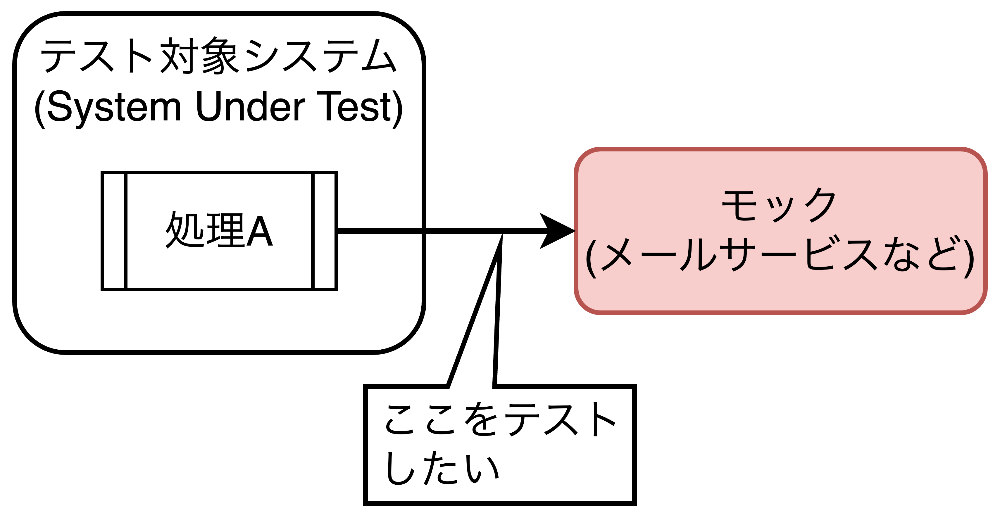
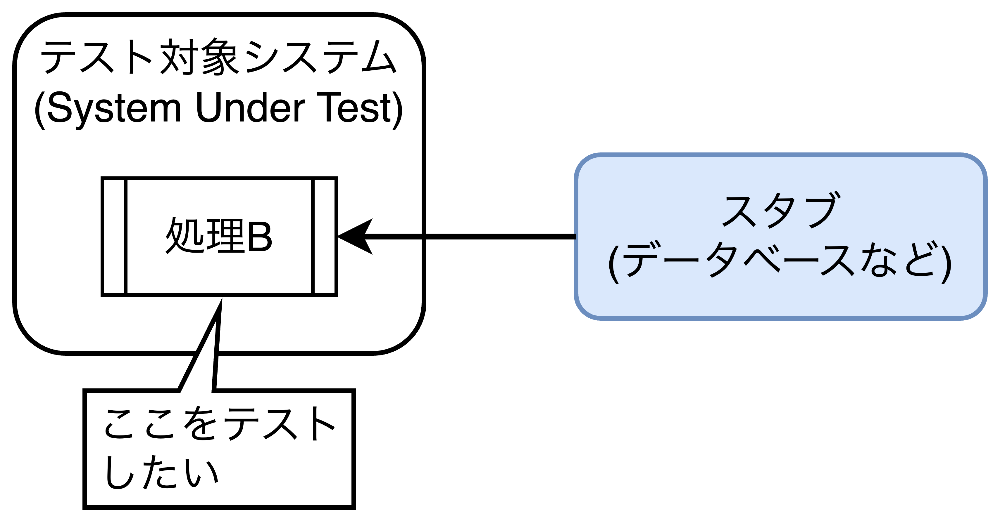
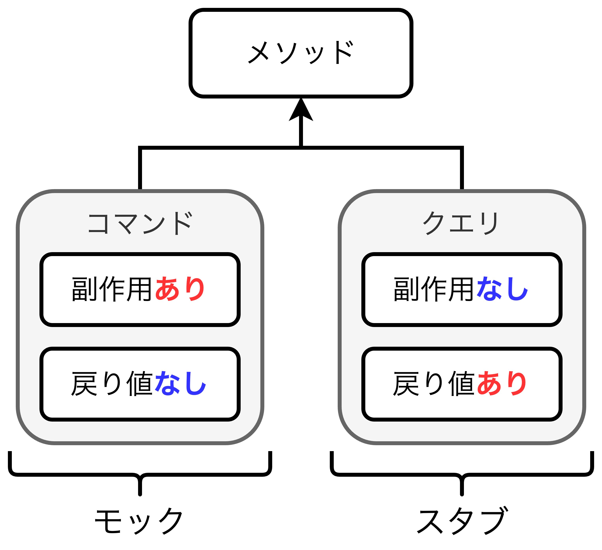
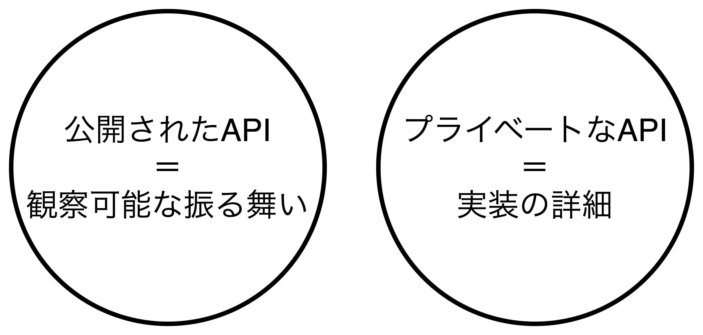
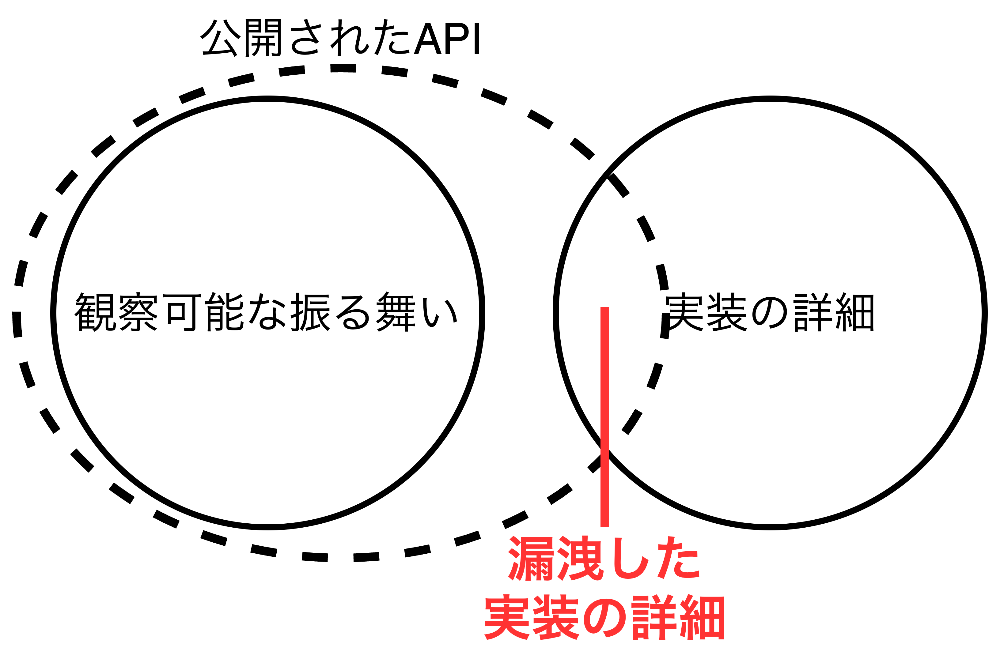
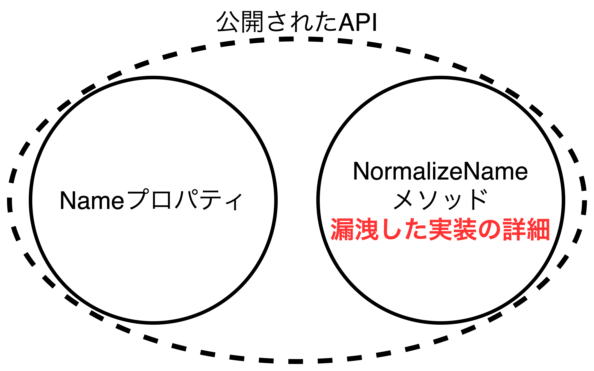
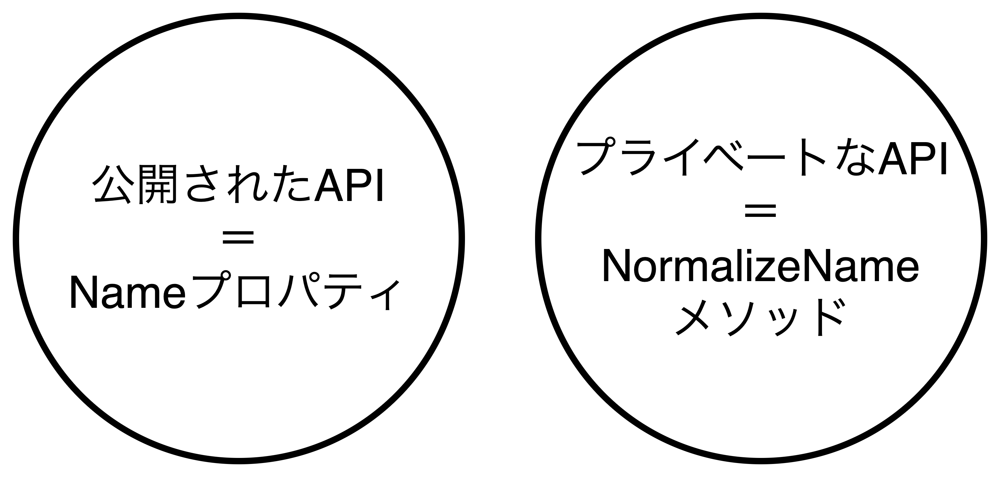
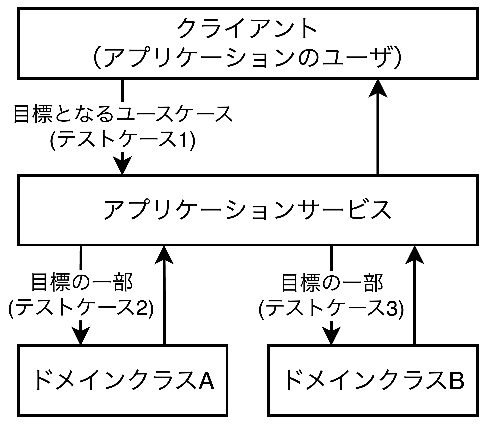
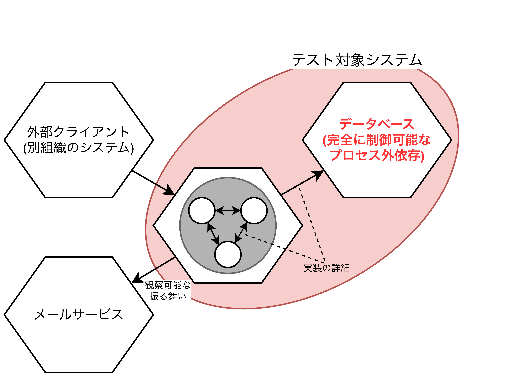

## モックの利用とテストの壊れやすさ

- この章で扱うこと
  - モックとスタブの違い
  - 観察可能な振る舞いと実装の詳細の定義
  - モックの利用とテストの壊れやすさと関係
  - リファクタリングへの耐性を損なわずにモックを使う方法

### モックとスタブの違い

- テストダブルはプロダクションコードには含まれず、テストでしか使用しないオブジェクトの総称であり、円滑にテストを実施する際に利用される。
- テストダブルは大きくモックとスタブの2つに分けられる。
  - **モック**: テスト対象システムの処理結果である出力データを受けるテストダブル。
  - **スタブ**: テスト対象システムの処理に必要な入力データを返すテストダブル。
- <font color=red>モックはテスト対象システムとの通信で必要な<u>模倣と検証</u>を行い、スタブはテスト対象システムとの通信で必要な<u>模倣のみ</u>を行う。</font>
- スタブは最終的な結果を生み出すための一過程に過ぎないが、モックは最終的な出力データに結びつく処理を提供する。
- **リファクタリングの耐性に備える(偽陽性を持ち込まない)唯一の方法はドメインエキスパート(非開発者)に意味のある最終的な処理結果のみに絞ることであり、実装の詳細にはならないようにすることである。**

<table>
  <tr>
    <th>モック</th>
    <th>スタブ</th>
  </tr>
  <tr>
    <td></td>
    <td></td>
  </tr>
</table>

<div style="page-break-before:always"></div>

#### 複数の意味を持つ「モック」

```CSharp
以下のサンプルコードから伝えたいことは以下の2つ
・変数mockはテストダブルとしてのモックである。
・Mockクラスは道具としてのモックであり、スタブとしても作成が可能である。

// Mockクラスを使ったモックの作成
[Fact]
public void Sending_a_greeting_email() {
  var mock = new Mock<IEmailGateway>(); // テストダブルとしてモック(mock)を作成
  var sut = new Controller(mock.Object);

  sut.GreetUser("user@email.com");

  // sutがmockに対してSendGreetingEmailメソッドを一度呼び出されたか検証する。
  mock.Verify( 
    x => x.SendGreetingEmail("user@email.com"),
    Time.Once
  );
}

// Mockクラスを使ったスタブの作成
[Fact]
public void Creating_a_report() {
  int expected = 10;
  var stub = new Mock<IDatabase>(); // テストダブルとしてスタブを作成
  stub                              // GetNumberOfUsersメソッドを事前に定義しておく。
    .Setup(x => x.GetNumberOfUsers())
    .Returns(10);
  var sut = new Controller(stub.Object);

  Report report = sut.CreateReport();

  Assert.Equal(expected, report.NumberOfUsers);
}
```

<div style="page-break-before:always"></div>

#### モックとスタブの両方の性質を持ったテストダブル

- **コマンド・クエリ分離の原則**に基づいて、モックとスタブは分けることができる。具体的には、<font color=red>モックはコマンド(戻り値なしで副作用ありのメソッド)としての役割を与え、スタブはクエリ(戻り値ありで副作用なしのメソッド)の役割を与えることが望ましい。</font>
- モックとスタブの両方の性質を持つ場合は「モック」と呼ぶ。理由は検証(Verify)があるからである。スタブは検証を行わない。
- 例外として<u>Stack.Popメソッド</u>や<u>Iterator.Nextメソッド</u>があるが極力避けた方が良い。

```CSharp
// モックとスタブの両方の性質を持ったテストダブル
[Fact]
public void Purchase_fails_when_not_enough_inventory() {
  var storeMock = new Mock<IStore>();
  storeMock.Setup(x => x.HasEnoughInventory(Product.Shampoo, 5)).Returns(false);
  var sut = new Customer();

  bool success = sut.Purchase(storeMock.Object, Product.Shampoo, 5);

  Assert.False(success);
  storeMock.Verify( // モックからRemoveInventoryメソッドが一度も呼び出されていないことを検証する。
    x => x.RemoveInventory(Product.Shampoo, 5),
    Times.Never
  );
}
```



### 観察可能な振る舞い(observable behavior)と実装の詳細(implementation detail)

- すべてのプロダクションコードは以下の観点から分類できる
  - <font color=red>【観点1】公開されたAPI(public修飾子)なのか、プライベートなAPI(private修飾子)なのか。</font>
  - <font color=red>【観点2】観察可能な振る舞いなのか、実装の詳細なのか。</font>
- 観察可能な振る舞い(observable behavior)は以下の2つの内どちらかを満たす。どちらも満たさないものは実装の詳細(implementation detail)になる
  - **クライアント(外部I/F、呼び出し元のクラスなど)が目標を達成するために使う公開された操作**〜計算ロジックやオブジェクトの内部情報が変わる(副作用を起こす)メソッド〜
  - **クライアント(外部I/F、呼び出し元のクラスなど)が目標を達成するために使う公開された状態**〜システムのコンディション〜
- 理想は<b>「公開されたAPI」と「観察可能な振る舞い」が一致</b>し、かつ、<b>「プライベートなAPI」と「実装の詳細」が一致</b>している(すべての実装の詳細がクライアントから隠れている)。

<table>
  <tr>
    <th>理想的な公開APIの設計</th>
    <th>不正な公開APIの設計</th>
  </tr>
  <tr>
    <td></td>
    <td></td>
  </tr>
</table>

<table>
	<tbody>
		<tr>
			<th></th>
			<th>観測可能な振る舞い</th>
			<th>実装の詳細</th>
		</tr>
		<tr>
			<th>公開</th>
			<td>すべき</td>
			<td>すべきでない</td>
		</tr>
		<tr>
			<th>プライベート</th>
			<td>該当しない<br>(<u>クライアントの目標を達成できない</u>)</td>
			<td>すべき</td>
		</tr>
	</tbody>
</table>

<div style="page-break-before:always"></div>

#### 公開されたAPIから漏洩する実装の詳細

- <font color=red>理想とするAPIの設計は「<b>1つの目標を1つの操作で達成できる</b>」ようにすることである。</font>1つの目標を達成するために2つ以上の操作を実行している場合は設計を見直す必要がある。

##### 不適切な公開(実装の詳細が漏れているケース)

- 実装の詳細(NormalizeNameメソッド)が漏れているため、<u>UserController(クライアント)はユーザ名を変更するためにuserに対して2つの処理(NormalizeNameメソッドの呼び出しとNameプロパティのset)が必要</u>になっている。



```CSharp
public class User {
  public string Name { get; set; }
  public string NormalizeName(string name) {
    string result = (name ?? "").Trim();
    if(result.Length > 50)
      return result.Substring(0, 50);
    return result;
  }
}
public class UserController { // クライアント
  public void RenameUser(int userId, string newName) {
    User user = GetUserFromDatabase(userId);
    string normalizedName = user.NormalizeName(newName); // userに対する1つ目の処理
    user.Name = normalizedName; // userに対する2つ目の処理
    SaveUserToDatabase(user);
  }
  // 続き...
}
```

<div style="page-break-before:always"></div>

##### 修正後の適切な公開

- UserクラスのNormalizeNameメソッドをカプセル化し、Nameプロパティ内部で呼び出すようにすることで、クライアントから参照できない状態にする。これにより、<font color=red><u>UserController(クライアント)はuserに対して1つの処理を実行するだけで目標を達成することができるようになる。</u></font>



```CSharp
public class User {
  private string _name;
  public string Name { 
    get => _name; 
    set => _name = NormalizeName(value);
  }
  private string NormalizeName(string name) {
    string result = (name ?? "").Trim();
    if(result.Length > 50)
      return result.Substring(0, 50);
    return result;
  }
}
public class UserController { // クライアント
  public void RenameUser(int userId, string newName) {
    User user = GetUserFromDatabase(userId);
    user.Name = newName; // 【大事】 1行で目標を達成できる
    SaveUserToDatabase(user);
  }
  // 続き...
}
```

<div style="page-break-before:always"></div>

### モックの利用とテストの壊れやすさとの関係

- 一般的にアプリケーションがドメイン層とアプリケーションサービス層に分かれており、正しく設計されたAPIは自己相似的(フラクタル)な構造をとるため、その構造はテストにも波及する。
- <font color=red><b>アプリケーションサービス層では目標となるユースケースをテストし、ドメイン層では目標の一部をテストする構造になる。</b>これらのテストはドメインエキスパートがわかるようなテストであること(観測可能な振る舞いのみが公開され、実装の詳細が非公開になっていること)が望ましい。</font>
- クライアント(外部アプリケーション)はアプリケーションサービスを呼び出し、アプリケーションサービスはドメインを呼び出す。これにより<u>**適切にAPIを公開し、依存関係を一方向に保ったまま、実装の詳細が外側に漏れることを防ぐ**</u>。例外としては、**ユーティリティやインフラ(DB、ファイルなどの永続化層)などのコードは**解決しようとしている問題があまりにも低レイヤになる(操作の粒度が細かい)ため、公開されるAPIから**達成したい目標(ビジネス要求やユースケース)をたどることが難しい**。
- <u>テストケースはクライアントが達成したい目標(ユースケース)とアプリケーション間の通信を意識する</u>。これにより、最終的な出力と途中の処理を見分け、正しくモックを扱い、テストケースを壊れにくくする。



<div style="page-break-before:always"></div>

### 振り返り: 単体テストの古典学派とロンドン学派の違い

- 【振り返り】ロンドン学派ではアプリケーションサービスやドメインなどを考慮せず、無差別にテストダブルを使用するため、実装の詳細と結びつくケースが多く発生する。一方、古典学派はテストケース間で共有される依存(プロセス外依存)のみをテストダブルに置き換える。
- <font color=red>古典学派において、プロセス外依存にアクセスするのにテスト対象のアプリケーションを常に経由する場合(DBやファイルなどにアクセスする際、必ずSUTを経由するケースなど)は、<u>観察可能な振る舞いではなく実装の詳細として扱う</u>必要がある。</font>
- 完全に制御可能なプロセス外依存(データベースなど)をモックに置き換えると、テーブル設計やストアドルーチンの引数変更に対して弱くなり、テストケースが失敗するようになり壊れやすくなる。そのため、<u>データベース(Infra)とアプリケーション(App)を一つのシステムとして扱わなければならない。</u>
- データベース(完全に制御可能なプロセス外依存)とアプリケーションを一つのシステムとして扱う場合、実行時間が長くなり、迅速なフィードバックに備えられないことになるため、注意が必要である。



<div style="page-break-before:always"></div>

### まとめ

- テストダブルとはプロダクションコードには含まれない偽りの依存として表現されるオブジェクトの総称であり、モックとスタブの大きく2つに分けられる。
  - **モック**: テスト対象システムの出力結果(観測可能な振る舞い)を受けるテストダブルであり、テスト対象システムから外部アプリケーションへ向かう**外側の通信を模倣し、検証する**。
  - **スタブ**: テスト対象システムの処理に必要な入力(実装の詳細)を提供するテストダブルであり、外部アプリケーションからテスト対象システムへ向かう**内側の通信の模倣のみを行う**。
- コマンドクエリ分離の原則に基づくと、モックはコマンド(副作用あり・戻り値なし)、スタブはクエリ(副作用なし・戻り値あり)という役割でテストダブルを置き換える。
- すべてのプロダクションコードは①公開されたAPIなのかプライベートなAPIなのか、と②観察可能な振る舞いなのか実装の詳細なのかの2つの観点で分類できる。
  - ①はアクセス修飾子(publicやprivate)の設定により容易に制御可能
  - ②は以下のいずれかを満たすものは観察可能な振る舞い、いずれも満たさないものは実装の詳細に該当する。
    - クライアントが目標を達成するために使う公開された操作〜計算ロジックや内部状態が変わるメソッド〜
    - クライアントが目標を達成するために使う公開された状態〜システムのコンディション〜
- **適切に設計されたAPI**は公開されたAPIと観察可能な振る舞いが一致し、かつプライベートなAPIと実装の詳細が一致している。不正な設計がされたAPIは公開されたAPIに実装の詳細が漏れており、カプセル化の必要がある。
- 一般的なアプリケーションはアプリケーションサービス層とドメイン層から構成される。外部アプリケーション(クライアント)はアプリケーションサービス層と通信(**システム間通信**)し、アプリケーションサービス層はドメイン層と通信(**システム内通信**)する関係にすることで依存関係を1方向に保ち、実装の詳細が漏れることを防ぐ。
  - **システム間通信**: 観察可能な振る舞いの一部であり、テスト対象として扱う。
  - **システム内通信**: 実装の詳細であり、クラス間の通信が該当する。また完全に制御可能なプロセス外依存(DBなど)もシステム内通信とする。