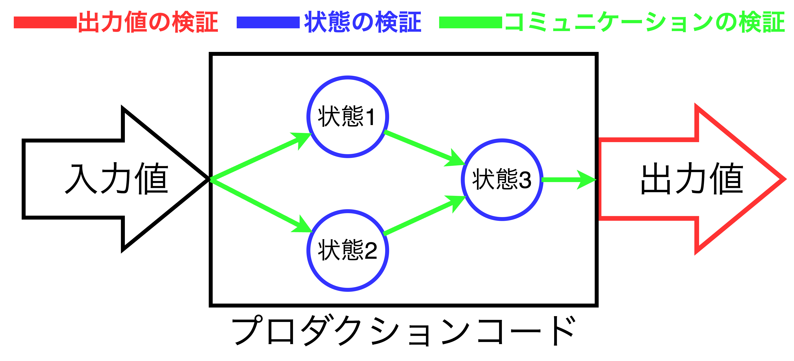
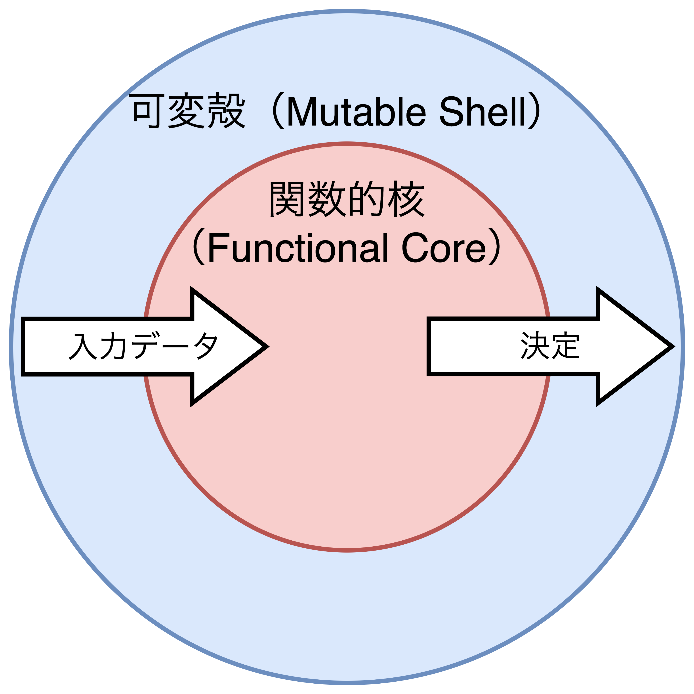
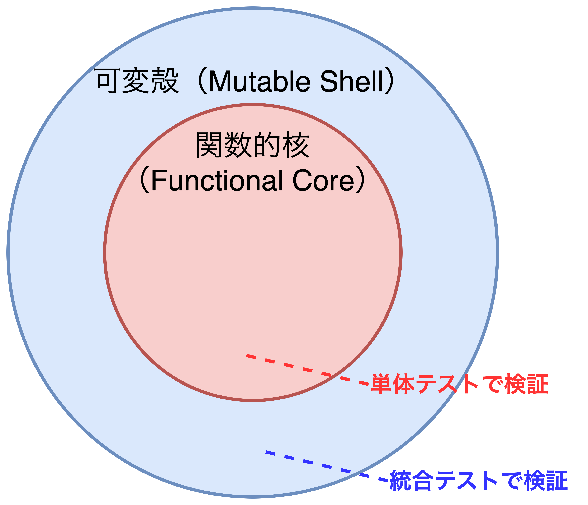
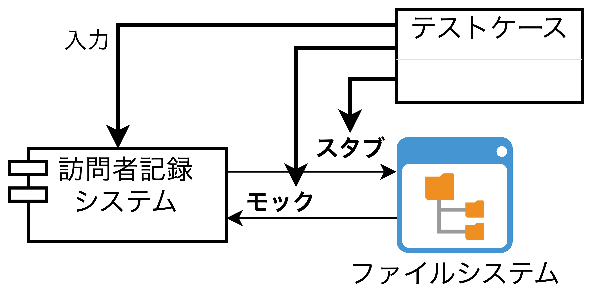
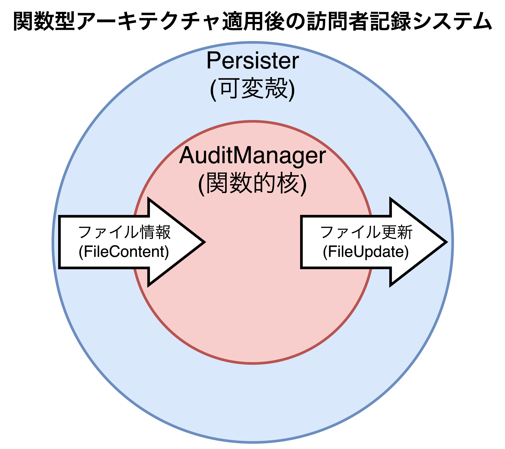

## 単体テストの3つの手法

- この章で扱うこと
  - 単体テストの手法の比較
  - 関数型アーキテクチャと碧さ後なるアーキテクチャとの関係
  - 出力地ベーステストへの移行

### 単体テストの3つの手法

- 単体テストは3種類に分けられる。
  - **出力値ベーステスト**: テスト対象に入力血を渡した後、出力値を検証するテスト。<u>適用条件はテスト対象システムと協力者オブジェクトの状態が処理前後で変わらないことが挙げられる</u>。
  - **状態ベーステスト**: 検証する処理の実行が終わった後にテスト対象システムや協力者オブジェクト、プロセス外依存などの状態を検証するテスト。
  - **コミュニケーションベーステスト**: モックを用いてテスト対象システムと協力者オブジェクト間の通信を検証するテスト。
- <font color=red>1つのテストケースについて、いずれか1種類のテストを適用することもあれば、3種類(出力値/状態/コミュニケーションベーステスト)適用することもある。</font>
- 古典学派ではコミュニケーションベーステストが好まれ、ロンドン学派では状態ベーステストが好まれる傾向にある。出力値ベーステストは両学派で使用される。



#### 出力値ベーステストの適用例

```CSharp
public class PriceEngine {
    public decimal CalculateDiscount(params Product[] products) {
        decimal discount = products.Length * 0.01m;
        return Math.Min(discount, 0.2m); // 「m」はC#においてdecimal型であることを意味する。
    }
}

[Fact]
public void Discount_of_two_products() {
    var product1 = new Product("Hand wash");
    var product2 = new Product("Shampoo");
    var sut = new PriceEngine();

    decimal discount = sut.CalculateDiscount(product1, product2);

    Assert.Equal(0.02m, discount);
}
```

#### 状態ベーステストの適用例

```CSharp
public class Order {
    private readonly List<Product> _products = new List<Product>();
    public IReadOnlyList<Product> Products => _products.ToList();
    public void AddProduct(Product product) {
        _products.Add(product);
    }
}

[Fact]
public void Adding_a_product_to_an_order() {
    var product = new Product("Hand wash");
    var sut = new Order();

    sut.AddProduct(product);

    Assert.Equal(1, sut.Products.Count);
    Assert.Equal(product, sut.Products[0]);
}
```

#### コミュニケーションベーステストの適用例

```CSharp
[Fact]
public void Sending_a_greetings_emails() {
    var emailGatewayMock = new Mock<IEmailGateway>();
    var sut = new Controller(emailGatewayMock.Object);

    sut.GreetUser("user@emai.com");

    emailGatewayMock.Verify(
        x => x.SendGreetingsEmail("user@email.com"),
        Times.Once
    );
}
```

<div style="page-break-before:always"></div>

### 良い単体テストの4つの性質から3つの手法を比較

- <font color=red><b>退行に対する保護</b>は単体テストの手法によって差はなく、単体テストの作成者の判断によって差が出る。</font>ただし、<u>モックを使用するコミュニケーションベーステストは例外であり、モックの使用過多によって浅いテストになってしまう可能性がある</u>ため注意が必要。
- <font color=red><b>迅速なフィードバック</b>は単体テストの手法によって影響を受けることはほとんどない。</font>強いて言えば、<u>完全に制御可能なプロセス外依存を扱うケースのみ実行速度を考慮する必要がある</u>が、ほとんど無視できるレベルのはずである。
- <font color=red>出力値ベーステスト、状態ベーステスト、コミュニケーションベーステストの順で<b>リファクタリングの耐性(偽陽性)</b>がある。</font><u>理由は実装の詳細との結びつきが出力値、状態、コミュニケーションの順で弱いから</u>である。
- <font color=red><b>保守のしやすさ</b>はテストの理解しやすさ(テストコードの量)と実行の難しさ(プロセス外依存の数)で決まり、出力値ベーステスト、状態ベーステスト、コミュニケーションベーステストの順で保守がしやすい。</font>
  - **出力値ベーステスト**: 入力値に対する出力値の検証だけになるため、最も保守しやすい。
  - **状態ベーステスト**: 状態の検証を単純化する(楽にする)ためにプロダクションコードに処理(メソッド)を追加することが発生するケースが多々あるため、出力値ベーステストよりは保守がしにくい。
  - **コミュニケーションベーステスト**: 3つの手法の中で最も保守がしにくい。モックの作成が必要なことが主な原因であり、テストダブル(モックやスタブ)が別のテストダブルを返す事象(**モックの連鎖**)につながるため、保守コストが高くなりやすい。

<table>
    <caption>単体テスト手法の比較</caption>
	<tbody>
		<tr>
			<th></th>
			<th>出力値ベーステスト<br>(費用対効果が最も高い)</th>
			<th>状態ベーステスト</th>
			<th>コミュニケーション<br>ベーステスト</th>
		</tr>
		<tr>
			<th>退行に対する保護</th>
			<td colspan=3>テスト手法の違いによる差はない</td>
		</tr>
		<tr>
			<th>迅速なフィードバック</th>
			<td colspan=3>テスト手法の違いによる差はない</td>
		</tr>
		<tr>
			<th>リファクタリングへの耐性</th>
			<td>高い</td>
			<td>中程度</td>
			<td>低い</td>
		</tr>
		<tr>
			<th>保守のしやすさ</th>
			<td>しやすい</td>
			<td>普通</td>
			<td>しにくい</td>
		</tr>
	</tbody>
</table>

<div style="page-break-before:always"></div>

### 関数型アーキテクチャについて

#### 関数型プログラミングとは？

- <font color=red><b>関数型プログラミング</b>は、隠れた入力や出力がない関数(数学的関数または純粋関数)を用いたプログラミング</font>のことであり、<u>受け取った入力値が同じであれば常に同じ出力値が必ず返ってくる性質(<b>参照透過性</b>)を持つ</u>。
- 隠れた入力や出力が発生する種類は以下の通り。
  - **副作用(最も多い事象)**: オブジェクトの状態が変更されることやディスク上のファイルが更新されることといった、<u>入出力データ以外のデータが変更されること</u>。
  - **例外**: 例外をスローすることで<u>隠れた出力値を返すこと</u>。ただし、メソッドシグネチャで定義したデータ型を返すのであれば良い。
  - **内部もしくは外部の状態への参照**: 現在日時(DateTime.Now)や乱数(Random)などの<u>隠れた入力値(可変フィールド)を取得/参照すること</u>。

```CSharp
public class Num {
    private int val = 1;
    
    // 関数型プログラミングではない例
    public static int Increment() {
        val++;
        return val;
    }

    // 関数型プログラミングの例
    public static int Increment(int x) {
        return x + 1;
    }
}
```

<div style="page-break-before:always"></div>

#### 関数型アーキテクチャとは？

- <font color=red><b>関数型アーキテクチャ</b>とは数学的関数によるコードを最大化しつつ、副作用を扱うコードを最小化したアーキテクチャ</font>であり、以下の式を満たす。
$$max\ \ \frac{数学的関数のコード量}{副作用を扱うコード量}$$
- **関数型プログラミングの目標はビジネスロジックを扱うコードと副作用を起こすコードを分離すること**であり、ビジネスロジックと副作用の分離は次の2種類のコードに分離することで行われる。
  - **関数的核・不変核(決定を下すコード)**: 副作用を起こさず、他の層から隔離された状況でも機能するコードであり、数学的関数を使って記述可能。
  - **可変殻(決定に基づくアクションを実行するコード)**: 数学的関数によって決定された観察可能な振る舞いの一部(データベースの操作やメッセージの送信など)に変換する。
- 関数型アーキテクチャでは関数的核が可変殻に依存してはならないため、以下のような連携が重要になる。
  1. 可変殻にて、関数的核に渡すすべての入力データが集められる。
  2. 関数的核は可変殻から受け取った入力データを元に決定を下す。
  3. 可変殻は関数的核が下した決定をもとに副作用を発生させる。
- **関数型アーキテクチャでは、単体テストで関数的核だけを検証し、可変殻の検証は統合テストに任せる。**

<table>
    <caption>関数型アーキテクチャ</caption>
    <tr>
        <th>オペレーション</th>
        <th>テストイメージ</th>
    </tr>
    <tr>
        <td></td>
        <td></td>
    </tr>
</table>

#### 関数型アーキテクチャとヘキサゴナルアーキテクチャの比較

- <font color=red>関数型アーキテクチャとヘキサゴナルアーキテクチャは「責任の分離」と「依存方向が一方向である」ことに関して類似しているが、<b>「副作用の扱い」について違いがある</b>。</font>
  - **関数型アーキテクチャの副作用の扱い**: 全副作用を関数的核の外に出し、オペレーションの最初や最後に配置する。
  - **ヘキサゴナルアーキテクチャの副作用の扱い**: ドメイン層内に限定される限り、副作用を許す。
- 関数型アーキテクチャはヘキサゴナルアーキテクチャの一種であり、ヘキサゴナルアーキテクチャに極端な制限(副作用の扱い)を課したアーキテクチャとして見ることができる。

<div style="page-break-before:always"></div>

### 関数型アーキテクチャおよび出力値ベーステストへの移行

- <font color=red>関数型アーキテクチャへ移行するためには「<b>プロセス外依存→モック→関数型アーキテクチャ</b>」の順で移行する必要がある。</font>

#### 【作業0】サンプルプロジェクト「訪問者記録システム」

- テキストファイル(訪問者記録ファイル)に訪問者の記録を残し、訪問のたびに訪問者の名前と日時を最新の訪問者記録ファイルの最後に追加する。
- 以下に示す現在のコードだとAuditManagerクラスがファイルシステム(共有依存・プロセス外依存)と深く結びついているためテストがしにくい。


<table>
    <caption>AuditManagerクラスの単体テストの評価</caption>
    <tr>
        <th></th>
        <th>最初のバージョン</th>
    </tr>
    <tr>
        <th>退行に対する保護</th>
        <td>良い</td>
    </tr>
    <tr>
        <th>リファクタリングへの耐性</th>
        <td>良い</td>
    </tr>
    <tr>
        <th>迅速なフィードバック</th>
        <td>悪い</td>
    </tr>
    <tr>
        <th>保守のしやすさ</th>
        <td>悪い</td>
    </tr>
</table>

<div style="page-break-before:always"></div>

##### 【サンプル】訪問者記録ファイルとソースコード
```text
<!-- audit_01.txt -->
Peter;  2019-04-06T16:30:00
Jane;   2019-04-06T16:40:00
Jack;   2019-04-06T17:00:00

<!-- audit_02.txt -->
Mary;   2019-04-06T17:30:00
{訪問者};   {訪問日時}
```
```CSharp
public class AuditManager {
    private readonly int _maxEntriesPerFile;
    private readonly string _directoryName;

    /* コンストラクタではフィールドの初期化のみを行っている。 */

    public void AddRecord(string visitorName, DateTime timeOfVisit) {
        string[] filePaths = Directory.GetFiles(_directoryName);
        (int index, string path)[] sorted = SortByIndex(filePaths);
        string newRecord = visitorName + ";" + timeOfVisit;

        if(sorted.Length == 0) { // 訪問者記録ファイルがない場合(初回実行)
            string newFile = Path.Combine(_directoryName, "audit_1.txt");
            File.WriteAllText(newFile, newRecord);
            return;
        }

        (int currentFileIndex, string currentFilePath) = sorted.Last();
        List<string> lines = File.ReadAllLines(currentFilePath).ToList();

        if(lines.Count < _maxEntriesPerFile) {
            lines.Add(newRecord);
            string newContent = string.Join("\r\n", lines);
            File.WriteAllText(currentFilePath, newContent);
        } else {
            string newFile = Path.Combine(_directoryName, $"audit_{currentFileIndex + 1}.txt");
            File.WriteAllText(newFile, newRecord);
        }
    }
}
```

<div style="page-break-before:always"></div>

#### 【作業1】モックを用いたファイルシステム(プロセス外依存)の分離

- <font color=red>プロダクションコードがプロセス外依存と深く結びついている場合、一般的にはモックに置き換えることで解決できる。具体的には<u>プロダクションコード上のファイル操作部分をインタフェースとして抽出</u>する。</font>これにより、<u>無駄なファイル作成や処理時間の遅延がなくなる</u>。
- モック導入後により、迅速なフィードバックの改善できたが、保守コストは高い(テストケースが読みにくい)ままであり、まだ改善の余地がある。



<table>
    <caption>AuditManagerクラスの単体テストの評価</caption>
    <tr>
        <th></th>
        <th>最初のバージョン</th>
        <th>モック導入後</th>
    </tr>
    <tr>
        <th>退行に対する保護</th>
        <td>良い</td>
        <td>良い</td>
    </tr>
    <tr>
        <th>リファクタリングへの耐性</th>
        <td>良い</td>
        <td>良い</td>
    </tr>
    <tr>
        <th>迅速なフィードバック</th>
        <td>悪い</td>
        <td><font color=red>良い</font></td>
    </tr>
    <tr>
        <th>保守のしやすさ</th>
        <td>悪い</td>
        <td>悪い</td>
    </tr>
</table>

##### 修正後のプロダクションコード(IFileSystemインタフェースをフィールドに追加)

```CSharp
public interface IFileSystem { //追加するファイル操作インタフェース
    string[] GetFiles(string directoryname);
    void WriteAllText(string filePath, string content);
    List<string> ReadAllLines(string filePath);
}

public class AuditManager {
    private readonly int _maxEntriesPerFile;
    private readonly string _directoryName;
    private readonly IFileSytem _fileSystem; // ファイル操作インタフェース追加
    
    public void AddRecord(string visitorName, DateTime timeOfVisit) {
        // インタフェース呼び出し
        string[] filePaths = _fileSystem.GetFiles(_directoryName);
        (int index, string path)[] sorted = SortByIndex(filePaths);
        string newRecord = visitorName + ";" + timeOfVisit;

        if(sorted.Length == 0) {
            string newFile = Path.Combine(_directoryName, "audit_1.txt");
            // インタフェース呼び出し
            _fileSystem.WriteAllText(newFile, newRecord);
            return;
        }

        (int currentFileIndex, string currentFilePath) = sorted.Last();
        // インタフェース呼び出し
        List<string> lines = _fileSystem_.ReadAllLines(currentFilePath).ToList();

        if(lines.Count < _maxEntriesPerFile) {
            lines.Add(newRecord);
            string newContent = string.Join("\r\n", lines);
            // インタフェース呼び出し
            _fileSystem_.WriteAllText(currentFilePath, newContent);
        } else {
            string newFile = Path.Combine(_directoryName, $"audit_{currentFileIndex + 1}.txt");
            // インタフェース呼び出し
            _fileSystem.WriteAllText(newFile, newRecord);
        }
    }
}
```

##### 修正後のプロダクションコードに対して正当なモックを使用したテストコード

```CSharp
[Fact]
public void A_new_file_is_created_when_the_current_file_overflows() {
    // Arrangeフェーズは入力値や出力値をそのまま使用しているだけであり、
    // 読みにくいままであり、改善の余地がある。
    var fileSystemMock = new Mock<IFileSystem>();
    fileSystemMock
        .Setup(x => x.GetFiles("audits"))
        .Returns(new string[] {
            @"audits/audit_1.txt",
            @"audits/audit_2.txt"
        });
    fileSystemMock
        .Setup(x => x.ReadAllLines(@"audits/audit_2.txt"))
        .Returns(new List<string> {
            @"Peter;    2019-04-06T16:30:00",
            @"Jane;     2019-04-06T16:40:00",
            @"Jack;     2019-04-06T17:00:00",
        });
    var sut = new AuditManager(3, "audits", fileSystemMock.Object);

    sut.AddRecord("Alice", DateTime.Parse("2019-04-06T18:00:00"));

    fileSystemMock.Verify(x => x.WriteAllTest(
        @"audits/audit_3.txt",
        "Alice;     2019-04-06T18:00:00"
    ))
}
```

<div style="page-break-before:always"></div>

#### 【作業2】関数型アーキテクチャのリファクタリング

- <font color=red>副作用を取り除く(保守コストを低く保つ)ために、<u>処理に必要な入出力データに対して処理をするPersisterクラスを新たに追加し、AuditManagerクラスは決定を下すことだけにする</u>。</font>
- **Persisterクラスは発生する副作用を処理する可変殻のクラス**であり、指定ディレクトリから訪問者記録ファイルの中身を返すReadDirectoryメソッドとAuditManagerクラスの決定内容をファイルに反映(更新)させるApplyUpdateメソッドの2つを持つ。
- **AuditManagerクラスはビジネスロジックのすべての複雑さを処理する関数的核のクラス**であり、入力データ(FileContent)の解析や書き込み内容(FileUpdate)の決定などの処理を担う。
- **アプリケーションサービスは関数的核と可変殻の管理/連携を行うクラス**である。
- 関数型アーキテクチャの適用により、迅速なフィードバックを維持したまま保守のしやすさが改善されている。



<table>
    <caption>AuditManagerクラスの単体テストの評価</caption>
    <tr>
        <th></th>
        <th>最初のバージョン</th>
        <th>モック導入後</th>
        <th>関数型アーキテクチャの適用後</th>
    </tr>
    <tr>
        <th>退行に対する保護</th>
        <td>良い</td>
        <td>良い</td>
        <td>良い</td>
    </tr>
    <tr>
        <th>リファクタリングへの耐性</th>
        <td>良い</td>
        <td>良い</td>
        <td>良い</td>
    </tr>
    <tr>
        <th>迅速なフィードバック</th>
        <td>悪い</td>
        <td>良い</td>
        <td>良い</td>
    </tr>
    <tr>
        <th>保守のしやすさ</th>
        <td>悪い</td>
        <td>悪い</td>
        <td><font color=red>良い</font></td>
    </tr>
</table>

##### 修正後のプロダクションコード(AuditManagerクラスを決定を下すだけのクラスに修正)

```plantuml
title "クラス図"

class "クライアント\n(外部サービス)" as client
package Domain {
    class FileContent
    class FileUpdate
    class Persister #def {
        --
        + ReadDirectory(string): FileContent[]
        + ApplyUpdate(string, FileUpdate): void
    }
    class AuditManager #fdd {
        --
        + AuditManager(int)
        + AddRecord(FileContent[], string, DateTime): FileUpdate
    }
}
package ApplicationService {
    class VisitManager {
        - AuditManager
        - Persister
        --
        + VisitManager(string, int)
        + AddRecord(string, DateTime): void
    }
    note left of VisitManager
    関数的核と可変殻の連携を
    担当するクラス。
    end note
}

client => VisitManager : use
VisitManager *-- AuditManager
VisitManager *-- Persister
Persister -[hidden]- FileContent
AuditManager-[hidden]- FileUpdate
```

```CSharp
/* アプリケーションサービス層 */
public class VisitManager {
    private readonly string _directoryName;
    private readonly AuditManager _auditManager;
    private readonly Persister _persister;

    public VisitManager(string directoryName, int maxEntriesPerFile) {
        _directoryName = directoryName;
        _auditManager = new AuditManager(maxEntriesPerFile);
        _persister = new Persister();
    }

    public void AddRecord(string visitorName, DateTime timeOfVisit) {
        // ファイル情報(可変殻)
        FileContent[] files = _persister.ReadDirectory(_directoryName);
        
        // ドメインロジック(関数的核)
        FileUpdate update = _auditManager.AddRecord(files, visitorName, timeOfVisit); 

        // ファイル更新(可変殻)
        _persister.ApplyUpdate(_directoryName, update);
    }
}
```

```CSharp
/* ドメイン層(可変殻) */
public class FileContent { // ファイル情報クラス
    public readonly string FileName;
    public readonly string[] Lines;

    public FileContent(string fileName, string[] lines) {
        FileName = fileName;
        Lines = lines;
    }
}
public class FileUpdate { // ファイル更新クラス
    public readonly string FileName;
    public readonly string NewContent;

    public FileUpdate(string fileName, string newContent) {
        FileName = fileName;
        NewContent = newContent;
    }
}
public class Persister { // 可変殻の処理を担うクラス
    public FileContent[] ReadDrectory(string directoryName) {
        return Directory
            .GetFiles(directoryName)
            .Select(x => new FileContent(Path.GetFileName(x), Path.ReadAllLines(x)))
            .ToArray();
    }
    public void ApplyUpdate(string directoryName, FileUpdate update) {
        string filePath = Path.Combine(directoryName, update.FileName);
        File.WriteAllText(filePath, update.NewContent);
    }
}
```
```CSharp
/* ドメイン層(関数的核) */
public class AuditManager { // 関数的核の処理を担うクラス
    private readonly int _maxEntriesPerFile;
    
    /* 戻り値をFileUpdateに変更 */
    public FileUpdate AddRecord(FileContent[] files, string visitorName, DateTime timeOfVisit) {
        (int index, FileContent file)[] sorted = SortByIndex(files);
        string newRecord = visitorName + ";" + timeOfVisit;

        if(sorted.Length == 0) {
            return new FileUpdate("audit_1.txt", newRecord);
        }

        (int currentFileIndex, FileContent currentFile) = sorted.Last();
        List<string> lines = currentFile.Lines.ToList();

        if(lines.Count < _maxEntriesPerFile) {
            lines.Add(newRecord);
            string newContent = string.Join("\r\n", lines);
            return new FileUpdate(currentFile.FileName, newContent);
        } else {
            string newName = $"audit_{currentFileIndex + 1}.txt";
            return FileUpdate(newName, newRecord);
        }
    }
}
```

##### 修正後のプロダクションコードに対して正当なモックを使用したテストコード

```CSharp
[Fact]
public void A_new_file_is_created_when_the_current_file_overflows() {
    var sut = new AuditManager(3);
    var files = new FileContent[] {
        new FileContent("audit_1.txt", new string[0]),
        new FileContent("audit_2.txt", new string[] {
            "Peter; 2019-04-06T16:30:00",
            "Jane;  2019-04-06T16:40:00",
            "Jack;  2019-04-06T17:00:00",
        })
    };

    FileUpdate update = sut.AddRecord(files, "Alice", DateTime.Parse("2019-04-06T18:00:00"));

    Assert.Equal("audit_3.txt", update.FileName);
    Assert.Equal("Alice;2019-04-06T18:00:00", update.NewContent);
}
```

#### 【作業3】開発がさらに進んだ時のシナリオ

- <font color=red>現状の訪問者記録システムは訪問者の記録を追加することはできるが、以下に示すような他のユースケースは考慮されていない。
  - <b>特定の訪問者を削除するユースケース</b>
  - 入力データチェック(訪問者名の最大文字数、日付の異常値チェックなど)</font>
- 例えば、**特定の訪問者を削除するユースケースを考える場合**、①複数の訪問記録ファイルを読み込むことや、②訪問者の削除後に空のファイルができてしまうこと、さらには③クラス設計の見直し(ファイル操作の列挙型の作成やFileUpdateをFileActionにクラス名を変更するなど)が考えられる。
- 関数型アーキテクチャにおけるエラーハンドリングにはメソッドの戻り値にエラーを付与する方法がある。<u>エラーの内容をアプリケーションサービスクラスがエンドユーザに返す</u>。

##### 関数型アーキテクチャにおけるエラーハンドリングの実装例

```CSharp
public class AuditManager {
    /* メソッドの戻り値を変える */
    public (FileUpdate update, Error error) AddRecord(
        FileContent[] files,
        string visitorName,
        DateTime timeOfVisit
    ) { /* ... */ }
}
```

<div style="page-break-before:always"></div>

### 関数型アーキテクチャの欠点

- <font color=red>関数型アーキテクチャの特徴上、関数的核の処理を呼び出す前に入力データをすべて集めている必要がある。しかし、<b>関数的核の途中処理の結果を用いてプロセス外依存から新たにデータを取得する場合などはうまく導入できない</b>。</font>
- 例えば、訪問者記録システムに対して、24時間以内に訪問した人の数が指定した訪問者数の最大値よりも多くなった場合に訪問者のアクセスレベルを確認するという新たな仕様が追加されることになったとする。この場合、次の2つが対応策として考えられるが、いずれも欠点がある。
  - 【**対応策1**】アプリケーションサービスが事前に訪問者のアクセスレベルの情報も持つようにする。
  - 【**対応策1の欠点**】アクセスレベルの情報取得のためにデータベースにアクセスする必要があり、パフォーマンスの低下が考えられる。
  - 【**対応策2**】AuditManagerクラスにアクセスレベルの検証の要否を判断するメソッド(IsAccessLevelCheckRequiredなど)を追加し、アプリケーションサービスがAddRecordメソッドを呼び出す前に実行する。
  - 【**対応策2の欠点**】アプリケーションサービスにメソッド呼び出しの要否を委ねることになり、<u>ドメインロジックがアプリケーションサービスに漏れてしまう</u>。
- ここで注意しなければならないことは、**ドメインモデル(AuditManagerクラス)にデータベース接続の処理は絶対にしてはいけない(リポジトリクラスにしてもらう)**。これは関心の分離に違反する。

#### パフォーマンスに関する欠点

- <font color=red>関数型アーキテクチャの適用により、プロセス外依存への呼び出しが多く行われるため全体的なパフォーマンスが落ちることになる。</font>例えば、訪問者記録システムにおいて、当初はファイル名だけを取得していたところ、関数型アーキテクチャの適用によりファイルを読み込み、中身を確認するようになった。
- 関数型アーキテクチャは「入力データの収集→決定→実行」の形式に基づいているため必然的に**パフォーマンスと保守のしやすさとのトレードオフ**がある。

#### コードベースが肥大化する欠点

- <font color=red>関数型アーキテクチャでは関数的核と可変殻を明確に分離するため、<b>実装するコード量が多くなる傾向にある</b>。</font>そのため、<u>複雑なことがほとんどなく、ビジネス的観点においても重要でないシステムに対しては関数型アーキテクチャを採用する意味はない</u>。

<div style="page-break-before:always"></div>

### まとめ

- 単体テストの手法には、**出力値ベーステスト**、**状態ベーステスト**、**コミュニケーションベーステスト**の3つがある。
- 出力値ベースは実装の詳細と結びつくことがあまりなく、リファクタリングの耐性を持ち、テストケースが比較的小さいため、**保守がしやすい質の良い単体テストを作成することができる**。
- 状態ベーステストは出力値ベーステストよりもコード量が増える傾向にあり、また、テストをしやすくするためにヘルパーメソッドや値オブジェクトを実装することがある。これは**プロダクションコードの汚染**につながり、保守性を下げることから避けるべき方法である。
- コミュニケーションベーステストはモックを多用する可能性(**モックの連鎖**)があるため最も保守が難しい手法である。コミュニケーションベーステストはアプリケーションサービスの境界を超えており、かつ、外部から確認できる副作用を発生させる場合に限るが基本的には使わないほうが良い。
- 古典学派は状態ベーステストを好み、ロンドン学派はコミュニケーションベーステストを好む。出力値ベーステストは両学派で使用される。
- **関数型プログラミングとは隠れた入出力を持たない関数(数学的関数・純粋関数)を用いたプログラミング**のことであり、副作用や例外は隠れた出力、内部や外部の状態を参照/取得することは隠れた入力に該当する。**関数型プログラミングを導入する目的**はビジネスロジックと副作用の明確な分離であり、これによりテストを行いやすくする。
- 関数型アーキテクチャはすべてのコードを「決定を下す処理である関数的核」と「入力データの提供や関数的核で下された決定に基づいて副作用を起こす処理を行う可変殻」に分類し、以下の式を満たすことを目指す。
$$max\ \ \frac{数学的関数のコード量}{副作用を扱うコード量}$$
- **関数型アーキテクチャはパフォーマンスと保守のしやすさのトレードオフ**を持ち、初期開発のコード量が比較的多くなる。採用基準としては<u>①対象システムが複雑さを持つかどうか</u>、<u>②重要なシステムであるかどうか</u>、が挙げられる。