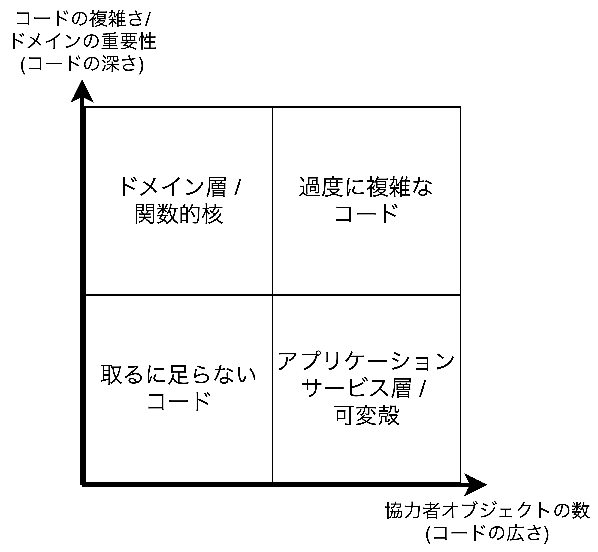
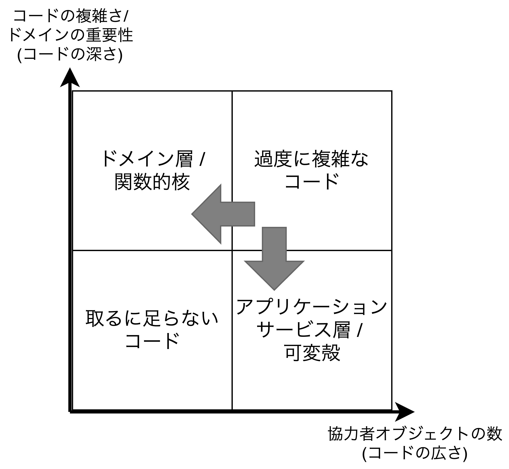
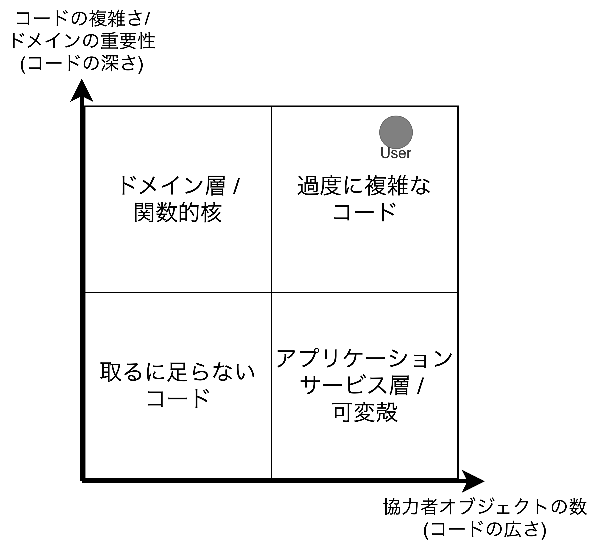
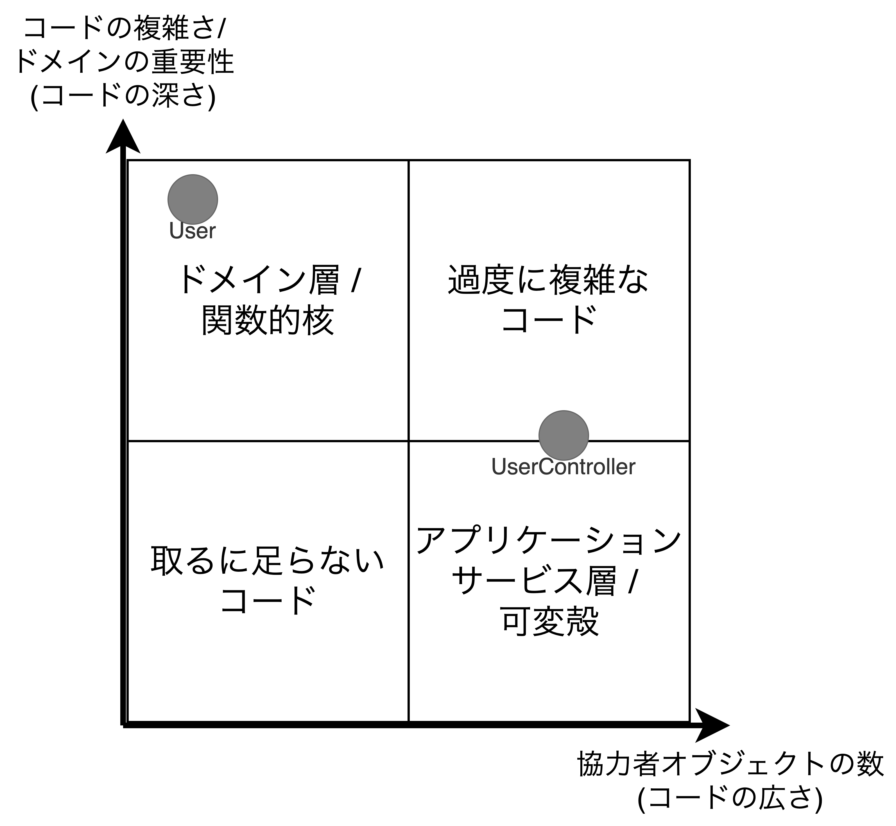
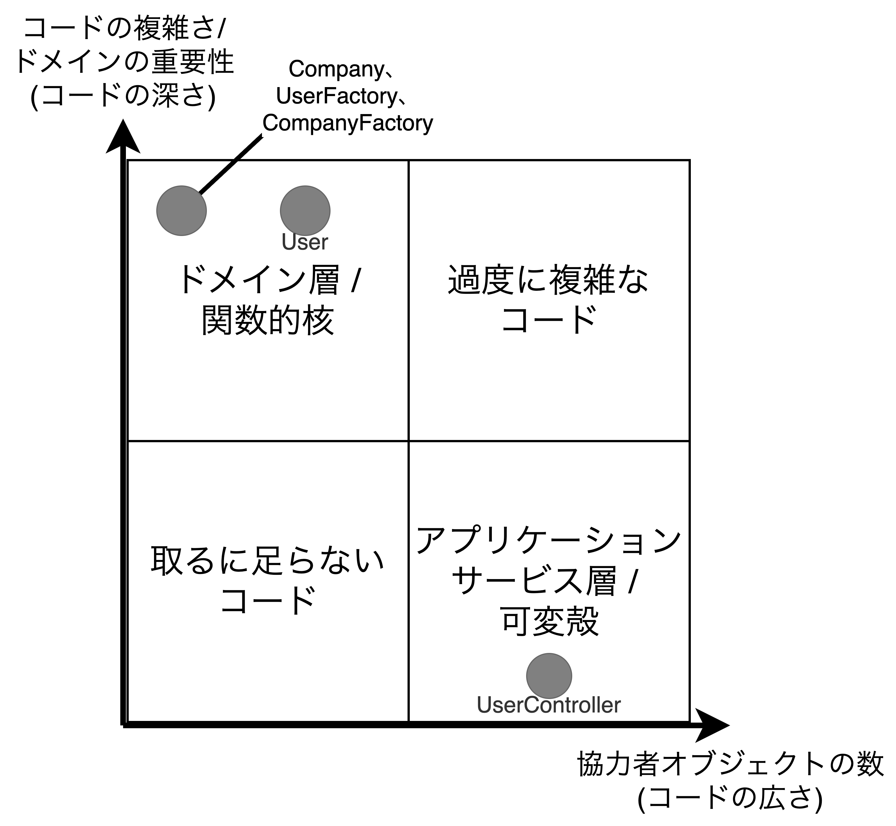
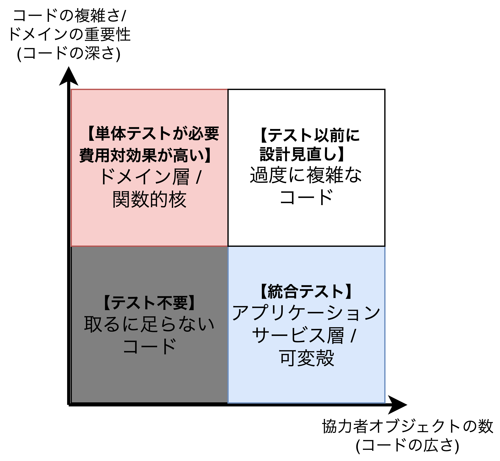
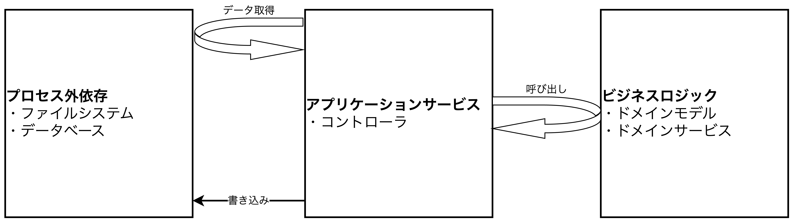
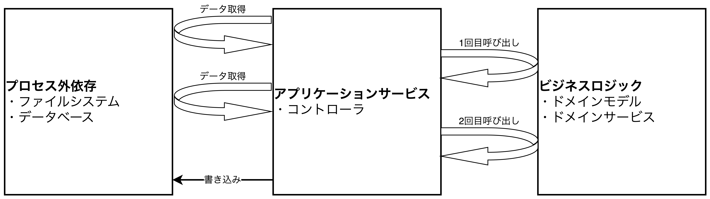

<style>
    .diagonal tr:first-child th:first-child {
    background-image: linear-gradient(
        to right top, transparent calc(50% - 0.5px), #eaeaea 50%, #eaeaea calc(50% + 0.5px), transparent calc(50% + 1px)
    );
    display: grid;
    width: max-content;
    justify-content: space-between;
    grid-template-columns: repeat(2, 1fr);
    grid-auto-rows: 1fr;
    }
    .col-header {
        grid-column-start: 2;
        text-align: right;
    }
    .row-header {
        grid-column-start: 1;
    }
</style>

## 単体テストの価値を高めるリファクタリング

- この章で扱うこと
  - プロダクションコードの種類の識別
  - 質素なオブジェクト(Humble Object)と呼ばれるパターンについて
  - 価値のあるテストケースを作成する方法

### リファクタリングが必要なコードの識別

- <font color=red>テストコードとプロダクションコードは影響し合うため、プロダクションコードの変更なく、テストスイートを改善することは難しい。</font>テスト対象となるプロダクションコードを見極め、テストケースの作成能力が必要。
- プロダクションコードは①コードの複雑さ/ドメインにおける重要性と②協力者オブジェクトの数という2つの軸から4つの種類に分類できる。
  - **ドメイン層/関数的核**: ドメインモデル/サービスなどの業務知識に関するコード
  - **取るに足らないコード**: 引数なしのコンストラクタやプロパティなどの複雑さも重要性も低いコード
  - **アプリケーションサービス層/可変殻**: 複数のコンポーネントが適切に連携できるように調整を行うコード
  - **過度に複雑なコード**: ドメインロジックや協力者オブジェクトを多く持つコード。コントローラにすべての機能を持たすとこのコードになってしまう(Fat Controller)。
- **過度に複雑なコードはテストすることが非常に難しく、かつ、テストをしないでおくことがあまりにも危険なコードでもあるというジレンマを抱えている**。このジレンマの対応策としては、ドメインモデル/アルゴリズムとコントローラに分割する方法があるが、現実問題としては難しい場合が多い。
- ここで、過度に複雑なコードを取り除くことが大事なのではなく、**プロジェクトに明確な価値をもたらすテストケースだけでテストスイートを構築することが重要**な考え方である。質の悪いテストケースを作成するくらいなら、そのようなテストケースを全く作成しないほうが良い。

<table>
    <caption>プロダクションコードの分類</caption>
    <tr>
        <th>4つの分類</th>
        <th>理想の改善</th>
    </tr>
    <tr>
        <td></td>
        <td></td>
</table>

#### 質素なオブジェクト(Hunble Object)を用いた過度に複雑なコードの分割

- <font color=red>多くの場合、テストが難しくなるのはテスト対象のコードが共有依存やプロセス外依存と直接結びつく場合であり、これが原因で過度に複雑な依存になってしまう。この依存部分から<b>テストが行いやすい部分を抽出したクラスを質素なオブジェクトとして作成する</b>。</font>
- **「質素なオブジェクト(Humble Object)」は単一責務の原則(Single Responsibility Principle)を遵守するための一つの手段**であり、<u>MVCやMVPにおけるControllerやPresenterが質素なオブジェクトに該当し、ViewやModelを結びつける役割</u>を担う。
- プロダクションコードの複雑さや重要性は「**コードの深さ**」として、協力者オブジェクトの数は「**コードの広さ**」として考えることができる。このことから、<u>ドメイン層や関数的核はコードの深さを持つが広さは持つべきではない</u>。逆に、<u>アプリケーション層や可変殻はコードの広さは持つが深さは持つべきではない</u>。
- **ビジネスロジックの部分(コードの深さ)と連携を指揮する部分(コードの広さ)を分離する理由はプロジェクトの持続可能な成長に必要だから**である。これにより、<u>プロダクションコードの複雑さを軽減・解消し、保守のしやすさを高め、テストが行いやすい設計にできる</u>。

<div style="page-break-before:always"></div>

### 単体テストに価値を持たせるためのリファクタリング

#### 【作業0】サンプルプロジェクト「ユーザ管理システム」

- <font color=red>以下の3つのビジネスルールを持つユーザ管理システムを元にリファクタリングを行う。</font>
  - もしユーザのメールアドレスに自社のドメイン名が含まれている場合、そのユーザの種類を従業員として登録し、そうでない場合は顧客として登録する。
  - 登録されたユーザの中から従業員となるユーザの数(従業員数)を管理し、もし、ユーザの種類が従業員から顧客に変わるのであれば、従業員数を減らし、その逆に顧客から従業員に変わるのであれば従業員を増やすようにする。
  - メールアドレスの変更ができたら、メッセージバスにメッセージを送り、メールアドレスが変更されたことを外部のシステムに通知する。
- 伝えたいことを明確にするために、今回は以下のような細かい妥当性確認は実装していない。
  - メールアドレスの正当性チェック
  - データベース内にユーザが存在するかどうかのチェック
- Userクラスは明示的な依存と暗示的な依存をそれぞれ2つずつ持つ
  - **明示的な依存**: ChangeEmailメソッドの2つの引数(①userIdと②newEmail)
  - **暗示的な依存**: ChangeEmailメソッド内の2つの協力者クラス(DatabaseクラスとMessageBusクラス)
- **現状のUserクラスは**ドメインクラスであり、かつ、協力者オブジェクトを2つ持つことから、**過度に複雑なクラスに該当**する。



##### Userクラス

```CSharp
public enum UserType {
    Customer = 1,
    Employee = 2,
}

public class User {
    public int UserId { get; private set; }
    public string Email { get; private set; }
    public UserType Type { get; private set; }


    public void ChangeEmail(int userId, string newEmail) {
        object[] data = Database.GetUserById(userId);
        UserId = userId;
        Email = (string)data[1];
        Type = (UserType)data[2];

        if(Email == newEmail) return;

        object[] companyData = Database.GetCompany();

        string companyDomainName  = (string)companyData[0];
        string emailDomain = newEmail.Split('@').[1];
        bool isEmailCorporate = emailDomain == companyDomainName;
        UserType newType = (isEmailCorporate)? UserType.Employee : UserType.Customer;

        int numberOfEmployees = (int)companyData[1];
        if(Type != newType) {
            int delta = (newType == UserType.Employee)? 1 : -1;
            int newNumber = numberOfEmployees + delta;
            Database.SaveCompany(newNumber);
        }

        Email = newEmail;
        Type = newType;

        Database.SaveUser(this);
        MessageBus.SendEmailChangeMessage(UserId, newEmail);
    }
}
```

<div style="page-break-before:always"></div>

#### 【作業1】1回目のリファクタリング「アプリケーションサービス層の導入」

- <font color=red>ドメインモデルであるUserクラスに協力者オブジェクト(プロセス外依存)を持たせないために、アプリケーションサービス層に該当するUserControllerクラス(Humble Object)を作成する。</font>
- UserControllerクラスの実装によりUserクラスからプロセス外依存を取り除くことができたが、いまだに以下の課題を持っている。
  - 【課題1】プロセス外依存が具象クラス(DatabaseクラスとMessageBusクラス)でありインタフェース(抽象クラス)ではないため、モックに置き換えることができず、統合テストで問題となる。
  - 【課題2】コントローラは連携が責務であり、データベースの取得データを変換する処理(UserとCompany情報の変換処理)は責務外になるため、別のクラスに担当してもらう必要がある。
  - 【課題3】UserクラスのChangeEmailメソッドの戻り値が従業員数となっているが、Userクラスの責務ではないため、別のクラスに持たせる必要がある(設計の間違い)。
  - 【課題4】コントローラは更新されたデータを保存した後、新しいメールアドレスが以前と同じだったのかどうかを確認せずにメッセージを送っている。



##### UserControllerクラス

```CSharp
public class UserController {
    private readonly Database _database = new Database();
    private readonly MessageBus _messageBus = new MessageBus();

    public void ChangeEmail(int userId, string newEmail) {
        object[] data = _database.GetUserById(userId);
        string email = (string)data[1];
        UserType type = (UserType)data[2];
        var user = new User(userId, email, type);

        object[] companyData = _database.GetCompany();
        string companyDomainName  = (string)companyData[0];
        int numberOfEmployees = (int)companyData[1];

        int newNumberOfEmployees = 
            user.ChangeEmail(newEmail, companyDomainName, numberOfEmployees);

        _database.SaveCompany(newNumberOfEmployees);
        _database.SaveUser(user);
        _messageBus.SendEmailChangeMessage(userId, newEmail);
    }
}
```

##### ChangeEmailメソッド修正後のUserクラス

```CSharp
public class User {
    public int ChangeEmail(string newEmail, string companyDomainName, int numberOfEmployees) {
        if(Email == newEmail) return numberOfEmployees;

        string emailDomain = newEmail.Split('@')[1];
        bool isEmailCorporate = emailDomain == companyDomainName;
        UserType newType = (isEmailCorporate)? UserType.Employee : UserType.Customer;

        if(Type != newType) {
            int delta = (newType == UserType.Employee)? 1 : -1;
            int newNumber = numberOfEmployees + delta;
            Database.SaveCompany(newNumber);
        }
        
        Email = newEmail;
        Type = newType;
        return numberOfEmployees;
    }
}
```

<div style="page-break-before:always"></div>

#### 【作業2】2回目のリファクタリング「アプリケーションサービスから複雑さを取り除く」

- <font color=red>UserControllerクラスにコントローラとしての性質をきちんと持たせるためにはデータベースから取得したデータをドメインクラスのインスタンスに変換するロジックを取り除く必要がある。</font>O/Rマッパー(Object-Relational Mapper)やFactoryクラスを用意することで対応する。
- 変換ロジックはデータ変換処理やデータ参照の際にライブラリのロジックを通る。これはライブラリ内の分岐や例外処理を通ることを意味しており、<u>変換ロジックは複雑なロジックとして考えることができる</u>。

##### UserFactoryクラス

```CSharp
public class UserFactory {
    public static User Create(object[] data) {
        // [独自に用意したメソッド]
        // 引数がfalseであれば例外を投げる
        Precondition.Requires(data.Length >= 3);

        int id = (int)data[0];
        string email = (string)data[1];
        UserType type = (UserType)data[2];

        return new User(id, email, type);
    }
}
```

<div style="page-break-before:always"></div>

#### 【作業3】3回目のリファクタリング「新たなクラス(ドメイン層)の導入」

- <font color=red>1、2回目のリファクタリングを経て、次の課題を残しているため、以下に対応策とその影響を示す。</font>
  - **課題**: UserクラスのChangeEmailメソッドの戻り値が従業員数という責務外の機能を持っており、そのChangeEmailメソッドをUserControllerが呼び出している。
  - **対応策**: Companyクラス(ドメインモデル)を作成し、そのファクトリであるCompanyFactoryクラスも作成した後、UserControllerとUserクラスをリファクタリングする。
  - **影響**: UserControllerクラスはドメインモデルと共有依存・プロセス外依存の連携だけ担当するクラスとして以前より下に移動した。UserクラスはCompanyクラスを協力者オブジェクトとして持っているため、以前より右に位置し、テストがしにくくなったが気にするほどの難しさではない。
- UserControllerの連携内容はデータベースからデータを取得し、そのデータをドメインモデルに変換した後、モデルの内部情報を更新し、更新結果を反映し保存し直すことである。
- ドメインモデルであるUserやCompanyクラスは副作用を発生させているがドメインモデル内で収まっており、またデータベースやメッセージバスなどの共有依存・プロセス外依存の副作用はコントローラ内で収まっていることから**テスト容易性はリファクタリング前と比較して格段に向上している**。今回のリファクタリングでコミュニケーションベーステストが不要になり、<u>出力値ベーステストと状態ベーステストのみで単体テストができる</u>ことを意味している。




##### CompanyクラスとCompanyFactoryクラス

```CSharp
public class Company { // ドメインモデル
    public string DomainName { get; private set; }
    public int NumberOfEmployees { get; private set; }

    public void ChangeNumberOfEmployees(int delta) {
        Precondition.Requires(NumberOfEmployees + delta >= 0);
        NumberOfEmployees += delta;
    }

    public void IsEmailCorporate(string email) {
        string emailDomain = email.Split('@')[1];
        return emailDomain == DomainName;
    }
}

public class CompanyFactory { // ファクトリクラス
    public static User Create(object[] data) {
        Precondition.Requires(data.Length >= 3);

        string domainName  = (string)companyData[0];
        int numberOfEmployees = (int)companyData[1];

        return new Company(domainName, numberOfEmployees);
    }
}
```

##### リファクタリング後のUserとUserControllerクラス

```CSharp
public class UserController {
    private readonly Database _database = new Database();
    private readonly MessageBus _messageBus = new MessageBus();

    public void ChangeEmail(int userId, string newEmail) {
        object[] userData = _database.GetUserById(userId);
        var user = new UserFactory(userData);

        object[] companyData = _database.GetCompany();
        Company company = CompanyFactory.Create(companyData);

        user.ChangeEmail(newEmail, company);

        _database.SaveCompany(newNumberOfEmployees);
        _database.SaveUser(user);
        _messageBus.SendEmailChangeMessage(userId, newEmail);
    }
}

public class User {
    public int UserId { get; private set; }
    public string Email { get; private set; }
    public UserType Type { get; private set; }

    public void ChangeEmail(string newEmail, Company company) {
        if(Email == newEmail) return;

        UserType newType = (isEmailCorporate)? UserType.Employee : UserType.Customer;

        if(Type != newType) {
            int delta = (newType == UserType.Employee)? 1 : -1;
            company.ChangeNumberOfEmployees(delta);
        }
        
        Email = newEmail;
        Type = newType;
    }
}
```

<div style="page-break-before:always"></div>

### プロダクションコードの種類に基づく効果的な単体テストの作成

- <font color=red>リファクタリング後のユーザ管理システムからメソッド単位でプロダクションコードを分類すると下表のようになり、<b>最も単体テストの費用対効果が高いのは表内の左上が該当する</b>。</font>次に、**取るに足らないコードは単体テストが不要である**。そして、**アプリケーションサービス層・可変殻のコードは統合テストの対象になる**。

<table>
    <caption>メソッドごとのプロダクションコードの種類</caption>
    <tr>
        <th></th>
        <th>協力者オブジェクトの数が少ない</th>
        <th>協力者オブジェクトの数が多い</th>
    </tr>
    <tr>
        <th>コードの複雑さ・<br>重要性が高い</th>
        <td>・Userクラス<br>　・ChangeEmail<br>・Companyクラス<br>　・ChangeNumberOfEmployees<br>　・IsEmailCorporate<br>・UserFactoryクラス<br>　・Create<br>・CompanyFactoryクラス<br>　・Create</td>
        <td>なし</td>
    </tr>
    <tr>
        <th>コードの複雑さ・<br>重要性が低い</th>
        <td>・Userクラス<br>　・コンストラクタ<br>・Companyクラス<br>　・コンストラクタ</td>
        <td>・UserControllerクラス<br>　・ChangeEmail</td>
    </tr>
</table>



<div style="page-break-before:always"></div>

#### ドメイン層とユーティリティコードに対するテスト

```CSharp
/* メールアドレスを非従業員のものから従業員のものに変える */
[Fact]
public void Changing_email_from_non_corporate_to_corporate() {
    var company = new Company("mycorp.com", 1);
    var sut = new User(1, "user@gmail.com", UserType.Customer);

    sut.ChangeEmail("new@mycorp.com", company);

    Assert.Equal(2, company.NumberOfEmployees);
    Assert.Equal("new@mycorp.com", sut.Email);
    Assert.Equal(UserType.Employee, sut.Type);
}

/* メールアドレスを従業員のものから非従業員のものに変える */
public void Changing_email_from_corporate_to_non_corporate() { /* ... */ }
/* ユーザの種類を変えずにメールアドレスを変える */
public void Changing_email_from_corporate_to_non_corporate() { /* ... */ }
/* メールアドレスを同じメールアドレスで変える */
public void Changing_email_from_corporate_to_non_corporate() { /* ... */ }
```

```CSharp
/* パラメータ化テスト */
[InlineData("mycorp.com", "email@mycorp.com", true)]
[InlineData("mycorp.com", "email@gmail.com", false)]
[Theory]
public void Differentiates_a_corporate_email_from_non_corporate(
    string domain,
    string email,
    bool expectedResult
) {
    var sut = new Company(domain, 0);

    bool isEmailCorporate = sut.IsEmailCorporate(email);

    Assert.Equal(expectedResult, isEmailCorporate);
}
```

#### 事前条件のテスト

- <font color=red>事前条件とは、特殊なケースで機能するセーフティネットとして振る舞うものであり、<b>事前条件に反するときはバグが発生した時になる</b>。</font>
- 事前条件の実装により、**アプリケーション内で間違いを止めることができ、データベース(インフラ)まで被害が及ぶことを防ぐことができる**。
- <u>事前条件はドメインにおいて重要であれば検証すべきであり、重要でないのであればテストは不要である</u>。

### コントローラにおける条件付きロジックの扱い

- <font color=red>プロセス外依存とビジネスロジック(ドメイン)の分離が最もしやすい処理は「プロセス外依存からのデータの取得→ビジネスロジックの実行→変更されたデータの保存(更新)」の流れであり、逆に機能しにくいケースとしては<b>ビジネスロジックの処理中にプロセス外依存から新たにデータを取得する場合</b>である。</font>この課題の対応策としては3つの選択肢がある。
  - **外部の依存に対するすべての読み書き(入出力処理)を最初や最後に行う**: これにより、「読み込み→決定→実行」の構造を保つことができるが、<u>全データを操作するためパフォーマンスを犠牲にすることになるため、**ほとんど採用されない選択肢**</u>である。
  - **ドメインモデルにプロセス外依存を注入する**: この場合はビジネスロジックの中でプロセス外依存の入出力処理を操作できるが、<u>ドメインモデルのテスト容易性が低下し、さらにドメインモデルが過度に複雑なコードになってしまうため、**避けるべき選択肢**</u>である。
  - **ドメインロジックの処理をさらに細かく分割する**: パフォーマンスとテスト容易性を高く保つことができるが、<u>コントローラの連携処理が複雑になってしまい、コントローラが過度に複雑なコードになってしまう</u>。ただし、このケースはある程度対処可能であるため、**現実的な選択肢**になる。
- 上記対応策で考慮することは以下の3つである。
  - **ドメインモデルのテスト容易性**: 協力者オブジェクトの数や種類に関する性質
  - **コントローラの簡潔さ**: コントローラにおける決定を下す箇所(分岐)の数に関する性質
  - **パフォーマンス(機能性)**: プロセス外依存への呼び出し回数(処理時間)に関する性質

<table>
    <tr>
        <th>ヘキサゴナル/関数型アーキテクチャが<br>機能するオペレーション</th>
        <th>ヘキサゴナル/関数型アーキテクチャが<br>機能しにくいオペレーション</th>
    </tr>
    <tr>
        <td></td>
        <td></td>
    </tr>
</table>

<table class="diagonal">
	<tbody>
        <caption>コントローラの条件付きロジックにおける考慮事項とその性質</caption>
		<tr>
			<th><span class="col-header">性質</span><span class="row-header">考慮事項　　　　　　</span></th>
			<th>ドメインモデルの<br>テスト容易性</th>
			<th>コントローラの簡潔さ</th>
			<th>パフォーマンス<br>(機能性)</th>
		</tr>
		<tr>
			<th>ドメインモデルにプロセス外依存を注入する</th>
			<th></th>
			<th>◯</th>
			<th>◯</th>
		</tr>
		<tr>
			<th>ビジネスロジックをさらに細分化する</th>
			<th>◯</th>
			<th></th>
			<th>◯</th>
		</tr>
		<tr>
			<th>外部依存に対する全ての入出力処理を<br>処理フローの初めや終わりに行う</th>
			<th>◯</th>
			<th>◯</th>
			<th></th>
		</tr>
	</tbody>
</table>

<div style="page-break-before:always"></div>

#### 確認後実行(CanExecute / Execute)パターンの適用

- <font color=red>ビジネスロジックとプロセス外依存の分離がしにくい場合、ビジネスロジックをさらに細分化する手段があるがコントローラが複雑になるというデメリットがある。<b>この問題の対応策として確認後実行パターンがある</b>。</font>
- **確認後実行パターンとはコントローラにドメインロジックが漏洩することを防ぐテクニック**(カプセル化のテクニック)である。これにより、<u>**すべてのビジネスにおける決定をドメイン層に集約**でき、コントローラ（呼出元）はドメインモデルの事前条件を知らなくても、操作の実行可否を判断できる</u>。

##### 確認後実行パターンの実装例

```CSharp
public class User {
    public int UserId { get; private set; }
    public string Email { get; private set; }
    public UserType Type { get; private set; }
    public bool IsEmailConfirmed { get; private set; } // ← 新たに追加

    /* ##### 確認後実行パターン(事前条件をこのメソッドに集約) ##### */
    public string CanChangeEmail() {
        if(IsEmailConfirmed)
            return "Can't change a confirmed email";
        return null;
    }
    public void ChnageEmail(string newEmail, Company company) {
        Precondtion.Required(CanChangeEmail() == null);        
        if(Email == newEmail)
            return; // メールアドレスの変更はしない
        /* ...略 */
    }
}
public class UserController {
    public string ChangeEmail(int userId, string newEmail) {
        // データの準備
        object[] userData = _database.GetUserById(userId);
        User user = UserFactory.Create(userData);
        string error = user.CanChangeEmail();
        if(error != null) return error;
        object[] companyData = _database.GetCompany();
        Company company = CompanyFactory.Create(companyData);

        user.ChangeEmail(newEmail, company);
    
        _database.SaveCompany(company);
        _database.SaveUser(user);
        _messageBus.SendEmailChangeMessage(userId, newEmail);
        return "OK";
    }
}
```

#### ドメインモデルの状態を追跡するドメインイベントの利用

- <font color=red><b>コントローラに複雑さを持ち込まないもう一つの方法としてドメインイベントがある</b>。</font><u>ドメインイベントはドメインモデルの変更をビジネスオペレーション終了後にプロセス外依存に通知する際に利用する</u>。
- **ドメインイベントは外部システムに伝えなくてはならないデータを含んだクラス**である。
- ドメインイベントは**基底クラス(DomainEventクラスなど)を作成**し、汎用性を上げた上で**コレクション(List\<DomainEvent\>など)として保持するようにリファクタリングすることも可能**。また、コントローラと別に**イベント管理クラス(EventDispatcherクラスなど)を作成することで責務の分離も可能**になる。
- ドメインイベントは外部システム(プロセス外依存)と責務を分離しているため、**テスト容易性の向上に貢献**する。つまり、**プロセス外依存を用いたテスト(モックの作成)が不要であり、ドメインイベントの発生有無だけをテストするだけで済む**。<u>ただし、パフォーマンスには注意が必要である(トレードオフ)。</u>

##### ドメインイベントの実装例

```CSharp
public class EmailChangedEvent { // ドメインイベントクラス
    public int UserId { get; }
    public string NewEmail { get; }
}

public class User {
    public int UserId { get; private set; }
    public string Email { get; private set; }
    public UserType Type { get; private set; }
    public bool IsEmailConfirmed { get; private set; }
    public List<EmailChangedEvent> EmailChangedEvents { get; private set; } // ← 新たに追加

    public void ChnageEmail(string newEmail, Company company) {
        Precondtion.Required(CanChangeEmail() == null); // 事前条件チェック
        
        if(Email == newEmail)
            return; // メールアドレスの変更はしない

        UserType newType = company.IsEmailCorporate(newEmail)
            ? UserType.Employee
            : UserType.Customer;

        if(Type != newType) {
            int delta = (newType == UserType.Employee)? 1 : -1;
            company.ChangeNumberOfEmployees(delta);
        }

        /* ドメインイベントの追加 */
        Email = newEmail;
        Type = newType;
        EmailChangedEvents.Add(new EmailChangedEvent(UserId, newEmail));
    }
}
```
```CSharp
public class UserController {
    public string ChangeEmail(int userId, string newEmail) {
        // データの準備
        object[] userData = _database.GetUserById(userId);
        User user = UserFactory.Create(userData);
        string error = user.CanChangeEmail();
        if(error != null) return error;

        object[] companyData = _database.GetCompany();
        Company company = CompanyFactory.Create(companyData);

        user.ChangeEmail(newEmail, company);
    
        _database.SaveCompany(company);
        _database.SaveUser(user);
        user.EmailChangedEvents.ForEach(event => { // LINQ
            _messageBus.SendEmailChangeMessage(event.UserId, event.NewEmail)
        });
        return "OK";
    }
}
```

##### ドメインイベント適用後のテスト例

```CSharp
[Fact]
public void Changing_email_from_corporate_to_non_corporate() {
    var company = new Company("mycorp.com", 1);
    var sut = new User(1, "user@mycorp.com", UserType.Employee, false);

    sut.ChangeEmail("new@gmail.com", company);

    company.NumberOfEmployees.Should().Be(0);
    sut.Email.Should().Be("new@gmail.com");
    sut.Type.Should().Be(UserType.Customer);
    sut.EmailChangedEvents.Should().Equal(
        // ドメインイベントが追加されているか確認
        new EmailChangedEvent(1, "new@gmail.com") 
    );
}
```

<div style="page-break-before:always"></div>

### 結論

- <font color=red>ビジネスオペレーションの最後まで副作用を起こさせないために、<b>確認後実行パターン(事前条件のカプセル化)やドメインイベントによる決定を下す過程をドメインモデル内に収める方法</b>を見てきました。</font>
- **抽象化は結果に対して行うことでテスト容易性を向上させる**。
- ビジネスロジックが散財するケースとして以下がある。
  - **メールアドレスが一意であることを確認するケース**: ドメインモデルが過度に複雑なコードに寄ってしまう。
  - **プロセス外依存の中でエラー(DBのロールバック、WebAPIのエラーレスポンス)によりビジネスオペレーションの切り替えが必要な場合**: コントローラにエラー発生時の決定ロジックを実装し、統合テストで検証する必要がある。
  - メソッドが観察可能な振る舞いの一部かどうかは以下の条件を1つ以上満たす。
    - ①対象のメソッドがクライアントの目標の1つに直接結びついている。
    - ②外部アプリケーションから確認でk裏雨副作用がプロセス外依存で起こる。
  - 上記で実装した`UserController`の`ChangeEmail`メソッドは①と②の両方を満たすため、観察可能な振る舞いの一部になる。
- <u>観察可能な振る舞いと実装の詳細との関係は「外部サービス→アプリケーションサービス層→ドメイン層」と階層があり、視点を変える度に実施すべきテスト項目が変わる。</u>

<div style="page-break-before:always"></div>

### まとめ

- コードの複雑さとドメインにおける重要性(コードの深さ)を持つドメイン層のプロダクションコードは最も価値をもたらすコードであり、**ドメイン層に対するテストは退行に対して強い保護を備える**。
- ①コードの複雑さ・ドメインの重要性(コードの深さ)、②協力者オブジェクトの数(コードの広さ)からすべてのプロダクションコードは4つに分類される
  - **ドメイン層/関数的核**: ドメインモデル/サービスなどの業務知識に関するコード。<u>単体テストで検証されるべきであり、費用対効果が最も高い</u>。
  - **取るに足らないコード**: 引数なしのコンストラクタやプロパティなどのコード。<u>テストの価値は全くない</u>。
  - **アプリケーションサービス層/可変殻**: 複数のコンポーネントが適切に連携できるように調整を行う。<u>単体テストではなく統合テストで検証されるべき</u>。
  - **過度に複雑なコード**: ドメインロジックや協力者オブジェクトを多く持つコード。コントローラにすべての機能を持たすとこのコードになってしまう(Fat Controller)。<u>ドメイン層とアプリケーションサービス層の切り分けを行うための設計の見直しが必要</u>。
- **質素なオブジェクト(Humble Object)は過度に複雑なコードの対策**である。**ヘキサゴナルアーキテクチャ**はビジネスロジックをプロセス外依存から隔離するアーキテクチャであり、**関数型アーキテクチャ**はビジネスロジックをすべての協力者オブジェクト(プロセス外依存ではないものも含む)から隔離するアーキテクチャである。
- <u>**事前条件**はドメインにおける重要性がある場合にだけテスト</u>し、重要でない場合はテストは不要。
- **過度に複雑なコードの対処**はプロセス外依存とビジネスロジックの分離であり、3つの対応策がある。
  - **外部の依存に対するすべての読み書き(入出力処理)を最初や最後に行う**: これにより、「読み込み→決定→実行」の構造を保つことができるが、<u>全データを操作するためパフォーマンスを犠牲にすることになるため、**ほとんど採用されない選択肢**</u>である。
  - **ドメインモデルにプロセス外依存を注入する**: この場合はビジネスロジックの中でプロセス外依存の入出力処理を操作できるが、<u>ドメインモデルのテスト容易性が低下し、さらにドメインモデルが過度に複雑なコードになってしまうため、**避けるべき選択肢**</u>である。
  - **ドメインロジックの処理をさらに細かく分割する**: パフォーマンスとテスト容易性を高く保つことができるが、<u>コントローラの連携処理が複雑になってしまい、コントローラが過度に複雑なコードになってしまう</u>。ただし、このケースはある程度対処可能であるため、**現実的な選択肢**になる。
- 上記対応策で考慮することは以下の3つである。
  - **ドメインモデルのテスト容易性**: 協力者オブジェクトの数や種類に関する性質
  - **コントローラの簡潔さ**: コントローラにおける決定を下す箇所(分岐)の数に関する性質
  - **パフォーマンス(機能性)**: プロセス外依存への呼び出し回数(処理時間)に関する性質
- ドメインロジックをさらに分割する方法は以下の2つがあり、コントローラが複雑になることを防ぐ。
  - **確認後実行(CanExecute/Execute)パターン**: 何かを実行するメソッド`Execute`に対して実行可否メソッド`CanExecute`を用意することで、対象の処理を正しく実行するための事前条件が必ず満たされること保証する設計パターンである。これにより、<u>`Execute`の前に必ず事前条件の確認を行う`CanExecute`が呼び出されるようになるため、コントローラが決定を下す責務を本質的に取り除くことになる</u>。
  - **ドメインイベント**: ドメインモデルで発生する重要な状態の変更を追跡する方法であり、発生したドメインイベントをもとにプロセス外依存へ呼び出しを行うようにする。これにより、<u>コントローラから状態の変更を追跡する責務を取り除ける(ドメインイベントが責務を担当する)</u>。
  ※ドメインイベントは基底クラス(`DomainEvent`など)をコレクション(`List<DomainEvent>`など)で扱い、管理クラス(`EventDispatcher`など)を備えることで汎用性を持たせることができる。


