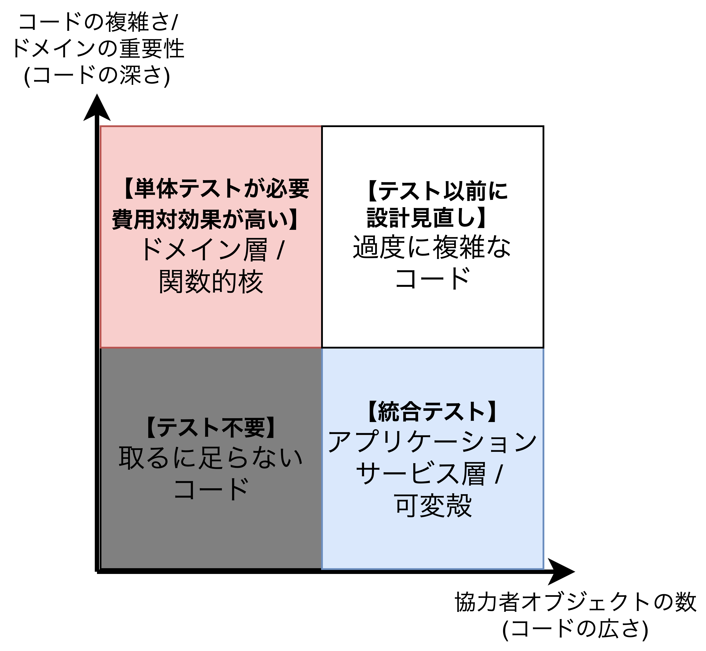
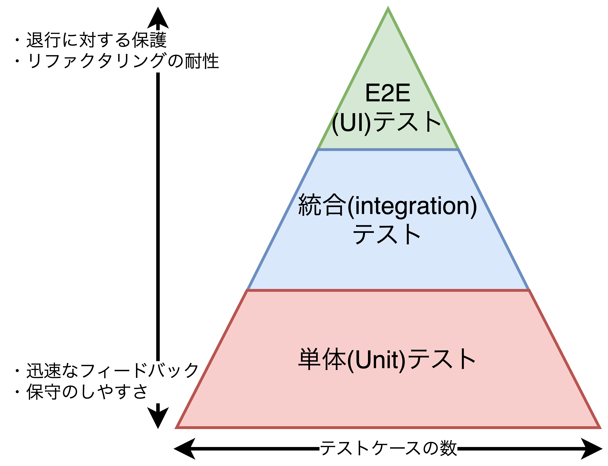
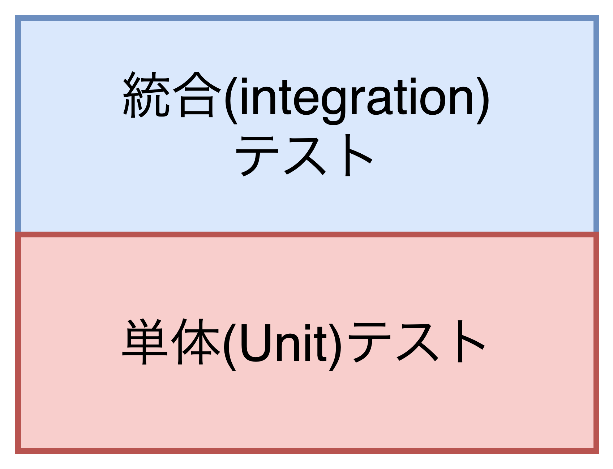
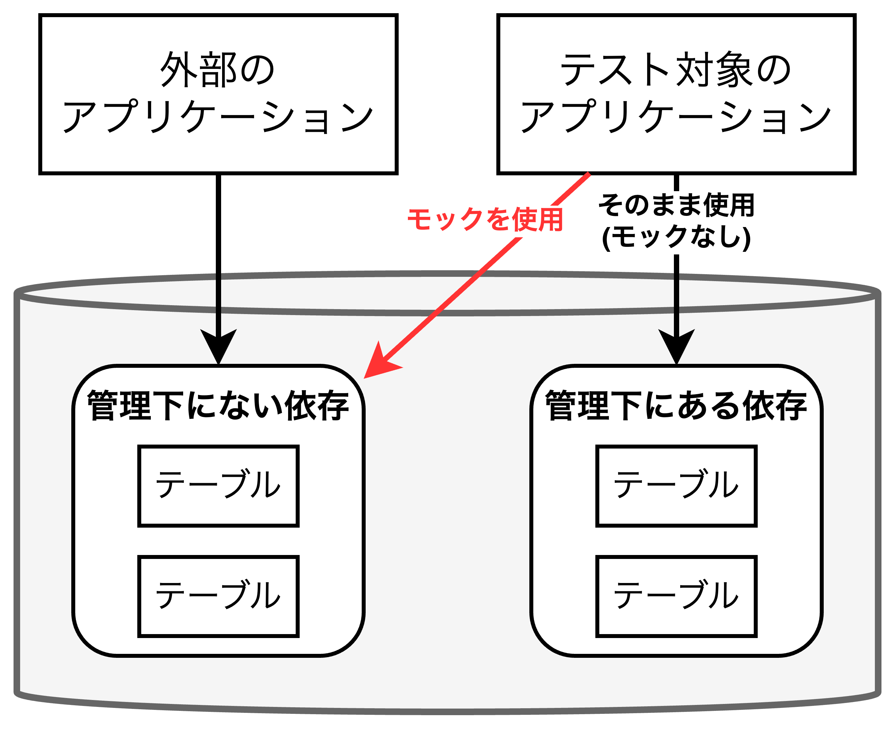
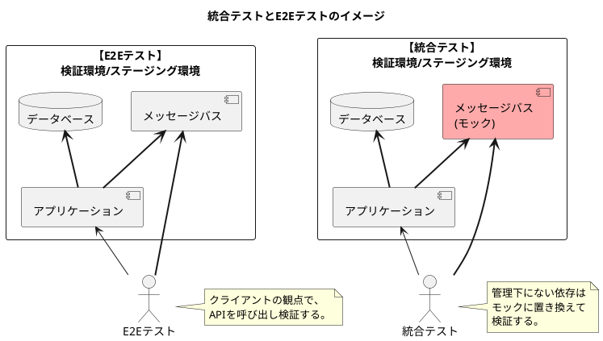
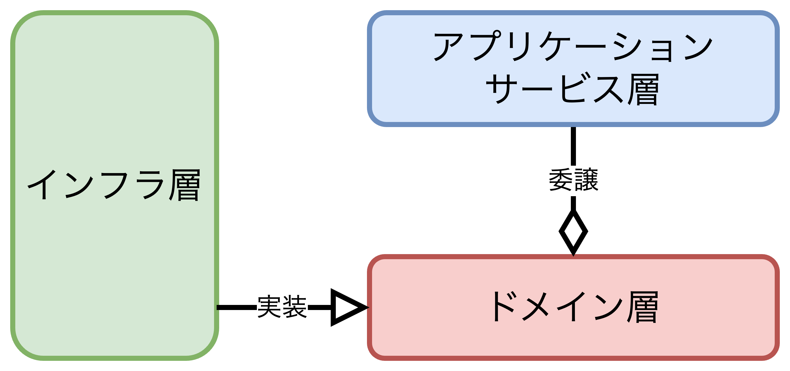
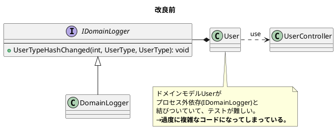
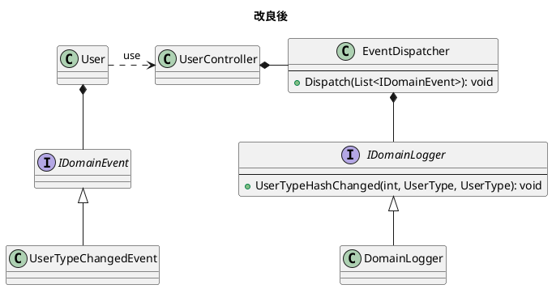

## なぜ、統合（integration）テストを行うのか？

- この章で扱うこと
  - 統合テストの役割
  - テストピラミッドについてのさらなる考察
  - 価値のある統合テストの書き方

### 統合(integration)テストとは？

#### 統合テストの役割

- <font color=red><b>一般的に単体テストはビジネスシナリオにおける異常系(edge case)をできるだけ多く検証するのに対し、統合テストは1件の正常系と単体テストでは検証できない異常系を検証することが適切</b>だと考えられている。</font>つまり、**検証するほとんどを単体テストに持たせることで保守コストを少なくしつつ、ビジネスシナリオごとに包括的な統合テストを1、2件行う**ことで、システム全体が正常に機能することに自信を持てるようにする。
- <u>ほとんどのアプリケーションにおいてデータベースはモックに置き換えるべきではないプロセス外依存として扱う</u>。理由は別のアプリケーションからアクセスされることがないためである。



#### テストピラミッドの振り返り

- <font color=red>テストピラミッドはプロジェクトの複雑さによって形を変え、<u>単純なアプリケーションの場合は単体テストと統合テストの大きさは同じになる場合がある</u>。</font>
- 統合テストの目的は他システムと連携した上で正常に機能するかを検証するテストであるため、**統合テストの重要性はアプリケーションの規模で変わることはない**。
- **統合テストのデメリット**
  - 【**保守のしやすさ↓**】プロセス外依存を利用可能な状態に維持する必要がある。
  - 【**保守のしやすさ↓**】協力者オブジェクトの数が増えるにつれ、テストコード量が増える。
  - 【**迅速なフィードバック↓**】実行時間が長くなる。
- **統合テストのメリット**
  - 【**退行に対する保護↑**】多くのプロダクションコードが実行される
  - 【**リファクタリングの耐性↑**】プロダクションコードとの結びつきが単体テストと比べて弱い(実装の詳細から離れる)

<table>
    <tr>
        <th>テストピラミッド</th>
        <th>単純なアプリケーションにおける<br>テストピラミッド</th>
    </tr>
    <tr>
        <td></td>
        <td></td>
    </tr>
</table>

#### 統合テストと早期失敗(Fail Fast)

- <font color=red>統合テストはまず、<b>①全てのプロセス外依存とのやり取りを検証できるような長いハッピーパスを見つけ出し</b>、もし見つからない場合は、<b>②テストケースを増やしていきながら全ての外部システムとのやり取りが検証されるようにする</b>。</font>
- **早期失敗**とは、望んでいないエラーが起こった際にすぐにその処理を停止させることであり、次の効果が期待できる。
  - **フィードバック・ループの短縮**: より速やかにバグ検出ができ、バグ修正が可能になる。
  - **保存される状態の保護**: データが壊れることを可能な限り抑えることができ、不正な状態が波及することを防ぐ。
- **早期失敗の具体例としては事前条件の確認(CanExecute/Executeパターン)や設定ファイルの値確認などが挙げられる**。

### どのようなプロセス外依存をモックに置き換えるべきか？

- 全てのプロセス外依存は管理下にあるかないかの2種類に大きく分類できる。
  - **管理下にある依存(managed dependency)**: 必ずアプリケーションを経由するプロセス外依存であり、<u>外部から見ることができない</u>。例としてDBがあり、この場合は**実装の詳細**となる。
  - **管理下にない依存(unmanaged dependency)**: テスト対象のアプリケーションが自由に操作できないプロセス外依存であり、<u>外部から見ることができる</u>。例として、メールサービスやメッセージバスがあり、この場合は**観察可能な振る舞いの一部**になる。
- <font color=red><b>管理下にある依存</b>は外部からすると意識する必要のないものであるためそのまま使用し(<u>モックを使用しない</u>)、<b>管理下にない依存</b>は通信を行う際の仕様(I/F)の維持するためにモックを使用する。</font>
- **管理下にある依存をそのまま使用する効果**は<u>①テスト対象のアプリケーションの最終的な状態を外部の視点で見ることができる</u>ことと<u>②DBのリファクタリングも容易になる</u>ことの2つがある。
- **管理下にある依存と管理下にない依存の両方の性質を持つプロセス外依存も場合によっては存在する**。たとえば、<u>導入初期は1つのアプリケーションのみがDBにアクセスしていたが、数年後、他のアプリケーションも同じDBにアクセスようになった場合である</u>。
  - **管理下にない依存に対する対応**: 別のアプリと共有されるテーブルをメッセージバス、各行(レコード)をメッセージとみなすことで、共有されるテーブルをモックに置き換える。そして、<u>そのモックとのコミュニケーションを検証する(**コミュニケーションベーステスト**)</u>。
  - **管理下にある依存に対する対応**: この場合、共有されないテーブルであるため、<u>検証対象は最終的なテーブルの状態になる(**出力値ベーステスト**)</u>。



#### 統合テストで実際のDBを使えない場合

- 統合テストでDBが利用不可のケースとして、①レガシーなDB、②開発/検証環境にデプロイできないDB、③セキュリティ上の制約、④設定や保守コストが極端に大きい、などが挙げられる。
- 統合テストでDBを利用できない状態で検証できることとしては、<font color=red>①リポジトリや②ドメインモデルの単体テストしかなく、細心の注意を払ってテストケースを精査する必要がある。<u>モックに置き換えることは<b>リファクタリングの耐性</b>と<b>退行に対する保護</b>が損失するためNG。</u></font>

### どのように結合(integration)テストを行うのか？

#### 【例】6.4節のユーザ管理システムに対する統合テストの適用

- <font color=red>統合テストの基本方針は「<b>①最長のハッピーパス(理想的なシナリオ)を検証すること</b>」と「<b>②単体テストでは検証できなかった全ての異常ケースを検証すること</b>」の2つである。</font>
※**最長のハッピーパス**: 全てのプロセス外依存を経由してビジネスシナリオを正常終了する実行経路
- **ユーザ管理システムにおける最長のハッピーパス**は「自社のドメイン名を持つメールアドレスから異なるドメイン名を持つメールアドレスに変更する」である。この<u>最長のハッピーパスにより、ユーザと会社の両方の情報が更新され、メッセージバスにメッセージが送信される</u>。
- **単体テストで検証できなかった異常ケース**として「メールアドレスを変更できない場合のシナリオ」があるが、<u>ドメインにてメールアドレスの変更可否を判断するメソッド(CanChangeEmailメソッド)が実装されており、早期失敗(Fail Fast)が保証されているため**検証不要**である</u>。

##### ユーザ管理システムの概要

```plantuml
title ユーザ管理システム　シーケンス図

participant "MessageBus\n(プロセス外依存)" as bus
actor "ApplicationService\n(UserController)" as controller #faa
actor "Domain" as domain
database DB as db

controller -> domain : CanChangeEmail
controller -> domain : ChangeEmail
controller -> db : SaveCompany
controller -> db : SaveUser
controller -> bus : SendEmailChangeMessage

```
```CSharp
public class UserController {
    public string ChangeEmail(int userId, string newEmail) {
        User user = UserFactory.Create(_database.GetUserById(userId));
        string error = user.CanChangeEmail();
        if(error != null) 
            return error;

        Company company = CompanyFactory.Create(_database.GetCompany());
        user.ChangeEmail(newEmail, company);
    
        _database.SaveCompany(company);
        _database.SaveUser(user);
        user.EmailChangedEvents.ForEach(event => { // LINQ
            _messageBus.SendEmailChangeMessage(event.UserId, event.NewEmail)
        });
        return "OK";
    }
}
```

#### モックに置き換えるべきか否かの依存の分類

- <font color=red>まずは全てのプロセス外依存を洗い出し、<b>直接アクセスすべき依存なのか、それともモックに置き換えるべき依存なのかを判断する。</b></font>
- ユーザ管理システムにおいて、<u>データベースは他のシステムからアクセスされることがないため管理下にある依存</u>であり、<u>メッセージバスは他システムとコミュニケーションをとるため、管理下にない依存</u>である。

<div style="page-break-before:always"></div>

#### E2E(End-to-End)テストはどうする？

- <font color=red>E2Eテストを行う場合、テスト環境やステージング環境にデプロイし、プロセス外依存をモックに置き換えることなく、クライアントの観点で検証を行う必要がある。</font>一方、統合テストは管理下にない依存はモックに置き換えられ、管理下にある依存はそのまま使用する。
- E2Eテストが必要かどうかの基準はプロジェクトにより異なるが、<u>**統合テスト**にて管理下にない依存のみをモックに置き換えた上で、**管理下にある全ての依存**をそのまま使って検証できているのであれば、E2Eテストと同等の価値を提供できている</u>。
- <u>**E2Eテスト**にて、**最長のハッピーパス**を検証できていれば、全てのプロセス外依存と適切に通信できていることを保証できる</u>ため、確信を持てるようになる。



#### 統合テストの作成

- <font color=red>DBの状態を確認する際、書込データ(入力値)と読込データ(出力値)を検証する必要がある。</font>
- ユーザ管理システムの場合、最初にユーザと会社の情報をDBに登録しておき(**Arrange**)、テスト対象(UserController)の処理を実行した後(**Act**)、DBに処理結果が反映されているか確認する(**Assert**)。
- **Assertフェーズでは<u>コントローラが内部的に使っているコードと同様の流れで確認する必要がある</u>**。ユーザ管理システムの場合、Database、UserFactory、CompanyFactoryを用いて確認する。
- <u>モックに改善の余地があるが、9章と10章で取り扱う</u>。

##### 統合テストのサンプルコード

```CSharp
[Fact]
public void Changing_email_from_corporate_to_non_corporate() {
    // Arrange
    var db = new Database(ConnectionString);
    User user = CreateUser("user@mycorp.com", UserType.Employee, db);
    CreateCompany("mycorp.com", 1, db);
    var messageBusMock = new Mock<IMessageBus>();
    var sut = new UserController(db, messageBusMock.Object);

    // Act
    string result = sut.ChangeEmail(user.UserId, "new@gmail.com");

    // Assert(1.出力結果確認 2.ユーザの状態確認 3.会社の状態確認 4.メソッドの呼び出し確認)
    Assert.Equal("OK", result);

    object[] userData = db.GetUserById(user.UserId);
    User userFromDb = UserFactory.Create(userData);
    Assert.Equal("new@gmail.com", userFromDb.Email);
    Assert.Equal(UserType.Costomer, userFromDb.Type);

    object[] companyData = db.GetCompany();
    Company companyFromDb = CompanyFactory.Create(companyData);
    Assert.Equal(0, companyFromDb.NumberOfEmployees);

    messageBusMock.Verify(
        x => x.SendEmailChangedMessage(user.UserId, "new@gmail.com"), 
        Times.Once
    );
}
/* ヘルパーメソッド(2つ) */
private Company CreateCompany(string domainName, int numberOfEmployees, 
    Database database) {
    var company = new Company(domainName, numberOfEmployees);
    database.SaveCompany(company);
    return company;
}
private User CreateUser(string email, UserType type, Database database) {
    var user = new User(0, email, type, false);
    database.SaveUser(user);
    return user;
}
```

### インタフェースを使った依存の抽象化

- <font color=red>インタフェースを使う理由として①疎結合のための抽象化と②オープン・クローズドの原則の遵守などが挙げられるが、<b>③モックを作成できるようになる</b>という考え方もある。<u>そのため、<b>究極的には管理下にない依存に対してのみインタフェースを用意する</b>という結論になる</u>。</font>ただし、複数の具象クラスを抽象化するためにインタフェースを作成するケースもある。
- YAGNI(You Aren't Gonna Need It)の原則に基づくと、<u>将来的に追加される機能を予想して開発したり、既存コードを修正したりすべきではない</u>。これにより、**①ユーザが必要としていない機能に時間を費やすこと**になり、**②負債(コード)も増えること**になる。
- **オープンクローズドの原則**はWebAPIやフレームワーク開発などの将来変更するのが難しい機能を設計している場合は**YAGNIの原則より優先**される。
- **YAGNIの原則**はエンタープライズアプリや共有ライブラリなどのその時必要な機能のみを開発する場合は**オープンクローズドの原則より優先**される。

### 統合テストのベストプラクティス

- <font color=red>統合テストを最大限活用するための基本指針は<b>①ドメインモデルの境界の明確化</b>、<b>②アプリケーションを構成する層を減らす</b>、<b>③循環依存を取り除く</b>、の3つがある。</font>
  - **ドメインモデルの境界の明確化**: 解決する課題のドメイン知識を集めたものがドメインモデルであり、<u>ドメインモデルの境界を明確にすることで可読性とテスト容易性が向上</u>する。さらに**ドメインとアプリケーションサービスの境界を明確に分けることができれば、単体テストと統合テストの区別も容易になる**。
  - **アプリケーションを構成する層を減らす**: システムはドメイン層、アプリケーションサービス層、インフラ層の3層で構成することが望ましく、<u>3層以上になると開発者の認知的負荷が増加し、進行の妨げにつながる</u>。
  - **循環依存を取り除く**: クラスの依存関係が円環を成してしまう状態を循環依存といい、<u>循環依存があると開発者の認知的負荷が上がり、可読性が大きく下がる</u>。



#### 1つのテストケースに複数のActフェーズを用いる場合

- <font color=red>1つのテストケースに複数のArrange・Act・Assertフェーズが存在する場合、<b>複数の振る舞い(ユースケース)を検証している可能性があり、保守性を下げる</b>ことになる。</font>
- 例えば、以下のような複数のActフェーズを持つテストケースはE2Eテストでのみ許容される。
  1. **準備フェーズ**: ユーザ登録するためのデータを準備する。
  2. **実行フェーズ1**: UserControllerクラスのRegisterUserメソッドを呼び出す。
  3. **確認フェーズ1**: DBを検索し、正しく登録されていることを確認する。
  4. **実行フェーズ2**: UserControllerクラスのDeleteUserメソッドを呼び出す。
  5. **確認フェーズ2**: DBを検索し、対象ユーザが削除されていることを確認する。
- 複数のActフェーズを持つテストケースの作成を許容できるのは、**開発者が好きなようにプロセス外依存を扱えない場合だけ**であり、<u>単体テストでは複数のActフェーズを持つテストケースは存在しないはずである。また、統合テストでも滅多に現れることはなく、複数のActフェーズを持つテストケースはE2Eテストでのみ現れる</u>。

### ログ出力に対するテスト

- <font color=red>ログは2種類に分けることができ、<b>テスト対象のログ出力が外部から見られることを意図している観察可能な振る舞いの一部であれば、テストすべきである</b>。</font>
  - **サポートログ(＝ビジネス要求)**: 特定のイベントを記録したログ。システムのサポートスタッフや管理者が見ることを想定したログ。
  - **診断ログ**: 開発者がアプリ内で何が起こっているのかを把握できるようにするためのログ。
- ログ出力のテストはプロセス外依存に対するテストと同じルールで行う。つまり**モックを用いて、アプリケーションとログストレージとの間で行われるやり取りを検証する**。

#### どのようにログ出力をテストすべきか？

- <font color=red><b>サポートログの出力機能はビジネス要求</b>であるため、<u>サポートログを出力するクラス`DomainLogger`を作成し、特定のイベントごとのログ出力メソッドを定義する</u>。これにより、<b>サポートログをオブジェクト化(`DomainLogger`クラスなど)し、テスト対象とすることができる</b>。</font>
- サポートログクラス`DomainLogger`の実装方法によっては、`DomainLogger`(プロセス外依存)とドメインモデルが強く結びつき、**ドメインモデルが過度に複雑なコードになってしまう危険性がある**。そこで、<u>ドメインイベントとそのディスパッチャを実装し、ディスパッチャにて`DomainLogger`を呼び出させるようにする</u>。

<div style="page-break-before:always"></div>

- 下記のドメインイベントを用いたDomainLoggerの実装例により、テスト方法が以下のように簡単になった。
  - **単体テスト**: テスト対象の<u>UserがUserTypeChangedEventのインスタンスを生成しているか検証する</u>。
  - **統合テスト**: モックを用いて<u>DomainLoggerへの呼び出しが想定通りに行われているか検証する</u>。
- <u>DomainLogger(サポートログ)はEventDispatcher以外にもUserControllerが持っても良い</u>。これはUserControllerが連携指示を責務に持っているからである。
- **可能であれば避けた方が良い**が、ドメインモデルが診断ログを持つことは許容される。理由は、<u>診断ログは開発者のみが見れば良いログであり、テストが不要であるからである</u>。
- **ログ出力の理想は診断ログを極力避け、ドメインモデルでは全く出力させないように努めるべき**である。




<div style="page-break-before:always"></div>

##### DomainLoggerクラス(サポートログ)の実装例(改良後)

```CSharp
public class DomainLogger : IDomainLogger {
    private readonly ILogger _logger;
    public DomainLogger(ILogger logger) {
        _logger = logger;
    }

    public void UserTypeHasChanged(int userId, UserType oldType, UserType newType) {
        _logger.Info($"User {userId} changed type from {oldType} to {newType}");
    }
}

public class User { // DomainLoggerと一切結びつかない！
    public List<IDomainEvent> DomainEvents { get; }

    public void ChangeEmail(string newEmail, Company company) {
        _logger.Info($"Changing email for user {UserId} to {newEmail}"); // 診断ログ

        Precondition.Requires(CanChangeEmail() == null);
        if (Email == newEmail) return;

        UserType newType = company.IsEmailCorporate(newEmail)
            ? UserType.Employee
            : UserType.Customer;
        
        if (Type != newType) {
            int delta = (newType == UserType.Employee)? 1 : -1;
            company.ChangeNumberOfEmployees(delta);
            AddDomainEvent(new UserTypeChangedEvent(UserId, Type, newType));
        }

        Email = newEmail;
        Type = newType;
        AddDomainEvent(new EmailChangedEvent(UserId, newEmail));

        _logger.Info($"Email is changed for user {UserId}"); // 診断ログ
    }

    private void AddDomainEvent(IDomainEvent domainEvent)
        => DomainEvents.Add(domainEvent);
}
```

<div style="page-break-before:always"></div>

```CSharp
public class EventDispatcher { // DomainLoggerと連携する！
    public void Dispatch(List<IDomainEvent> events) {
        events.ForEach(e => Dispatch(e));
    }

    private void Dispatch(IDomainEvent ev) {
        switch (ev) {
            case EmailChangedEvent ecEv:
                _messageBus.SendEmailChangedMessage(
                    ecEv.UserId, 
                    ecEv.NewEmail
                );
                break;
            case UserTypeChangedEvent utcEv:
                _domainLogger.UserTypeHasChanged( // ドメインイベントとしてログ出力される！
                    utcEv.UserId, 
                    utcEv.OldType, 
                    utcEv.NewType
                );
                break;
        }
    }
}

public class UserController {
    public UserController(
        Database database,
        MessageBus messageBus,
        IDomainLogger domainLogger
    ) {
        _database = database;
        _eventDispatcher = new EventDispatcher(messageBus, domainLogger);
    }

    public string ChangeEmail(int userId, string newEmail) {
        /* 略 */

        _eventDispatcher.Dispatch(user.DomainEvents); // ディスパッチャ呼び出し

        return "OK";
    }
}
```

#### ログ出力オブジェクトの受け渡し

- <font color=red>よく見られるのは静的メソッドを用いてログ出力クラスを取得する方法である。これは<b>環境コンテキストと呼ばれるアンチパターン</b>である</font>。デメリットは以下2つ
  - 依存関係が隠れてしまい、変更が難しくなる。
  - テストがより難しくなる。
- **メソッドやコンストラクタの引数から明示的にログ出力オブジェクトを渡すべきである**。

##### 静的メソッドからログ出力クラスを取得(アンチパターン)

```CSharp
public class User {
    // アンチパターン
    private static readonly ILogger _logger = 
        LogManager.GetLogger(typeof(User));

    // ...
}
```

### 結論

- <font color=red>全てのプロセス外依存のコミュニケーションに対して「<b>観察可能な振る舞いの一部</b>」なのか「<b>実装の詳細</b>」なのかを判別することが重要である。</font>
- ログ出力も同じように**サポートログ**(カスタマーサポートやシステム管理者向けのビジネス要求のログ)と**診断ログ**(開発者向けのアプリの挙動を示したログ)のうち、非開発者向けのサポートログはモックに置き換えてテストする必要がある。一方で診断ログは開発者しか見ないログであるためテスト不要であり、避けるべきではあるがドメインモデル内でのログ出力も許容される。

<div style="page-break-before:always"></div>

### まとめ

- テストピラミッドの形はプロジェクトの複雑さによって変わるため、単体テストと統合テストの比率が1:1になることもある。
- **早期失敗**は問題(バグ)が発生した際にすぐに処理を失敗させることを提唱している原則であり、統合テストの代わりとして実際に使える原則である。
- プロセス外依存は①管理下にある依存と②管理下にない依存に大別できる。
  - **管理下にある依存**: テスト対象のアプリケーションを経由することでしかアクセスできないプロセス外依存であり、**外部から見ることができないプロセス外依存**である。<u>管理下にある依存はテスト時にそのまま使用する(モックに置き換えない)</u>。
  - **管理下にない依存**: 他のアプリケーションからもアクセスされるプロセス外依存であり、**外部から見ることができるプロセス外依存**である。<u>管理下にない依存はモックに置き換える</u>。
- **統合テストでは管理下にある依存を扱う層を全て経由する検証を行う必要がある**。DBの場合、準備フェーズで入力値をDBに登録し、確認フェーズでは再度DBにアクセスして検証後の更新された状態を取得してから確認する必要がある。
- ログには非開発者向けのサポートログと開発者向けの診断ログの2つがある。サポートログはビジネス要求であり他のプロセス外依存と同じように扱う。また、<u>診断ログは過度に使うとノイズになってしまうため想定外の問題が起こった時のみ使うようにする</u>。
- <u>ログ出力オブジェクトを含む全ての依存は常にコンストラクタやメソッドの引数を経由して**明示的に注入されるようにすべき**である</u>。

<table>
    <caption>単体テストと統合テストの違い</caption>
	<tbody>
		<tr>
			<th></th>
			<th>単体テスト</th>
			<th>統合テスト</th>
		</tr>
		<tr>
			<th>対象コード</th>
			<td>ドメイン層</td>
			<td>アプリケーションサービス層</td>
		</tr>
		<tr>
			<th>備える性質</th>
			<td>◾️迅速なフィードバック<br>◾️保守のしやすさ</td>
			<td>◾️退行に対する保護<br>◾️リファクタリングへの耐性</td>
		</tr>
		<tr>
			<th>主な検証内容</th>
			<td>◾️可能な限りの<br>　異常系テスト</td>
			<td>◾️最長のハッピーパス(正常系テスト)<br>◾️単体テストで検証できなかった<br>　異常系テスト</td>
		</tr>
		<tr>
			<th>テストケースの割合</th>
			<td>多い</td>
			<td>少ない</td>
		</tr>
	</tbody>
</table>

