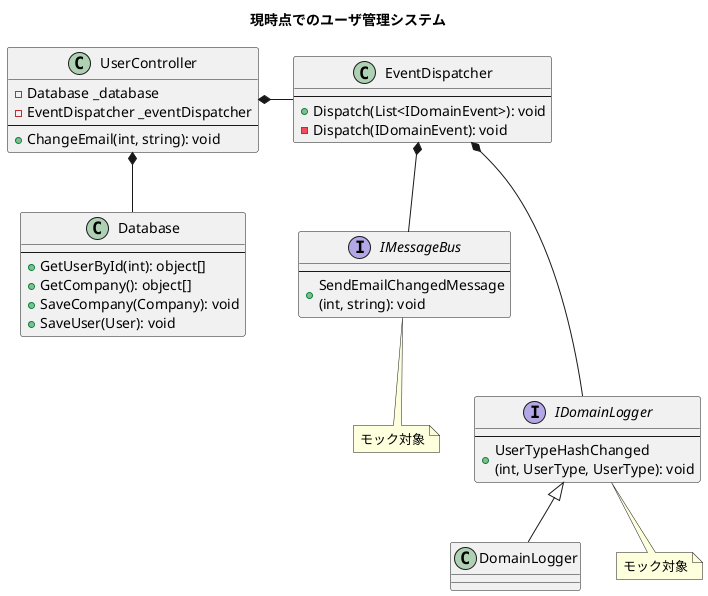
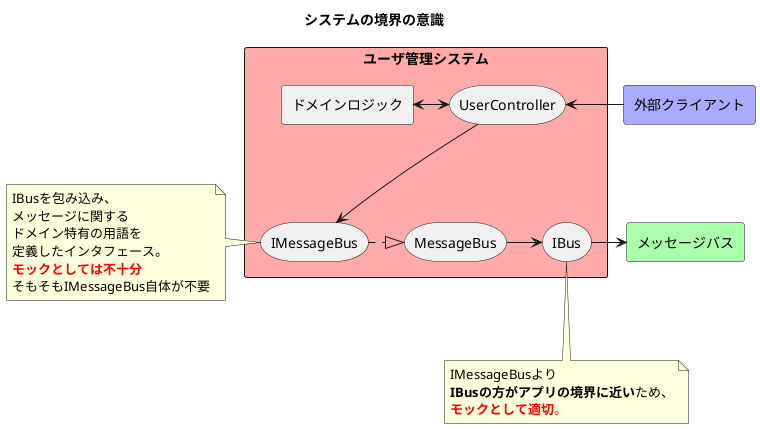

## モックのベスト・プラクティス

- この章で扱うこと
  - モックの価値を最大限に引き出す方法
  - モックからスパイへの移行
  - モックのベストプラクティス

### モックの価値を最大限に引き出す方法

- <font color=red>モックに置き換える対象を管理下にない依存だけに制限することはモックの価値を最大限引き出すための最初の一歩である。</font>
- 

#### 【振り返り】現時点でのユーザ管理システム



```CSharp
[Fact]
public void Changing_email_from_corporate_to_non_corporate() {
    // Arrange
    var db = new Database(ConnectionString);
    User user = CreateUser("user@mycorp.com", UserType.Employee, db); // ヘルパーメソッド
    CreateCompany("mycorp.com", 1, db); // ヘルパーメソッド
    var messageBusMock = new Mock<IMessageBus>();
    var loggerMock = new Mock<IDomainLogger>();
    var sut = new UserController(db, messageBusMock.Object, loggerMock.Object);

    // Act
    string result = sut.ChangeEmail(user.UserId, "new@gmail.com");

    // Assert(1.出力結果確認 2.ユーザの状態確認 3.会社の状態確認 4.メソッドの呼び出し確認)
    Assert.Equal("OK", result);

    object[] userData = db.GetUserById(user.UserId);
    User userFromDb = UserFactory.Create(userData);
    Assert.Equal("new@gmail.com", userFromDb.Email);
    Assert.Equal(UserType.Costomer, userFromDb.Type);

    object[] companyData = db.GetCompany();
    Company companyFromDb = CompanyFactory.Create(companyData);
    Assert.Equal(0, companyFromDb.NumberOfEmployees);

    messageBusMock.Verify(
        x => x.SendEmailChangedMessage(user.UserId, "new@gmail.com"), 
        Times.Once
    );
    loggerMock.Verify(
        x => x.UserTypeHashChanged(user.UserId, UserType.Employee, UserType.Customer),
        Times.Once
    );
}
```

#### システムの境界を超えて行われるコミュニケーションの検証

- <font color=red><b>モックは「システムの境界に位置する管理下にない依存」が行うコミュニケーションを検証するときだけ利用する</b>、という指針を常に守るようにする。</font>これにより、以下の効果がある。
  - 経由するクラス数が増え、実行されるコード量が増えるため、**退行に対する保護が強化**される。
  - 実装の詳細から離れた検証ができているため、**リファクタリングの耐性が強化**される。
- 例えばIBusインタフェースが存在し、IMessageBusインタフェースの中でIBusに処理を委譲することを想定している場合、IBusインタフェースの方がシステムの境界に位置していることが考えられる。



```CSharp
public interface IMessageBus { // 不要なインタフェースなため、削除を検討しても良い
    void SendEmailChangedMessage(int userId, string newEmail);
}
public class MessageBus : IMessageBus {
    private readonly IBus _bus;
    public void SendEmailChangedMessage(int userId, string newEmail) {
        _bus.Send(
            "Type USER EMAIL CHANGED; " +
            $"Id: {userId}; " +
            $"NewEmail: {newEmail}"
        );
    }
}
public interface IBus { // 必要なインタフェース
    void Send(string message);
}
```

##### UserControllerクラスの統合テストの改善1

```CSharp
[Fact]
public void Changing_email_from_corporate_to_non_corporate() {
    // Arrange
    var busMock = new Mock<IBus>();
    var messageBus = new MessageBus(busMock.Object); // 具象クラスを利用
    var loggerMock = new Mock<IDomainLogger>();
    var sut = new UserController(db, messageBus, loggerMock.Object);

    // Act
    /* 略 */

    // Assert(1.出力結果確認 2.ユーザの状態確認 3.会社の状態確認 4.メソッドの呼び出し確認)
    /* 略 */

    busMock.Verify(
        x => x.Send(
            $"Type: USER EMAIL CHANGED; " + 
            "$Id: {user.UserId}; " + 
            "NewEmail: new@gmail.com"
        ),
        Times.Once
    );
    /* 略 */
}
```

#### モックからスパイ(手書きのモック)への置き換え

- <font color=red>スパイはシステムの境界に位置するクラスである場合は<b>モックよりも優れている</b>。</font>理由は、さまざまなテストケースから利用でき、テストコード量が減り、可読性が向上するからである。
- **テストで確認する際はプロダクションコードを信頼すべきではない**。下記の`busSpy`はテストコードの一部であるのに対し、`IMessageBus(MessageBus)`はプロダクションコードの一部であることから、全く異なるものである。

##### スパイを使った統合テスト例

```CSharp
public class BusSpy : IBus  { // スパイ(手書きのモック)
    private List<string> _sentMessages = new List<string>();

    public void Send(string message) {
        _sentMessages.Add(message);
    }

    public BusSpy ShouldSendNumberOfMessages(int number) {
        Assert.Equal(number, _sentMessages.Count);
        return this;
    }

    public BusSpy WithEmailChangedMessage(int userId, string newEmail) {
        string message = $"Type: USER EMAIL CHANGED; Id: {userId}; NewEmail: {newEmail}";

        Assert.Contains(_sentMessages, x=> x == message);
        return this;
    }
}
```

```CSharp
[Fact]
public void Changing_email_from_corporate_to_non_corporate() {
    // Arrange
    var busSpy = new BusSpy(); // スパイクラス
    var messageBus = new MessageBus(busSpy); // ← スパイを渡す
    var loggerMock = new Mock<IDomainLogger>();
    var sut = new UserController(db, messageBus, loggerMock.Object);

    // Act
    /* 略 */

    // Assert
    /* 略 */

    /* ##### スパイを用いたテスト ##### */
    busSpy 
        .ShouldSendNumberOfMessages(1)
        .WithEmailChangedMessage(user.UserId, "new@gmail.com");

    /* 略 */
}
```

#### ログ出力の検証でもテストダブルの対象を変えるべきか？

- <font color=red>ログ出力で重要なこと、もっと言うとログ監視者にとって重要なことは<b>①ログが出力されること</b>と<b>②ログの情報</b>である。</font>そのため、<u>IDomainLoggerをモックにしても十分な保護を備えることができる</u>。
- メッセージバスの場合は外部システムの反応が予想できないため、**メッセージの構造に対して如何なる変更も許されないことが重要になる**。

### モックのベストプラクティス

- モックの対象は以下の通り。
  1. **管理下にない依存**
  2. **アプリケーション(システム)の境界に位置する依存**
- モックのベストプラクティスは以下の通り。
  1. モックの利用は統合テストに限定する(単体テストでは使わない)。
  2. モックに対して行われた呼び出しの回数を常に確認する。
  3. モックの対象になる方は自身のプロジェクトが所有する型のみにする。

<div style="page-break-before:always"></div>

#### モックの利用は統合テストに限定する(単体テストでは使わない)。

- <font color=red><b>ドメイン層とアプリケーションサービス層の分離のために</b>、単体テスト(ドメイン層)ではモックは使用せず、統合テスト(アプリケーションサービス層)でのみモックを利用する。</font>
- <u>ドメイン層とアプリケーションサービス層の両方の性質を持つコード(過度に複雑なコード)は**コードを分割し、責務を分離する必要がある**。</u>

#### モックに対して行われた呼び出しの回数を常に確認する。

- <font color=red>管理下にない依存とのコミュニケーションでは、<u><b>①想定する呼び出し</b>が行われていること</u>と<u><b>②想定しない呼び出し</b>は行われていないこと</u>の2つが重要になる。</font>目的は以下の2つ。
  - 後方互換を維持する必要性があるから。
  - 外部システムが想定していない通信がされていないことを保証するため。

#### モックの対象になる方は自身のプロジェクトが所有する型のみにする。

- <font color=red>サードパーティ製のライブラリに対するアダプタ(Interfaceやクラス)を独自に作成し、そのアダプタをモックとすることで、<b>アダプタが外部の世界との腐敗防止層として機能</b>する。</font>IBusインタフェースがこのアダプタに相当する。
- アダプタ作成の理由は3つ。
  1. サードパーティ製のライブラリが実際にどのように機能しているのかを深く知ることは滅多にできないから。
  2. サードパーティ製のライブラリのインタフェースをモックに置き換える対象にすると、**モックの振る舞いとサードパーティ製のライブラリの実際の振る舞いとが一致することを保証しなくてはならなくなる**から。
  3. アダプタを挟むことでライブラリの技術的な詳細(ビジネス的に本質ではない箇所)を隠蔽できるようになり、さらに、**自身のアプリケーションの用語を用いてライブラリとの関係を定義できる**ようになるから。
- アダプタ作成によるメリットは3つ。
  1. ライブラリの複雑さを抽象化できる(変更容易性)。
  2. 必要な機能のみを公開できる(アダプタがインタフェースになる)。
  3. ドメインの用語を使えるようになる(APIを自由に実装できる)。
- <u>**大前提、管理下にない依存をモックの対象とする**。管理下にある依存やプロセス内の依存は該当しない。</u>

<div style="page-break-before:always"></div>

### まとめ

- 管理下にない依存とのコミュニケーションを検証する場合、コントローラからその依存に向かう流れの中で**最後のコンポーネント(システムの境界)となるものをモックの置き換え対象にする**。このようにすることで<u>退行に対する保護とリファクタリングへの耐性の両方を強化できる</u>ようになる。
- **スパイは手書きのモック**と呼ばれ、システムの境界にあるクラスに対してはモックよりもスパイの方が優れている。理由は確認コード(Assert)をスパイクラスに記述し、複数のテストケースから呼び出すことができる(Fluent Interface)ためであり、<u>コード量減少と可読性向上が期待できる</u>。
- 確認の際はプロダクションコード(例で言うとIMessageBusやMessageBus)を信頼してはならない。テストではプロダクションコードに定義されたリテラルや定数を使わず、**プロダクションコードから影響を受けずに検証を行える場所を提供しなくてはならない**ということである。そうしないと実質的に何も検証していない無意味な確認を行う同義語反復(tautology)のテストケースが作成されることになってしまう。
- 管理下にない依存が全て同じレベルでの後方互換を必要とするわけではない。例えば、<u>ログ出力のようなメッセージの構造の正確さが重要ではなく、メッセージの存在とそのメッセージに含まれる情報だけが検証の対象になるのであれば、システムの境界に位置する管理下にない依存とのコミュニケーションをテストダブルに置き換えて検証するという指針に従う必要はなくなる</u>。
- モックは管理下にない依存だけにしか使われず、そのような管理下にない依存を扱うのはコントローラ<u>だけ</u>であるため、**モックを使うのは統合テスト(アプリケーションサービス層)を行うときだけとなる。いい変えると単体テスト(ドメイン層)ではモックを使ってはならない**。
- 1つのテストケースの中で複数のモックを使っても問題はない。使用されるモックの数はテスト対象の処理を行っている時に呼び出される管理下にない依存の数によって変わる。
- モックを用いたテストでは、**①想定している呼び出しが行われていること**と**②想定していない呼び出しが行われていないことの両方を確認しなくてはならない**。
- もし管理下にない依存へのアクセスにサードパーティ製のライブラリを使用しているのであれば、<u>そのライブラリを内包する独自のアダプタ(例で言うとIBus)を作成し、自身で作成したアダプタに対してモックを作成するようにしなくてはならない</u>。